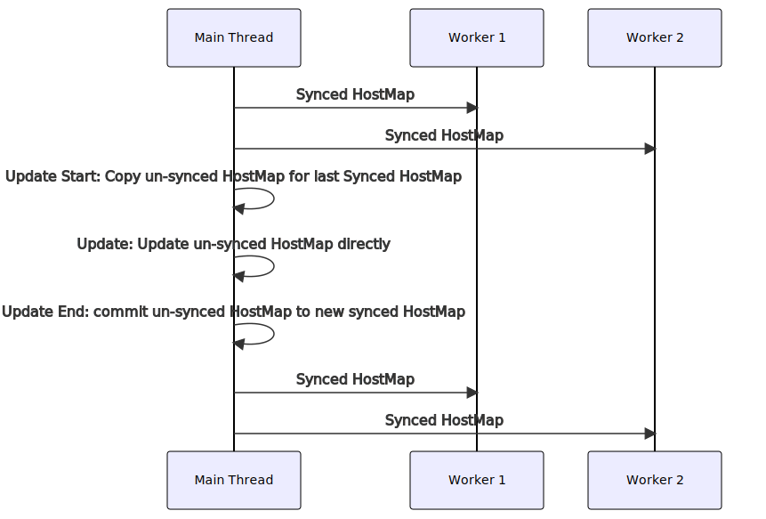

## 1. 问题背景

会话保持是七层负载均衡的核心功能之一。对于同一会话的请求或者连接，通过会话保持机制，负载均衡软件会将其路由到同一个后端，以利用局部性原理来提高服务整体的效率。

在传统的 LB 产品之中，会话保持能力可以说是重中之重，比如 F5 软件就提供了丰富的会话保持机制供用户选择。而在云原生的场景当中，由于更多面向无状态的服务，服务实例动态启用和销毁，会话保持能力相对而言重要性有所降低。而作为云原生边缘网络代理，Envoy 在会话保持方面自然也相对薄弱。

在开源 Envoy 当中，只提供了基于一致性哈希的会话保持机制。具体来说，Envoy 提供了一个一致性哈希负载均衡算法进行流量的负载均衡。对于一组后端服务实例，Envoy 会根据服务实例名称或者地址来计算出一个哈希环。之后，对于每一个 HTTP 请求，Envoy 都会根据请求的特征计算一个哈希值，然后根据哈希值在后端哈希环中选择一个最合适的后端实例（通过折半查找）。该会话保持机制不需要保存额外的状态，最终结果只和计算所得的哈希值以及哈希环有关。此外，天然的，该会话保持机制也可以做到跨实例会话保持，也即是当拥有多个 Envoy 实例时，请求无论是由 Envoy A 实例转发或者是 Envoy B 实例转发，最终转发到的目标服务实例都是一致的。

Envoy 支持配置从不同的请求特征中计算哈希值，比如使用特定请求头，使用源地址 IP，或者使用 cookie 等。只要后端实例保持稳定，这一机制几乎是完美的。但是，事实上，后端实例并不总能够保持稳定，而且有一些特殊的场景，基于一致性哈希的负载均衡机制也无法实现。**因为基于一致性哈希的会话保持机制本质上是无状态会话保持。会话保持依赖的不是某个持续的状态值，而是算法实时计算的结果。**

为了进一步的完善 Envoy 的会话保持能力，拓展 Envoy 的使用场景，比如在传统分布式系统中作为七层软负载均衡，轻舟微服务团队对 Envoy 负载均衡器做了进一步的增强，以支持有状态的会话保持机制。具体来说，有状态会话保持是为了解决以下问题：

- 保证当后端节点集状态发生变化时（节点被标记为 degrade 或者不健康、新增节点或者移除节点），属于已有会话的请求仍旧能够正确的路由到会话对应的节点。现有的基于一致性哈希的会话保持机制，当后端节点发生变化时，就会重新构造哈希环，导致会话保持的结果不稳定。
- 使得最小连接数等算法也能够具备会话保持能力。现有会话保持是构建在一致性哈希负载均衡算法的基础之上，但是如最小连接数，轮转等负载均衡算法不具备会话保持能力。
- 提高一致性哈希负载均衡策略的性能。一致性哈希算法通过折半查找的方法来找到合适的节点。如果使用有状态会话保持，可以有效的减少在具备大量节点时的节点搜索的开销。

**目前，团队已经将整个方案的所有设计与实现均贡献给了开源 Envoy 并且完成了合入，成为了开源 Envoy 的一部分。**

## 2. 实例管理

要实现各种各样的负载均衡算法，自然需要实现对后端实例集合的管理，在 Envoy 中，为了实现后端实例的管理，使用了一个 `PrioritySet` 的数据类型。其主要的特点三个：

- 多优先级：一个 PrioritySet 包含多个优先级的多组后端实例；
- 数组结构：后端实例多以数组结构组织和管理；
- 线程隔离：每个线程中都有独立的 `PrioritySet`；


而要实现有状态会话保持，首先，必须要提供快速的实例搜索能力，这是开源 `PrioritySet` 并不具备的。为此，数据面扩展增强了 `PrioritySet`，在其中实现了一个以实例地址为 Key 的 HostMap，来提供跨优先级的快速搜索能力。

同时，为了尽可能的减小该项增强带来的额外内存开销，HostMap 在各个线程的 `PrioritySet` 中共享。但是需要注意到，Envoy 特色功能之一就是可以动态更新后端实例列表，所以这个 HostMap 也需要更新（更新都在主线程中）并且面临线程安全问题。

**一般来说，面对此类一写多读的数据更新，一个读写锁是一个不错的选择。但是在有状态会话保持中，HostMap 的搜索是高频操作，每个请求都是至少操作一次。而实例表更新则是一个相对来说非常低频的操作。为了一个低频的实例更新，而在每次请求中都引入一次读锁的开销，对于高性能网络代理来说，是很难让人接受的。所以为此需要设计一套机制来保证线程安全的实例更新的同时，保证搜索的无锁和高性能。**



该机制简单原理如上所示，当需要更新实例表时，Envoy 会从已有的 HostMap 中创建一份拷贝，所有更新都在新的拷贝进行，而不是直接修改已有 HostMap，这样避免了已有的 HostMap 在多线程上读写的冲突。（当然，这并非毫无代价，每次更新都需要拷贝一次 HostMap，以主线程的拷贝开销换取工作现场的无锁操作）

在更新完成之后，需要将最终更新就绪的 HostMap 同步到工作线程中去时，再 commit 拷贝出来的 HostMap，并向各个工作线程推送一个更新事件，最终完成整个实例表以及 HostMap 更新。

## 3. 会话状态

在完成第 2 小节中的实例管理机制增强之后，就为有状态会话保持提供了一个基础。另一个需要解决的问题是会话状态的保存。

第一种典型的方案是使用 HTTP Cookie 来保存会话状态。具体来说，用户可以指定一个特殊的 Cookie 名称。对于每一个请求，如果包含指定的 Cookie，则从 Cookie 中解析出目标实例的地址，并且根据地址检索目标实例。如果不存在对应的 Cookie 或者 Cookie 中地址不存在对应目标实例，则根据负载均衡算法选择一个后端实例，并且将该后端实例的地址通过 Set-Cookie 添加到响应中。



该方案简单有效，而且最重的是 Envoy 将会话状态保存的责任转嫁给了客户端，保持了自身的无状态。这样做不但使得实现上更为简单，最重要的是，该方案天然的支持跨实例的会话保持。也即是说，当存在多个 Envoy 实例时，请求无论在 Envoy A 或者 Envoy B 上被处理，都不影响会话保持的结果。
不过这个方案，也有它的缺陷。它的灵活性相对较弱。对于每个没有有效指定 Cookie 的新请求，Envoy 都会为它添加对应的 Cookie 并将之作为一个新的会话处理。它无法更加灵活的使用请求源 IP、请求头等信息来作为识别会话的特征。

为此，数据面提出了另一种基于存储/缓存的方案作为上一方案的补充。该方案会根据请求指定的特征（如源 IP、请求头等）计算特征值，并且保存特征值和目标实例的映射（内存缓存 + 中心缓存）。如此，就可以实现根据任意的请求特征来作为会话保持的依据。



不难发现第二个方案和第一个方案在流程处理上几乎完全一致。唯一的不同在于“有状态会话保持”中的状态由谁来保存的问题。在第二个方案中，带来了更好的灵活性，状态的保持需要 Envoy/数据面自身来处理。

## 4. 负载交互

在第 2 小节中，接入了如何设计一个安全、高效的 HostMap 来管理后端实例表并且实现实例的快速搜索。在第 3 小节中，介绍了如果维护会话状态，实现会话状态的保存和提取。

但是如何在请求路由转发的过程中，将会话状态和 Host 搜索选择结合到一起，则是第三个问题。在 Envoy 当中，相比于极端的高性能，更加看重模块化、易测试等特点。在具体的实现当中，会话状态的保存是在代理协议的 L4 Filter 内部实现的。以 HTTP 协议为例，会话状态需要靠 HTTP Connection Manager 这个 L4 Filter 来实现（其中内嵌的 HTTP L7 Filter 当作整个 L4 Filter 的一部分）。而后端实例、负载均衡、HostMap 等则是由 Upstrem 模块实现和管理。两者之间仅仅通过 `LoadBalancerContext` 接口进行交互。
为此，需要拓展  `LoadBalancerContext` 接口，允许 L4 Filter 通过  `LoadBalancerContext`  向 Upstream 传递会话状态。而 Upstream 则根据会话状态优先选择目标实例。如果会话状态无效，则正常的根据负载均衡算法选择后端实例。具体的扩展接口设计如下：

```cpp
class LoadBalancerContext {
public:
  // ......
  using OverrideHost = absl::string_view;
  /**
   * Returns the host the load balancer should select directly. If the expected host exists and
   * the host can be selected directly, the load balancer can bypass the load balancing algorithm
   * and return the corresponding host directly.
   */
  virtual absl::optional<OverrideHost> overrideHostToSelect() const PURE;
};
```

**此外，轻舟还对 HTTP Connection Manager 暴露给 L7 Filter 的 API 做了增强，允许开发通过编写简单的 HTTP Filter 来设置 override host，让开发者可以根据自身的需要对负载均衡结果做更灵活的控制。**

```cpp
class StreamDecoderFilterCallbacks : public virtual StreamFilterCallbacks {
public:
  // ......

  /**
  * Set override host to be used by the upstream load balancing. If the target host
  * exists in the host list of the routed cluster, the host should be selected
  * first.
  * @param host The override host address.
  */
  virtual void setUpstreamOverrideHost(absl::string_view host) PURE;

  /**
  * @return absl::optional<absl::string_view> optional override host for the
  * upstream load balancing.
  */
  virtual absl::optional<absl::string_view> upstreamOverrideHost() const PURE;
};

```

## 5. API 设计

最后一部分是数据面 Envoy 向上层控制面暴露的 API，使得控制面可以对有状态会话保持功能进行控制。它包括 HTTP 扩展和服务级别负载均衡配置两部分。

在 HTTP 扩展中，添加了一个额外的 HTTP Filter，来根据具体的有状态会话保持实现来提取目标实例，比如 cookie 实现就会从指定 cookie 中获取目标实例地址（当然，因为 HTTP Connection Manager 本身也已经做了增强，完全从头开发新的 HTTP 扩展想来也是轻而易举之事）。

```proto
message StatefulSession {
  // Specific implementation of session state. This session state will be used to store and
  // get address of the upstream host to which the session is assigned.
  //
  // [#extension-category: envoy.http.stateful_session]
  config.core.v3.TypedExtensionConfig session_state = 1;
}

message CookieBasedSessionState {
  // The cookie configuration used to track session state.
  type.http.v3.Cookie cookie = 1 [(validate.rules).message = {required: true}];
}
```

在服务均衡配置当中，提供了额外的状态限制，确保只有指定状态的示例可以通过前述的 override host 选择，假设目标实例建康状态符合预期，则认为该会话状态为有效状态，否则根据负载均衡算法重新选择目标实例并更新会话状态。如此就完成了整个方案的最后一环。

```proto
// This controls what hosts are considered valid when using
// :ref:`host overrides <arch_overview_load_balancing_override_host>`, which is used by some
// filters to modify the load balancing decision.
//
// If this is unset then [UNKNOWN, HEALTHY, DEGRADED] will be applied by default. If this is
// set with an empty set of statuses then host overrides will be ignored by the load balancing.
core.v3.HealthStatusSet override_host_status = 8;

```

## 6. 全文小结

整个有状态会话保持机制主要分为三个部分，分别是：在 Upstream 模块中实现线程安全的高性能 HostMap 以便于快速的实例搜索以及实例状态限制；在 L4/L7 Filter 中实现会话状态的记录、提取，且提供了非常良好的扩展性，且支持多种有状态会话实现；扩展  `LoadBalancerContext`  以实现两个模块交互上下游模块交互，允许 Filter 指定目标实例覆盖负载均衡结果。

Envoy 有状态会话保持机制弥补了 Envoy 在会话保持机制方面相对薄弱的缺陷。解决了在部分传统场景下 Envoy 的短板。而且，目前轻舟微服务团队已经将整个有状态会话保持机制都贡献给了 Envoy 开源社区，并持续维护。有兴趣或者有这方面需求的同学可以直接使用，如果其中有不足之处，也可以直接向社区反馈 :)。

9 月 23 日，2022 网易数字 + 大会将在杭州康莱德酒店召开，届时我们团队和中国信通院、中泰证券、吉利集团、安信证券的相关负责人会分享更多云原生技术与实践。欢迎感兴趣的朋友[提前关注](https://yc.sf.163.com/?tag=ppzu_prpromote_mediacooperate_0908shuzi)。
