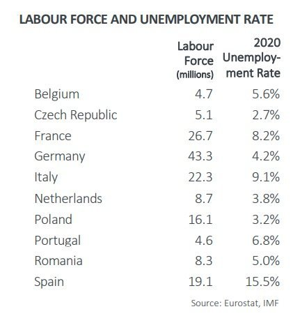
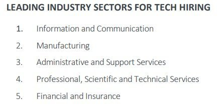

本文译自[2021 European Tech Hiring Trends](https://thechief.io/c/editorial/2021-european-tech-hiring-trends/)，作者[The Chief I/O](https://thechief.io/c/editorial/)。

## 译者评论

最近在社区里看到很多人在讨论国家开始不给大型互联网企业减税，互联网公司股价普跌，大部分距离年内最高点腰斩，个人所得税成为工薪税，程序员被划归为”新生代农名工“，”贫贱不能移“等话题。让我们一起来看看欧洲的IT招聘趋势还有薪资水平，是否国外的月亮就是圆呢？

## 报告解读

尽管新冠疫情正在逐渐消退，但其影响仍将持续一段时间。本文衡量了疫情对欧洲科技企业招聘的影响，展露了欧洲科技招聘的新趋势。

- 国家的经济规模不断扩大
- 欧洲国家的失业率保持稳定
- 招聘活动增加
- 软件开发人员、程序员的需求量更大
- 雇主寻求全面发展的技术人才
- 雇主要求软技能作为主要技能的一部分
- 39%的招聘信息寻求具有0-2年经验的专业人士
- 薪资范围从36000到90000欧元
- 德国和法国在科技人员招聘方面领先
- 信息和通信业、制造业引领科技招聘

在所有行业中，2020年是一个促进招聘的年份，迫使招聘团队修改和改进他们的人才招聘模式，以满足对技术人才不断增长的需求，特别是在科技行业。与许多其他经济体一样，欧洲经济经历了疫情的冲击，并正在迅速从其影响中恢复。

利用[Burning Glass](https://www.burning-glass.com/?ref=thechiefio)汇总的雇主职位发布数据，CompTIA开发了[欧洲科技企业招聘趋势](https://comptiacdn.azureedge.net/webcontent/docs/default-source/research-reports/comptia-european-tech-hiring-trends---q2-2021-release.pdf?sfvrsn=c441f76b_2?ref=thechiefio)，涵盖了2020年第一季度欧洲国家的科技招聘活动。该报告调查了十个欧洲国家。比利时、荷兰、捷克、波兰、法国、葡萄牙、德国、罗马尼亚、意大利和西班牙，将2021年第一季度的招聘活动与2020年进行比较，以衡量科技行业从2020年的衰退中恢复的程度。

本文重述了这份报告，并强调了关键的发现，以帮助雇主、专业人士和科技界利益相关者了解欧洲科技就业市场的招聘趋势。

## 国家的经济规模不断扩大

图片来源：https://comptiacdn.azureedge.net/webcontent/docs/default-source/research-reports/comptia-european-tech-hiring-trends---q2-2021-release.pdf

众所周知，新冠疫情在2020年对全球经济产生了破坏性影响。随着欧洲各国封锁的缓解，经济开始逐渐回升，商业活动重新活跃起来。预计西班牙的经济增长将达到6.4%，为11980亿；罗马尼亚为6.0%，为2370亿；法国为5.8%，为24090亿；意大利和捷克分别为4.2%，为17270亿和2260亿。其他预测增长缓慢的国家包括比利时（4.0%，4750亿）、葡萄牙（3.9%，2110亿）、德国（3.6%，35420亿）、荷兰和波兰预测各3.5%的经济增长。

## 欧洲国家的失业率保持稳定

图片来源：https://comptiacdn.azureedge.net/webcontent/docs/default-source/research-reports/comptia-european-tech-hiring-trends---q2-2021-release.pdf

与美国等其他国家相比，欧洲国家的失业率在新冠疫情的高峰期保持相对稳定，只有西班牙在2020年的失业率超过15%。

然而，尽管失业率稳定，经济活动的放缓导致整个欧洲国家的招聘活动放缓。

## 招聘活动的增加

在从疫情和招聘活动放缓的影响中恢复，2021年第一季度的招聘活动比2020年第四季度恢复了9%，比2020年第三季度增加了40%。2021年第一季度，技术职位的发布经历了一个新高，超过90万个职位发布，而2020年第一季度为60万个，2020年第二季度约为40万个，2020年第三季度和第四季度分别超过60万个和约80万个。

## 软件开发人员、程序员的需求量更大

在接受调查的十个欧洲国家中，软件开发人员、系统分析师和网络安全、系统管理员、网络开发人员、IT专家、数据库、网络和应用程序员是招聘活动最多的技术职位。在2021年第一季度，有249,017个软件开发人员的招聘信息，231,464个系统分析师和网络安全的招聘信息，以及超过84,000个系统管理员的招聘信息。进一步证实了技术的相互关联性，其他职业，如IT支持专家和技术员，IT经理和首席信息官，应用程序员，数据库和网络人员的需求也很大。

## 雇主寻求全面发展的技术人才

随着技术的不断扩展和新范围、工具、硬件和方法的出现，对工作要求的分析表明，雇主对了解广泛技术技能的候选人更感兴趣。以软件开发人员的职位为例，一个典型的雇主更喜欢具有多种编程语言经验的候选人，具有网络安全知识，至少有一个云平台，并熟悉[DevOps流程](https://thechief.io/c/editorial/demystifying-the-devops-career/)。

办公室/电子表格、编程/面向对象的编程、商业IT系统、SQL、数据库和统一建模语言是技术职位招聘中最受欢迎的一些技术技能。

## 雇主要求软技能作为主要技能的一部分

商业和软技能在技术岗位上不再被视为次要。招聘信息显示了这一点，技术雇主认为软技能，如批判性思维、团队合作、解决问题、项目和时间管理，与技术技能同等重要。

## 39%的招聘信息寻求具有0-2年经验的专业人士

虽然现在大多数科技雇主根据专业知识、技能和业绩进行招聘，但在科技岗位招聘中，工作年限仍然是一个决定性的标准。在2021年第一季度，雇主寻求更多具有0-2年经验的初级专业人士。2021年第一季度，14%的科技职位招聘要求有3-10年的经验，11%要求有11年以上的经验，而36%没有明确要求的经验年限。

## 薪资范围从36000到90000欧元

雇主提供的工资在36,000左右，主要是针对初级职位的招聘信息，不包括其他副业收入。随着专业知识水平、工作年限和工作地点的不同，技术类职位的[基本工资](https://thechief.io/c/editorial/salary-trends-for-devops-and-cloud-native-professionals/)最高可达9万，不包括其他补偿和奖金。与疫情之前的时期相比，**一些技术角色，如[DevOps](https://thechief.io/c/news/devops-pros-salary-rise-despite-effect-pandemic/)、平台工程师和AI工程师的工资在疫情之后也有所增加。**

## 德国和法国在科技人员招聘方面领先

尽管比2020年第四季度减少了4%，但德国在2021年第一季度以421,109名科技人员的招聘数在所有被调查的十个国家中处于领先地位。法国紧随其后，与2020年第四季度相比，增加了16%，即121,863人，而波兰则以105,921人的科技人员招聘数紧随其后，与2020年第四季度相比，增加了37%。意大利和荷兰在2021年第一季度也分别经历了50%（60,082人）和43%（53,313人）的技术招聘激增。

## 信息和通信业、制造业引领科技招聘

随着各组织转向技术，以缓解疫情的影响并增加业务增长，信息和通信行业在招聘技术职位方面处于领先地位。其他行业，如制造业，物流和支持服务，专业、科学和技术服务，以及金融和工业行业也是招聘技术职位的主要行业之一。
