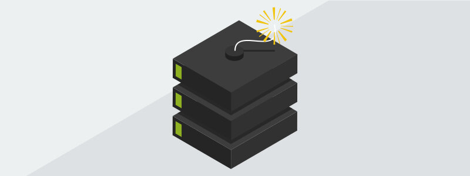
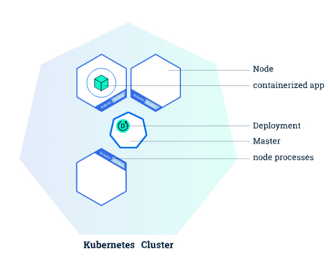
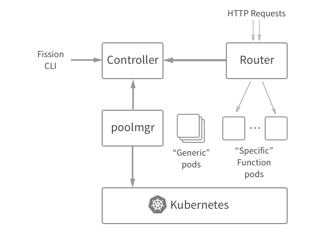
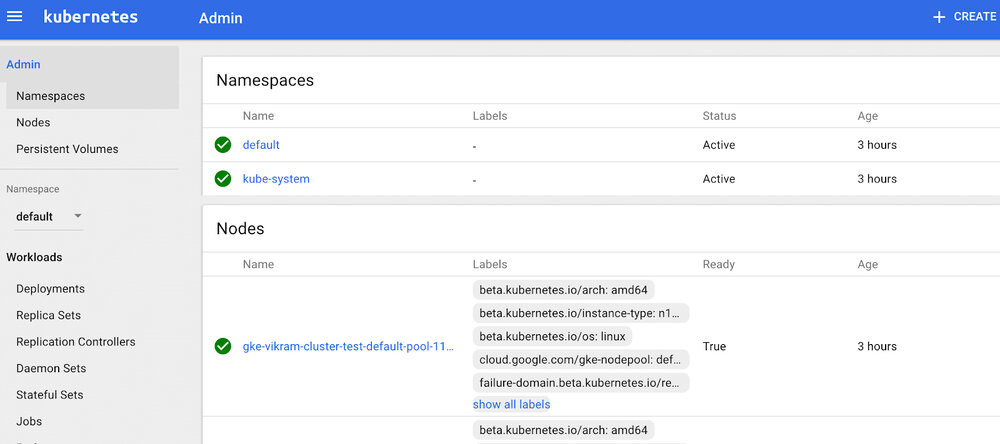
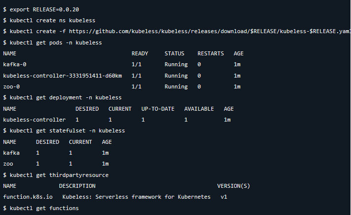
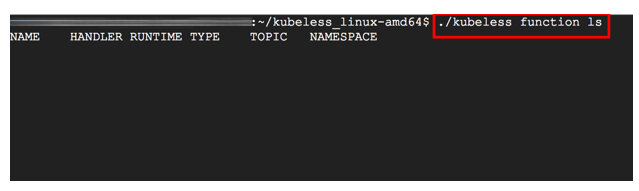

本文为翻译文章，[点击查看原文](https://rancher.com/blog/2018/2018-04-23-evaluation-of-serverless-frameworks-for-kbe/)。

Rancher 1.6 和 Rancher 2.0 底层容器编排引擎的术语和概念略微有所不同。想要了解这些差异就需要先了解 Cattle 和 Kubernetes 之间的根本区别。对于使用过 Cattle 或者 Kubernetes 的新手来说，这篇文章比较适合您。同时你也可以从这里获取到容器编排引擎 Cattle 到 Kubernetes 的对应关系词汇表 cheatsheet。

[无服务器](https://rancher.com/tags/serverless) [kubernetes](https://rancher.com/tags/kubernetes)

---

在 Pokemon Go 的早期，我们都惊讶于 Niantic 如何在全球范围内扩展其用户群，现在看来他们应该是以无缝地向其容器集群添加额外的节点以容纳更多的玩家和环境，所有这一切都可以通过使用 Kubernetes 作为容器编排工具来实现。Kubernetes 在扩展和管理容器基础架构中，能够从开发者角度抽象出部分过程和低级依赖关系。这使它成为一个非常有效的平台，用于开发和维护跨多个容器的应用程序服务。本文将探讨如何利用 K8S 的设计参数和服务编排功能，并将它们与无服务器框架和函数即服务（FaaS）结合起来。特别是，我们将深入研究其特性和功能，分析在 K8s 架构上构建的三个无服务器框架的运行性能和效率：（i）Fission; （ii）OpenFaaS; （iii）Kubeless。

## A. 为什么 Kubernetes 是无服务器的优秀编排系统？

无服务器体系结构指的是从开发人员中抽象出服务器管理任务的应用程序体系结构，并通过动态分配和管理计算资源来提高开发速度和效率。函数即服务（FaaS）是一个运行时被构建的无服务架构，可以在其上构建无服务器体系结构。FaaS 框架作为短暂的容器运行，它们已经安装了公共语言运行时，并允许在这些运行时内执行代码。

FaaS 框架应该能够在各种基础架构上运行，以实现真正有用，包括公共云，混合云和内部部署环境。在真实生产环境中基于 FaaS 运行时构建的无服务器框架应该能够依靠经过验证和测试的编排和管理功能来大规模部署容器和分布式工作负载。

对于编排和管理，无服务器 FaaS 框架依赖 Kubernetes，因为它能够：

*   跨主机群集编排容器。
*   最大化程度的利用企业应用程序所需的硬件资源。
*   管理和自动化应用程序部署并提供声明式更新。
*   通过挂载存储运行有状态应用程序。
*   秒级扩容容器化应用程序并提供支持它们的资源。
*   声明式地管理服务。
*   提供一个大盘，来检查应用的健康情况，并通过自动重启，自动复制和自动缩放来进行应用程序的自我修复。


#### 无服务器系统可以包括通过客户端请求触发的功能或作为业务服务的一部分执行的功能。这两个过程都可以使用容器集群管理器（如 Kubernetes）进行编排。资料来源：dzone.com

我们将在本文中介绍三个无服务器框架各自的优点和缺点。这些 FaaS 框架之间的共同点是，它们能够（1）将函数转化为服务; （2）利用 Kubernetes 平台管理这些服务的生命周期。这些框架背后的设计，会由于其用于实现的具体方式的不同而有差异，我们将在下一节中探讨。我们将在以下部分中重点介绍这些框架之间的一些差异：

1.  框架是在源码级别或 Docker 镜像级别还是在中间运行，例如 buildpacks？
2.  由于使用公共语言运行库启动容器，冷启动性能的延迟或执行函数期间的延迟分别是多少？
3.  它们如何为服务分配内存或资源？
4.  它们如何访问和部署 Kubernetes 的编排和容器管理功能？

## B. OpenFaaS 和部署 Spring Boot 模板

OpenFaaS 是一个无服务器平台，允许使用 Docker 或 Kubernetes 管理函数，因为它是基于 OCI 格式的容器。OpenFaaS 可以支持企业级扩展的功能，如 Docker Universal Control Plane 企业级集群管理解决方案与 Docker Enterprise 或 Tectonic for Kubernetes。OpenFaaS 继承了现有的容器安全功能，例如 r/o 文件系统，权限下降和内容信任。它能够使用 Docker 或 K8s 调度程序/容器编排的管理功能，并且可以使用其相关的丰富的商业和社区供应商生态系统。同样，由于其多语言特性，任何可执行文件都可以打包到 OpenFaas 中的函数中。

SpringBoot 和 Vertx 是开发微服务的非常流行的框架，它们的易用性已经通过 OpenFaaS 模板扩展到 OpenFaaS。这些模板允许在 OpenFaaS 平台上无缝地开发和部署无服务器函数。模板在[这里](https://github.com/tmobile/faas-java-templates)的 github 存储库中可用。让我们来看看如何在 OpenFaaS 平台上部署 SpringBoot 模板。

### 在本地安装 OpenFaaS

#### 在本地计算机上下载和安装模板

我们需要安装和配置 FaaS CLI 以与本地或远程 K8S 或 Docker 配合使用。在本练习中，我们将使用本地 Docker 客户端，并在后续工作中将其扩展到基于云的 GKE 集群。

对于最新版本的 CLI 类型：

`$ curl -sL https://cli.openfaas.com | sudo sh`

\[或通过 MacOS 上的 brew install faas\-cli。\]

使用以下命令验证本地安装的模板：

`faas-cli new --list`

在我们创建无服务器函数之前，我们必须在本地计算机上安装这些模板。
```shell
 faas-cli template pull https://github.com/tmobile/faas-java-templates.git
```

#### 查看帮助菜单

可以为所有命令调用\-help 标志。

`$ faas-cli --help`

从命令行管理您的 OpenFaaS 功能

用法： `faas-cli` \[flags\] `faas-cli` \[command\]

可用命令：

`build` 构建 OpenFaaS 功能容器

`deploy` 部署 OpenFaaS 功能

`help` 有关任何命令的帮助

`push` 将 OpenFaaS 功能推送到远程仓库（Docker Hub）

`remove` 删除已部署的 OpenFaaS 功能

`version` 显示客户端版本信息

参数： `-h`，`--help` 帮助 FAAS\-CLI `-f`，`--yaml string` 描述函数的 yaml 文件的路径

有关命令的更多信息，请使用 `faas-cli` \[command\] `--help`。

#### 用已安装的模板创建函数

使用来自Vertx/SpringBoot模板的github存储库中我们感兴趣的函数，我们可以创建一个函数（用我们的函数替换大括号内的文本，我们使用springboot但你可以用vertx模板代替它）：

`faas-cli new {function of function} --lang springboot`

使用 mvnw，命令是

```
faas-cli new mvnw --lang vertx | springboot 
Folder: mvnw created.
Function created in folder: mvnw 
Stack file written: mvnw.yml
```

mvnw.yml 的内容现在可以与 CLI 一起使用。

> 注意：如果您的群集是远程的或未在 8080 端口上运行 \- 请在继续之前在 YAML 文件中对其进行编辑。为我们的函数生成了 handler.java 文件。您可以编辑 pom.xml 文件，并在“build”步骤中安装所有依赖项。

#### 构建函数

现在我们已经创建了函数逻辑，我们可以使用 faas cli build 命令构建函数。我们将使用本地 Docker 客户端将该函数构建到 docker 镜像中。

```shell
$ faas-cli build -f mvnw.yml
Building: mvnw.
Clearing temporary build folder: ./build/mvnw/
Preparing ./mvnw/ ./build/mvnw/function
Building: mvnw with node template. Please wait..
docker build -t mvnw .
Sending build context to Docker daemon  8.704kB
Step 1/19 : FROM node:6.11.2-alpine
 ---> 16566b7ed19e

Step 19/19 : CMD fwatchdog
 ---> Running in 53d04c1631aa
 ---> f5e1266b0d32
Removing intermediate container 53d04c1631aa
Successfully built f5e1266b0d32
Successfully tagged mvnw:latest
Image: mvnw built.
```

#### 推送您的函数（可选，因为我们正在进行本地安装）

为了部署我们的函数，我们将编辑 mvnw.yml 文件并将“image”行设置为 Docker Hub 上适用的用户名，例如：hishamhasan/mvnw。然后我们将再次构建该函数。

```shell
$ faas-cli push -f mvnw.yml
Pushing: mvnw to remote repository.
The push refers to a repository [docker.io/hishamhasan/mvnw]
```

完成此操作后，镜像将被推送到 Docker Hub 或远程 Docker registry，我们可以部署并运行该函数。

#### 部署函数

```shell
$ faas-cli deploy -f mvnw.yml
Deploying: mvnw.
No existing service to remove
Deployed.
200 OK
URL: [http://localhost:8080/function/mvnw](http://localhost:8080/function/mvnw)
```

#### 调用函数

```

$ faas-cli invoke -f mvnw.yml callme
Reading from STDIN - hit (Control + D) to stop.
This is my message

{"status":"done"}
```

我们还可以将命令传递给函数，例如：

```
$ date | faas-cli invoke -f mvnw.yml mvnw
{"status":"done"}

```

### 在 Google Cloud Platform 上安装 OpenFaaS

在使用 OpenFaaS 时，我们不限于任何本地或云基础架构。现在我们已经在本地 Docker 集群中部署了模板，我们可以通过在 GCP 中的 GKE 上设置它来利用 OpenFaaS 的多功能性。

1.  创建一个名为的 GCP 项目
2.  [在此处](https://cloud.google.com/sdk/) 下载并安装 Google Cloud SDK。安装 SDK 后，运行 gcloud init，然后将默认项目设置为 openfaas。
3.  使用 gcloud 安装 kubectl： `gcloud components install kubectl`
4.  导航到 API Manager>凭据>创建凭据>服务帐户密钥。
5.  选择 JSON 作为密钥类型。将文件重命名为 json 并将其放在项目中
6.  添加刚刚在 ComputeEngine> Metadata> SSH Keys 下创建的 SSH 密钥，并使用您的公共 SSH 密钥作为值创建名为 sshKeys 的元数据条目。
7.  创建一个三节点 Kubernetes 集群，每个节点位于不同的区域中。在[此处](https://kubernetes.io/docs/concepts/cluster-administration/federation/#selecting-the-right-number-of-clusters) 阅读 有关群集联合的信息，以了解如何选择每个群集中的群集数和节点数，这些群集可能会根据负载或增长频繁更改。

```shell
k8s_version=$(gcloud container get-server-config --format=json | jq -r '.validNodeVersions[0]')

gcloud container clusters create demo \
   --cluster-version=${k8s_version} \
   --zone=us-west1-a \
   --additional-zones=us-west1-b,us-west1-c \
   --num-nodes=1 \
   --machine-type=n1-standard-2 \
   --scopes=default,storage-rw
```
将默认节点池的大小增加到所需的节点数（在此示例中，我们将按比例增加 3 到 9 个节点）：

`gcloud container clusters resize --size=3`

您可以通过调用此 [页面中](https://cloud.google.com/sdk/gcloud/reference/container/clusters/) 所述的合适的 SDK 命令来执行集群管理功能，例如删除集群。

`gcloud container clusters delete demo -z=us-west1-a`

### 完整的管理设置

设置 kubectl 的凭据：

`gcloud container clusters get-credentials demo -z=us-west1-a`

创建集群管理员用户：

```shell
kubectl create clusterrolebinding "cluster-admin-$(whoami)" \
--clusterrole=cluster-admin \
--user="$(gcloud config get-value core/account)"
```

授予 kubernetes\-dashboard 管理员权限（确保在非生产环境中完成）：

```shell
kubectl create clusterrolebinding "cluster-admin-$(whoami)" \
--clusterrole=cluster-admin \
--user="$(gcloud config get-value core/account)"
```

您可以通过使用 kubectl 反向代理在浏览器（或在 [http//localhost:9099/ui](http://localhost:9099/ui) ）上调用 `kubectl proxy --port=8080` 和导航到 [http//localhost:8080/ui](http://localhost:8080/ui) 来访问 port\-8080 上的 kubernetes\-dashboard：[http://localhost:9099/ui](http://localhost:9099/ui)

`kubectl proxy --port=9099 &`

Kubernetes 集群由主节点和节点资源组成 \- 主节点协调集群，节点运行应用程序，并通过 Kubernetes API 进行通信。我们使用 OpenFaaS CLI 构建了容器化应用程序并编写了.yml 文件来构建和部署该函数。通过在 Kubernetes 集群中的节点之间部署该函数，我们允许 GKE 分发和调度我们的节点资源。我们的节点已经配置了处理容器操作的工具，可以通过 kubectl CLI。



#### 资料来源：dzone.com

### 使用基本身份验证部署 OpenFaaS。

克隆 openfaas\-gke 存储库：

```shell
git clone https://github.com/tmobile/faas-java-templates.git
cd openfaas-gke
```

创建 openfaas 和 openfaas\-fn 名称空间以在多租户设置中部署 OpenFaaS 服务：

`kubectl apply -f ./namespaces.yaml`

要在 openfaas 命名空间中部署 OpenFaaS 服务：

`kubectl apply -f ./openfaas`

这将为 OpenFaaS 网关，FaaS\-netesd（K8S 控制器），Prometheus，警报管理器，Nats 和队列工作者提供 K8s pods，部署和服务。

我们需要在通过设置身份验证在 Internet 上公开 OpenFaaS 之前保护我们的网关。我们可以使用一组凭据创建一个通用的 basic\-auth 秘密：

```shell
kubectl -n openfaas create secret generic basic-auth \
--from-literal=user=admin \
--from-literal=password=admin
```

然后我们可以为我们的 OpenFaaS 网关部署 Caddy，它既可以作为反向代理，又可以作为强大的负载均衡器，并支持 WebSocket 连接：

`kubectl apply -f ./caddy`

然后，我们将使用 K8s 服务对象公开的外部 IP 访问 OpenFaaS 网关 UI，并使用我们的凭据访问 http://<EXTERNAL\-IP>。我们可以通过运行 kubectl get svc 来获取外部 IP。

```shell
get_gateway_ip() {

 kubectl -n openfaas describe service caddy-lb | grep Ingress | awk'{ print $NF }'

}

until [["$(get_gateway_ip)"]]

do sleep1;

echo -n ".";

done

echo "."

gateway_ip=$(get_gateway_ip)

echo "OpenFaaS Gateway IP: ${gateway_ip}"
```

> 注意：如果外部 IP 地址显示为<pending>，请等待一分钟再次输入相同的命令。

如果您尚未执行上一个练习，请通过调用安装 OpenFaaS CLI。

`curl-sL cli.openfaas.com | sh`

然后使用 CLI，凭据和 K8s 服务公开的外部 IP 登录：

`faas-cli login -u admin -p admin --gateway http://<EXTERNAL-IP>`

> 注意：（a）您可以通过创建 Ingress 资源，使用 Google Cloud L7 HTTPS 负载均衡器公开 OpenFaaS 网关。您可以在 [此处](https://cloud.google.com/kubernetes-engine/docs/tutorials/http-balancer) 找到有关创建负载均衡器的详细指南。（b）您可以使用密码创建文本文件，并将该文件与\-password\-stdin 标志一起使用，以避免在 bash 历史记录中输入密码。

### 您可以使用先前在上一个练习中发布的镜像并部署无服务器功能。

`$ faas-cli deploy -f mvnw.yml`

deploy 命令在当前目录中查找 mvnw.yml 文件，并部署 openfaas\-fn 命名空间中的所有函数。

> 注意：（a）您可以使用 com.openfaas.scale.min 标签设置最小运行 pod 数，并为 autoscaler com.openfaas.scale.max 设置最小副本数。OpenFaaS 的默认设置是每个功能运行一个 pod，并且在负载下最多可扩展到 20 个 pod

### 调用无服务器功能。

`faas-cli invoke mvnw--gateway=http://<GATEWAY-IP>`

### 您可以随时注销：

`faas-cli logout -gateway http://<EXTERNAL-IP>`

## C. Fission 和部署简单的 HTTP 请求

Fission 是一个无服务器框架，它进一步抽象出容器镜像，并允许仅通过函数在 K8s 上创建 HTTP 服务。Fission 中的容器镜像包含语言运行时，一组常用的依赖项和一个用于函数的动态加载器。可以定制这些图像，例如打包二进制依赖项。Fission 能够通过维护一个正在运行的容器池来优化冷启动开销。当新请求来自客户端应用程序或业务服务时，它会将该函数复制到容器中，动态加载它，并将请求路由到该实例。因此，对于 NodeJS 和 Python 函数，它能够最小化 100 毫秒的冷启动开销。

通过在源码级别进行操作，Fission 使用户不必处理容器的镜像构建，将镜像推送到注册表，管理注册表凭据，镜像版本控制和其他管理任务。



#### https://kubernetes.io/blog/2017/01/fission\-serverless\-functions\-as\-service\-for\-kubernetes

如上图所示，Fission 被设计为一组微服务，主要组件如下所述：

1.  跟踪功能，HTTP 路由，事件触发器和环境镜像的控制器;
2.  管理空闲环境容器池的池管理器，将函数加载到这些容器中，并定期杀死函数实例以管理容器开销;
3.  一种路由器，它接收 HTTP 请求并将它们路由到 poolmgr 或已在运行的实例中的新鲜函数实例。

我们可以使用在上一个练习中 GCP 上创建的 K8s 群集在 Fission 上部署 HTTP 请求。让我们走过这个过程吧。

1.  安装 Helm CLI，Helm 是一个 Kubernetes 包管理器。让我们初始化 Helm：

    ```shell
    $ helm init
    ```

2.  在 GKE 命名空间中安装 Fission

    ```shell
    $ helm install --namespace fission https://github.com/fission/fission/releases/download/0.7.0/fission-all-0.7.0.tgz
    ```

3.  安装 Fission CLI

    **OSX**
    
    ```shell
    $ curl -Lo fission https://github.com/fission/fission/releases/download/0.7.0/fission-cli-osx&& chmod +x fission && sudo mv fission /usr/local/bin/
    ```

    **Windows** 在 [此处](https://github.com/fission/fission/releases) 下载 Windows 可执行文件。

4.  创建 HTTP 服务我们将创建一个简单的 HTTP 服务来打印 Hello World。

    ```shell
    $ cat > hello.py

    def main(context):

        print "Hello, world!"
    ```

5.  在 Fission 上部署 HTTP 服务

    ```shell
    $ fission function create --name hello --env python --code hello.py --route /hello

    $ curl http://<fission router>/hello

    Hello, world!
    ```

## D. Kubeless 和部署 Spring Boot 模板

Kubeless 是一个 Kubernetes 原生无服务器框架，可以将功能部署在 K8s 集群上，同时允许用户利用 Kubernetes 资源提供自动扩展，API 路由，监控和故障排除。Kubeless 使用 Kubernetes 自定义资源定义来创建自定义 kubernetes 资源的功能。自定义资源是 [Kubernetes API](https://kubernetes.io/docs/reference/api-overview/) 中的端点，用于存储[API 对象](https://kubernetes.io/docs/concepts/overview/working-with-objects/kubernetes-objects/)的集合某种类型的 K8s pod 对象，它代表了特定 K8s 安装的自定义。自定义资源非常有用，因为它们可以通过动态注册进行配置然后在正在运行的集群中删除，集群管理员可以独立于集群本身更新自定义资源。Kubeless 利用这些功能并运行集群内控制器，可以跟踪这些自定义资源并按需启动运行时。

我们可以使用在上一个练习中 GCP 上创建的 K8s 群集在 Fission 上部署 HTTP 请求。让我们走过这个过程吧。

1.  访问 Kubernetes 仪表板

    在 K8s 集群正在运行的情况下，我们可以使用 kubectl 在 8080 端口上使用仪表板：

    `kubectl proxy --port=8080`

    


    **可以通过浏览器导航到[http://localhost8080/i](http://localhost8080/ui)来访问仪表板**

1.  安装 Kubeless CLI

    **OSX**

    ```shell
    $ curl -L https://github.com/kubeless/kubeless/releases/download/0.0.20/kubeless_darwin-amd64.zip > kubeless.zip
    $ unzip kubeless.zip
    $ sudo cp bundles/kubeless_darwin-amd64/kubeless /usr/local/bin/
    ```

    **Windows**

    在 [此处](https://github.com/kubeless/kubeless/releases) 下载 Windows 可执行文件。

1.  在 K8s 群集中部署 Kubeless

    

    我们将使用此[链接中](https://github.com/kubeless/kubeless/releases) 的清单在 K8s 群集中部署 Kubless。根据清单创建一个 kubeless 命名空间，一个函数 ThirdPartyResource，一个 kubeless 控制器，并在进程中设置一个 kafka，zookeeper StatefulSet。Kubless 的一个主要优点是它具有高度的 Kubernetes 原生特性，它可以设置非 rbac 和 rbac 特定环境。下面的屏幕截图显示了如何使用 kubectl 命令在非 rbac 环境中部署 kubeless。

    

1.  创建函数

    我们可以创建一个服务函数，并从请求中接受方法，URL，标题和请求体。

    ```shell
    const http = require('http');

        http.createServer((request, response) => {
          const { headers, method, url } = request;
          let body = [];
          request.on('error', (err) => {
            console.error(err);
          }).on('data', (chunk) => {
            body.push(chunk);
          }).on('end', () => {
            body = Buffer.concat(body).toString();
            // 此时，我们有标题，方法，网址和请求体，现在可以做任何我们需要的事情来回应这个要求。
          });
        }).listen(8080); // 激活此服务器，监听 8080 端口。
    ```
1.  在 Kubeless 环境中运行函数

    我们可以通过提供以下信息向 Kubeless 注册该函数：

    1.  用于通过 Web 访问该函数的名称
    2.  用于访问该函数的协议
    3.  要执行以运行代码的语言运行时
    4.  包含函数代码的文件的名称
    5.  文件内部函数的名称

通过添加上面的变量 1\-5，我们调用以下命令在 Kubeless 中注册和部署函数：

` kubeless function deploy serverequest--trigger-http --runtime nodejs6 --handler serverequest.createServer --from-file /tmp/serverequest.js`
## E.无服务器平台的评估

我们评估的每个无服务器平台都有其独特的价值主张。使用 OpenFaas，任何进程或容器都可以打包为 Linux 或 Windows 的无服务器功能。对于企业而言，OpenFaaS 使用的体系结构提供了无缝插入计划群集和现有微服务的 CI/CD 工作流的能力，因为 OpenFaaS 是围绕 Docker 构建的，所有功能都打包到 Docker 镜像中。OpenFaaS 还为企业提供了一种通过外部 API，网关管理和执行函数的无缝方式，并管理函数的生命周期，包括通过提供商进行部署，扩展和 secret 管理。

Fission 具有事件驱动架构，使其成为短期无状态应用程序的理想选择，包括 REST API 或 webhook 实现以及 DevOps 自动化。使用 Fission 的一个很好的用例可能是开发聊天机器人的后端，因为 Fission 可以实现良好的冷启动性能，并在需要时通过保持运行时的容器池来提供快速响应时间。

最后，Kubeless 架构利用原生 Kubernetes 概念来部署和管理功能，例如自定义资源定义，用于定义功能和自定义控制器来管理函数，将其部署为 Kubernetes 部署并通过 Kubernetes 服务公开它。与 Kubernetes 原生功能的紧密结合将吸引现有的 Kubernetes 用户，降低所需的学习曲线并无缝插入现有的 Kubernetes 架构。

## 关于作者


---

Hisham 是一位咨询企业解决方案架构师，在利用容器技术解决基础架构问题和更快地部署应用程序以及更高级别的安全性，性能和可靠性方面拥有丰富的经验 最近，Hisham 一直在为各种中间件应用程序利用容器和云原生架构，以在整个企业中部署复杂的关键任务服务。在进入咨询领域之前，Hisham 曾在 Aon Hewitt，Lexmark 和 ADP 从事软件实施和技术支持工作。
