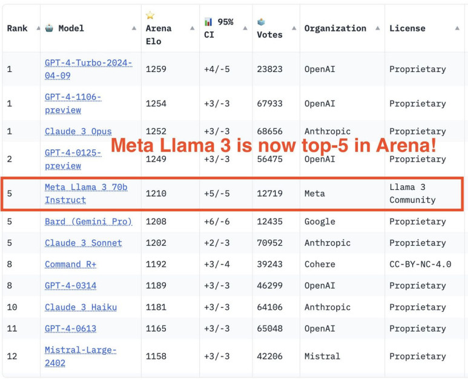
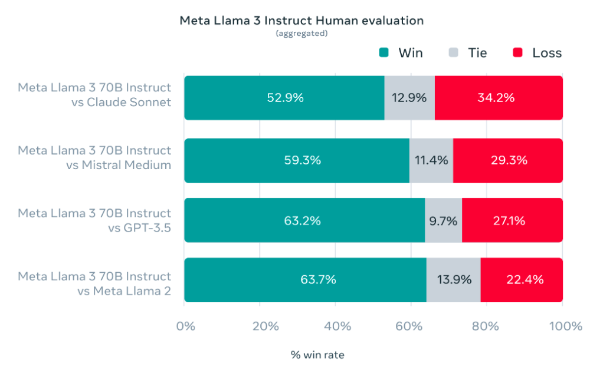
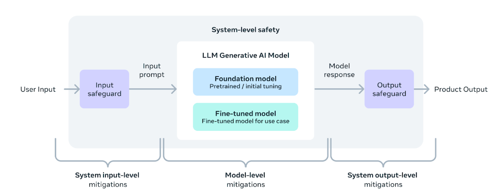

Meta 公司最近发布了 [Llama 3](https://ai.meta.com/blog/meta-llama-3/)，这是其最新一代尖端开源大型语言模型（LLM）。基于其前身的基础之上，Llama 3 旨在提升 Llama 2 作为与 ChatGPT 竞争的重要开源产品的能力，如文章 [Llama 2: 深入探索开源挑战者 ChatGPT](https://www.unite.ai/llama-2-a-deep-dive-into-the-open-source-challenger-to-chatgpt/) 中全面回顾的那样。

在本文中，我们将讨论 Llama 3 背后的核心概念，探索其创新架构和训练过程，并提供关于如何负责任地访问、使用和部署这一开创性模型的实际指导。无论你是研究人员、开发者还是 AI 爱好者，这篇文章都将为你提供利用 Llama 3 为你的项目和应用赋能的知识和资源。

## Llama 的演变：从 Llama 2 到 Llama 3

Meta 的 CEO，Mark Zuckerberg，在 [Threads.net](https://www.threads.net/@zuck/post/C56MFEKxl-x) 上宣布了 Llama 3 的首次亮相，这是 Meta AI 开发的最新 AI 模型。这个尖端模型现在已开源，旨在提升 Meta 的各种产品，包括 Messenger 和 Instagram。Zuckerberg 强调，Llama 3 使 Meta AI 成为最先进的[免费可用的 AI 助手](https://about.fb.com/news/2024/04/meta-ai-assistant-built-with-llama-3/)。

在我们讨论 Llama 3 的具体细节之前，让我们简要回顾一下它的前身，Llama 2。Llama 2 于 2022 年推出，是开源 LLM 领域的一个重要里程碑，提供了一个强大而高效的模型，可以在消费者硬件上运行。

然而，尽管 Llama 2 取得了显著的成就，但它也有其局限性。用户报告了一些问题，如错误拒绝（模型拒绝回答无害的提示）、有限的帮助性，以及在推理和代码生成等领域的改进空间。

进入 Llama 3：Meta 对这些挑战和社区的反馈做出了回应。通过 Llama 3，Meta 设定了与当今市场上顶级专有模型相媲美的最佳开源模型的目标，同时也优先考虑了负责任的开发和部署实践。

## Llama 3：架构和训练

Llama 3 的一项关键创新是其分词器，特点是显著扩展的词汇表，**128,256 个 token**（从 Llama 2 的 32,000 个增加）。这更大的词汇表允许更有效的文本编码，无论是输入还是输出，可能导致更强的多语言能力和整体性能的提升。

Llama 3 还采用了**分组查询注意力**（GQA），这是一种提高可扩展性的有效表示技术，有助于模型更有效地处理更长的上下文。**8B** 版本的 Llama 3 使用了 GQA，而**8B** 和 **70B** 模型都可以处理长达 **8,192 个 token**的序列。

### 训练数据和扩展

用于 Llama 3 的训练数据是其性能提升的关键因素。Meta 精心策划了一个包含超过 **15 万亿** token 的庞大数据集，来自公开可获得的在线来源，是用于 Llama 2 的数据集的七倍。这个数据集还包括了超过 5% 的高质量非英语数据，涵盖了 **30 多种语言**，为未来的多语言应用做准备。

为了确保数据质量，Meta 采用了先进的过滤技术，包括启发式过滤器、NSFW 过滤器、语义去重和训练在 Llama 2 上预测数据质量的文本分类器。团队还进行了广泛的实验，以确定预训练的最佳数据来源组合，确保 Llama 3 在广泛的用例上表现良好，包括琐事、STEM、编码和历史知识。

放大预训练是 Llama 3 开发的另一个关键方面。Meta 开发了缩放法则，使他们能够在实际训练之前预测其最大模型在关键任务上的性能，如代码生成。这些信息指导了关于数据组合和计算分配的决策，最终导致了更有效和有效的培训。

Llama 3 最大的模型是在两个定制构建的 24,000 GPU 集群上训练的，利用数据并行、模型并行和流水线并行技术的组合。Meta 的先进训练堆栈自动化了错误检测、处理和维护，最大化了 GPU 的运行时间，使训练效率比 Llama 2 提高了大约三倍。

### 指令微调和性能

为了充分发挥 Llama 3 在聊天和对话应用中的潜力，Meta 创新了其指令微调方法。其方法结合了**监督微调**（SFT）、拒绝抽样、**近端政策优化**（PPO）和**直接偏好优化**（DPO）。

SFT 中使用的提示质量和在 PPO 和 DPO 中使用的偏好排名在对齐模型的性能中起着关键作用。Meta 的团队精心策划了这些数据，并对由人类注释者提供的注释进行了多轮质量保证。

通过 PPO 和 DPO 对偏好排名进行训练还显著提高了 Llama 3 在推理和编码任务上的性能。Meta 发现，即使模型在直接回答推理问题时遇到困难，它仍然可能产生正确的推理迹象。通过偏好排名的训练，模型学会了如何从这些迹象中选择正确的答案。

成果显而易见：Llama 3 在常见的行业基准测试中表现优于许多可用的开源聊天模型，为 LLM 的 8B 和 70B 参数级别建立了新的最佳性能。

## 负责任的开发和安全考虑

在追求尖端性能的同时，Meta 也优先考虑了负责任的开发和部署实践，用于 Llama 3。该公司采用了系统级方法，将 Llama 3 模型视为更广泛生态系统的一部分，使开发者能够设计和定制模型以满足其特定用例和安全要求。

Meta 进行了广泛的红队演习，执行了对抗评估，并实施了安全缓解技术，以降低其指令调优模型中的残余风险。然而，该公司承认可能仍会存在残余风险，并建议开发者在其特定用例的背景下评估这些风险。

为支持负责任的部署，Meta 更新了其负责任使用指南，为开发者提供了一个全面的资源，以实施模型和系统级安全最佳实践，用于他们的应用。该指南涵盖了内容审查、风险评估和使用安全工具（如 Llama Guard 2 和 Code Shield）等主题。

Llama Guard 2，基于 MLCommons 分类法构建，旨在对 LLM 输入（提示）和响应进行分类，检测可能被视为不安全或有害的内容。CyberSecEval 2 在其前身的基础上增加了措施，以防止模型的代码解释器被滥用、攻击性网络安全能力和对提示注入攻击的易感性。

Code Shield 是 Llama 3 新推出的一个介绍，增加了推断时间的不安全代码过滤，减轻了不安全代码建议、代码解释器滥用和安全命令执行等风险。

## 访问和使用 Llama 3

随着 Meta AI 的 Llama 3 发布，已推出了几种开源工具，可在各种操作系统上进行本地部署，包括 Mac、Windows 和 Linux。本节详细介绍了三个值得注意的工具：Ollama、Open WebUI 和 LM Studio，每个工具都提供了利用 Llama 3 功能的独特功能。

**Ollama**：适用于 Mac、Linux 和 Windows，[Ollama](https://ollama.com/download) 简化了在个人计算机上操作 Llama 3 和其他大型语言模型的过程，即使是那些硬件较弱的设备也是如此。它包括一个包管理器，便于模型管理，并支持跨平台的下载和运行模型的命令。

**Open WebUI with Docker**：这个工具提供了一个用户友好的、基于 [Docker](https://docs.docker.com/desktop/) 的界面，兼容 Mac、Linux 和 Windows。它与 Ollama 注册表中的模型无缝集成，允许用户在本地 Web 界面内部署和交互，例如 Llama 3。

**LM Studio**：面向 Mac、Linux 和 Windows 的用户，[LM Studio](https://lmstudio.ai/) 支持一系列模型，基于 llama.cpp 项目构建。它提供了一个聊天界面，便于直接与各种模型进行交互，包括 Llama 3 8B Instruct 模型。

这些工具确保用户可以在个人设备上高效利用 Llama 3，满足技术技能和需求的不同范围。每个平台都提供了设置和模型交互的分步过程，使先进的人工智能更加易于开发者和爱好者接触。

## 大规模部署 Llama 3

除了直接提供模型权重外，Meta 还与各种云提供商、模型 API 服务和硬件平台合作，实现 Llama 3 的无缝部署。

Llama 3 的一大优势是其改进的 token 效率，这要归功于新的分词器。基准测试显示，与 Llama 2 相比，Llama 3 需要的 token 减少了 **15%**，从而实现了更快、更经济的推断。

Grouped Query Attention (GQA) 的整合在 Llama 3 的 8B 版本中有助于保持与 Llama 2 的 7B 版本相当的推断效率，尽管参数数量增加了。

为简化部署流程，Meta 提供了 Llama Recipes 代码库，其中包含开源代码和微调、部署、模型评估等示例。这个代码库为开发者提供了一个宝贵的资源，帮助他们利用 Llama 3 的能力来应用到他们的应用中。

对于那些有兴趣探索 Llama 3 性能的人来说，Meta 已经将其最新模型整合到 Meta AI 中，这是一个以 Llama 3 技术构建的领先人工智能助手。用户可以通过各种 Meta 应用程序，如 Facebook、Instagram、WhatsApp、Messenger 和 Web 与 Meta AI 进行交互，以完成任务、学习、创造和与他们关心的事物建立联系。

## Llama 3 接下来会怎样？

尽管 8B 和 70B 模型标志着 Llama 3 发布的开始，但 Meta 对这款开创性 LLM 的未来有雄心勃勃的计划。

在未来几个月，我们可以期待看到新功能的引入，包括多模态（能够处理和生成不同数据模态，如图像和视频）、多语言支持（支持多种语言）和更长的上下文窗口，以提高在需要广泛上下文的任务上的性能。

此外，Meta 计划发布更大的模型大小，包括目前正在训练中的超过 4000 亿参数的模型，这些模型在性能和能力方面展现出了有前途的趋势。

为了进一步推进该领域的发展，Meta 还将发布关于 Llama 3 的详细研究论文，与广泛的 AI 社区分享其发现和见解。

作为即将推出的内容的预览，Meta 分享了一些其最大 LLM 模型在各种基准上的早期性能快照。尽管这些结果是基于早期检查点的，并且可能会发生变化，但它们提供了一个激动人心的展望，展示了 Llama 3 的未来潜力。

## 结论

Llama 3 代表了开源大型语言模型演变的一个重要里程碑，推动了性能、能力和负责任开发实践的边界。凭借其创新架构、庞大的训练数据集和尖端的微调技术，Llama 3 为 LLM 的 8B 和 70B 参数级别建立了新的最佳性能基准。

然而，Llama 3 不仅仅是一个强大的语言模型；它还体现了 Meta 致力于培养一个开放和负责任的 AI 生态系统的承诺。通过提供全面的资源、安全工具和最佳实践，Meta 授权开发者充分利用 Llama 3 的潜力，同时确保根据其特定用例和受众的需求实现负责任的部署。

随着 Llama 3 之旅的继续，随着新的能力、模型大小和研究发现的出现，AI 社区热切期待从这款开创性 LLM 中涌现出的创新应用和突破。

无论你是一名推动自然语言处理边界的研究人员、一名构建下一代智能应用的开发者还是对最新进展感到好奇的 AI 爱好者，Llama 3 都承诺成为你工具箱中的强大工具，开启新的大门并解锁一系列可能性。
