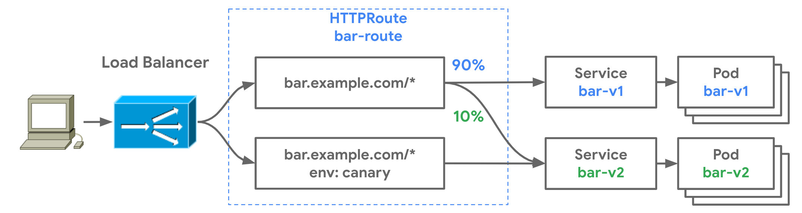

译者注：本文译自 [Evolving Kubernetes networking with the Gateway API](https://kubernetes.io/blog/2021/04/22/evolving-kubernetes-networking-with-the-gateway-api/)， Gateway API 的出现解决了 Ingress 的可移植性问题，且有利于基于角色的访问设计。

Ingress 资源是 Kubernetes 众多成功案例中的一个。它创造了一个[多样化的 Ingress 控制器的生态系统](https://kubernetes.io/docs/concepts/services-networking/ingress-controllers/)，这些控制器以标准化和一致的方式在数十万个集群中使用。这种标准化有助于用户采用 Kubernetes。然而，在 Ingress 创建五年后，有迹象表明它被分割成不同但[惊人相似的 CRD](https://dave.cheney.net/paste/ingress-is-dead-long-live-ingressroute.pdf) 和 [过载的注释](https://kubernetes.github.io/ingress-nginx/user-guide/nginx-configuration/annotations/)。Ingress 普遍存在的可移植性问题也限制了它的未来。

那是在 2019 年圣地亚哥的 Kubecon 上，一群充满激情的贡献者聚集在一起，讨论 [Ingress 的发展](https://static.sched.com/hosted_files/kccncna19/a5/Kubecon%20San%20Diego%202019%20-%20Evolving%20the%20Kubernetes%20Ingress%20APIs%20to%20GA%20and%20Beyond%20%5BPUBLIC%5D.pdf)。拥挤的人群溢出到了街对面的酒店大堂，而讨论出来的东西后来被称为 [Gateway API](https://gateway-api.sigs.k8s.io/)。这次讨论是基于几个关键的假设：

1. 路由匹配、流量管理和服务暴露所依据的 API 标准已经商业化，对其实施者和用户提供的定制 API 的价值很小。
2. 可以通过共同的核心 API 资源来表示 L4/L7 的路由和流量管理。
3. 可以在不牺牲核心 API 的用户体验的前提下，为更复杂的功能提供扩展性。

## Gateway API 介绍

这产出了一些设计原则，使 Gateway API 能够在 Ingress 的基础上进行改进。

- **表达性**：除了 HTTP 主机 / 路径匹配和 TLS 之外，Gateway API 还可以表达 HTTP 头操作、流量加权和镜像、TCP/UDP 路由等能力，以及其他只有在 Ingress 中通过自定义注释才能实现的能力。
- **面向角色的设计**：API 资源模型反映了路由和 Kubernetes 服务网络中常见的责任分离。
- **可扩展性**：这些资源允许在 API 的各个层面上进行任意的配置附加。这使得在最适当的地方进行细化的定制成为可能。
- **灵活的一致性**：Gateway API 定义了不同的一致性级别 —— 核心（强制支持）、扩展（支持时可移植）和自定义（不保证可移植性），一起被称为[灵活的一致性](https://gateway-api.sigs.k8s.io/concepts/guidelines/#conformance)。这促进了高度可移植的核心 API（如 Ingress），仍然为 Gateway 控制器实施者提供了灵活性。

### Gateway API 是什么样子的？

Gateway API 引入了一些新的资源类型：

- [**GatewayClasses**](https://gateway-api.sigs.k8s.io/references/spec/#networking.x-k8s.io/v1alpha1.GatewayClass) 是集群范围内的资源，作为模板，明确地定义由其衍生的网关的行为。这与 StorageClasses 的概念类似，但用于网络数据平面。
- [**Gateway**](https://gateway-api.sigs.k8s.io/references/spec/#networking.x-k8s.io/v1alpha1.Gateway) 是 GatewayClasses 的部署实例。它们是执行路由的数据平面的逻辑表示，它可能是集群内的代理、硬件 LB 或云 LB。
- **路由** 不是一个单一的资源，而是代表许多不同的特定协议的路由资源。[HTTPRoute](https://gateway-api.sigs.k8s.io/references/spec/#networking.x-k8s.io/v1alpha1.HTTPRoute) 有匹配、过滤和路由规则，这些规则被应用到可以处理 HTTP 和 HTTPS 流量的网关。同样，还有 [TCPRoutes](https://gateway-api.sigs.k8s.io/references/spec/#networking.x-k8s.io/v1alpha1.TCPRoute)、[UDPRoutes](https://gateway-api.sigs.k8s.io/references/spec/#networking.x-k8s.io/v1alpha1.UDPRoute) 和 [TLSRoutes](https://gateway-api.sigs.k8s.io/references/spec/#networking.x-k8s.io/v1alpha1.TLSRoute)，它们也有协议特定的语义。这种模式也允许网关 API 在未来逐步扩展其协议支持。


### Gateway 控制器的实现

好消息是，虽然 Gateway 还在 [Alpha](https://github.com/kubernetes-sigs/gateway-api/releases) 阶段，但已经有几个 [Gateway 控制器实现](https://gateway-api.sigs.k8s.io/references/implementations/)，你可以运行。由于它是一个标准化的规格，下面的例子都可以运行，而且功能应该完全相同。我们来看看如何安装和使用这些 Gateway 控制器。

## 实践 Gateway API

在下面的例子中，我们将展示不同的 API 资源之间的关系，并引导你完成一个常见的使用案例。

- foo 团队在 foo 命名空间中部署了他们的应用程序。他们需要控制其应用程序的不同页面的路由逻辑。
- Team bar 正在 bar 命名空间中运行。他们希望能够对他们的应用程序进行蓝绿部署以减少风险。
- 平台团队负责管理 Kubernetes 集群中所有应用程序的负载均衡器和网络安全。

下面的 foo-route 对 foo 命名空间中的各种服务进行路径匹配，并且有一个到 404 服务器的默认路由。这通过 `foo.example.com/login` 和 `foo.example.com/home` 分别暴露了 foo-auth 和 foo-home 服务。

```yaml
kind: HTTPRoute
apiVersion: networking.x-k8s.io/v1alpha1
metadata:
  name: foo-route
  namespace: foo
  labels:
    gateway: external-https-prod
spec:
  hostnames:
  - "foo.example.com"
  rules:
  - matches:
    - path:
        type: Prefix
        value: /login
    forwardTo:
    - serviceName: foo-auth
      port: 8080
  - matches:
    - path:
        type: Prefix
        value: /home
    forwardTo:
    - serviceName: foo-home
      port: 8080
  - matches:
    - path:
        type: Prefix
        value: /
    forwardTo:
    - serviceName: foo-404
      port: 8080
```

在同一个 Kubernetes 集群的 bar 命名空间中运行的 bar 团队也希望将他们的应用程序暴露在互联网上，但他们也希望控制自己的金丝雀发布和蓝绿部署。下面的 HTTPRoute 被配置为以下行为。

- 对于访问 `bar.example.com`的流量：
  - 将 90% 的流量发送到 bar-v1
  - 将 10% 的流量发送到 bar-v2
- 对于访问 `bar.example.com` 的流量，HTTP header 为 `env: canary`：
  - 将所有的流量发送到 bar-v2




```yaml
kind: HTTPRoute
apiVersion: networking.x-k8s.io/v1alpha1
metadata:
  name: bar-route
  namespace: bar
  labels:
    gateway: external-https-prod
spec:
  hostnames:
  - "bar.example.com"
  rules:
  - forwardTo:
    - serviceName: bar-v1
      port: 8080
      weight: 90
    - serviceName: bar-v2
      port: 8080
      weight: 10
  - matches:
    - headers:
        values:
          env: canary
    forwardTo:
    - serviceName: bar-v2
      port: 8080
```

### 路由和网关绑定

因此，我们有两个 HTTPRoute 匹配并将流量路由到不同的服务。你可能想知道，这些服务在哪里可以访问？它们是通过哪些网络或IP暴露的？

路由如何暴露给客户是由[路由绑定](https://gateway-api.sigs.k8s.io/concepts/api-overview/#route-binding)管理的，它描述了路由和网关如何在彼此之间建立双向关系。当路由与网关绑定时，意味着它们的集体路由规则被配置在底层负载均衡器或代理上，并且路由可以通过网关访问。因此，网关是一个网络数据平面的逻辑表示，可以通过路由配置。


### 行政授权

网关和路由资源之间的分割允许集群管理员将一些路由配置委托给各个团队，同时仍然保留集中控制。下面的网关资源在 443 端口暴露 HTTPS，并用集群管理员控制的证书终止该端口的所有流量。

```yaml
kind: Gateway
apiVersion: networking.x-k8s.io/v1alpha1
metadata:
  name: prod-web
spec:
  gatewayClassName: acme-lb
  listeners:  
  - protocol: HTTPS
    port: 443
    routes:
      kind: HTTPRoute
      selector:
        matchLabels:
          gateway: external-https-prod
      namespaces:
        from: All
    tls:
      certificateRef:
        name: admin-controlled-cert
```

下面的 HTTPRoute 显示了 Route 如何通过它的 `kind`（HTTPRoute）和资源标签（`gateway=external-https-prod`）确保它与 Gateway 的选择器相匹配。

```yaml
# 匹配网关上所需的 kind 选择器
kind: HTTPRoute
apiVersion: networking.x-k8s.io/v1alpha1
metadata:
  name: foo-route
  namespace: foo-ns
  labels:
    # 匹配网关上所需的标签选择器
    gateway: external-https-prod
...
```

### 以角色为导向的设计

当你把它放在一起时，你有一个单一的负载均衡基础设施，可以被多个团队安全地共享。Gateway API 不仅是一个用于高级路由的更具表现力的 API，而且是一个面向角色的 API，为多用户基础设施而设计。它的可扩展性确保了它在保持可移植性的同时，还能为未来的使用场景而发展。最终，这些特性将使 Gateway API 在未来适应不同的组织模式和实施方式。

### 尝试和参与
有许多资源可供查阅，以了解更多。

- 查阅[用户指南](https://gateway-api.sigs.k8s.io/guides/getting-started/)，看看可以解决哪些用例。
- 试用现有的[网关控制器](https://gateway-api.sigs.k8s.io/references/implementations/)。
- 或者[参与进来](https://gateway-api.sigs.k8s.io/contributing/community/)，帮助设计并影响Kubernetes服务网络的未来！
