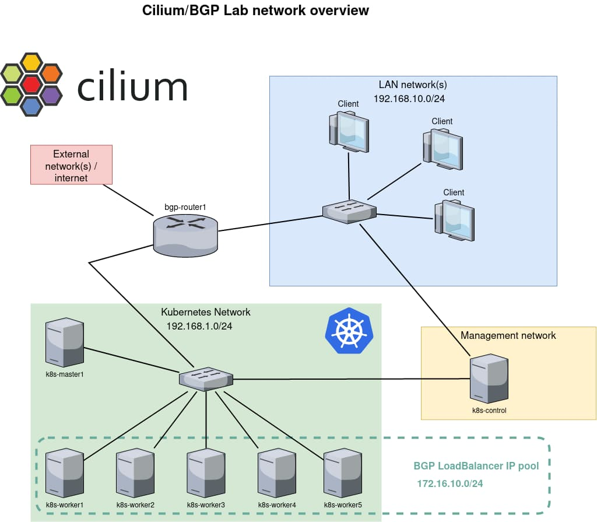
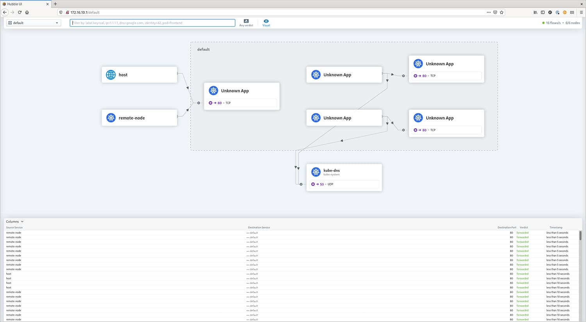

本文译自 [Exposing Load-Balanced Kubernetes Services with Cilium](https://sue.eu/blogs/expose-loadbalanced-kubernetes-services-with-bgp-cilium/)。

Cilium 是一个开源项目，旨在为云原生环境提供网络、安全和可观测性，例如 Kubernetes 集群和其他容器编排平台。本博客展示了如何使用 Cilium 和 BGP 将您的 Kubernetes 服务暴露给外部世界。

**BGP**
边界网关协议（BGP）是一种标准化的外部网关协议，旨在在互联网上的自治系统（AS）之间交换路由和可达性信息。该协议被分类为路径矢量协议，因此它根据由网络管理员配置的路径、网络策略或规则集来做出路由决策。它参与制定核心路由决策，这使得它对互联网的正常运行至关重要。

BGP 专为健壮性和可扩展性而开发，用于在大型网络之间路由数据，包括 ISP 和其他大型组织。它确保了无环的域间路由，并有助于维护稳定的网络结构。BGP 可以处理数千个路由，并以其随着网络增长而扩展的能力而脱颖而出。由于其灵活性和对路由策略的控制，它被广泛使用，使其能够快速响应网络变化。

**Cilium 和 BGP**
在版本 1.10 中，Cilium 集成了对 MetalLB 的 BGP 支持，从而使其能够宣布 Kubernetes 服务的 IP 地址类型为[使用 BGP 的 LoadBalancer](https://sue.eu/insights/bgp-load-balancing/)。其结果是，服务可以从 Kubernetes 网络外部访问，无需额外的组件，例如 Ingress 路由器。特别是“无需额外组件”的部分是令人振奋的消息，因为每个组件都会增加延迟，因此没有额外组件会减少延迟。



此示例中显示的网络配置代表了具有用于服务负载均衡的 BGP 集成的基于 Kubernetes 的环境。以下是配置的详细信息：

**客户端网络（LAN 网络）：** 存在一个具有 IP 范围 192.168.10.0/24 的本地区域网络（LAN），连接了多个客户端。该网络包含了设置的用户端，用户和其他设备可以在其中访问托管在 Kubernetes 集群上的服务。

**Kubernetes 网络：** Kubernetes 集群具有自己的网络空间，由子网 192.168.1.0/24 指定。该网络包括 Kubernetes 主节点（k8s-master1）和多个工作节点（从 k8s-worker1 到 k8s-worker5）。这些节点托管了 Kubernetes 集群的实际容器和工作负载。

**管理网络：** 一个独立的管理网络，至少有一个设备（k8s-control）用于控制和管理 Kubernetes 集群。这与 Kubernetes 数据平面分开，以确保安全性和管理效率。

**BGP 路由器：** bgp-router1 桥接了外部网络/互联网和 Kubernetes 网络。它负责使用 BGP 来广播路由将流量路由到 Kubernetes 集群中的适当服务。IP 范围 172.16.10.0/24 保留供 Kubernetes 集群内的 LoadBalancer 服务使用。当将 Kubernetes 服务公开为 LoadBalancer 时，它会分配一个来自此池的 IP 地址。然后，BGP 路由器将此 IP 广播到外部网络，从而使流量路由到 LoadBalancer 服务。

此网络配置允许通过利用 BGP 进行 IP 地址管理和路由来实现运行在 Kubernetes 集群上的服务的可扩展和灵活的负载均衡。它将客户端访问、集群管理和服务流量分别分隔到不同的网络中，以进行组织和安全性目的。

## 暴露服务

一旦构建了上述基础架构，就可以创建一个部署并使用 BGP 将其暴露给网络。让我们从一个部署开始，其中包含一个简单的 NGINX Web 服务器，提供默认的 Web 页面。我们还添加了一个类型为 LoadBalancer 的 Service。这将导致使用 BGP 向我们的路由器宣布外部 IP 地址。

一旦构建完成，命令 `kubectl get svc` 显示我们的服务具有外部 IP 地址：
```
NAME          TYPE           CLUSTER-IP       EXTERNAL-IP       PORT(S)         AGE
kubernetes    ClusterIP      10.96.0.1        <none>            443/TCP         7d3h
web1-lb       LoadBalancer   10.106.236.120   172.16.10.0       80:30256/TCP    7d2h
```
172.16.10.0 这个地址看起来很奇怪，但没问题。通常会跳过.0 地址，而使用.1 地址作为第一个地址。其中一个原因是在早期，.0 地址用于广播，后来改为.255。由于.0 仍然是一个有效的地址，负责地址池的 MetalLB 会将其分配为第一个地址。在路由器 bgp-router1 上运行的命令 `vtysh -c 'show bgp summary'` 显示它已接收到一个前缀：

```
IPv4 Unicast Summary:
BGP router identifier 192.168.1.1, local AS number 64512 vrf-id 0
BGP table version 17
RIB entries 1, using 192 bytes of memory
Peers 6, using 128 KiB of memoryNeighbour V AS MsgRcvd MsgSent TblVer InQ OutQ Up/Down State/PfxRcd PfxSnt
192.168.1.10 4 64512 445 435 0 0 0 03:36:56 1 0
192.168.1.21 4 64512 446 435 0 0 0 03:36:54 1 0
192.168.1.22 4 64512 445 435 0 0 0 03:36:56 1 0
192.168.1.23 4 64512 445 435 0 0 0 03:36:56 1 0
192.168.1.24 4 64512 446 435 0 0 0 03:36:56 1 0
192.168.1.25 4 64512 445 435 0 0 0 03:36:56 1 0

Total number of neighbors 6
```

路由表的以下片段（ip route）告诉我们，对于特定的 IP 地址 172.16.10.0，存在 6 个可能的路由/目标。换句话说，所有 Kubernetes 节点都宣布它们正在处理该地址的流量。太棒了！！

```
172.16.10.0 proto bgp metric 20
nexthop via 192.168.1.10 dev enp7s0 weight 1
nexthop via 192.168.1.21 dev enp7s0 weight 1
nexthop via 192.168.1.22 dev enp7s0 weight 1
nexthop via 192.168.1.23 dev enp7s0 weight 1
nexthop via 192.168.1.24 dev enp7s0 weight 1
nexthop via 192.168.1.25 dev enp7s0 weight 1
```

实际上，现在从我们的路由器上可以看到 Web 页面。

```
$ curl -s -v http://172.16.10.0/ -o /dev/null

* Trying 172.16.10.0…
* TCP_NODELAY set
* Connected to 172.16.10.0 (172.16.10.0) port 80 (#0)
> GET / HTTP/1.1
> Host: 172.16.10.0
> User-Agent: curl/7.61.1
> Accept: */*
< HTTP/1.1 200 OK
< Server: nginx/1.21.3
< Date: Sun, 31 Oct 2023 14:19:17 GMT
< Content-Type: text/html
< Content-Length: 615
< Last-Modified: Tue, 07 Sep 2023 15:21:03 GMT
< Connection: keep-alive
< ETag: “6137835f-267”
< Accept-Ranges: bytes>
{ [615 bytes data]}
* Connection #0 to host 172.16.10.0 left intact
```

而且，位于我们客户端网络中的客户端也可以访问相同的页面，因为它使用 bgp-router1 作为默认路由。


## 更多细节

现在一切都运作正常，大多数工程师都想看到更多细节，所以我不会让你失望。

### Ping

你将注意到的第一件事是，LoadBalancer 的 IP 地址无法通过 ping 访问。深入挖掘一下可以揭示原因。我们创建了源端口 80 和目标端口 80 之间的映射。此映射在接口上使用 eBPF 逻辑执行，并存在于所有节点上。此映射确保只有端口 80 的流量被均衡。所有其他流量，包括 ping，都不被接收。这就是为什么你可以看到 icmp 数据包到达节点，但从未发送响应的原因。

### 观察流量

Hubble 是建立在 eBPF 和 Cilium 之上的网络和安全性可观测平台。通过命令行和图形 Web GUI，可以查看当前和历史流量。在这个示例中，Hubble 放置在 k8s-control 节点上，该节点直接访问 Hubble Relay 的 API。Hubble Relay 是从 Cilium 节点获取所需信息的组件。请注意，Hubble 命令也存在于每个 Cilium 代理 Pod 中，但那个命令只会显示特定代理的信息！以下输出显示了从路由器上执行 curl http://172.16.10.0/ 命令后的观察者信息。

```
$ hubble observe –namespace default –follow

Oct 31 15:43:41.382: 192.168.1.1:36946 <> default/web1-696bfbbbc4-jnxbc:80 to-overlay FORWARDED (TCP Flags: SYN)
Oct 31 15:43:41.384: 192.168.1.1:36946 <> default/web1-696bfbbbc4-jnxbc:80 to-overlay FORWARDED (TCP Flags: ACK)
Oct 31 15:43:41.384: 192.168.1.1:36946 <> default/web1-696bfbbbc4-jnxbc:80 to-overlay FORWARDED (TCP Flags: ACK, PSH)
Oct 31 15:43:41.385: 192.168.1.1:36946 <> default/web1-696bfbbbc4-jnxbc:80 to-overlay FORWARDED (TCP Flags: ACK)
Oct 31 15:43:41.385: 192.168.1.1:36946 <> default/web1-696bfbbbc4-jnxbc:80 to-overlay FORWARDED (TCP Flags: ACK)
Oct 31 15:43:41.386: 192.168.1.1:36946 <> default/web1-696bfbbbc4-jnxbc:80 to-overlay FORWARDED (TCP Flags: ACK, FIN)
Oct 31 15:43:41.386: 192.168.1.1:36946 <> default/web1-696bfbbbc4-jnxbc:80 to-overlay FORWARDED (TCP Flags: ACK)
```

之前，我警告过不要在 Cilium 代理 Pod 内使用 hubble 命令，但在特定节点流量中看到具体的情况也可以非常有信息价值。在这种情况下，每个 Cilium 代理 Pod 中都执行了 `hubble observe –namespace default –follow`，并且路由器的 curl 执行了一次。

在托管 Pod 的节点（k8s-worker2）上，我们看到与上面的输出相同的输出。但是，在另一个 Pod（k8s-worker1）上，我们看到以下输出：

```
Oct 31 15:56:05.220: 10.0.3.103:48278 -> default/web1-696bfbbbc4-jnxbc:80 to-endpoint FORWARDED (TCP Flags: SYN)
Oct 31 15:56:05.220: 10.0.3.103:48278 <- default/web1-696bfbbbc4-jnxbc:80 to-stack FORWARDED (TCP Flags: SYN, ACK)
Oct 31 15:56:05.220: 10.0.3.103:48278 -> default/web1-696bfbbbc4-jnxbc:80 to-endpoint FORWARDED (TCP Flags: ACK)
Oct 31 15:56:05.221: 10.0.3.103:48278 -> default/web1-696bfbbbc4-jnxbc:80 to-endpoint FORWARDED (TCP Flags: ACK, PSH)
Oct 31 15:56:05.221: 10.0.3.103:48278 <- default/web1-696bfbbbc4-jnxbc:80 to-stack FORWARDED (TCP Flags: ACK, PSH)
Oct 31 15:56:05.222: 10.0.3.103:48278 -> default/web1-696bfbbbc4-jnxbc:80 to-endpoint FORWARDED (TCP Flags: ACK, FIN)
Oct 31 15:56:05.222: 10.0.3.103:48278 <- default/web1-696bfbbbc4-jnxbc:80 to-stack FORWARDED (TCP Flags: ACK, FIN)
Oct 31 15:56:05.222: 10.0.3.103:48278 -> default/web1

-696bfbbbc4-jnxbc:80 to-endpoint FORWARDED (TCP Flags: ACK)
Oct 31 15:56:12.739: 10.0.4.105:36956 -> default/web1-696bfbbbc4-jnxbc:80 to-endpoint FORWARDED (TCP Flags: SYN)
Oct 31 15:56:12.739: default/web1-696bfbbbc4-jnxbc:80 <> 10.0.4.105:36956 to-overlay FORWARDED (TCP Flags: SYN, ACK)
Oct 31 15:56:12.742: 10.0.4.105:36956 -> default/web1-696bfbbbc4-jnxbc:80 to-endpoint FORWARDED (TCP Flags: ACK)
Oct 31 15:56:12.742: 10.0.4.105:36956 -> default/web1-696bfbbbc4-jnxbc:80 to-endpoint FORWARDED (TCP Flags: ACK, PSH)
Oct 31 15:56:12.745: default/web1-696bfbbbc4-jnxbc:80 <> 10.0.4.105:36956 to-overlay FORWARDED (TCP Flags: ACK, PSH)
Oct 31 15:56:12.749: 10.0.4.105:36956 -> default/web1-696bfbbbc4-jnxbc:80 to-endpoint FORWARDED (TCP Flags: ACK, FIN)
Oct 31 15:56:12.749: default/web1-696bfbbbc4-jnxbc:80 <> 10.0.4.105:36956 to-overlay FORWARDED (TCP Flags: ACK, FIN)
```

我们在这里看到的是，我们的路由器将 IP 地址 172.16.10.0 的流量发送到 k8s-worker1，但该工作节点不托管我们的 web1 容器，因此它将流量转发到处理流量的 k8s-worker2。所有的转发逻辑都使用 eBPF 处理 - 附加到接口的一个小的 BPF 程序将在需要时发送流量和路由到另一个工作节点。这也是为什么在 k8s-worker1 上运行 tcpdump，初始接收到流量的地方，不会显示任何流量的原因。它已经在进入 k8s-worker1 的 IP 堆栈之前被重定向到 k8s-worker2。

我们的合作伙伴 [Isovalent](https://docs.cilium.io/en/stable/network/ebpf/intro/) 有很多关于 eBPF 和内部工作原理的信息。如果你还没有听说过 eBPF，而且你对 Linux 和/或网络感兴趣，请务必探索一下基础知识。在我看来，eBPF 将在不久的将来彻底改变 Linux 的网络，特别是对于云原生环境！

[Cilium.io ](https://cilium.io/)上有很多关于 eBPF 和内部工作原理的信息。如果你还没有听说过 eBPF，而且你对 Linux 和/或网络感兴趣，请务必了解至少基础知识。在我看来，eBPF 将在不久的将来彻底改变 Linux 的网络，特别是对于云原生环境！

### Hubble Web GUI

通过一个工作正常的 BGP 设置，使 Hubble Web GUI 对外界也很简单。



## 最后的话

通过 MetalLB 的集成，使用 BGP 设置 Cilium 变得非常简单，消除了昂贵的网络硬件的需求。Cilium/BGP 的这种组合，特别是与停用 kube-proxy 结合使用，显著降低了到云端服务的延迟。它还通过仅宣布 LoadBalancer 的 IP 地址来增强安全性和透明性。虽然这种设置不需要 Ingress Controller，但对于大多数 HTTP 服务仍然建议使用一个。像 NGINX 或 Traefik 这样的控制器，通过 BGP 公开，提供协议级别的重写和请求速率限制等重大优势。

这种云原生和基于 Linux 的网络的进步确实是一个飞跃，标志着网络技术的激动人心的时代！