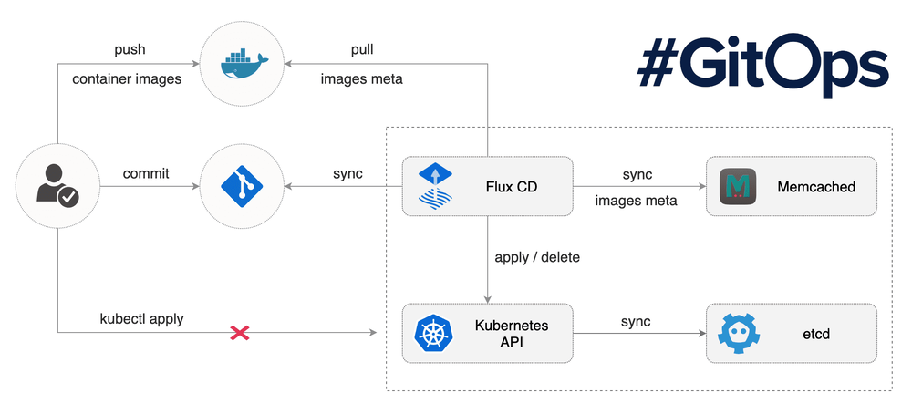
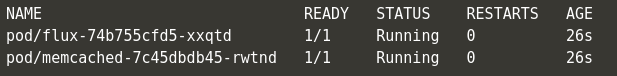
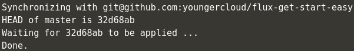
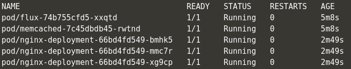
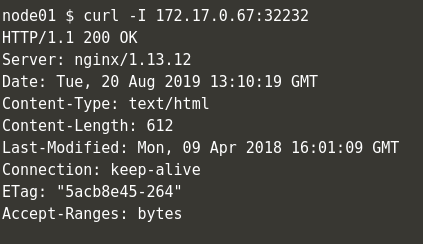
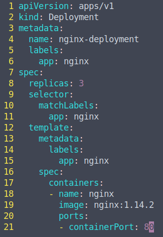
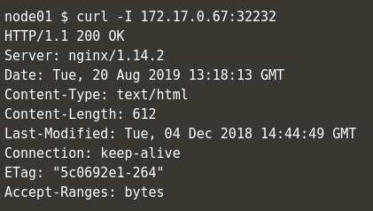
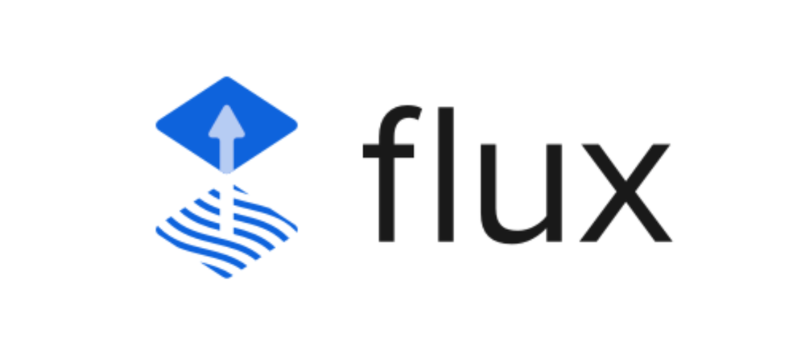

## 什么是 GitOps?

GitOps, 这已经并不是一个新鲜的概念了。2018 年 5 月初在丹麦举行的哥本哈根 KubeCon 大会上，Weaveworks 公司的演讲将 GitOps 与 Istio Service Mesh 进行了集成，如果说以前 Docker Swarm 与 Kubernetes 竞争之时 Docker 公司提出了 Docker Native，CNCF 基于 Kubernetes 提出了自己的 Cloud Native，毫不夸张的说，Weaveworks 公司开源的 Weave Flux 也可以说是 GitOps 的‘Native’了。而在 2019 年 8 月 20 日，Flux 项目也最终成功加入了 CNCF Sandbox，成为了 CNCF Sandbox 中的一员。



当然，GitOps 的概念是从 DevOps 慢慢延伸出来的。把时间轴向前调调整，如 2014 年左右如火如荼的 DevOps 一样，当时从大到小的互联网企业都在招聘 DevOps 工程师。然而慢慢脱离了以前 DevOps 理念的不成熟，随着 DevOps 的发展，人们才慢慢意识到 DevOps 并不是所谓的"运维开发", 而是一种注重了开发团队、测试团队、运维团队的更好的沟通协作，从而去实现持续集成和持续交付的最佳实践。

如果说之前对 DevOps 的理念理解是"顾名思义"而导致的问题，那么现在的 GitOps 也多多少少面临着同样的境地，GitOps 绝非是仅仅用 Git 去做 CI/CD 的 Pipeline，既然 Weaveworks 开源的 Weave Flux 可以成为 GitOps 的主流实践，其给出的描述是这样的：“如果说 DevOps 的 CI/CD Pipeline 的终点是互联网公司交付的产品或者是我们最终发布的线上业务，GitOps 则把目标转向了当前的容器编排事实标准--Kubernetes，而 GitOps 则是一种进行 Kubernetes 集群管理和应用程序交付的方法。”

这样一来，GitOps 就于传统的 DevOps 划清了界限。更明确一点说：“DevOps 注重的是产品发布中开发/运维/测试的沟通与协作，GitOps 则更加贴近集群管理。这个集群还得是"拥抱云原生"基础设施的 Kubernetes 集群。”

既然贴近了云原生和 Kubernetes，就不得不提到云原生 12 要素。更值得关注的是，这 12 要素的第一条就是"基准代码，多份部署"。GitOps 的设计者也意识到了这一点，在 GitOps 中，一旦 Git 仓库中的代码被更改，CI/CD Pipeline 也就会对我们的 Kubernetes 集群进行更改。GitOps 摒弃了传统部署环境的多份环境多份配置文件，并且设计者也应用了 Kubernetes 控制循环的思想，用 Git 管理的 Kubernetes 集群的期望状态也会和 Git 仓库中的实时状态不断地进行比较。

接下来的实战就一起来看看 Flux 项目是怎么用 Git 来管理整个 Kubernetes 集群的。
***

## Flux CD 实践

Flux 的安装默认提供了两种方式，传统的使用 yaml 文件部署的方式或者通过 Helm 的部署。但是 Flux 暂未支持 Helm 的 V3 版本，所以我们使用传统方式去部署 (笔者闲谈：由于笔者使用的是 Helm V3 版本，也坚信去 Tiller 化的正确性，但是目前开源社区对 Helm V3 版本的响应程度着实不高，也导致更多人把精力转向了 Kubernetes 原生的 Kustomize)

我们直接 Clone Flux 项目的 Github Repo

```shell
% git clone https://github.com/fluxcd/flux
% cd flux/
% vim deploy/flux-deployment.yaml
```

在这里，我们需要将--git-url 更改为存储生产环境 yaml 文件的 Github Repo，当然如果不想把生产环境的 yaml 文件托管在 Github 上，Flux 也提供了 Gitlab 的支持去更好的进行私有环境的部署与管理。


```shell
--git-url=git@github.com:YOUR-GITHUB/REPO-NAME
```

PS: 因为官方的例子过于繁琐，笔者在这里提供了更直观的例子。这个例子很简单，只由一个 Nginx-Deployment 和带有 NodePort 的 Nginx-Service 组成，项目已经存储在[Github](https://github.com/youngercloud/flux-get-start-easy)

部署 Flux 到 Kubernetes 集群中

```shell
% kubectl apply -f deploy
```

PS: 如果使用 minikube 进行实验，请确保安装 socat

```shell
% yum install -y socat
```

确保 Flux Pod 进入 Running 状态并 Ready 后，我们还需要下载 fluxctl 二进制命令包，fluxctl 将与 Kubernetes 集群中的 flux Pod 进行交互。



```shell
% wget https://github.com/fluxcd/flux/releases/download/1.13.1/fluxctl_linux_amd64
% mv fluxctl_linux_amd64 fluxctl && chmod +x fluxctl && cp fluxctl /usr/local/bin/
```

fluxctl 安装好之后，我们需要部署我们的 Deploy Key 到 Github Repo 上，以实现本地集群和远端 Github Repo 的连调。


我们可以通过 fluxctl identity 命令获取 Flux 的 SSH 公钥，如果你想打造一个更方便管理的环境，Flux 也可以使用系统 SSH 所产生的私钥，具体的做法是先删除原本 Flux 的 secret，再通过--from-file=priveate_key 的方式重新创建需要被 Pod 挂载的 Secret 私钥。

```shell
% fluxctl identity
```

当我们在 Git Repo 中通过 SSH 私密部署好 Deploy Key 并 Allow Read/Write Access 权限后，我们就可以尝试本地环境和远端 Repo 的同步了。

```shell
% fluxctl sync
```

如果没有问题的话，Flux 会返回以下信息：



这条信息的出现表明了集群同步已经完毕。接下来我们就可以尝试使用 Git 去管理 Kubernetes 集群了。

我们先执行`kubectl get all`查看 Kubernetes 集群的当前状态。
可以清楚的看到，我们没有手动的使用 kubectl 执行任何操作，Flux 已经自动的帮我们做好了本地集群和远端 Git Repo 的同步工作，Nginx-Pod 已经处在了 Running 状态。



我们可以使用 curl 命令对已经被 Flux 部署在 Kubernetes 集群中的 Nginx 进行访问测试，可以看到访问测试是成功的。

 	

在这时，如果我们尝试用 git 去对集群做出更改，整体的流程和我们平时修改代码的流程是大致相同的

**1. 如果本地仓库没有 yaml 文件，我们需要先从远端仓库 pull 下来我们的 yaml**

**2. 在本地仓库去更改我们的 yaml 文件，在这个例子中，我对之前所部署的 Nginx 版本做出了修改，从 1.13.12 升级到了 1.14.2**



**3. git add FILE_CHANGED**

**4. git commit -m "DESCRIPTION"**

**5. git push**

一旦我们的代码被提交到远端的 GitRepo 仓库后，我们就可以再次使用`fluxctl sync`命令去进行同步。如果不执行这条命令，Flux 也会过几分钟之后自动的去进行同步。

通过 curl 命令的测试结果我们可以看到，集群更新已经完毕，我们 Kubernetes 集群中的 Nginx 也修改到了 1.14.2 版本。



##  参考连接：
* Flux 项目 Github Repo：https://github.com/fluxcd/flux
* Flux 项目官方网站：https://fluxcd.io/



