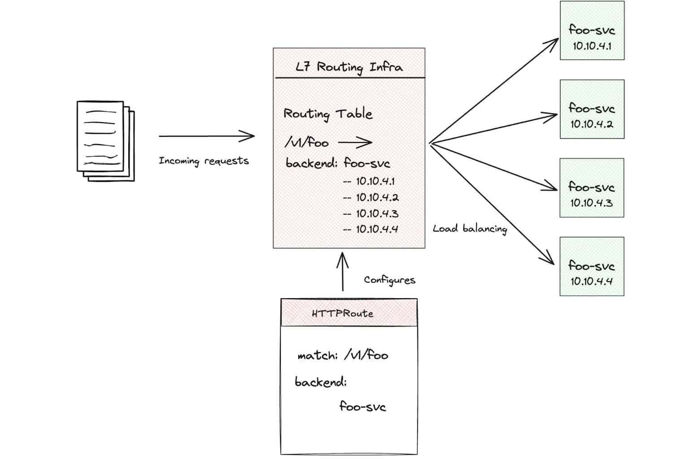
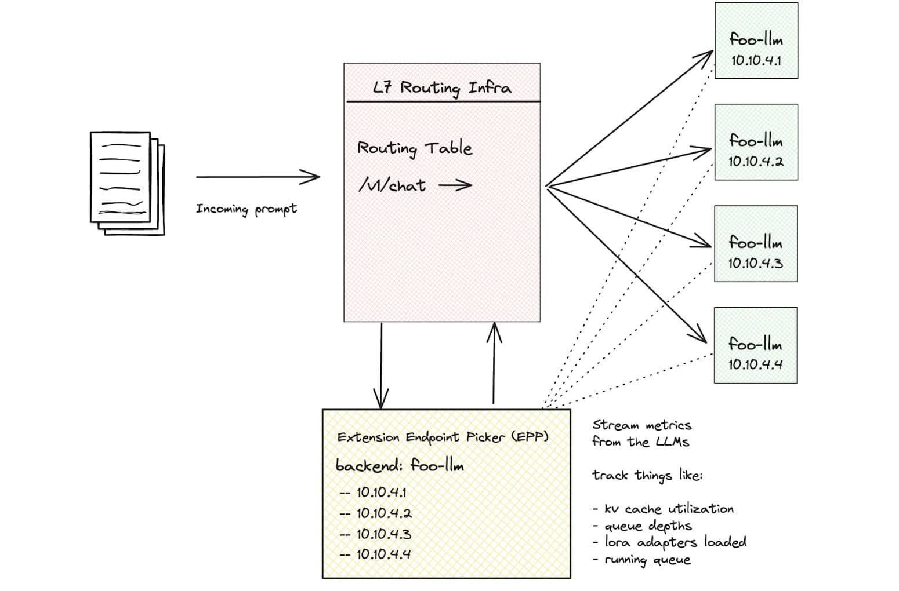
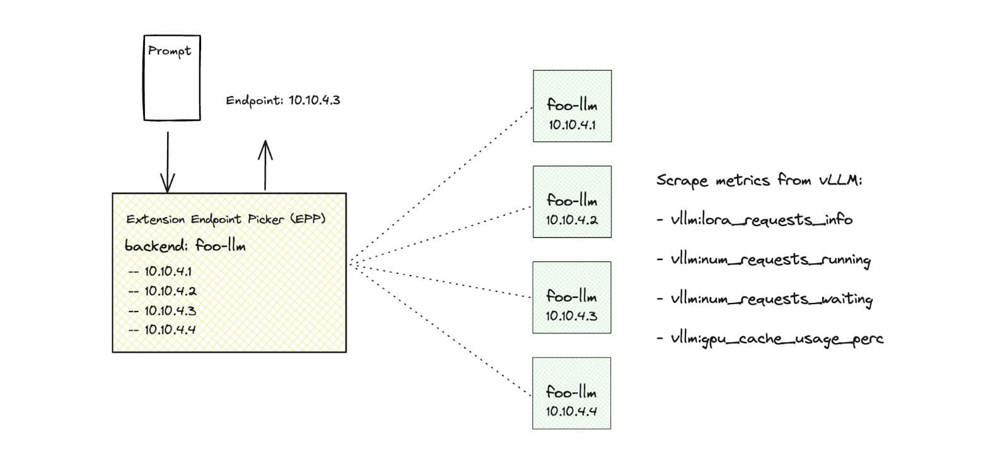
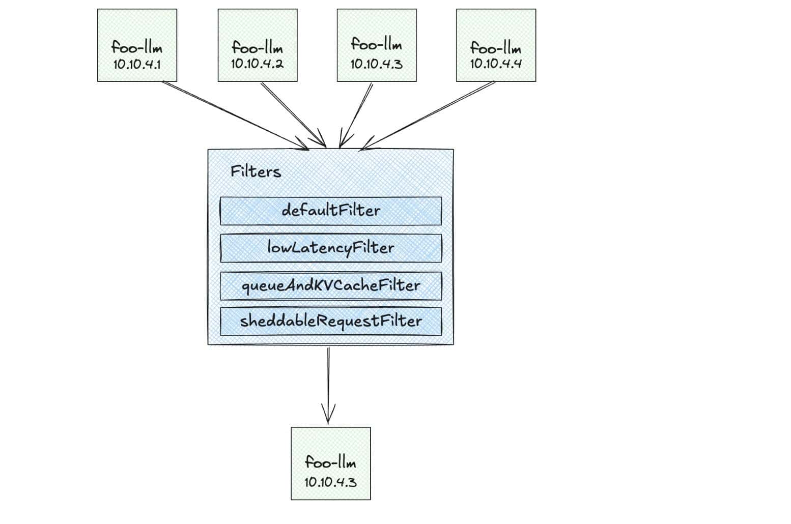

在 Kubernetes 上运行 AI 推理工作负载具有一些独特的特点和挑战，Gateway API Inference Extension 项目旨在解决其中的一些问题。我最近在 [kgateway 项目](https://kgateway.dev/blog/smarter-ai-reference-kubernetes-gateway-api/) 中写过关于这些新能力的文章，而本文将深入讲解其工作原理。

大多数人将 Kubernetes 中的请求路由理解为基于 Gateway API、Ingress 或 Service Mesh（统称为 L7 路由器）的机制。这些实现的原理类似：你定义一些根据请求属性（如 header、path 等）进行匹配的路由规则，L7 路由器会基于这些规则决定请求应发送到哪个后端，并使用某种负载均衡算法（如 [轮询、最少请求、环哈希、区域感知、优先级](https://www.envoyproxy.io/docs/envoy/latest/intro/arch_overview/upstream/load_balancing/load_balancing) 等）。



然而，传统的负载均衡算法并不适合 AI/LLM 模型后端。与典型的无状态 Web API 不同，基于 GPU 的 LLM 运行方式特殊，处理方式不当将导致资源浪费与高成本。如果我们能够利用模型和 GPU 的实时指标做出更智能的路由与负载均衡决策，会怎样？例如，当某个后端 LLM 已加载某个特定的 LoRA 微调适配器时，相关请求应该优先路由至该实例，以避免其他实例因动态加载适配器而浪费 GPU 时间。再如，当某个后端请求队列已积压过多，请求继续发送只会拖慢响应。如果所有后端都已饱和，是否可以启用“负载丢弃”机制，保障系统稳定？



这正是 [Gateway API Inference Extension](https://gateway-api-inference-extension.sigs.k8s.io/) 项目所实现的功能。它引入了两个新的 Kubernetes CRD：[InferenceModel 和 InferencePool](https://gateway-api-inference-extension.sigs.k8s.io/concepts/api-overview/)，并提出了“endpoint picker（端点选择器）”的概念，可以扩展 L7 路由能力。该选择器可以结合底层 LLM 的指标做出更合理的路由决策，支持项目如 [kgateway](https://kgateway.dev/) 和 [Istio](https://istio.io/) 的集成。

## 推理扩展如何扩展 Gateway API

Gateway API Inference Extension 引入了两个新的自定义资源定义（CRD）：`InferenceModel` 和 `InferencePool`。结合端点选择器使用，可将现有 L7 路由架构升级为“推理网关”，以支持自托管的大模型/生成式 AI（GenAI）服务，采用“模型即服务”的架构理念。

[InferenceModel CRD](https://gateway-api-inference-extension.sigs.k8s.io/api-types/inferencemodel/) 主要面向 AI 工程师，用于定义逻辑模型的推理入口。它支持将用户可见的模型名映射到实际后端模型，并支持在多个微调模型之间进行流量切分。例如，你想将模型 `llama2` 提供给用户，而实际后端模型可能叫做 `vllm-llama2-7b-2024-11-20` 或 `vllm-llama2-7b-2025-03-24`，使用 InferenceModel 即可实现：

```yaml
apiVersion: inference.networking.x-k8s.io/v1alpha2
kind: InferenceModel
metadata:
  name: inferencemodel-llama2
spec:
  modelName: llama2
  criticality: Critical
  poolRef:
    name: vllm-llama2-7b-pool
  targetModels:
  - name: vllm-llama2-7b-2024-11-20
    weight: 75
  - name: vllm-llama2-7b-2025-03-24
    weight: 25
```

此外，它还允许工作负载所有者为请求指定“重要性等级”，确保实时服务优先于批量处理任务。后续我们会看到该设置如何结合 LLM 实时指标进行调度。

[InferencePool CRD](https://gateway-api-inference-extension.sigs.k8s.io/api-types/inferencepool/) 则面向平台运维人员，表示一组模型服务实例，是 AI 工作负载的后端服务。借助该 CR，可将 HTTPRoute 请求路由至一个推理实例池，并通过定义 `endpoint picker` 实现根据实时指标（如请求队列长度、GPU 内存使用等）做出智能决策：

```yaml
apiVersion: inference.networking.x-k8s.io/v1alpha2
kind: InferencePool
metadata:
  name: vllm-llama2-7b-pool
spec:
  targetPortNumber: 8000
  selector:
    app: vllm-llama2-7b
  extensionRef:
    name: vllm-llama2-7b-endpoint-picker
```

要实现从推理网关到 LLM 后端的流量转发，需定义一个将流量引导至 InferencePool 的 HTTPRoute：

```yaml
apiVersion: gateway.networking.k8s.io/v1
kind: HTTPRoute
metadata:
  name: llm-route
spec:
  parentRefs:
  - name: inference-gateway
  rules:
  - backendRefs:
    - group: inference.networking.x-k8s.io
      kind: InferencePool
      name: vllm-llama2-7b
    matches:
    - path:
        type: PathPrefix
        value: /
```

一旦请求到达推理网关，匹配规则后将转发至 InferencePool，此时请求会首先进入一个名为 “Endpoint Selection Extension”（ESE）的组件。这个 ESE 根据 LLM 的实时指标来选择具体的后端 Pod。我们来深入了解其工作机制。

## 端点选择机制详解

当请求到达 Endpoint Selection Extension（ESE）时，它会从请求体中提取 `modelName` 字段，目前该请求体需符合 [OpenAI API 格式](https://platform.openai.com/docs/api-reference/chat/create)。识别出模型名后，ESE 会比对现有的 InferenceModel 资源，定位对应的后端模型名或 LoRA 微调适配器。

如请求中指定了 `llama2`，ESE 会查找并选择对应的后端模型，如 `vllm-llama2-7b-2024-11-20` 或 `vllm-llama2-7b-2025-03-24`。

选择后端的逻辑由一系列“过滤器”组成，ESE 会依次评估以下指标：

- 请求的关键性（Critical 或 Sheddable）
- LLM 的请求队列长度
- LoRA 适配器是否已加载
- KV 缓存占用率



评估流程示意如下：

1. 判断请求是否为 Critical。
2. 如果是 Critical，请求只会进入队列长度 < 50 的实例。
3. 再判断是否已加载对应的 LoRA。
4. 若没有加载，也会尝试选择能加载的备选。
5. 如果是 Sheddable 请求，则只选择 KV 缓存占用率 < 80%、队列长度 < 5 的实例；否则请求会被丢弃。



### 示例分析

#### 示例1：Critical 请求 + LoRA 适配器要求

假设有以下 Pod：

- Pod A: 队列=10，KV 缓存=30%，已加载 LoRA-X
- Pod B: 队列=5，KV 缓存=70%，未加载 LoRA-X
- Pod C: 队列=60，KV 缓存=20%，已加载 LoRA-X

最终选择：**Pod A**

#### 示例2：非 Critical 请求

- Pod A: 队列=6，KV=85%
- Pod B: 队列=4，KV=75%
- Pod C: 队列=7，KV=60%

最终选择：**Pod B**

#### 示例3：Critical 请求 + 所有队列都很高

- Pod A: 队列=70，KV=40%，有 LoRA-Y
- Pod B: 队列=80，KV=60%，有 LoRA-Y
- Pod C: 队列=65，KV=70%，无 LoRA-Y

最终选择：**Pod A**

## 总结

Gateway API Inference Extension 项目为 Kubernetes 上运行的大模型和 GPU 提供了智能模型选择和负载均衡能力。在 GPU 资源紧缺、成本高昂的背景下，该项目可以大幅提升吞吐性能和资源利用率，并节省企业成本。你可以在 [项目网站](https://gateway-api-inference-extension.sigs.k8s.io/performance/benchmark/) 上查看最新性能基准测试数据。
