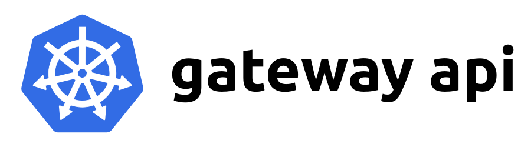
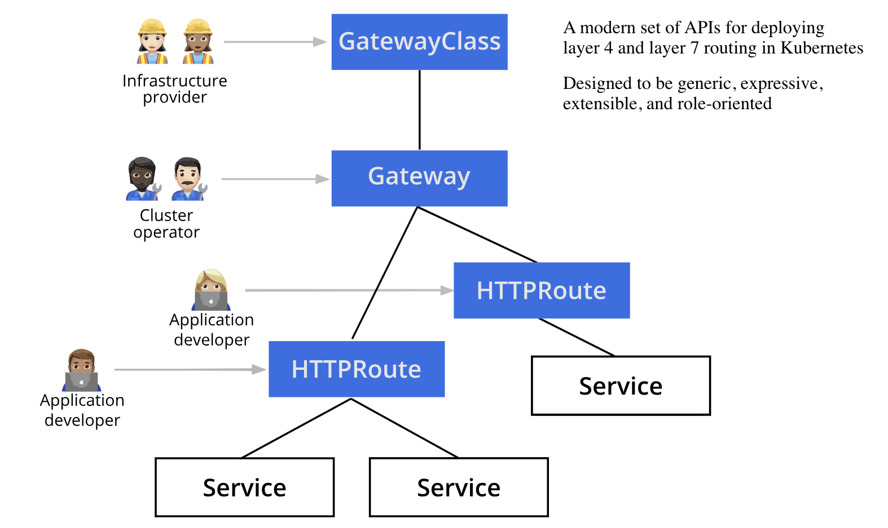

近日 Kubernetes Gateway API [宣布 GA](https://kubernetes.io/blog/2023/10/31/gateway-api-ga/)，此版本包括将 Gateway、GatewayClass 和 HTTPRoute 升级到 v1，这意味着它们现在已全面可用 (GA)。此 API 版本表示对 API 表面的高度信任，并提供向后兼容性的保证。请注意，尽管标准通道中包含的这些 API 的版本现在被认为是稳定的，但这并不意味着它们是完整的。当这些 API 满足毕业标准时，将继续通过实验渠道接收新功能。有关所有这些工作原理的更多信息，请参阅网关 API 版本控制策略。



与此同时 Gateway API 项目组发布了 [ingress2gateway](https://github.com/kubernetes-sigs/ingress2gateway) 工具，它可以帮助你从 [Ingress](https://kubernetes.io/docs/concepts/services-networking/ingress/) 迁移到 [Gateway API](https://gateway-api.sigs.k8s.io/)。Gateway API 距离 GA（General Availability，正式版本）发布只有几周的时间，如果你还没有进行升级，现在是时候考虑一下了！

## 背景

在不断发展的 Kubernetes 世界中，网络在其中起着至关重要的作用。随着越来越多的应用程序部署在 Kubernetes 集群中，将这些服务有效地暴露给客户端成为一个关键问题。如果你一直在使用 Kubernetes，你可能对 [Ingress API](https://kubernetes.io/docs/concepts/services-networking/ingress/) 非常熟悉，这一直是管理对外访问服务的首选解决方案。

Ingress API 提供了一种将外部流量路由到集群内部应用程序的方式，使其成为许多 Kubernetes 用户不可或缺的工具。然而，Ingress 也有其局限性，随着应用程序变得越来越复杂，对 Kubernetes 集群的需求也增加，这些局限性可能成为瓶颈。

其中一些局限性包括：

- **不足的共同基准** - 通过尝试为各种 HTTP 代理建立一个共同基准，Ingress 只能容纳基本的 HTTP 路由，将当代代理的更多功能（如流量拆分和标头匹配）强制转移到特定于提供商的、不可传递的注释中。
- **不足的权限模型** - Ingress 规范在一个对象中同时配置基础设施和应用程序配置。在 Ingress 中，集群操作员和应用程序开发人员在同一个 Ingress 对象上进行操作，而彼此的角色并不清楚。这导致了不足的基于角色的访问控制，并且很容易出现设置错误。
- **协议多样性的缺乏** - Ingress 主要关注 HTTP(S) 路由，并没有原生支持其他协议，比如 TCP、UDP 和 gRPC。这个局限性使得它在处理非 HTTP 工作负载方面不太适用。

## Gateway API

为了克服这些问题，Gateway API 设计了一种更灵活、可扩展和强大的方式来管理流量到你的服务。

Gateway API 距离 GA（正式版本）发布只有几周的时间。它提供了一个标准的 Kubernetes API 来控制入口流量。它提供了扩展的功能、改进的自定义性和更大的灵活性。通过关注模块化和表达能力强大的 API 资源，Gateway API 可以描述更广泛的路由配置和模型。

在 Kubernetes 中从 Ingress API 迁移到 Gateway API 的过程是由 Gateway API 提供的优势和高级功能驱动的，它的基础建立在四个核心原则上：面向角色的方法、可移植性、表达性和可扩展性。

### 面向角色的方法

Gateway API 使用面向角色的方法，使其与参与配置 Kubernetes 服务网络的组织中的传统角色保持一致。这种方法使得基础设施工程师、集群操作员和应用程序开发人员可以共同解决 Gateway API 的不同方面。

例如，基础设施工程师在部署 GatewayClasses 时发挥着关键作用，GatewayClasses 是集群范围的资源，它们作为模板明确定义了从它们派生的 Gateways 的行为，为强大的服务网络奠定了基础。

随后，集群操作员使用这些 GatewayClasses 来部署网关。Kubernetes 的 Gateway API 中的 Gateway 定义了如何将外部流量导向集群内的服务，从本质上讲，将非 Kubernetes 源与 Kubernetes 感知目标连接起来。它代表了对与 GatewayClass 规范对齐的负载均衡器配置的请求。Gateway 规范可能不是详尽无遗的，因为一些细节可以由 GatewayClass 控制器提供，以确保可移植性。此外，一个 Gateway 可以与多个 Route 引用关联起来，将特定的流量子集通道到指定的服务。

最后，应用程序开发人员配置路由资源（例如 HTTPRoutes），用于管理配置（例如超时、请求匹配/过滤）和服务组合（例如将路径路由到后端）。路由资源为从 Gateway 到 Kubernetes 服务的请求定义了协议特定的规则。HTTPRoute 用于复用 HTTP 或终止的 HTTPS 连接，它适用于你想要检查 HTTP 流并使用 HTTP 请求数据进行路由或修改的情况，例如使用 HTTP 标头进行路由，或在传输过程中对其进行修改。



### 可移植性

通过超过 20 个 [API 实现](https://gateway-api.sigs.k8s.io/implementations/#implementations)，Gateway API 旨在在不同的实现、集群和环境中更易于移植。它有助于减少 Ingress 对非可移植、特定于提供商的注释的依赖，使你的配置更一致，更容易在多个集群中管理。

Gateway API 致力于支持最新的 5 个 Kubernetes 次要版本。这意味着 Gateway API 目前支持 Kubernetes 1.24+。

### 表达性

Gateway API 提供了对许多功能的标准化、基于 Kubernetes 的支持，例如基于标头的匹配、流量拆分、基于权重的路由、请求镜像等等。而在 Ingress 中，这些功能需要使用自定义的特定于提供商的注释。

### 可扩展性

Gateway API 的设计中具有可扩展性作为核心特性。它不强制使用一种大小适应所有的模型，而是提供了在 API 框架的多个层次上链接自定义资源的灵活性。这种分层的自定义方法确保用户可以根据自己的特定需求调整配置，而不会淹没主要结构。通过这样做，Gateway API 实现了更精细和上下文敏感的调整，允许在标准化和适应性之间实现精确的平衡。在特定的云原生环境中，特定的用例需要细微的配置，这一点尤为重要。一个关键的区别是，Gateway API 具有更广泛的基础功能集和一个标准的扩展模式，比 Ingress 上的注释更具表现力。

## 升级到 Gateway

从 Ingress 迁移到 Gateway API 可能看起来令人生畏，但幸运的是，Kubernetes 刚刚发布了一个简化该过程的工具。[ingress2gateway](https://github.com/kubernetes-sigs/ingress2gateway) 通过将现有的 Ingress 资源转换为 Gateway API 资源来帮助进行迁移。以下是你可以开始使用 Gateway API 和 ingress2gateway 的方法：

1. [安装 Gateway 控制器](https://gateway-api.sigs.k8s.io/guides/#installing-a-gateway-controller) 或者[手动安装 Gateway API CRD](https://gateway-api.sigs.k8s.io/guides/#installing-gateway-api)。
2. 安装 [ingress2gateway](https://github.com/kubernetes-sigs/ingress2gateway)。
   
    如果你在本地有 Go 开发环境，可以使用以下命令安装 `ingress2gateway`：
    
    ```
    go install github.com/kubernetes-sigs/ingress2gateway@v0.1.0
    ```
    
    这将 `ingress2gateway` 安装到 `$(go env GOPATH)/bin/ingress2gateway`。
    
    或者，可以按照[这里](https://github.com/kubernetes-sigs/ingress2gateway#installation)的安装指南进行操作。
    
3. 安装工具后，你可以使用它将集群中的 Ingress 资源转换为 Gateway API 资源。
   
    ```
    ingress2gateway print
    ```
    
    上述命令将执行以下操作：
    
    1. 加载当前的 Kubernetes 客户端配置，包括活动上下文、命名空间和身份验证详细信息。
    2. 在该命名空间中搜索 Ingress 和特定于提供商的资源。
    3. 将它们转换为 Gateway API 资源（目前仅支持 Gateways 和 HTTPRoutes）。有关其他选项，你可以运行带有 `h` 的工具，或参考 [https://github.com/kubernetes-sigs/ingress2gateway#options](https://github.com/kubernetes-sigs/ingress2gateway#options)。
4. 检查转换后的 Gateway API 资源，验证它们，然后将其应用到集群中。
5. 向你的 Gateway 发送测试请求，以检查其是否正常工作。你可以使用 `kubectl get gateway <gateway-name> -n <namespace> -o jsonpath='{.status.addresses}{"\n"}'` 命令获取 Gateway 的地址。
6. 更新你的 DNS，将其指向新的 Gateway。
7. 确认不再有流量通过你的 Ingress 配置后，你可以安全地删除它。

## 总结

实现可靠、可扩展和可扩展的网络一直是一个具有挑战性的目标。Gateway API 旨在改进当前的 Kubernetes 网络标准，如 Ingress，并减少对实现特定注释和 CRD 的依赖。

它是一个 Kubernetes 标准 API，在不同的平台和实现中保持一致，最重要的是它是未来的。Gateway API 是 Ingress API 的下一代，但其范围更广，还扩展到了网格和第四层路由。Gateway API 和 ingress2gateway 得到了 SIG Network 下的专门团队的支持，他们积极参与其中并管理生态系统。它还可能获得更多的更新和社区支持。

### 展望未来

ingress2gateway 刚刚开始。我们计划接入更多提供商，引入对更多类型的 Gateway API 路由的支持，并确保一切与 Gateway API 的持续开发顺利同步。

令人兴奋的是，Gateway API 也在取得重大进展。虽然 v1.0 即将发布，但前方仍有大量工作等待着我们。此版本包含许多新的实验性功能，额外的功能目前正处于规划和开发的早期阶段。

如果你有兴趣帮助做出贡献，我们非常欢迎你！请访问[社区页面](https://gateway-api.sigs.k8s.io/contributing/community/)，其中包含 Slack 频道和社区会议的链接。我们期待与你见面！

### 有用的链接

- 在[GitHub](https://github.com/kubernetes-sigs/ingress2gateway)上参与 Ingress2Gateway 项目
- 提出新问题 - [ingress2gateway](https://github.com/kubernetes-sigs/ingress2gateway/issues/new/choose)，[Gateway API](https://github.com/kubernetes-sigs/gateway-api/issues/new/choose)。
- 加入我们的[讨论](https://github.com/kubernetes-sigs/gateway-api/discussions)。
- [Gateway API 入门指南](https://gateway-api.sigs.k8s.io/guides/)
- [Gateway API 实现](https://gateway-api.sigs.k8s.io/implementations/#gateways)
