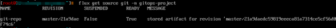
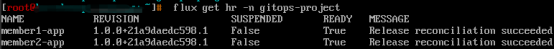
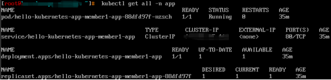
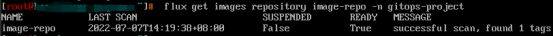
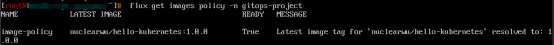
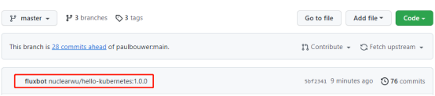
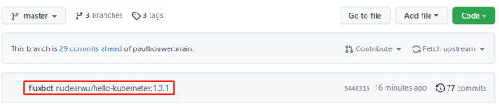

## 背景

随着云原生技术的普及和落地，越来越多的云原生应用需要差异化的配置部署到不同的生产环境中，由于云原生应用通常都是基于云的分布式部署模式，且每个应用可能是由多个功能组件互相调用来一起提供完整的服务的，每个组件都有自己独立的迭代流程和计划，不同的生产环境会呈现差异化的配置。在这种情况下，功能组件越多，意味着应用的发布管理越复杂，如果没有一个好的方案来管理应用的持续交付的话，业务系统将面临巨大的风险。

在这样的背景下，我们加入到应用持续交付的探索中。GitOps为管理基础设施和应用程序提供了一种方法，以声明式描述整个系统并进行版本控制，提供了一个自动化的过程来确保部署的环境和存储库中期望的状态相匹配。Flux v2是一组可支持实现GitOps的工具，负责监听配置源（如Git Repository）的变化，对比当前应用的实际运行状态和期望运行状态的差异，自动拉取变更并同步到集群环境中，Flux v2为实现云原生应用的持续部署提供了一种方法。本文是关于Flux v2在多集群场景下构建应用持续交付的实践。

## Flux v2架构

Flux v2是用GitOps Toolkit组件构建的，GitOps Toolkit是构成Flux v2运行时的一组APIs和controllers，可以用于构建云原生应用的持续交付流水线。


Flux v2各GitOps Toolkit组件的功能如下：

**Source Controller**：
源管理组件的主要作用是为工件获取提供一个通用接口。负责从配置的源存储库和分支持续拉取清单。如果需要的话，可以将控制器配置为使用HTTP出口代理来与这些资源库进行通信。

**Kustomize Controller**：
负责对源控制器检索到的Kubernetes清单进行kustomize构建，并通过与Kubernetes API服务器的通信将它们应用于集群。Kustomize是一个工具，它允许你声明性地定义Kubernetes清单，并通过插值将其模板化。

**Helm Controller**：
负责从源存储库调和HelmRepository和HelmChart资源并将其部署到集群上。通过这个控制器，你可以像平时使用value文件一样创建一个Helm部署清单。然后HelmController将负责获取Helm资源库。你可以配置Chart的来源，通过HelmRepository资源从上游的Helm仓库中提取，或者通过GitRepository资源从本地的Git仓库中提取。

**Notification Controller**：
负责处理入站和出站事件。一方面处理来自外部系统（GitHub、GitLab、Bitbucket、Harbor、Jenkins）的事件，然后通知GitOps Toolkit 控制器有关源更改的信息。另一方面处理由GitOps Toolkit控制器发出的事件，然后根据事件的严重性和涉及的对象将它们转发至外部系统（Slack、Microsoft Teams、Discord、Rocker）。

**Image Automation Controllers**：
Image Automation Controllers包含image-reflector和image-automation两个控制器，image-reflector-controller负责扫描镜像仓库，然后将镜像元数据反应在Kubernetes资源中，image-automation-controller负责根据最新的镜像扫描结果更新YAML文件，然后将更改后的内容提交到给定的Git Repository中。

## Flux v2实践


### 环境准备

#### K8s集群

准备3个K8s集群，包含1个host集群，2个member集群，其中host集群主要用来安装Flux CLI和部署Flux v2的GitOps Toolkit组件，2个member集群主要用来部署差异化配置的应用。

#### 代码仓库

准备1个代码仓库，用来存放应用的业务代码和Helm Chart。本文主要借鉴了开源hello-kubernetes（https://github.com/paulbouwer/hello-kubernetes）项目，为了适配当前场景的演示做了相应的配置和代码修改，修改后的代码仓库结构如下：

```yaml
./hello-kubernetes
├── docs
├── hello-kubernetes.png
├── helm-chart # 应用模板
├── LICENSE
├── Makefile
├── README.md
└── src # 业务代码
```

#### Helm Chart

1个自定义的helm chart，存放差异化的配置和应用模板。其结构如下：

```yaml
./
├── member1-values.yaml # member1集群配置
├── Chart.yaml
├── member2-values.yaml # member2集群配置
├── templates
│   ├── deployment.yaml
│   ├── _helpers.tpl
│   ├── NOTES.txt
│   ├── serviceaccount.yaml
│   └── service.yaml
└── values.yaml # 集群通用配置
```

### 安装部署

#### 安装Flux CLI

在host集群上安装Flux命令行工具：

    curl -s https://fluxcd.io/install.sh | sudo bash

#### 安装Flux v2

在host集群上安装Flux，Flux官方文档（https://fluxcd.io/docs/）提供了多种安装方式，可根据实际使用场景选择适配的安装方式。本文采用的是Dev install的安装方式：

    flux install

或者使用kubectl命令安装:

    kubectl apply -f https://github.com/fluxcd/flux2/releases/latest/download/install.yaml

安装完成后看到如下状态即表示安装成功。


### 构建应用持续交付

#### 创建GitRepository

GitRepository API定义了一个Source来为Git存储库的修改生成Artifact。

创建git-repo.yaml:

```yaml
apiVersion: source.toolkit.fluxcd.io/v1beta2
kind: GitRepository
metadata:
  name: git-repo
  namespace: gitops-project
spec:
  interval: 1m0s
  url: https://github.com/nuclearwu/hello-kubernetes.git
  ref:
    branch: master
```

查看GitRepository源状态:



从上图可以看到Source Controller已经从配置源拉取并保存了最新的工件。

#### 创建集群访问凭证

创建访问member集群的凭证

    kubectl -n gitops-project create secret generic member1-kubeconfig --from-file=value.yaml=/root/.kube/member1-config

    kubectl -n gitops-project create secret generic member2-kubeconfig --from-file=value.yaml=/root/.kube/member2-config

查看集群访问凭证

    kubectl get secret -n gitops-project

#### 创建HelmRelease

HelmRelease API定义了一个可供Helm Controller调和完成Helm发布的资源。

创建member1-app.yaml:

```yaml
apiVersion: helm.toolkit.fluxcd.io/v2beta1
kind: HelmRelease
metadata:
  name: member1-app
  namespace: gitops-project
spec:
  storageNamespace: gitops-project
  targetNamespace: app
  install:
    createNamespace: true
  kubeConfig:
    secretRef:
      name: member1-kubeconfig
  interval: 1m         
  chart:
    spec:
      chart: ./helm-chart
      version: "0.1.0"
      sourceRef:
        kind: GitRepository
        name: git-repo
        namespace: gitops-project
      interval: 1m
      valuesFiles:
      - ./helm-chart/values.yaml
      - ./helm-chart/member1-values.yaml
      reconcileStrategy: Revision
  upgrade:
    remediation:
      remediateLastFailure: true
    force: true  
```

    kubectl apply -f member1-app.yaml

创建member2-app.yaml:

```yaml
apiVersion: helm.toolkit.fluxcd.io/v2beta1
kind: HelmRelease
metadata:
  name: member2-app
  namespace: gitops-project
spec:
  storageNamespace: gitops-project
  targetNamespace: app
  install:
    createNamespace: true
  kubeConfig:
    secretRef:
      name: member2-kubeconfig
  interval: 1m         
  chart:
    spec:
      chart: ./helm-chart
      version: "0.1.0"
      sourceRef:
        kind: GitRepository
        name: git-repo
        namespace: gitops-project
      interval: 1m
      valuesFiles:
      - ./helm-chart/values.yaml
      - ./helm-chart/member2-values.yaml
      reconcileStrategy: Revision
  upgrade:
    remediation:
      remediateLastFailure: true
    force: true 
```

    kubectl apply -f member2-app.yaml

查看HelmRelease:



从上图可以看到Helm Controller已经自动完成应用在member集群中的发布，分别登录2个member集群，可看到应用已经部署成功。




#### 批量更新集群配置

更新通用配置values.yaml，然后执行git commit和git push操作将更新的内容推送到远程代码仓库。最后分别登录两个member集群查看应用service，可以看到service类型都由ClusterIP变成了NodePort。

```yaml
service:
  type: NodePort
```


#### 更新单个集群配置

更新member1-values.yaml，执行git commit和git push操作将更新的内容推送到远程代码仓库。然后登录member1集群查看应用pod，可以看到pod副本数由原来的1个变成了2个。

```yaml
deployment:
  replicaCount: 2
config:
  message: "member1"
```


### 配置镜像自动更新

#### 创建ImageRepository

ImageRepository API定义了一个如何扫描OCI镜像仓库的资源

创建image-repo.yaml:

```yaml
apiVersion: image.toolkit.fluxcd.io/v1beta1
kind: ImageRepository
metadata:
  name: image-repo
  namespace: gitops-project
spec:
  image: nuclearwu/hello-kubernetes
  interval: 1m
```

    kubectl apply -f image-repo.yaml

查看ImageRepository:

    flux get images repository image-repo -n gitops-project



可以看到 image-reflector-controller成功扫描到了镜像仓库nuclearwu/hello-kubernetes

#### 创建ImagePolicy

ImagePolicy给出了从扫描的ImageRepository中选择最新镜像的规则。
创建image-policy.yaml:

```yaml
apiVersion: image.toolkit.fluxcd.io/v1beta1
kind: ImagePolicy
metadata:
  name: image-policy
  namespace: gitops-project
spec:
  imageRepositoryRef:
    name: image-repo
  policy:
    semver:
      range: 1.0.x  
```

查看ImagePolicy:
    
    flux get images policy -n gitops-project



可以看到 image-reflector-controller拉取到nuclearwu/hello-kubernetes最新的镜像版本为1.0.0。

#### 更新values.yaml文件

添加marker，标记Image Automation Controller自动更新的位置。

```yaml
deployment:
  container:
    image:
      repository: "nuclearwu/hello-kubernetes" # {"$imagepolicy": "gitops-project:image-policy:name"}
      # Override the image tag whose default is the chart appVersion
      tag: "" # {"$imagepolicy": "gitops-project:image-policy:tag"}
      pullPolicy: IfNotPresent
```

#### 创建仓库凭证

Image Automation Controller需要写权限，所以需要在github的Developer settings中生成带有写入权限的Personal access tokens，然后在host集群中创建仓库凭证。

    kubectl create secret generic flux-git-auth --from-literal=username=nuclearwu --from-literal=password=<token> -n gitops-project

#### 更新GitRepository

添加GitRepository的写入权限。

更新git-repo.yaml:

```yaml
apiVersion: source.toolkit.fluxcd.io/v1beta2
kind: GitRepository
metadata:
  name: git-repo
  namespace: gitops-project
spec:
  # 添加权限
  secretRef:
    name: flux-git-auth   
  interval: 1m0s
  url: https://github.com/nuclearwu/hello-kubernetes.git
  ref:
    branch: master
```

#### 创建ImageUpdateAutomation

ImageUpdateAutomation定义了一个自动化流程，该流程将基于同一个命名空间中的ImagePolicy对象自动更新Git存储库。

创建image-update-automation.yaml：

```yaml
apiVersion: image.toolkit.fluxcd.io/v1beta1
kind: ImageUpdateAutomation
metadata:
  name: image-update-automation
  namespace: gitops-project
spec:
  interval: 1m0s
  sourceRef:
    kind: GitRepository
    name: git-repo
    namespace: gitops-project
  git:
    checkout:
      ref:
        branch: master
    commit:
      author:
        email: fluxbot@flux.com
        name: fluxbot
      messageTemplate: '{{range .Updated.Images}}{{println .}}{{end}}'
    push:
      branch: master
  update:
    path: ./helm-chart
    strategy: Setters
```

查看ImageUpdateAutomation:

    flux get images update image-update-automation -n gitops-project




可以看到image-automation-controller通过fluxbot的身份提交更改了values.yaml中镜像tag为1.0.0。因为默认部署的镜像版本就是1.0.0，所以两个member环境中的应用不会重启更新。

#### 推送新镜像等待更新成功

接下来在本地构建新版本镜像并推送至远程镜像仓库（模拟CI自动构建镜像后推送至远程镜像仓库）。

    docker build -t nuclearwu/hello-kubernetes:1.0.1 .
    docker push nuclearwu/hello-kubernetes:1.0.1




可以看到image-automation-controller通过fluxbot的身份提交更改了values.yaml中镜像tag为1.0.1。查看两个member集群中的应用，可以看到都进行了重启并且镜像版本也更改为了最新的1.0.1版本。

## 总结

本文主要从多集群场景下部署差异化配置的云原生应用出发，介绍了基于Flux v2的应用持续交付实践。Flux v2具备原生的Helm支持，可以无缝对接Helm Repository和Helm Chart资源，实现基于应用模板的应用持续交付。Flux v2可以优雅地对接CI，利用image-reflector和image-automation，可以更好的衔接CI和GitOps流程，只需要配置，而无需用户手动在CI流水线中编写更改manifest的脚本。Flux v2支持部署信息推送，通过Notification Controller不仅可以处理外部事件，还可以向外部系统发出警报，通知用户有关应用部署的信息。总而言之，Flux v2提供了一组可支持实现GitOps的工具，面向云原生应用持续交付提供了通用的解决方案。

##参考链接

https://www.gitops.tech/#what-is-gitops

https://developer.aliyun.com/article/771574

https://cloudnative.to/blog/accelerating-developer-productivity-via-gitops/

https://cloudnative.to/blog/flux-get-start-easy/

https://www.bilibili.com/video/BV1q3411M7hc

https://github.com/fluxcd/flux2

https://fluxcd.io/


