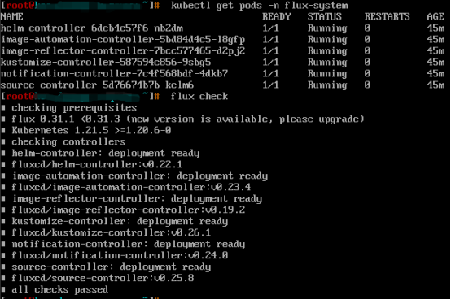

## 背景

随着云原生技术的普及和落地，越来越多的云原生应用需要差异化的配置部署到不同的生产环境中，由于云原生应用通常都是基于云的分布式部署模式，且每个应用可能是由多个功能组件互相调用来一起提供完整的服务的，每个组件都有自己独立的迭代流程和计划，不同的生产环境会呈现差异化的配置。在这种情况下，功能组件越多，意味着应用的发布管理越复杂，如果没有一个好的方案来管理应用的持续交付的话，业务系统将面临巨大的风险。

在这样的背景下，我们加入到应用持续交付的探索中。GitOps 为管理基础设施和应用程序提供了一种方法，以声明式描述整个系统并进行版本控制，提供了一个自动化的过程来确保部署的环境和存储库中期望的状态相匹配。Flux v2 是一组可支持实现 GitOps 的工具，负责监听配置源（如 Git Repository）的变化，对比当前应用的实际运行状态和期望运行状态的差异，自动拉取变更并同步到集群环境中，Flux v2 为实现云原生应用的持续部署提供了一种方法。本文是关于 Flux v2 在多集群场景下构建应用持续交付的实践。

## Flux v2 架构

Flux v2 是用 GitOps Toolkit 组件构建的，GitOps Toolkit 是构成 Flux v2 运行时的一组 APIs 和 controllers，可以用于构建云原生应用的持续交付流水线。


Flux v2 各 GitOps Toolkit 组件的功能如下：

**Source Controller**：
源管理组件的主要作用是为工件获取提供一个通用接口。负责从配置的源存储库和分支持续拉取清单。如果需要的话，可以将控制器配置为使用 HTTP 出口代理来与这些资源库进行通信。

**Kustomize Controller**：
负责对源控制器检索到的 Kubernetes 清单进行 kustomize 构建，并通过与 Kubernetes API 服务器的通信将它们应用于集群。Kustomize 是一个工具，它允许你声明性地定义 Kubernetes 清单，并通过插值将其模板化。

**Helm Controller**：
负责从源存储库调和 HelmRepository 和 HelmChart 资源并将其部署到集群上。通过这个控制器，你可以像平时使用 value 文件一样创建一个 Helm 部署清单。然后 HelmController 将负责获取 Helm 资源库。你可以配置 Chart 的来源，通过 HelmRepository 资源从上游的 Helm 仓库中提取，或者通过 GitRepository 资源从本地的 Git 仓库中提取。

**Notification Controller**：
负责处理入站和出站事件。一方面处理来自外部系统（GitHub、GitLab、Bitbucket、Harbor、Jenkins）的事件，然后通知 GitOps Toolkit 控制器有关源更改的信息。另一方面处理由 GitOps Toolkit 控制器发出的事件，然后根据事件的严重性和涉及的对象将它们转发至外部系统（Slack、Microsoft Teams、Discord、Rocker）。

**Image Automation Controllers**：
Image Automation Controllers 包含 image-reflector 和 image-automation 两个控制器，image-reflector-controller 负责扫描镜像仓库，然后将镜像元数据反应在 Kubernetes 资源中，image-automation-controller 负责根据最新的镜像扫描结果更新 YAML 文件，然后将更改后的内容提交到给定的 Git Repository 中。

## Flux v2 实践


### 环境准备

#### K8s 集群

准备 3 个 K8s 集群，包含 1 个 host 集群，2 个 member 集群，其中 host 集群主要用来安装 Flux CLI 和部署 Flux v2 的 GitOps Toolkit 组件，2 个 member 集群主要用来部署差异化配置的应用。

#### 代码仓库

准备 1 个代码仓库，用来存放应用的业务代码和 Helm Chart。本文主要借鉴了开源 hello-kubernetes（https://github.com/paulbouwer/hello-kubernetes）项目，为了适配当前场景的演示做了相应的配置和代码修改，修改后的代码仓库结构如下：

```yaml
./hello-kubernetes
├── docs
├── hello-kubernetes.png
├── helm-chart # 应用模板
├── LICENSE
├── Makefile
├── README.md
└── src # 业务代码
```

#### Helm Chart

1 个自定义的 helm chart，存放差异化的配置和应用模板。其结构如下：

```yaml
./
├── member1-values.yaml # member1 集群配置
├── Chart.yaml
├── member2-values.yaml # member2 集群配置
├── templates
│   ├── deployment.yaml
│   ├── _helpers.tpl
│   ├── NOTES.txt
│   ├── serviceaccount.yaml
│   └── service.yaml
└── values.yaml # 集群通用配置
```

### 安装部署

#### 安装 Flux CLI

在 host 集群上安装 Flux 命令行工具：

    curl -s https://fluxcd.io/install.sh | sudo bash

#### 安装 Flux v2

在 host 集群上安装 Flux，Flux 官方文档（https://fluxcd.io/docs/）提供了多种安装方式，可根据实际使用场景选择适配的安装方式。本文采用的是 Dev install 的安装方式：

    flux install

或者使用 kubectl 命令安装：

    kubectl apply -f https://github.com/fluxcd/flux2/releases/latest/download/install.yaml

安装完成后看到如下状态即表示安装成功。



### 构建应用持续交付

#### 创建 GitRepository

GitRepository API 定义了一个 Source 来为 Git 存储库的修改生成 Artifact。

创建 git-repo.yaml:

```yaml
apiVersion: source.toolkit.fluxcd.io/v1beta2
kind: GitRepository
metadata:
  name: git-repo
  namespace: gitops-project
spec:
  interval: 1m0s
  url: https://github.com/nuclearwu/hello-kubernetes.git
  ref:
    branch: master
```

查看 GitRepository 源状态：

```bash
[root@host ~]# flux get source git -n gitops-project
NAME       REVISION         SUSPENDED       READY      MESSAGE
git-repo   master/21a9dae   False           True       stored artifact for revision '21a9daedc59819eeeca81a7314ce5cf56d0f74c6'
```

从上图可以看到 Source Controller 已经从配置源拉取并保存了最新的工件。

#### 创建集群访问凭证

创建访问 member 集群的凭证

    kubectl -n gitops-project create secret generic member1-kubeconfig --from-file=value.yaml=/root/.kube/member1-config

    kubectl -n gitops-project create secret generic member2-kubeconfig --from-file=value.yaml=/root/.kube/member2-config

查看集群访问凭证

    kubectl get secret -n gitops-project

#### 创建 HelmRelease

HelmRelease API 定义了一个可供 Helm Controller 调和完成 Helm 发布的资源。

创建 member1-app.yaml:

```yaml
apiVersion: helm.toolkit.fluxcd.io/v2beta1
kind: HelmRelease
metadata:
  name: member1-app
  namespace: gitops-project
spec:
  storageNamespace: gitops-project
  targetNamespace: app
  install:
    createNamespace: true
  kubeConfig:
    secretRef:
      name: member1-kubeconfig
  interval: 1m         
  chart:
    spec:
      chart: ./helm-chart
      version: "0.1.0"
      sourceRef:
        kind: GitRepository
        name: git-repo
        namespace: gitops-project
      interval: 1m
      valuesFiles:
      - ./helm-chart/values.yaml
      - ./helm-chart/member1-values.yaml
      reconcileStrategy: Revision
  upgrade:
    remediation:
      remediateLastFailure: true
    force: true  
```

    kubectl apply -f member1-app.yaml

创建 member2-app.yaml:

```yaml
apiVersion: helm.toolkit.fluxcd.io/v2beta1
kind: HelmRelease
metadata:
  name: member2-app
  namespace: gitops-project
spec:
  storageNamespace: gitops-project
  targetNamespace: app
  install:
    createNamespace: true
  kubeConfig:
    secretRef:
      name: member2-kubeconfig
  interval: 1m         
  chart:
    spec:
      chart: ./helm-chart
      version: "0.1.0"
      sourceRef:
        kind: GitRepository
        name: git-repo
        namespace: gitops-project
      interval: 1m
      valuesFiles:
      - ./helm-chart/values.yaml
      - ./helm-chart/member2-values.yaml
      reconcileStrategy: Revision
  upgrade:
    remediation:
      remediateLastFailure: true
    force: true 
```

    kubectl apply -f member2-app.yaml

查看 HelmRelease:

```bash
[root@host ~]# flux get hr -n gitops-project
NAME          REVISION               SUSPENDED       READY      MESSAGE
member1-app   1.0.0+21a9daedc598.1   False           True       Release reconciliation succeeded
member2-app   1.0.0+21a9daedc598.1   False           True       Release reconciliation succeeded
```

从上图可以看到 Helm Controller 已经自动完成应用在 member 集群中的发布，分别登录 2 个 member 集群，可看到应用已经部署成功。

```bash
[root@member1 ~]# kubectl get all -n app
NAME                                                       READY            STATUS         RESTARTS     AGE
pod/hello-kubernetes-app-member1-app-88dfd97f-nzsch        1/1              Running        0            35m

NAME                                                       TYPE             CLUSTER_IP    EXTERNAL-IP   PORT(S)   AGE
service/hello-kubernetes-app-member1-app                   ClusterIP                      <none>        80/TCP    35m

NAME                                                       READY            UP-TO-DATE    AVAILABLE     AGE
deployment.apps/hello-kubernetes-app-member1-app           1/1              1             1             35m

NAME                                                       DESIRED          CURRENT       READY         AGE
replicaset.apps/hello-kubernetes-app-member1-app-88dfd97f  1                1             1             35m
```

```bash
[root@member2 ~]# kubectl get all -n app
NAME                                                       READY            STATUS         RESTARTS     AGE
pod/hello-kubernetes-app-member2-app-996fcf45b-8svgv        1/1             Running        0            49m

NAME                                                       TYPE             CLUSTER_IP    EXTERNAL-IP   PORT(S)   AGE
service/hello-kubernetes-app-member2-app                   ClusterIP                      <none>        80/TCP    49m

NAME                                                       READY            UP-TO-DATE    AVAILABLE     AGE
deployment.apps/hello-kubernetes-app-member2-app           1/1              1             1             49m

NAME                                                       DESIRED          CURRENT       READY         AGE
replicaset.apps/hello-kubernetes-app-member2-app-996fcf45b 1                1             1             49m
```

#### 批量更新集群配置

更新通用配置 values.yaml，然后执行 git commit 和 git push 操作将更新的内容推送到远程代码仓库。最后分别登录两个 member 集群查看应用 service，可以看到 service 类型都由 ClusterIP 变成了 NodePort。

```yaml
service:
  type: NodePort
```

```bash
[root@member1 ~]# kubectl get svc -n app
NAME                                TYPE             CLUSTER-IP            EXTERNAL-IP       PORT(S)        AGE
hello-kubernetes-app-member1-app    NodePort                               <none>            80:31248/TCP   40m
```

```bash
[root@member2 ~]# kubectl get svc -n app
NAME                                TYPE             CLUSTER-IP            EXTERNAL-IP       PORT(S)        AGE
hello-kubernetes-app-member2-app    NodePort                               <none>            80:31604/TCP   51m
```

#### 更新单个集群配置

更新 member1-values.yaml，执行 git commit 和 git push 操作将更新的内容推送到远程代码仓库。然后登录 member1 集群查看应用 pod，可以看到 pod 副本数由原来的 1 个变成了 2 个。

```yaml
deployment:
  replicaCount: 2
config:
  message: "member1"
```

```bash
[root@member1 ~]# kubectl get pods -n app
NAME                                               READY           STATUS          RESTARTS        AGE
hello-kubernetes-app-member1-app-88dfd97f-bs6wz    1/1             RUNNING         0               20s
hello-kubernetes-app-member1-app-88dfd97f-nzsch    1/1             RUNNING         0               42m     
```

### 配置镜像自动更新

#### 创建 ImageRepository

ImageRepository API 定义了一个如何扫描 OCI 镜像仓库的资源

创建 image-repo.yaml:

```yaml
apiVersion: image.toolkit.fluxcd.io/v1beta1
kind: ImageRepository
metadata:
  name: image-repo
  namespace: gitops-project
spec:
  image: nuclearwu/hello-kubernetes
  interval: 1m
```

    kubectl apply -f image-repo.yaml

查看 ImageRepository:

```bash
[root@host ~]# flux get images repository image-repo -n gitops-project
NAME           LAST SCAN                   SUSPENDED   READY     MESSAGE
imge-repo      2022-07-07T14:19:38+08:00   False       True      successful scan, found 1 tags
```

可以看到 image-reflector-controller成功扫描到了镜像仓库nuclearwu/hello-kubernetes

#### 创建 ImagePolicy

ImagePolicy 给出了从扫描的 ImageRepository 中选择最新镜像的规则。
创建 image-policy.yaml:

```yaml
apiVersion: image.toolkit.fluxcd.io/v1beta1
kind: ImagePolicy
metadata:
  name: image-policy
  namespace: gitops-project
spec:
  imageRepositoryRef:
    name: image-repo
  policy:
    semver:
      range: 1.0.x  
```

查看 ImagePolicy:

```bash
[root@host ~]# flux get images policy -n gitops-project
NAME             LATEST IMAGE                         READY     MESSAGE
image-policy     nuclearwu/hello-kubernetes:1.0.0     True      Latest image tag for 'nuclearwu/hello-kubernetes' resolved to: 1.0.0
```

可以看到 image-reflector-controller拉取到nuclearwu/hello-kubernetes最新的镜像版本为1.0.0。

#### 更新 values.yaml 文件

添加 marker，标记 Image Automation Controller 自动更新的位置。

```yaml
deployment:
  container:
    image:
      repository: "nuclearwu/hello-kubernetes" # {"$imagepolicy": "gitops-project:image-policy:name"}
      # Override the image tag whose default is the chart appVersion
      tag: "" # {"$imagepolicy": "gitops-project:image-policy:tag"}
      pullPolicy: IfNotPresent
```

#### 创建仓库凭证

Image Automation Controller 需要写权限，所以需要在 github 的 Developer settings 中生成带有写入权限的 Personal access tokens，然后在 host 集群中创建仓库凭证。

    kubectl create secret generic flux-git-auth --from-literal=username=nuclearwu --from-literal=password=<token> -n gitops-project

#### 更新 GitRepository

添加 GitRepository 的写入权限。

更新 git-repo.yaml:

```yaml
apiVersion: source.toolkit.fluxcd.io/v1beta2
kind: GitRepository
metadata:
  name: git-repo
  namespace: gitops-project
spec:
  # 添加权限
  secretRef:
    name: flux-git-auth   
  interval: 1m0s
  url: https://github.com/nuclearwu/hello-kubernetes.git
  ref:
    branch: master
```

#### 创建 ImageUpdateAutomation

ImageUpdateAutomation 定义了一个自动化流程，该流程将基于同一个命名空间中的 ImagePolicy 对象自动更新 Git 存储库。

创建 image-update-automation.yaml：

```yaml
apiVersion: image.toolkit.fluxcd.io/v1beta1
kind: ImageUpdateAutomation
metadata:
  name: image-update-automation
  namespace: gitops-project
spec:
  interval: 1m0s
  sourceRef:
    kind: GitRepository
    name: git-repo
    namespace: gitops-project
  git:
    checkout:
      ref:
        branch: master
    commit:
      author:
        email: fluxbot@flux.com
        name: fluxbot
      messageTemplate: '{{range .Updated.Images}}{{println .}}{{end}}'
    push:
      branch: master
  update:
    path: ./helm-chart
    strategy: Setters
```

查看 ImageUpdateAutomation:

```bash
[root@host ~]# flux get images update image-update-automation -n gitops-project
NAME                      LAST RUN                    SUSPENDED   READY     MESSAGE
image-update-automation   2022-07-07T16:44:34+08:00   False       True      no updates made; last commit 5bf2341 at 2022-07-07T09:04:35Z
```


可以看到 image-automation-controller 通过 fluxbot 的身份提交更改了 values.yaml 中镜像 tag 为 1.0.0。因为默认部署的镜像版本就是 1.0.0，所以两个 member 环境中的应用不会重启更新。

#### 推送新镜像等待更新成功

接下来在本地构建新版本镜像并推送至远程镜像仓库（模拟 CI 自动构建镜像后推送至远程镜像仓库）。

    docker build -t nuclearwu/hello-kubernetes:1.0.1 .
    docker push nuclearwu/hello-kubernetes:1.0.1


```bash
[root@member1 ~]# kubectl get pods -n app
NAME                                                 READY       STATUS          RESTARTS        AGE
hello-kubernetes-app-member1-app-5fb555c87f-b8zcz    1/1         RUNNING         0               9m38s
hello-kubernetes-app-member1-app-5fb555c87f-ghvrh    1/1         RUNNING         0               9m32s  
[root@member1 ~]# kubectl describe pod hello-kubernetes-app-member1-app-5fb555c87f-b8zcz -n app | grep Image
    Image:       nuclearwu/hello-kubernetes:1.0.1
    Image ID:    docker-pullable://nuclearwu/hello-kubernetes@sha256:f6cb3ec2f4830da55ecb73f7257b859fc0b75675425740f89c2358d5646e1151
```

```bash
[root@member2 ~]# kubectl get pods -n app
NAME                                                READY       STATUS          RESTARTS         AGE
hello-kubernetes-app-member2-app-fd85b68cb-nrvnx    1/1         RUNNING         0                9m4s
[root@member2 ~]# kubectl describe pod hello-kubernetes-app-member2-app-fd85b68cb-nrvnx -n app | grep Image
    Image:       nuclearwu/hello-kubernetes:1.0.1
    Image ID:    docker-pullable://nuclearwu/hello-kubernetes@sha256:f6cb3ec2f4830da55ecb73f7257b859fc0b75675425740f89c2358d5646e1151
```

可以看到 image-automation-controller 通过 fluxbot 的身份提交更改了 values.yaml 中镜像 tag 为 1.0.1。查看两个 member 集群中的应用，可以看到都进行了重启并且镜像版本也更改为了最新的 1.0.1 版本。

## 总结

本文主要从多集群场景下部署差异化配置的云原生应用出发，介绍了基于 Flux v2 的应用持续交付实践。Flux v2 具备原生的 Helm 支持，可以无缝对接 Helm Repository 和 Helm Chart 资源，实现基于应用模板的应用持续交付。Flux v2 可以优雅地对接 CI，利用 image-reflector 和 image-automation，可以更好的衔接 CI 和 GitOps 流程，只需要配置，而无需用户手动在 CI 流水线中编写更改 manifest 的脚本。Flux v2 支持部署信息推送，通过 Notification Controller 不仅可以处理外部事件，还可以向外部系统发出警报，通知用户有关应用部署的信息。总而言之，Flux v2 提供了一组可支持实现 GitOps 的工具，面向云原生应用持续交付提供了通用的解决方案。

## 参考链接

- https://www.gitops.tech/#what-is-gitops
- https://developer.aliyun.com/article/771574
- https://cloudnative.to/blog/accelerating-developer-productivity-via-gitops/
- https://cloudnative.to/blog/flux-get-start-easy/
- https://www.bilibili.com/video/BV1q3411M7hc
- https://github.com/fluxcd/flux2
- https://fluxcd.io/


