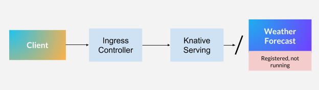
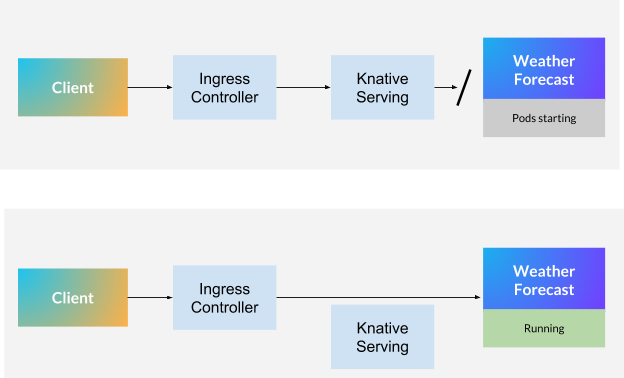
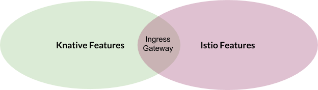
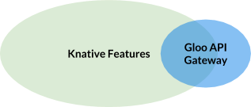

本文为翻译文章，[点击查看原文](https://medium.com/solo-io/gloo-by-solo-io-is-the-first-alternative-to-istio-on-knative-324753586f3a)。

[编者按]

> 之前有社区成员询问是不是想尝试 Knative 时，必须要安装 Istio 才行，今天就告诉大家一种 Istio 的替代方案，使用 Solo.io 公司研发的 Gloo 来替代 Istio 来使用 Knative。

> *在 Knative 中，Istio 的主要作用是作为一个 Ingress 技术。Gloo 现在加入 Istio 作为 Knative 的集成和支持 Ingress。有关快速演示 demo，请参阅文章末尾。*

简而言之，[Knative 的存在](https://github.com/knative/docs)是为了定义在[Kubernetes](https://kubernetes.io/)上构建和服务化工作负载的一套标准方法。Knative 的一个显著特性是它的 serverless 特性：它将工作负载的执行与事件关联起来，而只在此类事件发生时消耗计算能力（事件驱动）。

Knative 是最初在谷歌创建，现在已与 Pivotal、Red Hat、SAP、IBM 等许多公司联合开发的开源协作技术。

## 使用 Knative 服务处理请求

让我们简要了解一下 Knative 如何处理请求，以及它与“纯”Kubernetes 的比较。

Kubernetes 上的*传统*工作负载，比如 web 应用程序，需要一个运行的 Pod 和一个 Ingress，以允许流量从其他集群流入到当前集群。

现在，通过 Knative 的视角，让我们考虑下面的示例：有如下一个场景，客户端希望从一个在 Knative 平台上注册但不一定立即运行的应用程序中检索天气预报信息。使用 Knative 术语，有一个服务可以创建必要的配置和路由，以便在调用天气预报应用程序时运行它。在 Knative 上下文中，应用程序包括：

* [Knative Service](https://github.com/knative/serving/blob/master/docs/spec/spec.md#service)（不要与 Kubernetes Service 对象混淆）

* [Knative Route](https://github.com/knative/serving/blob/master/docs/spec/spec.md#route)

* [Knative Configuration](https://github.com/knative/serving/blob/master/docs/spec/spec.md#configuration)

* 一个或多个[Knative Revision](https://github.com/knative/serving/blob/master/docs/spec/spec.md#revision)，运行时，Revision 会变成 Kubernetes Pod。



深入到流量管理部分，Knative service 有一个名为[Activator](https://github.com/knative/serving/tree/master/pkg/activator)的组件，它负责报告某个工作负载需要运行相应数量的 pod 来处理请求。

这种架构的美妙之处在于，如果负责运行应用程序的 Pod 没有运行，那么请求将被搁置，直到流量可以路由到一个或多个 pod 为止。这优化了资源利用率。

如果您想知道，还有一些特性允许您预热应用程序，这样就不会阻塞任何请求。这使您能够对是否始终保持 Pod 运行做出明智的决策。



如前所述，一旦有一个修订（一个或多个 Pod）来处理请求，流量就可以从 Ingress 网关流到您的修订。Knative Serving 将继续收到请求的通知，以便确定是否需要对服务于修订的 Pod 进行伸缩。这真的太棒了！

## Istio 的必要性

请求可能需要路由到相同配置的不同版本 (请阅读工作负载规范)，特别是在同时运行同一应用程序的不同版本的情况下。为了做到这一点，Knative 需要一个可以执行以下功能的 Ingress 控制器：

* 流量分流

* 重试

* TLS 终止

* 基于 Header 路由

* 追加 Header

Solo.io 拥抱[Istio](https://istio.io/zh/)。我们已经投资构建了一个名为[SuperGloo](https://github.com/solo-io/supergloo)的服务网格编排器和管理平台，这可能是开始使用 Istio 的最简单方法。就我个人而言，我也很喜欢 Istio。在红帽的时候，我参与了这个项目的[正式启动](https://blog.openshift.com/red-hat-istio-launch/)，并[写下](https://www.infoworld.com/article/3273547/the-rise-of-the-istio-service-mesh.html)了为什么 Istio 如此受欢迎。

但如果我诚实地评价 Istio 在 Knative 上的角色，我的感觉是：



Istio 提供了一组令人惊讶的特性，但是 Knative 只使用了其中的一些。作为参考，Istio 目前有 48 个 CRD（CustomResourceDefinition 对象），其中只有一个主要由 Knative（VirtualService）使用。

现在，如果您的组织也愿意采用服务网格技术，并且 Istio 是您的选择，那么这种痛苦肯定会减少。为此，您必须熟悉或已经熟悉 Istio 的工作原理。现在对于许多用户来说，增加的复杂性可能不值得。

## Gloo——下一代通用 API 网关，作为网关服务。

Gloo 是下一代 API 网关，它既满足 Knative 的需求，又不会带来成熟服务网格技术 (Istio 就是这种情况) 的不必要包袱。



[Gloo](https://gloo.solo.io/)建立在 Envoy 之上，[是 Knative 第一个官方的 Istio 替代品](https://knative.dev/docs/install/knative-with-gloo/)。

但这在现实中意味着什么呢？当我们决定对这个解决方案投入精力时，我们的主要目标之一就是解决方案的可持续性。当一个新版本出现时，一起工作的项目突然停止工作，这肯定会令人沮丧，我们的集成工作主要集中在三个方面：易用性、实现和持续集成。

## 易用性

[Solo.io](https://www.solo.io/)作为一家公司的一个关键任务是为了弥合先进的开源技术与使用这种技术的企业和用户之间的差距。在这种程度上，我们在[使用 Gloo 时改进了 Knative 本身的安装](https://knative.dev/docs/install/knative-with-gloo/)。整个社区可以立即受益于一种更简单的实验和生产方式。

流行的`glooctl`命令现在包含一个 Knative 选项，该选项[不仅安装 Gloo 网关本身而且还将安装 Knative](https://gloo.solo.io/installation/#2c-install-the-gloo-knative-cluster-ingress-to-your-kubernetes-cluster-using-glooctl)（！！！）。在安装过程中，Knative 配置了[Gloo](https://gloo.solo.io/)作为集群 Ingress 网关，它使用一个命令：

```shell
$ glooctl install knative
```

## 实现

虽然这是一个显而易见的问题，但我们创建了必要的控制和监视，以便[Gloo](https://gloo.solo.io/)能够在 Istio Ingress 运行时在相同或更好的容量水平上运行和报告。大部分工作都是在 Gloo 上完成的。在技术层面，Gloo 得到了扩展，包括基于 Knative ClusterIngress CRD 读取和应用配置的能力。

## 持续集成

我们在[Knative](https://github.com/knative/serving/pull/3087)的 CI 测试流水线中实现并引入了特定的 Gloo 测试，这意味着如果 Knative 中的一个更改破坏了与 Gloo 的集成，反之亦然，那么社区将得到通知并根据情况采取相应的行动。这为任何正在寻找 Knative 上的 Istio 的替代方案的人提供了可能，在撰写本文时，Knative 是唯一的替代方案。

## 立刻行动吧！

如果您能够访问 Kubernetes 集群，只需[下载](https://github.com/solo-io/gloo/releases)最适合您的操作系统的`glooctl`版本，然后立即开始您的 Knative（和[Gloo](https://gloo.solo.io/)）之旅。我们最近也增加了对 Windows 的支持。要获得更多帮助，请查看我们的 Knative 特定[文档](https://gloo.solo.io/installation/#2c-install-the-gloo-knative-cluster-ingress-to-your-kubernetes-cluster-using-glooctl)并加入我们的[Slack](http://slack.solo.io/)。

Gloo 可以做的不仅仅是基本的 Ingress 路由。Gloo 被设计为下一代 API 网关，能够理解功能级别的调用 (HTTP1、HTTP2、gRPC、REST/OpenAPISpec、SOAP、WebSockets、Lambda/Cloud 函数)，并能够帮助您从单一功能到微服务和 serverless 的演进。参加我们的[网络研讨会](https://www.solo.io/)，我们将讨论如何渐进地、安全地发展您的应用程序架构，以利用新功能来满足您的业务需求，而不必对您的单体应用进行危险的更改。

## 观看介绍视频

<https://www.youtube.com/watch?v=_e61MB2Afvs>
