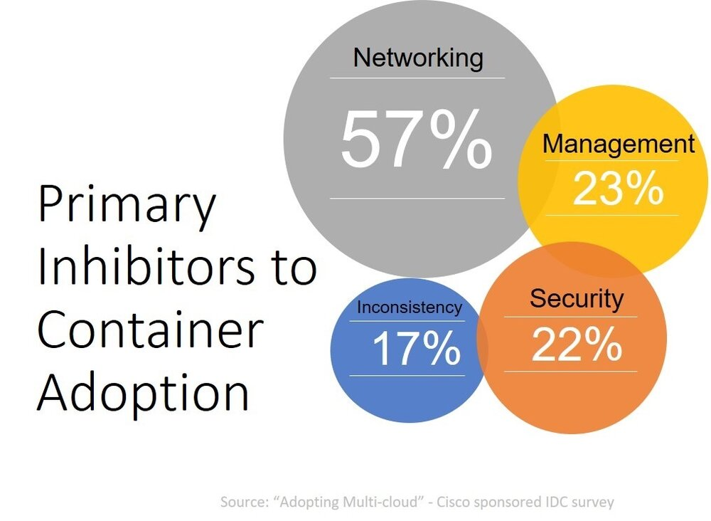
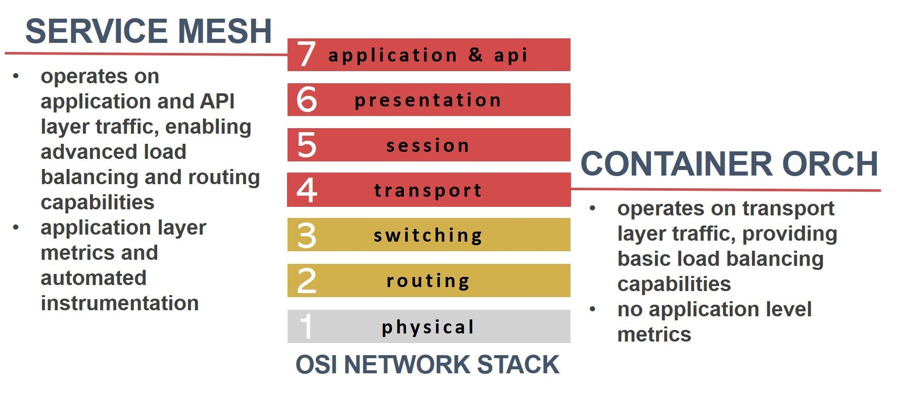

本文为翻译文章，[点击查看原文](https://aspenmesh.io/2018/09/going-beyond-container-orchestration/)。

最近的几次关于容器使用情况的调研都得到了相似的结果，开发团队不仅采用而且开始拥抱容器技术。大多数人并没有像超大型组织那样大规模的使用容器。在一项思科赞助的调研中发现有超过 8000 家企业在生产环境中使用容器。这听起来令人印象深刻，但他们使用容器的规模有限。在戴尔 EMC，英特尔和红帽委托的 Forrester 报告中，63％使用容器的企业运行的实例超过 100 个，82％预计到 2019 年会达到这一规模。这与超大型技术公司使用的数十万的规模相距甚远。

虽然采用率很高，这并不是说组织使用容器的道路就是一帆风顺的。采纳任何一样新技术都是存在挑战的。人们使用容器时最关心的是：网络和管理。其次才去关注安全性和不一致性。

网络挑战是由于 Kubernetes 等流行的容器编排软件所带来的。Kubernetes 构建的就是要支持微服务架构。这允许开发和运维人员将功能抽象成一组 pod，并将其作为“service”暴露出来，并通过定义好的 API 进行访问。Kubernetes 支持 DNS 和基于 TCP 的 L4 负载均衡。

基于 TCP L4 负载均衡的问题是它无法与 L7（应用程序和 API 层）交互。对于任何 L4 负载均衡都是如此；它不是容器和 Kubernetes 独有的东西。L4 负载均衡提供了对连接级别（TCP）协议和指标的可见性，但仅此而已。这使得很难（真的不可能）解决高阶问题，例如每秒请求数或事务等 L7 指标以及基于路径分割流量（路由请求）。这也意味着您无法在 API 层进行速率限制或支持重试和断路等关键功能。

因为缺乏这些功能，开发人员就不得不将它们编码到每个微服务中。这导致运维代码包含在业务逻辑中。这明显不太合适，因为它显然违反了微服务设计的原则。因为它为微服务增加了构建和技术债。

虽然 Kubernetes 特别擅长处理容器化应用程序的构建和部署，但是它缺乏在运行时监控基于微服务的应用程序所需的关键功能。Kubernetes 只能提供基本的健康检查存活探针和就绪探针，不能为开发和运维人员提供在执行期间快速有效地诊断问题所需的度量和追溯微服务的调用。让开发人员使用微服务来生成一致的指标可能是一项重大挑战，尤其是当他们要在限定时间内完成客户所需功能时，这会给他们带来很大的压力。

而 Service Mesh 是解决 kubernetes 在网络和管理方面问题的完美解决方案。

## Service Mesh 如何应对挑战

Service Mesh 通过在 Kubernetes 的一些列 pod 中注入 sidecar 代理能够很好的解决这些问题。通过直接注入到容器环境，sidecar 代理能够透明化网络和一致度量指标。由于所有流量都通过 sidecar 代理进行有效路由，因此它可以自动生成并将所需的指标提供给网格的其它部分。对于在容器环境中部署传统应用程序的组织而言，这非常有价值。传统应用程序不太可能适用于现代环境。使用 Service Mesh 及其 sidecar 代理基本使这些应用程序能够产生正确的指标，而无需或很少需要添加/修改代码。

这也意味着您不必花时间协调由各种运行时代理生成的不同指标。您可以依靠服务网格在所有应用程序和微服务中生成一致的度量标准集合。

这些指标包含提供给网格的更高阶数据点，并启用更高级的网络以确保对请求的最快可用响应。在 Service Mesh 中重试和断路器由 sidecar 代理处理，这减轻了开发人员将运维代码引入其微服务的负担。由于 sidecar 代理不受限于 L4 负载均衡（TCP），所以靠 L7 负载均衡（应用程序和 API 层）它支持更高级别的消息路由技术。

容器编排是一个很好的基础设施，但企业组织需要的不仅仅是一个良好的基础设施。他们需要能够与堆栈上层的服务进行交互的能力，这需要使用指标和现代架构去实现。

服务网格可以很好的提供这两种服务。当您需要超越容器编排时，请使用服务网格。
