作为开源 Service Mesh 明星项目 Istio 背后的主要厂商，Google 也在其公有云上推出了 Service Mesh 管理服务。让人迷惑的是 Google Cloud 上有两个 Service Mesh 产品：Traffic Director 与 Anthos Service Mesh。Google Cloud 首先在2019年3月发布了其第一个 Service Mesh 产品 Traffic Director，随后不久在2019 年9月紧接着发布了另一个 Service Mesh 产品 Anthos Service Mesh，随后两个产品独立并行发展，直到如今。

Google Cloud 同时推出两个 Service Mesh 产品的原因是什么？这两个产品的定位有何不同？本文将分别分析这两个产品的架构和功能，以试图解答该疑问。

## Traffic Director

Traffic Director 是 Google Cloud 专为服务网格打造的全托管式流量控制平面，用户不需要对 Traffic Director 进行部署，维护和管理。我们可以把 Traffic Director 看作一个托管的 Pilot（备注：并不确定其内部是否使用的 Pilot），其只提供了流量管理能力，不提供 Istio 控制面的其他能力。用户可以使用 Traffic Director 创建跨区域的、同时支持集群和虚拟机实例的服务网格，并对多个集群和虚拟机的工作负载进行统一的流量控制。Traffic Director 托管控制面 提供了跨地域容灾能力，可以保证99.99%的SLA。

总而言之，Traffic Director 的关键特性包括：

* 全托管控制面
* 控制面高可用
* 同时支持 K8s 集群和虚拟机
* 跨地域的流量管理

### Traffic Director 架构

Traffic Director 的总体架构和 Istio 类似，也采用了“控制面 + 数据面”的结构，控制面托管在 Google Cloud 中，对用户不可见。用户只需要在创建 project 时启用 Traffic Director API，即可使用 Traffic Director 提供的网格服务。数据面则采用了和 Istio 相同的 Envoy 作为 proxy。 控制面和数据面采用标准的 xDS v2 进行通信。控制面对外采用了一套自定义的 API 来实现流量管理，并不支持 Istio API。Traffic Director 也没有采用 Istio/K8s 的服务发现，而是采用了一套 Google Cloud 自己的服务注册发现机制，该服务注册发现机制以统一的模型同时支持了容器和虚拟机上的服务，并为工作负载提供了健康检测。

Traffic Director 架构

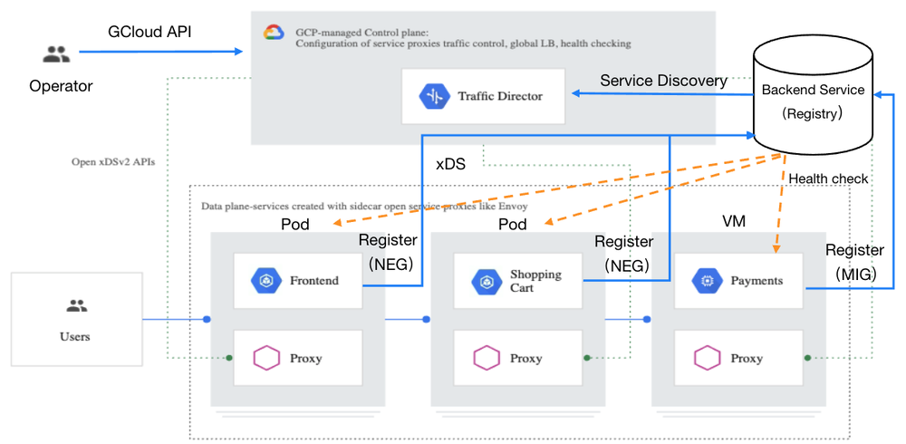

### 服务注册发现机制

Traffic Director 采用了 Google Cloud 的一种称为 Backend Service 的服务注册机制。通过 Backend Service 支持了 GKE 集群中容器工作负载和虚拟机工作负载两种方式的服务注册发现，不过和 Istio 不同的是，Traffic Director 并不支持 K8s 原生的服务注册发现机制。

#### 服务注册发现资源模型

Traffic Director 的服务注册发现资源模型如下图所示，图中蓝色的图形为 Traffic Director 中使用的资源，桔色的图形为这些资源对应在 K8s 中的概念。Backend Service 是一个逻辑服务，可以看作 K8s 中的 Service，Backend Service 中可以包含 GKE 集群中的 NEG （Network Endpoint Group），GCE 虚拟机 的 MIG （Managed Instance Group），或者无服务的 NEG 。NEG 中则是具体的一个个工作负载，即服务实例。 

Traffic Director 服务发现资源模型

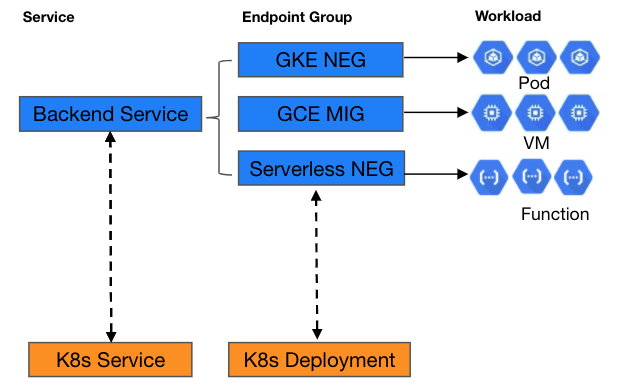

Google Cloud 的这一套服务注册的机制并不只是为 Traffic Director 而定制的，还可以和 Google Cloud 上的各种负载均衡服务一起使用，作为负载均衡的后端。熟悉 K8s 的同学应该清楚，进入 K8s 集群的流量经过 Load Balancer 后会被首先发送到一个 node 的 nodeport 上，然后再通过 DNAT 转发到 Service 后端的一个 Pod IP 上。Google Cloud 在 cluster 上提供了一个 [VPC native](https://cloud.google.com/kubernetes-engine/docs/how-to/alias-ips) 的网络特性，可以在 VPC 中直接路由 Pod ，在打开 VPC native 特性的集群中，通过将 NEG 而不是 K8s service 放到 Load balancer 后端，可以跳过 Kubeproxy iptables 转发这一跳，直接将流量发送到 Pod，降低转发延迟，并可以应用更灵活的 LB 和路由算法。

虽然 Backend Service 已经支持了无服务 NEG，但目前 Traffic Director 还不支持，但从资源模型的角度来看，应该很容易扩展目前的功能，以将无服务工作负载加入到服务网格中。

下面举例说明如何创建 Backend Service，并将 GKE 和 VM 中运行的服务实例加入到 Backend Service中，以了解相关资源的内部结构。

#### 注册 GKE 集群中的容器服务

1、 创建 GKE NEG：在 K8s Service 的 yaml 定义中通过 annotation 创建 NEG

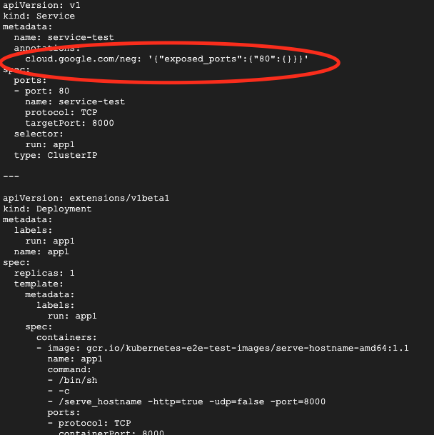

2、 创建防火墙规则：需要创建一条防火墙规则，以允许 gcloud 对 GKE NEG 中的服务实例进行健康检查

```bash
gcloud compute firewall-rules create fw-allow-health-checks \  
  --action ALLOW \    
  --direction INGRESS \    
  --source-ranges 35.191.0.0/16,130.211.0.0/22 \    
  --rules tcp
```

3、创建健康检查

```bash
gcloud compute health-checks create http td-gke-health-check \  
  --use-serving-port
```

4、创建 Backend Service，创建时需要指定上一步创建的健康检查

```bash
gcloud compute backend-services create td-gke-service \ 
  --global \ 
  --health-checks td-gke-health-check \ 
  --load-balancing-scheme INTERNAL_SELF_MANAGED
```

5、将 GKE NEG 加入到上一步创建的 Backend service 中

```bash
NEG_NAME=$(gcloud beta compute network-endpoint-groups list \
| grep service-test | awk '{print $1}')
gcloud compute backend-services add-backend td-gke-service \ 
  --global \ 
  --network-endpoint-group ${NEG_NAME} \ 
  --network-endpoint-group-zone us-central1-a \ 
  --balancing-mode RATE \ 
  --max-rate-per-endpoint 5
```

#### 注册 GCE 虚拟机服务

1、 创建虚机模版：在创建模版时可以通过命令参数 --service-proxy=enabled 声明使用该模版创建的虚拟机需要安装 Envoy sidecar 代理

```bash
gcloud beta compute instance-templates create td-vm-template-auto \    
  --service-proxy=enabled
```

2、 创建 MIG：使用虚拟机模版创建一个 managed instance group，该 group 中的实例数为2

```bash
gcloud compute instance-groups managed create td-vm-mig-us-central1 \    
  --zone us-central1-a 
  --size=2 
  --template=td-vm-template-auto
```

3、 创建防火墙规则

```bash
gcloud compute firewall-rules create fw-allow-health-checks \  
  --action ALLOW \  
  --direction INGRESS \  
  --source-ranges 35.191.0.0/16,130.211.0.0/22 \  
  --target-tags td-http-server \  
  --rules tcp:80
```

4、 创建健康检查

```bash
gcloud compute health-checks create http td-vm-health-check
```

5、 创建 Backend Service，创建时需要指定上一步创建的健康检查

```bash
gcloud compute backend-services create td-vm-service \ 
  --global \ 
  --load-balancing-scheme=INTERNAL_SELF_MANAGED \ 
  --connection-draining-timeout=30s \ 
  --health-checks td-vm-health-check
```

6、 将 MIG 加入到上一步创建的 Backend service 中

```bash
gcloud compute backend-services add-backend td-vm-service \  
  --instance-group td-demo-hello-world-mig \  
  --instance-group-zone us-central1-a \  
  --global
```

### 流量管理实现原理

Traffic Diretor 的主要功能就是跨地域的全局流量管理能力，该能力是建立在 Google Cloud 强大的 VPC 机制基础上的， Google Cloud 的 VPC 可以跨越多个 Region，因此一个 VPC 中的服务网格中可以有来自多个 Region 的服务。另外 Traffic Director 并未直接采用 Istio 的 API，而是自定义了一套 API 来对网格中的流量进行管理。

#### 控制面流量规则定义

Traffic Director 流量规则相关的控制面资源模型如下图所示，图中下半部分是 Istio 中和这些资源对应的 CRD。

* Forwarding Rule：定义服务的入口 VIP 和 Port。
* Target Proxy：用于关联 Forwarding Rule 和 URL Map，可以看作网格中代理的一个资源抽象。
* URL Map：用于设置路由规则，包括规则匹配条件和规则动作两部分。匹配条件支持按照 HTTP 的 Host、Path、Header进行匹配。匹配后可以执行 Traffic Splitting、Redirects、URL Rewrites、Traffic Mirroring、Fault Injection、Header Transformation 等动作。
* Backend Service：前面在服务发现中已经介绍了 Backend Service 用于服务发现，其实还可以在 Backen Service 上设置流量策略，包括LB策略，断路器配置，实例离线检测等。可以看到 Backend Service 在 Traffic Director 的流量管理模型中同时承担了 Istio 中的 ServiceEntry 和 Destionation Rule 两个资源等功能。

客户端直接通过 VIP 访问服务其实是一个不太友好的方式，因此我们还需要通过一个 DNS 服务将 Forwarding Rule 中的 VIP 和一个 DNS record 关联起来，在 Google Cloud 中可以采用 [Cloud DNS](https://cloud.google.com/dns/) 来将 Forwarding Rule 的 VIP 关联到一个内部的全局 DNS 名称上。 

Traffic Director 流量管理资源模型

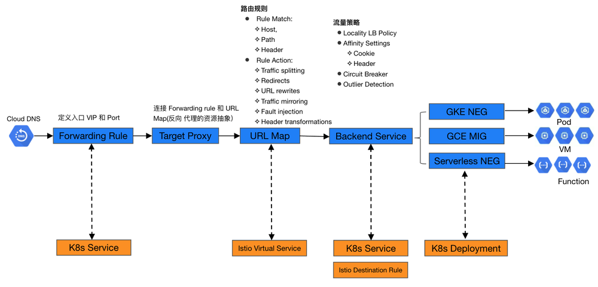

下面举例说明这些资源的定义，以及它们是如何相互作用，以实现Service Mesh中的流量管理。

下图中的forwarding rule定义了一个暴露在 10.0.0.1:80 上的服务，该服务对应的url map 定义了两条路由规则，对应的主机名分别为 * 和 hello-worold，请求将被路由到后端的 td-vm-service backend service 中的服务实例。

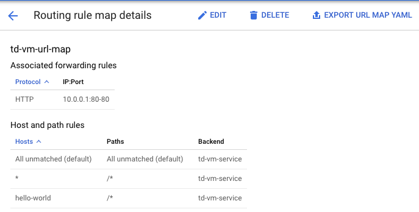

Forwarding Rule 定义

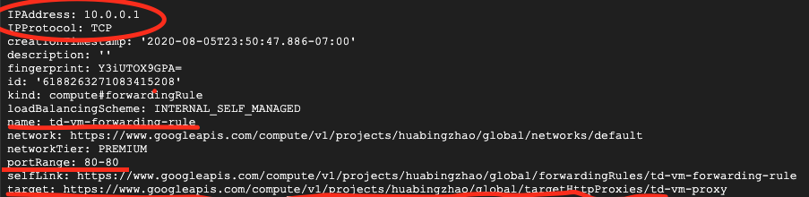

Target Proxy 定义

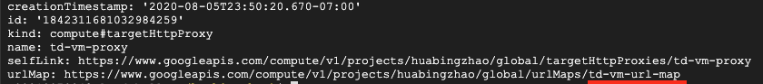

URL Map 定义

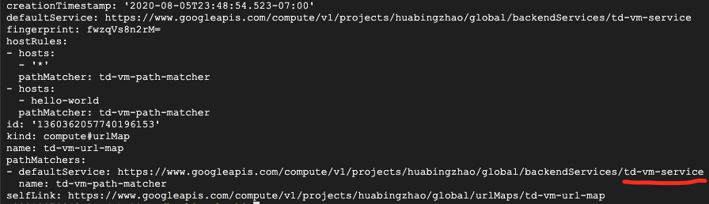

Backend Service 定义

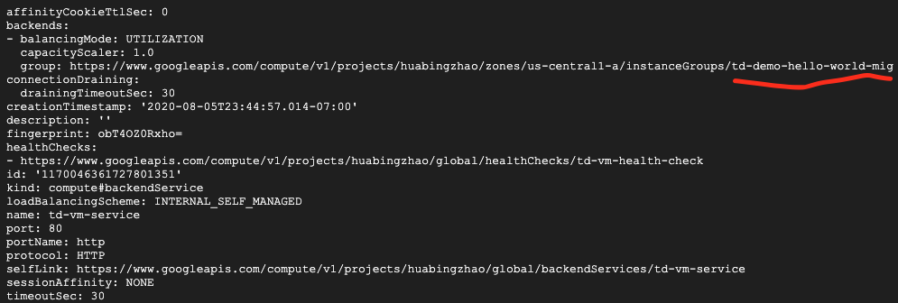

Managed Instance Group 定义

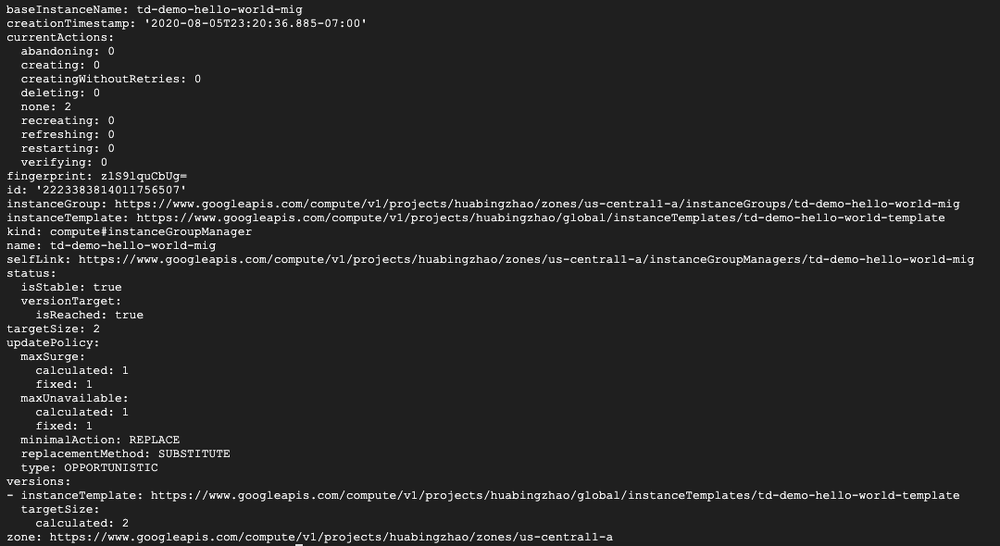

#### 数据面 Sidecar 配置

Traffic Director 将服务发现信息和路由规则转换为 Envoy 配置，通过 xDS 下发到 Envoy sidecar，控制面规则和数据面配置的对应关系下：

```text
Forwarding Rule    ->    Envoy Listener
URL Map            ->    Envoy Route
Backend Service    ->    Envoy Cluster
NEG/MIG            ->    Envoy endpoint
```

Listener 配置

Listener 中的 Http Connection Manager filter 配置定义了 IP+Port 层面的入口，这里只接受 Forwarding Rule 中指定的 VIP 10.0.0.1。我们也可以在 Forwarding Rule 中将 VIP 设置为 0.0.0.0，这样的话任何目的 IP 的请求都可以处理。

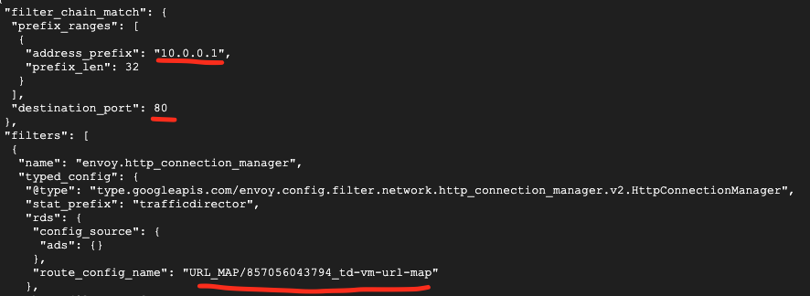

Route 配置

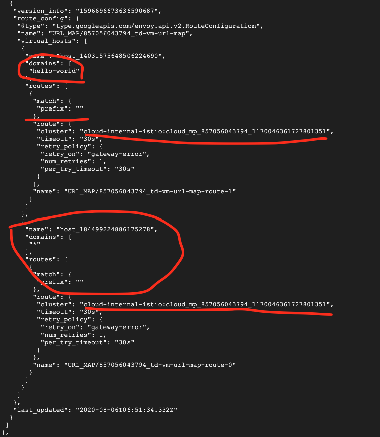

Cluster 配置


#### 高级流量规则

在 URL Map 中设置 Traffic Splitting

```yaml
    hostRules:
    - summary: ''
     hosts:
      - '*'
    pathMatcher: matcher1
    pathMatchers:
    - defaultService: global/backendServices/review1
      name: matcher1
      routeRules:
      - priority: 2
        matchRules:
        - prefixMatch: ''
        routeAction:
         weightedBackendServices:
         - backendService: global/backendServices/review1
           weight: 95
         - backendService: global/backendServices/review2
           weight: 5
```

在 Backend Service 中设置 Circuit Breaker

```yaml
 affinityCookieTtlSec: 0
 backends:
 - balancingMode: UTILIZATION
   capacityScaler: 1.0
    group:https://www.googleapis.com/compute/v1/projects/<var>PROJECT_ID</var>/zones/<var>ZONE</var>/instanceGroups/<var>INSTANCE_GROUP_NAME</var>
   maxUtilization: 0.8
 circuitBreakers:
   maxConnections: 1000
   maxPendingRequests: 200
   maxRequests: 1000
   maxRequestsPerConnection: 100
   maxRetries: 3
 connectionDraining:
   drainingTimeoutSec: 300
 healthChecks:
   - https://www.googleapis.com/compute/v1/projects/<var>PROJECT_ID</var>/global/healthChecks/<var>HEALTH_CHECK_NAME</var>
 loadBalancingScheme: INTERNAL_SELF_MANAGED
 localityLbPolicy: ROUND_ROBIN
 name: <var>BACKEND_SERVICE_NAME</var>
 port: 80
 portName: http
 protocol: HTTP
 sessionAffinity: NONE
 timeoutSec: 30
```

从这两个规则的定义可以看出，虽然文件结构有所差异，但实际上 Traffic Director yaml 路由规则的定义和 Istio 非常相似。

与 Istio 相比，Traffic Director 的流量管理机制更为灵活，可以在 Mesh 中同时接入 K8s 集群和虚拟机中的工作负载。但 Traffic Director 需要手动进行较多的配置才能对服务进行管理，包括 backend service，forwarding rule，url map 和 DNS，而在 Istio 中，如果不需要进行特殊的路由和流量策略，这些配置都是不需要手动进行的，pilot 会自动创建默认配置。

### Sidecar Proxy 部署机制

Traffic Director 数据面采用了和 Istio 相同的机制，通过 Iptables 规则将应用服务的出入流量重定向到 Envoy sidecar，由 Envoy 进行流量路由。Traffic Director 采用了下面的方式来在 K8s 集群的 Pod 或者虚拟机中安装数据面组件。

#### VM 手动部署

通过脚本从 gcloud 上下载 envoy 二机制，并安装 iptables 流量拦截规则，启动envoy。

```bash
# Add a system user to run Envoy binaries. Login is disabled for this user
sudo adduser --system --disabled-login envoy
# Download and extract the Traffic Director tar.gz file
# 下载traffic director相关文件
sudo wget -P /home/envoy https://storage.googleapis.com/traffic-director/traffic-director.tar.gz
sudo tar -xzf /home/envoy/traffic-director.tar.gz -C /home/envoy
#下载 Envoy 的初始化配置，配置中包含了控制面traffic director的地址
sudo wget -O - https://storage.googleapis.com/traffic-director/demo/observability/envoy_stackdriver_trace_config.yaml >> /home/envoy/traffic-director/bootstrap_template.yaml
# 设置iptables流量拦截规则的相关参数
sudo cat << END > /home/envoy/traffic-director/sidecar.env
ENVOY_USER=envoy
# Exclude the proxy user from redirection so that traffic doesn't loop back
# to the proxy
EXCLUDE_ENVOY_USER_FROM_INTERCEPT='true'
# Intercept all traffic by default
SERVICE_CIDR='10.10.10.0/24'
GCP_PROJECT_NUMBER='${GCP_PROJECT_NUMBER}'
VPC_NETWORK_NAME=''
ENVOY_PORT='15001'
ENVOY_ADMIN_PORT='15000'
LOG_DIR='/var/log/envoy/'
LOG_LEVEL='info'
XDS_SERVER_CERT='/etc/ssl/certs/ca-certificates.crt'
TRACING_ENABLED='true'
ACCESSLOG_PATH='/var/log/envoy/access.log'
END
sudo apt-get update -y
sudo apt-get install apt-transport-https ca-certificates curl gnupg2 software-properties-common -y
sudo curl -fsSL https://download.docker.com/linux/debian/gpg | sudo apt-key add -
sudo add-apt-repository 'deb [arch=amd64] https://download.docker.com/linux/debian stretch stable' -y
sudo apt-get update -y
sudo apt-get install docker-ce -y
#下载envoy二机制
sudo /home/envoy/traffic-director/pull_envoy.sh
#设置iptables规则，启动envoy
sudo /home/envoy/traffic-director/run.sh start"

```

#### VM 自动部署

在创建虚拟机模版时添加注入proxy的参数，可以在VM中自动部署Envoy sidecar。

```bash
gcloud beta compute instance-templates create td-vm-template-auto \    
--service-proxy=enabled

gcloud compute instance-groups managed create td-vm-mig-us-central1 \    
--zone us-central1-a --size=2 --template=td-vm-template-auto
```

#### GKE 通过 deployment 部署

GKE 提供 yaml 模版，需要修改 deployment 文件，在 yaml 中增加 sidecar 相关的镜像。未提供 webhook,参见 Traffic Director 的[示例文件](https://storage.googleapis.com/traffic-director/trafficdirector_istio_sidecar.yaml)。

### VM和GKE混合部署示例

下面我们创建一个示例程序，将 V 和 GKE 中的服务同时加入到 traffic director 管理的 service mesh 中，以展示 traffic director 的对 VM 和容器服务流量统一管理能力。
该程序的组成如下图所示。程序中部署了三个服务，在 us-central1-a 中部署了两个 VM MIG 服务，在 us-west1-a 中部署了一个 GKE NEG 服务，这三个服务处于同一个 VPC 中，因此网络是互通的。


通过 us-central1-a region 上的客户端向三个服务分别发送请求。

```bash
echo Access service in VM managed instance group td-demo-hello-world-mig
echo 
for i in {1..4}
do
    curl http://10.0.0.1
    sleep 1
done
echo 
echo Access service in VM managed instance group td-observability-service-vm-mig 
echo 
for i in {1..4}
do
    curl http://10.10.10.10
    sleep 1
done
echo 
echo Access service in GKE network endpoint group k8s1-e403ff53-default-service-test-80-e849f707 
echo 
for i in {1..4}
do
    curl http://10.0.0.2
    echo
    sleep 1
done
```

服务端会在请求响应消息中打印自身的 host name。我们从客户端循环访问三个服务，从命令结果可见每次的输出是不同的，这是因为 envoy 会通过缺省 lb 算法将请求分发到不同的服务实例上。

```bash
Access service in VM managed instance group td-demo-hello-world-mig

<!doctype html><html><body><h1>td-demo-hello-world-mig-ccx4</h1></body></html>
<!doctype html><html><body><h1>td-demo-hello-world-mig-658w</h1></body></html>
<!doctype html><html><body><h1>td-demo-hello-world-mig-ccx4</h1></body></html>
<!doctype html><html><body><h1>td-demo-hello-world-mig-658w</h1></body></html>

Access service in VM managed instance group td-observability-service-vm-mig

<!doctype html><html><body><h1>td-observability-service-vm-mig-50tq</h1></body></html>
<!doctype html><html><body><h1>td-observability-service-vm-mig-16pr</h1></body></html>
<!doctype html><html><body><h1>td-observability-service-vm-mig-50tq</h1></body></html>
<!doctype html><html><body><h1>td-observability-service-vm-mig-16pr</h1></body></html>

Access service in GKE network endpoint group k8s1-e403ff53-default-service-test-80-e849f707

app1-84996668df-dlccn
app1-84996668df-t4qmn
app1-84996668df-dlccn
app1-84996668df-t4qmn
```

## Anthos Service Mesh

Anthos Service Mesh 是 Google 混合云和多云解决方案 Anthos 中负责服务管理的部分。和 Traffic Director 的主要区别是，Anthos Service Mesh 直接采用了开源 Istio， 并且未对控制面进行托管，而是将 Istio 控制面部署在了用户集群中，只是将遥测信息接入了 Google Cloud，并在 Google cloud console 的 Anthos Service Mesh 界面中提供了服务网格的查看和监控界面。
Anthos Service Mesh关键特性包括：

* 原生Istio多集群方案
* 支持多云/混合云（不支持虚机）
* 集中的服务监控控制台。

### Anthos 的整体架构

Google Cloud Anthos 旨在提供一个跨越 Google Cloud、私有云和其他公有云的统一解决方案，为客户在混合云/多云环境下的集群和应用管理提供一致的体验。Anthos 包含了统一的 GKE 集群管理，服务管理和配置管理三大部分功能。其中 Anthos Service Mesh 负责其中统一的服务管理部分，可以将部署在多个不同云环境中的 Istio 集群在 Anthos Service Mesh 控制台中进行统一的管理和监控。

Anthos 架构

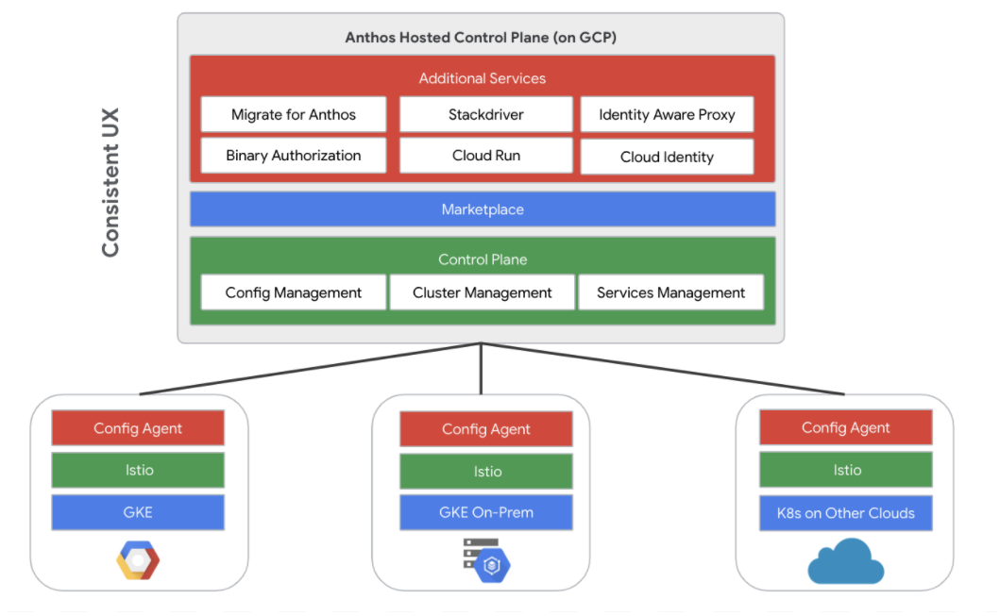

### Anthos GKE 集群管理

Anthos 对 On-Perm 和多云的 K8s 集群的管理采用了代理的方式，Anthos 会在每个加入 Anthos 的集群中安装一个 agent，由 agent 主动建立一个到 Anthos 控制面的连接，以穿透 NAT，连接建立后，Anthos 控制面会连接集群的 API Server，对集群进查看和行管理。

Anthos 采用 agent 接入 K8s 集群

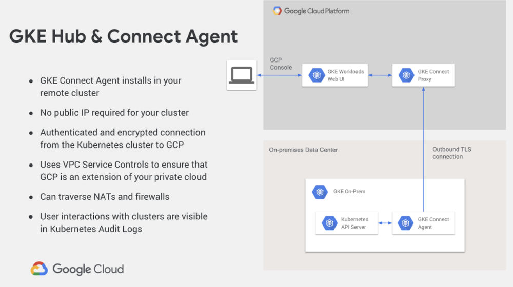

### Anthos Service Mesh 的混合云/多云解决方案

由于采用了开源 Istio，因此 Anthos Service Mesh 的混合云/多云解决方案实际上采用的是 Istio 的多集群方案。Istio 自身的多集群方案是非常灵活的，根据网络模式和控制面的安装模式，可以有多种灵活的搭配组合。Anthos Service Mesh 中推荐使用的是多控制面方案。

#### 多网络多控制平面

该方案中多个集群在不同网络中，不同集群中的 Pod IP 之间是不能通过路由互通的，只能通过网关进行访问。即使在不同集群中部署相同的服务，对远端集群中服务的访问方式也和本地服务不同，即不能采用同一服务名来访问不同集群中的相同服务，因此无法实现跨集群/地域的负载均衡或容灾。

由于上诉特点，多网络多控制平面的部署方案一般用于需要隔离不同服务的场景，如下图所示，通常会在不同集群中部署不同的服务，跨集群进行服务调用时通过 Ingress Gateway 进行。

Anthos Service Mesh 多集群管理-多网络多控制平面

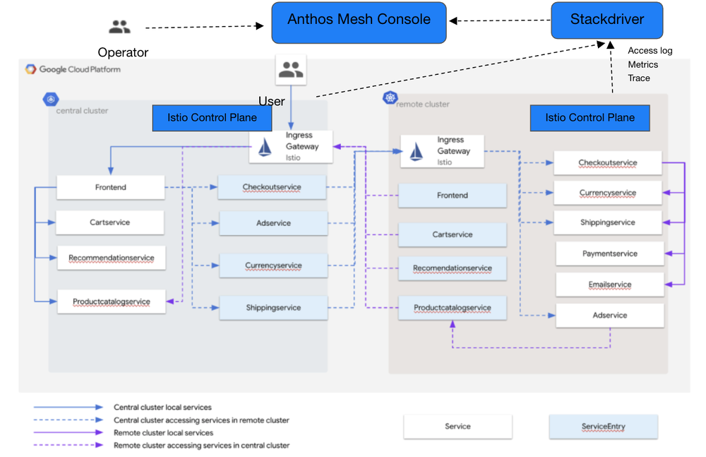

#### 单网络多控制平面

在该方案中，多个集群处于同一个扁平三层网络之中，各个集群中的服务可以直接相互访问。如下图所示，两个集群中的 Istio 控制面都通过访问对方的 API server 拿到了对方的服务信息。在这种场景中，通常会在不同集群中部署相同的服务，以实现跨地域的负载均衡和容灾。

如图中箭头所示，在正常情况下，每个 region 中的服务只会访问自己 region 中的其他服务，以避免跨 region 调用导致时延较长，影响用户体验。当左边 region 中的 ratings 服务由于故障不能访问时，reviews 服务会通过 Istio 提供的 Locality Load Balancing 能力访问右侧 region 中的 ratings 服务，以实现跨 region 的容灾，避免服务中断。

Anthos Service Mesh 多集群管理-单网络多控制平面

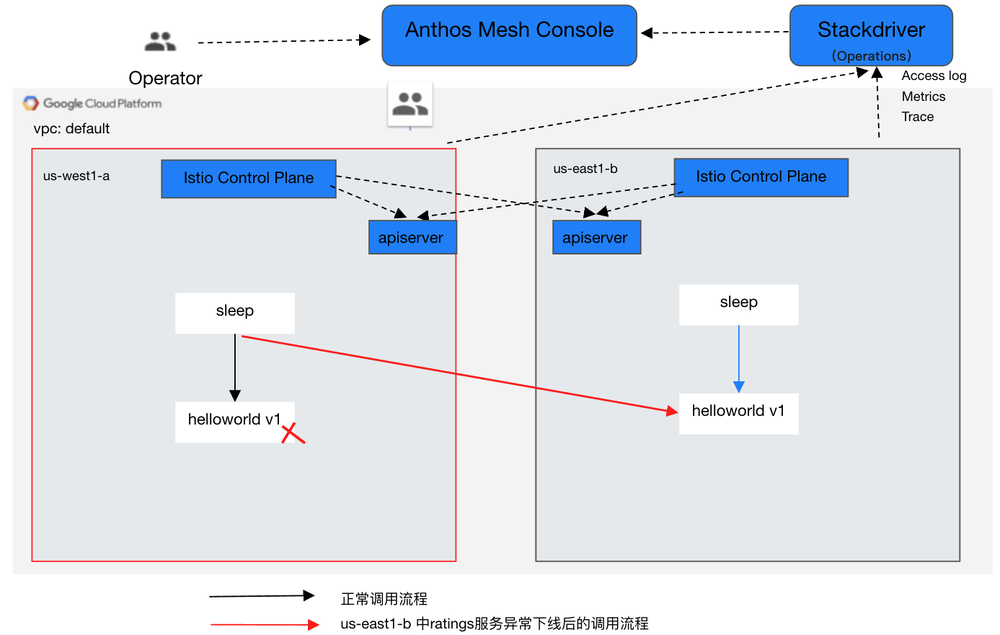

### Anthos Service Mesh 多集群部署示例

对于 Istio 来讲，其管理的 Mesh 中的多个集群是否跨云/混合云并不影响集群管理的部署方案，因为本质上都是同一网络/多个网络两种情况下的多集群管理。本示例的两个集群都使用了 GKE 的 Cluster。但只要把网络打通，本示例也适用于跨云/混合云的情况。

本示例的部署如图“单网络多控制面“所示，在同一个 VPC 中的两个 region 中部署了两个 GKE cluster。部署时需要注意几点：

* 需要将 cluster 的网络方案设置为 vpc-native，这样 pod ip 在 vpc 中就是可以路由的，以让两个 cluster 的网络可以互通。
* 需要为两个 cluster 中部署的 Istio 控制面设置对方 api server 的 remote secret，以使 stio 获取对方的 Service 信息。

具体的安装步骤可以参见 Anthos Service Mesh 的[帮助文档](https://cloud.google.com/service-mesh/docs/gke-project-setup)。

从导出的 Envoy sidecar 配置可以看到，其连接的 xds server 为本地集群中的 istiod。

```json
        "cluster_name": "xds-grpc",
        "endpoints": [
         {
          "lb_endpoints": [
           {
            "endpoint": {
             "address": {
              "socket_address": {
               "address": "istiod.istio-system.svc",
               "port_value": 15012
              }
             }
            }
           }
          ]
         }
        ]
````

Metric，Access log和 tracing 过 Envoy stackdriver http filter 上报到 Google Cloud，以便通过 Anthos Service Mesh 控制台统一查看。

```json
              "name": "istio.stackdriver",
              "typed_config": {
               "@type": "type.googleapis.com/udpa.type.v1.TypedStruct",
               "type_url": "type.googleapis.com/envoy.extensions.filters.http.wasm.v3.Wasm",
               "value": {
                "config": {
                 "root_id": "stackdriver_outbound",
                 "vm_config": {
                  "vm_id": "stackdriver_outbound",
                  "runtime": "envoy.wasm.runtime.null",
                  "code": {
                   "local": {
                    "inline_string": "envoy.wasm.null.stackdriver"
                   }
                  }
                 },
                 "configuration": "{\"enable_mesh_edges_reporting\": true, \"disable_server_access_logging\": false, \"meshEdgesReportingDuration\": \"600s\"}\n"
                }
               }
              }
```

尝试从位于 west1-a Region 集群的 sleep pod 中访问 helloworld 服务，可以看到缺省会访问本集群中的 helloword v1 版本的服务实例，不会跨地域访问。

```bash
g********@cloudshell:~ (huabingzhao-anthos)$ 
export CTX1=gke_huabingzhao-anthos_us-west1-a_anthos-mesh-cluster-1

for i in {1..4}
> do
> kubectl exec --context=${CTX1} -it -n sample -c sleep  \
>    $(kubectl get pod --context=${CTX1} -n sample -l    \
>    app=sleep -o jsonpath='{.items[0].metadata.name}')  \
>    -- curl helloworld.sample:5000/hello
> done
Hello version: v1, instance: helloworld-v1-578dd69f69-c2fmz
Hello version: v1, instance: helloworld-v1-578dd69f69-c2fmz
Hello version: v1, instance: helloworld-v1-578dd69f69-c2fmz
Hello version: v1, instance: helloworld-v1-578dd69f69-c2fmz
```

将 west1-a 集群中 helloworld deployment 的副本数设置为0，再进行访问，由于本地没有可用实例，会访问到部署在 east1-b region 的 helloworld v2，实现了跨地域的容灾。这里需要注意一点：虽然两个集群的 IP 是可路由的，但 Google cloud 的防火墙缺省并不允许集群之间相互访问，需要先创建相应的防火墙规则，以允许跨集群的网格访问流量。

```bash
kubectl edit deployment helloworld-v1 -nsample --context=${CTX1}
```

```yaml
apiVersion: apps/v1
kind: Deployment
metadata:
  annotations:
    deployment.kubernetes.io/revision: "1"
  creationTimestamp: "2020-08-14T12:00:32Z"
  generation: 2
  labels:
    version: v1
  name: helloworld-v1
  namespace: sample
  resourceVersion: "54763"
  selfLink: /apis/apps/v1/namespaces/sample/deployments/helloworld-v1
  uid: d6c79e00-e62d-411a-8986-25513d805eeb
spec:
  progressDeadlineSeconds: 600
  replicas: 0
  revisionHistoryLimit: 10
  selector:
    matchLabels:
      app: helloworld
      version: v1
  strategy:
    rollingUpdate:
      maxSurge: 25%
      maxUnavailable: 25%
    type: RollingUpdate
    ......
```

```bash
g********@cloudshell:~ (huabingzhao-anthos)$ for i in {1..4}
> do
> kubectl exec --context=${CTX1} -it -n sample -c sleep  \
>    $(kubectl get pod --context=${CTX1} -n sample -l    \
>    app=sleep -o jsonpath='{.items[0].metadata.name}')  \
>    -- curl helloworld.sample:5000/hello
> done
Hello version: v2, instance: helloworld-v2-776f74c475-jws5r
Hello version: v2, instance: helloworld-v2-776f74c475-jws5r
Hello version: v2, instance: helloworld-v2-776f74c475-jws5r
Hello version: v2, instance: helloworld-v2-776f74c475-jws5r
```

## 相互竞争还是优势互补？

从前面的分析可以看出， Google Cloud 推出的 Traffic Director 和 Anthos Service Mesh 这两个服务网格的产品各有侧重点：

* Traffic Director 关注重点为流量管理。依靠 Google Cloud 强大的网络能力提供了跨区域的 Mesh 流量管理，支持本地服务出现问题时将流量导向另一个地域的相同服务，以避免用户业务中断；并且通过统一的服务发现机制实现了 K8s 集群和虚拟机的混合部署。
* Anthos Service Mesh 关注重点为跨云/多云的统一管理。这是出于用户业务部署的实际环境和业务向云迁移的较长过程的实际考虑，但目前未支持虚拟机，并且其对于 Mesh 中全局流量的管理能力不如 Traffic Director 这样强大。

由于目的不同，两者在控制面也采用不同的实现方案。由于 Traffic Director 只需要支持 Google Cloud，处于一个可控的网络环境中，因此采用托管的自定义控制面实现，并对接了 Google Cloud 上的服务发现机制；而 Anthos Service Mesh 考虑到多云/混合云场景下复杂的网络环境和部署限制，采用了开源 Istio 的多控制面方案，在每个集群中都单独安装了一个 Istio，只是接入了 Google Cloud 的遥测数据，以对网格中的服务进行统一监控。

虽然 Traffic Director 和 Anthos Service Mesh 两者都是 Google Cloud 上的 Service Mesh 产品，似乎存在竞争关系，但从两者的功能和定位可以看出，这两个产品其实是互补的，可以结合两者以形成一个比较完善的 Service Mesh 托管解决方案。因此 Google Cloud 会对两个产品持续进行整合。下图为 Traffic Director Road Map 中 Anthos 和 Istio 的整合计划。


## 参考文档

* [Creating a VPC-native cluster](https://cloud.google.com/kubernetes-engine/docs/how-to/alias-ips)
* [Traffic Director](https://cloud.google.com/traffic-director)
* [Anthos Service Mesh](https://cloud.google.com/anthos/service-mesh)
