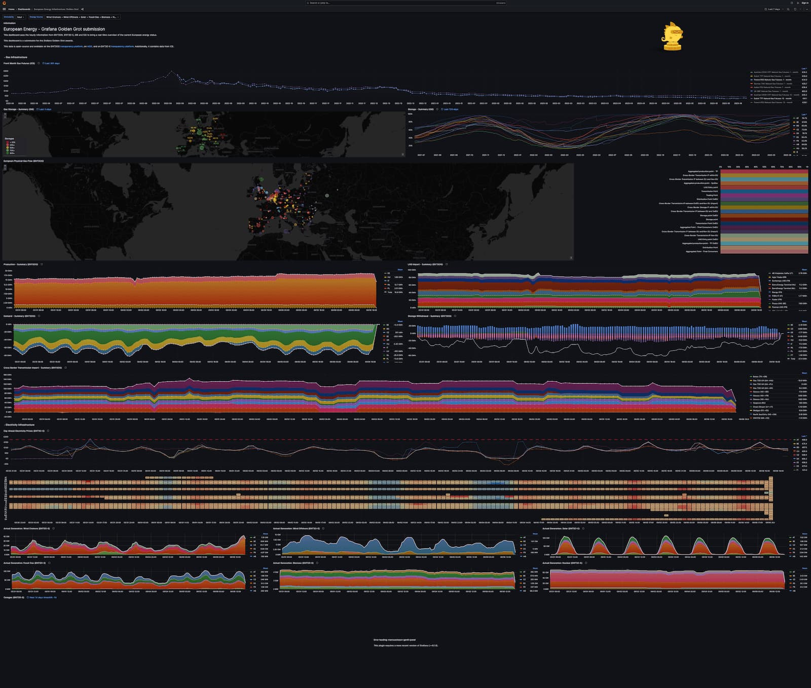
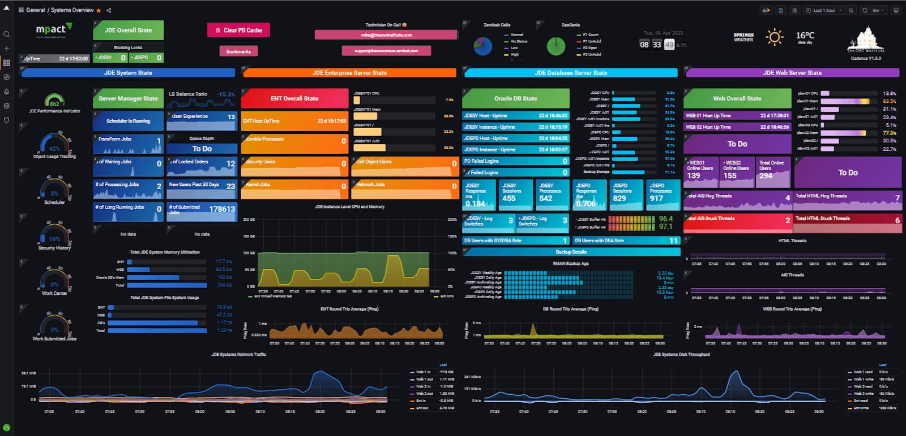
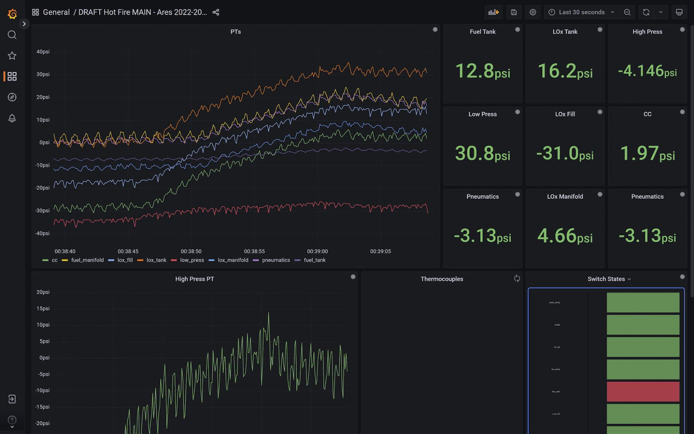
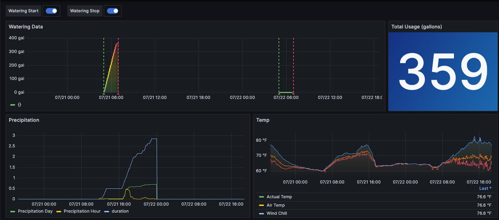
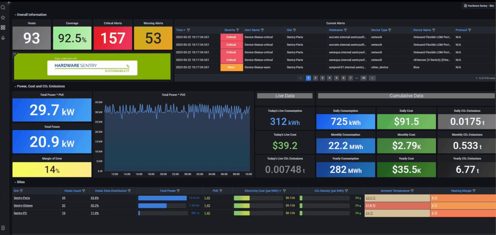
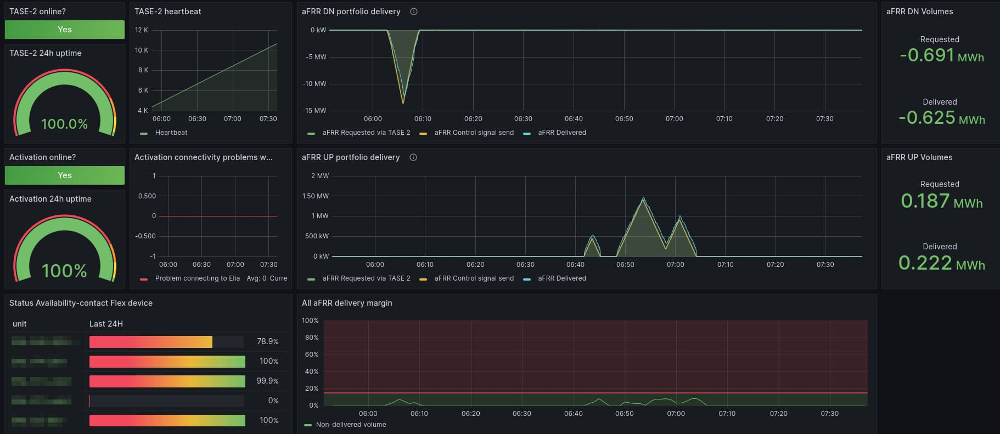
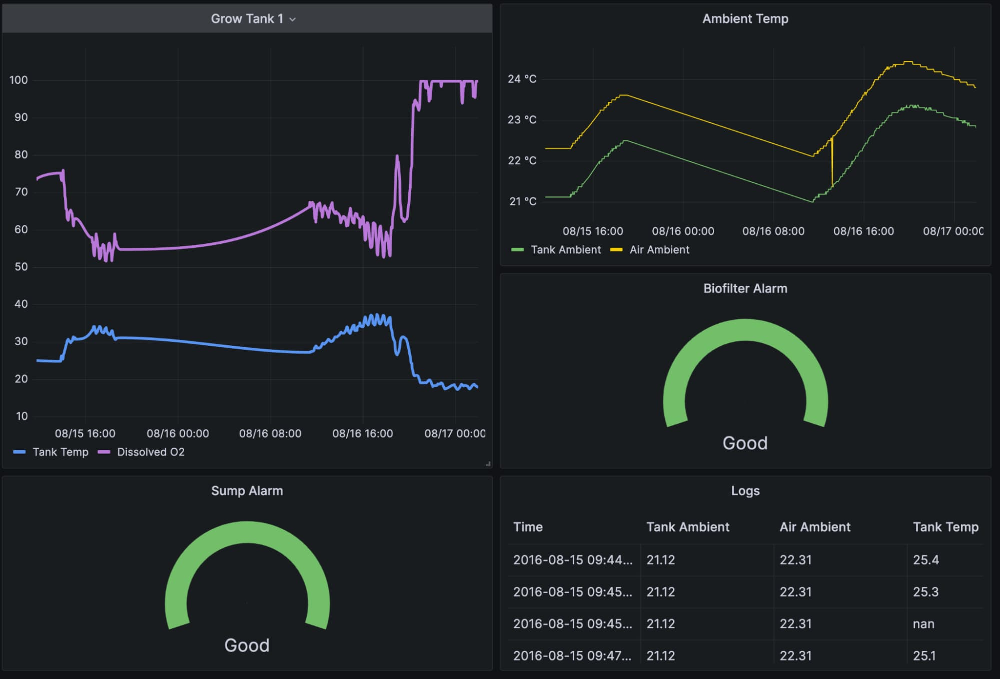
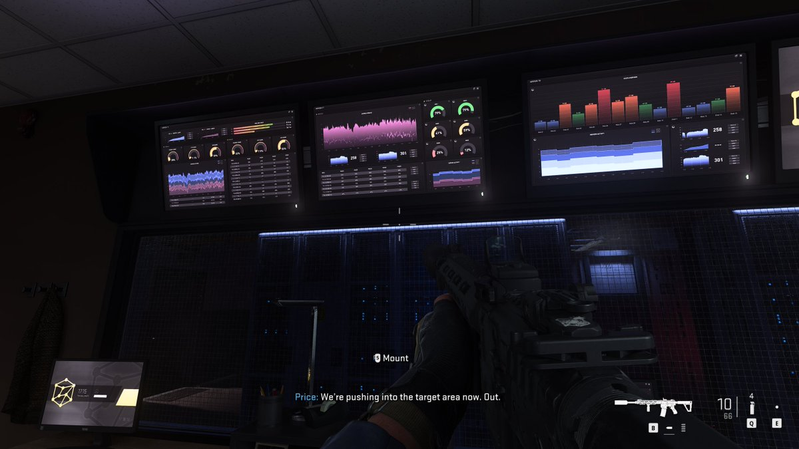

## 编者按

本文译自：[Grafana dashboards in 2023: Memorable use cases of the year](https://grafana.com/blog/2023/12/27/grafana-dashboards-in-2023-memorable-use-cases-of-the-year/)。

摘要：这篇文章回顾了 2023 年社区中一些令人印象深刻的 Grafana 仪表盘的用例，它们展示了 Grafana 的多样性和创造力，以及如何用可视化的方式监控和分析各种数据和场景。

## 正文

随着每年使用 [Grafana](https://grafana.com/oss/grafana?pg=blog&plcmt=body-txt) 的用户人数增加，人们使用 [Grafana 仪表板](https://grafana.com/grafana/dashboards/?pg=blog&plcmt=body-txt) 的原因也日益多样化。在 2023 年，我们社区内外的成员分享了一些令人难以置信的专业和个人项目，包括 Grafana 如何帮助他们成功发射火箭，减少碳排放，甚至帮助平衡国家电网。让我们回顾一下今年看到的一些最令人难忘的仪表板：

## 获奖者

Grafana 在六月份迎来了 10 岁的生日，为了庆祝这一时刻，我们首次推出了 [Golden Grot 奖项](https://grafana.com/about/events/grafanacon/2023/golden-grot-awards/?pg=blog&plcmt=body-txt)，这些奖项帮助突出显示了我们社区创建的令人惊叹的 Grafana 仪表板。但今年并不是唯一一个与仪表板相关的胜利：今年三月，加州大学洛杉矶分校的火箭工程团队使用 Grafana 作为测试和发射过程中的可视化工具，在一次业余火箭竞赛中赢得了冠军，并打破了世界纪录。

### [监控能源基础设施](https://grafana.com/blog/2023/06/15/meet-our-golden-grot-awards-grand-prize-winners/?pg=blog&plcmt=body-txt)

Golden Grot 奖项有两位大奖得主，在个人仪表板类别中，奖项授予了荷兰 Erasmus 经济学院的研究生 Nicky Sonnemans。他用仪表板监控 [欧洲能源基础设施的当前状态](https://grafana.sonnem.nl/d/uCV3CiPVz/european-energy-infastructure-golden-grot?orgId=2) — 具体包括有关天然气储存、天然气在欧洲的实际流动、电力生成和能源价格的当前和历史信息。Sonnemans 创建这个仪表板的灵感来自于他想要将能源数据可视化到一个集中的地方，以便他可以轻松地实时发现任何异常情况并收到任何必要的警报。他补充说：“我的主要动机是展示 Grafana 可以用作商业智能工具，而不仅仅是用于技术监控和服务器监控。”

### [解决工作中的可观测性问题](https://grafana.com/blog/2023/06/15/meet-our-golden-grot-awards-grand-prize-winners/?pg=blog&plcmt=body-txt)

在今年的 Golden Grot 奖项的专业仪表板类别中，获奖者是南非约翰内斯堡的 IT 专业人员 Raymond Sowden。他是 RadixTrie PTY LTD 的 CNC 团队负责人，专注于 Oracle 的 JD Edwards EnterpriseOne ERP (JDE)。他创建了获奖的 Grafana 仪表板来解决工作中的一个重大可观测性问题：“我们没有一个单一的监控视图来监控 JDE，所以我们的仪表板为我们提供了对 JDE 的整体健康和性能的无与伦比的见解。”他说，一个重要时刻是当他们能够看到后端和前端发生了什么时：“那时我们知道我们有了特别的东西。”

Raymond 的仪表板提供了对系统健康状况的高级概述，但各种小部件链接到了更多技术数据的详细仪表板。它被他公司的 JDE 技术人员使用，以及他们客户的技术人员，一直到执行层级。他说：“我们通过提供实时见解和指标来减少了日常检查、日常报告等人工工作的工作量。”

### [在火箭发射过程中提供数据可见性](https://grafana.com/blog/2023/04/21/how-grafana-helped-a-rocket-engineering-team-break-a-world-record/?pg=blog&plcmt=body-txt)

在一篇关于赢得 [Dollar Per Foot 挑战](https://friendsofamateurrocketry.org/dpf-challenge/) 并创下液体火箭最高高度的大学生和软件工程师 Philip Do 的博客文章中，他和来自 [UCLA 火箭项目](http://rocketproject.seas.ucla.edu/) 的队友解释了他们是如何依赖 [Grafana](https://grafana.com/oss/grafana?pg=blog&plcmt=body-txt) 来进行工作的。“通过我们的仪表板，我们可以快速可视化数据，并在测试和发射的关键阶段监控潜在的硬件问题，”他说。

## 家居

Grafana Labs 坚定地相信工作与生活的平衡，但当你对 Grafana 仪表板的吸引力和信息丰富性如此熟悉时，难以抵挡创建一个用于监视家庭事物的诱惑。我们在 2023 年展示的 Grafanista 制作的项目包括一个[可视化家用炉子的运行时间](https://grafana.com/blog/2023/05/19/monitoring-a-furnace-with-home-assistant-prometheus-and-grafana/?pg=blog&plcmt=body-txt)、一个[监控空气质量](https://grafana.com/blog/2023/02/15/breathing-easy-with-grafana-dashboards-and-3d-printing/?pg=blog&plcmt=body-txt)的项目，同时使用 3D 打印机，以及一个[跟踪温度和湿度](https://grafana.com/blog/2023/10/23/monitor-temperature-and-humidity-with-grafana-and-raspberry-pi/?pg=blog&plcmt=body-txt)的项目，用于监控滨海家庭。还有一个旨在监控 [Plex 媒体服务器](https://www.plex.tv/your-media/) 的项目，是 [内部 homelab Slack 频道的三位 Grafanista 在一次黑客马拉松期间创建的](https://grafana.com/blog/2023/04/28/plexporters-energize-how-we-monitor-plex-with-grafana/?pg=blog&plcmt=body-txt)。

另一个值得注意的家庭项目来自公司外部：[GrafanaCON 2023](https://grafana.com/about/events/grafanacon/2023/) 上，Toyota Racing Development 的高级 DevOps 工程师 Kyle Shelton 提供了一个演示，他介绍了如何将他在工作中使用的 [Grafana Cloud](https://grafana.com/products/cloud/?pg=blog&plcmt=body-txt) 经验，用于在家中使用 Grafana Cloud Free [监控个人三项铁人训练](https://grafana.com/about/events/grafanacon/2023/session/triathlon-training-with-prometheus-python-grafana-cloud/?pg=blog&plcmt=body-txt)。

### 从任何地方监测游泳池水位

高级解决方案工程师 Brian LeBlanc 创建了一个 Grafana 仪表板，以便他可以监测自家游泳池的水位。这使他可以安心地进行了一次为期 10 天的旅行，而不会过度担心游泳池水泵可能遭受的潜在损害（更换费用：1000 美元）。在[一篇博客文章](https://grafana.com/blog/2023/08/14/how-to-monitor-pool-water-levels-from-anywhere-with-grafana/?pg=blog&plcmt=body-txt)中，他解释了他如何建立一个系统，其中包括一个名为 [Pool Sentry](https://www.rola-chem.com/m-3000-pool-sentry/) 的机械设备，一个 [LinkTap G2S](https://www.link-tap.com/)（一个连接到花园水管的物联网智能水控制器），以及一个 [Tempest 天气站](https://weatherflow.com/tempest-home-weather-system/)。他使用 Docker 运行了一个在 GitHub 上找到的 [exporter](https://github.com/nalbury/tempest-exporter)，并将数据导出到 [Prometheus](https://grafana.com/oss/prometheus/?pg=blog&plcmt=body-txt)，然后远程将指标数据写入了由 Grafana Mimir 提供支持的 [Grafana Cloud Metrics](https://grafana.com/products/cloud/metrics/)。他解释说：“Tempest exporter 从 Tempest Cloud 中获取数据。然后，我的本地 Prometheus 实例会抓取这些数据并将其发布到 Grafana Cloud Metrics 中，以便我可以在 Grafana Cloud 中可视化它。”结果，他说：“我可以将两个物联网设备的数据汇总到一个窗口中，以评估水的消耗、降雨量和环境温度。”

这个项目在多个方面都取得了成功：“作为一名新的 Grafanista，它为我提供了一些实际的用例，让我有机会亲自学习我们的产品，”他说。“在我和家人度假期间，它也一直运行得非常顺利。”

## 环境、气候和能源消耗

今年的许多杰出仪表板是作为环保使命的一部分创建的。Grafana Labs 的一个客户转向 Grafana，帮助减少对环境的影响。在另一个用例中，我们了解到 Grafana Cloud 在一次能源危机期间发挥了关键作用。我们还发现，Grafana Labs 的一名工程师曾经将 Grafana 作为可持续农业系统的一部分使用。

### 减少数据中心的碳排放

[Sentry Software](https://www.sentrysoftware.com/) 是 Hardware Sentry 的制造商，它是一款 IT 监控软件，其业务的很大一部分依赖于在其数据中心中维持最佳的温度条件，这一操作对公司的整体碳足迹有所贡献。

最近，Sentry Software 开始采取措施，在位于巴黎的主要数据中心中降低电力消耗，以减少其碳排放。通过实施开放标准和 Grafana Labs 技术，他们开发了一个[使用 Grafana 仪表板监控电力使用情况](https://grafana.com/grafana/dashboards/17229-hardware-sentry-site/?pg=blog&plcmt=body-txt)的监控系统，以更高效地监测电力使用情况。最终结果是数据中心的空调能源使用减少了 19%，年度二氧化碳排放量减少了 7%。

最好的部分是，由于整个监控系统是建立在开源解决方案和开放标准之上的，任何人都可以复制该公司的成功经验。Sentry Software CEO Bertrand Martin 在[GrafanaCON 2023 演讲](https://grafana.com/about/events/grafanacon/2023/session/grafana-opentelemetry-to-reduce-electricity-usage-at-sentry-software/?pg=blog&plcmt=body-txt)中表示：“这个故事可以成为你的故事，你不需要复杂的企业解决方案。”

### 在法国平衡电网

去年冬天，Flexcity —— 电动灵活性市场的市场领导者 —— 面临了前所未有的挑战：帮助法国电网运营商 [RTE](https://www.rte-france.com/en/home) 在欧洲普遍的能源危机阴云笼罩下稳定法国国家电网。随着公司因其努力而上了新闻头条，Flexcity 的技术团队将 [Grafana Cloud](https://grafana.com/products/cloud/?pg=blog&plcmt=body-txt) 归功于帮助法国渡过了那个特别艰难的时期。利用 Grafana 仪表板，Flexcity 团队可以实时跟踪客户的能源消耗数据，从而在电网最需要的关键时刻节省了数千千瓦时电力。

Flexcity 的 CTO Mathias Deshayes 表示：“当我们收到电网运营商的请求时，我们使用 Grafana 仪表板实时查看客户基础的能源和功率消耗和产量水平。我们在客户现场安装了小型设备，每隔四秒，我们的平台就会将他们的消耗发送到我们的平台，并在 Grafana 中显示出来。因此，我们在 Grafana 中有了我们组合的总和，我们可以在激活期间跟踪消耗，即当电网运营商要求设备上下调整功率以帮助平衡电网时。”

### 监管小农场

在加入 Grafana Labs 之前，高级解决方案工程师 Chris Wilkes 经营了一个鱼塘农场 —— 严格来说是一个水耕农场。 （水耕农业结合了养鱼业和水培，即在液体培养基中种植蔬菜。）Wilkes 是一名初学者农民，坦言在开始时遇到了很多问题。例如，有一次，他的所有鱼在晚上一台空气泵发生故障后死亡。

在深入研究物联网领域之后，他说：“农场上的每一台机器都有一个微控制器。”随着时间的推移，农场上发展出了一个控制和监控系统，他使用 PubNub 查询了所有板，并将数据转储到运行在中央服务器上（一台旧的笔记本电脑放在集装箱中）的 PostgreSQL 数据库中。当他偶然发现 Grafana 时，他说：“就像走出黑暗洞穴进入光明。”

Wilkes 经营了这个农场约五年。他说：“Grafana 的监控能力在我管理和改进农业技术方面发挥了重要作用。”他补充说，他计划有一天回到农业领域，将更加高级的 Grafana 技能与他对可持续性的热情结合起来。他说：“我们需要改变种植食物的方式，特别是在食物稀缺和不确定的地方。”

## 户外

我们经常看到 Grafana 仪表板突然出现，但今年有两个特别引人注目。

### The Ocean Race

参赛者在这个全球帆船比赛中环绕世界比赛，这意味着他们需要全天候监测包括 GPS 位置、风速以及空气和水温在内的数据。代表德国的 [Team Malizia](https://www.theoceanrace.com/en/teams/team-malizia)分享了[帮助他们在艰难的六个月冒险中跟踪进展的 Grafana 仪表板](https://exocet.cloud/grafana/d/bsbc_7MGx/malizia-public-dashboard-the-ocean-race?orgId=15)。The Ocean Race 总部还展示了一些令人印象深刻的 Grafana 仪表板，以监测整个比赛。

### Call of Duty

Grafana 仪表板的现实世界示例并不新鲜，但它们也在虚拟世界中使用。下面的图像来自视频游戏 Call of Duty: Modern Warfare 2。

Grafana Labs 的首席执行官兼联合创始人 Raj Dutt 在[GrafanaCON 2023 主题演讲](https://grafana.com/about/events/grafanacon/2023/session/keynote-grafana-10/?pg=blog&plcmt=body-txt)中说：“对于那些了解 Grafana 的人来说，这显然非常像 Grafana，从指针的样式、颜色方案以及一切都清晰可见。”“所以无论是谁在 Activision 是 Grafana 的粉丝并且负责这个，谢谢你！我们所有人都表示由衷的敬意。”

我们期待在 2024 年看到更多令人惊叹的仪表板！

想要与社区分享您的 Grafana 故事和仪表板吗？给我们发送邮件：[stories@grafana.com](mailto:stories@grafana.com)。
