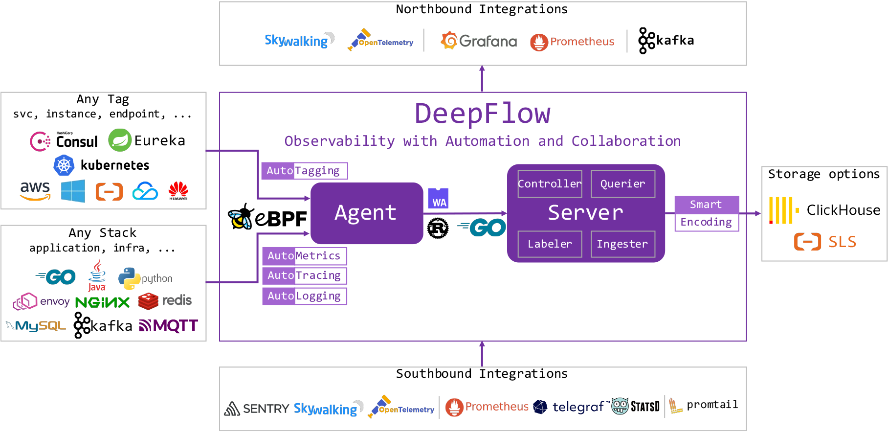
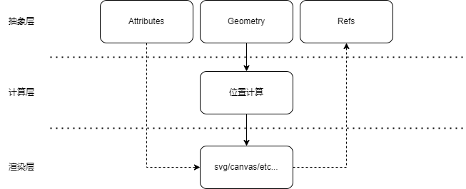

本文为云杉网络`原力释放 - 云原生可观测性分享会`第十三期直播实录。[回看链接](https://www.bilibili.com/video/BV1f44y1m7n8/?spm_id_from=333.788&vd_source=37077a01afa812c311092cba5befac7c)，[PPT 下载](http://yunshan-guangzhou.oss-cn-beijing.aliyuncs.com/yunshan-ticket/pdf/95b33b06763f2d05b77c18327aa38c3c_20221213150423.pdf)。

Grafana 是目前最广泛使用的数据可视化软件之一，DeepFlow 中已有大量基于 Grafana Dashboard 解决的可观测性场景的实战分享。这些场景都是基于 DeepFlow Grafana 插件提供的查询能力来构建的。DeepFlow 社区致力于基于开源生态构建一个完整的可观测性平台，而终端呈现和数据的可视化呈现是其中的重要一环。本文对当前 DeepFlow 提供的 Grafana 插件做一个简单介绍，抛砖引玉，希望大家能了解并创造更多的 DeepFlow 可观测性生态应用，也希望能让大家掌握如何开发一套完整的 Grafana Plugin。

## DeepFlow 插件简介

在最早的 DeepFlow 企业版中，我们提供了一些比较简单的 Grafana 插件。这些插件是基于 DeepFlow 企业版 API 来提供服务的，目的是为了能让用户无缝将 DeepFlow 页面中的视图在自己的 Grafana 环境中搭建起来，避免改变用户的使用习惯。在 DeepFlow 宣布开源以后，我们基于社区版重新设计了若干插件。包括：

- Data source plugin：DeepFlow Querier，用于为 Grafana 提供 DeepFlow 的数据
- Panel plugin：DeepFlow AppTracing，用于展示分布式追踪火焰图
- Panel plugin：DeepFlow Topo，用于展示服务之间的访问关系

这些定制化插件，配合 Grafana 原本提供的一系列标准图表，可以构建出一组完整的 DeepFlow 可观测性视图。可以前往我们的[在线 Demo](https://ce-demo.deepflow.yunshan.net/d/pplication_DNS_Monitoring/application-dns-monitoring?orgId=1) 快速体验。

## Data source plugin

Grafana 的 Data source 插件是用来将数据源接入 Grafana 体系中的核心插件。DeepFlow 架构中，提供了基于 SQL 查询语句的 Querier 接口，因此我们的 Data source 插件会基于这个查询语法，来提供用户完全自由的查询。



从代码的文件结构，Data source 插件主要有如下部分：

- ConfigEditor 是在 Grafana 中加入数据源时配置编辑模块，一般用于配置数据源本身连接方式、账户密码等。只需要实现对应的 ConfigEditor 类即可实现对应的编辑界面。
- QueryEditor 是构建数据源查询界面的主要模块，通过实现 QueryEditor 类即可实现编辑界面，其中可以自由引用 Grafana 自带 UI 库或者其他第三方库进行界面实现。
- Grafana 在 dashboard 中还可以支持变量。通过实现 VariableQueryEditor 可以实现自定义的变量动态查询，方便 dashboard 中关联使用。
- datasource.ts 是核心的逻辑模块，用于处理从界面接受的配置项，并从后端进行查询并对返回数据进行处理

```bash
[zhenyu@dev202 deepflow-gui-grafana]$ tree deepflow-querier-datasource/src/ -L 1
deepflow-querier-datasource/src/
├── components
├── ConfigEditor.tsx
├── consts.ts
├── datasource.ts
├── img
├── index.d.ts
├── module.ts
├── plugin.json
├── QueryEditor.css
├── QueryEditor.tsx
├── types.ts
├── update-dashboards.js
└── utils
```

模块之间的关系如下图：


注意其中需要在插件的 plugin.json 中配置相关的 proxy 信息，这样能让 Grafana core 中的 backendsrv 知道该如何转发去往 querier 的请求。

```json
{
  "path": "auth",
  "url": "{{ .JsonData.requestUrl }}",
  "headers": [
    {
      "name": "Content-Type",
      "content": "application/x-www-form-urlencoded"
    },
    {
      "name": "authorization",
      "content": "Bearer {{ .JsonData.token }}"
    }
  ]
},
```

从执行的数据流角度，Data source 插件中的数据流如下：

- 将用户在 QueryEditor 中输入的查询内容，构造为一个标准 JSON 结构
- 将 JSON 化的查询条件通过 DeepFlow Querier SDK 生成一个有效的查询语句（SQL）
- 将语句封装为 API 请求
- 通过 plugin 的 plugin.json 中设置的 proxy 转发至 DeepFlow Querier
- 将 DeepFlow Querier 返回的数据转换为符合 Panel 需要的数据
- 在 Panel 中将数据可视化呈现


其中，DeepFlow Querier SDK 是一个 DeepFlow 的内部转换库，可以将标准化的 JSON 结构转换为 SQL 或者 DeepFlow APP 所需要的参数格式。

上述数据流中最后一步，是将从 Querier 中获取查询到的数据，并可以将这些数据发送给 Panel 模块，用于可视化展示。

## DeepFlow 查询数据逻辑简介

在如何将查询数据结果进行可视化展现之前，需要简单的介绍下 DeepFlow 的数据查询逻辑。

DeepFlow 中的数据表，一般会分为双端表和单端表两种：

- 单端表是对单个服务或实例的统计数据，数据本身没有方向。例如某个 K8s 服务的 RED 指标数据，某个进程的网络性能指标等等。这种数据一般适合用常规的折线、柱图、表格等展示。
- 双端表是对 A 服务到 B 服务的访问路径的统计数据，有源、目的、方向等区分。例如，`A -> B` 和 `B -> A` 是两条不同的数据。这种数据一般适合用拓扑图等表征访问关系的视图进行展示。目前双端表有：
  - flow_metrics.vtap_app_edge_port：服务之间的应用访问关系和性能指标
  - flow_metrics.vtap_flow_edge_port：服务之间的网络访问关系和性能指标
  - flow_log.l7_flow_log：应用调用日志
  - flow_log.l4_flow_log：网络流日志

除此之外，DeepFlow 的存储数据和其他主流 TSDB/OLAP 也一样，所有的表都会有时间列、有 Tag 和 Metric 的区分，以及支持数据的分组聚合能力。


图中每个小圆点代表一行数据。查询到的原始数据，经过分组后，每组中有若干条数据，再对每组数据中进行聚合计算，每个分组得到一列数据。

这样的查询方式，可以很方便的查询出如下场景的数据：

- 每分钟的平均请求数 `SELECT AVG(request) ... GROUP BY INTERVAL(time, 60)`
- 每个 K8s Pod 在每分钟中的平均 TCP 重传比率 `SELECT AVG(retrans_ratio) ... GROUP BY INTERVAL(time, 60), pod`

从 QueryEditor UI 收集到的用户输入，会通过统一模块转换为 querier 认识的 SQL 语句，或者 API 约定的参数结构。我们提供了一个 SDK `deepflow-sdk-js`，可以按需将结构化的数据生成指定的文本输出。

这个 SDK 中，会首先对结构数据补充相关的信息，例如：

- 实例分组转换为实例 ID 的分组，避免实例之间的重名
- 自动增加 `node_type`、`icon_id` 等算子，用于附加实例的类型和对应图标等信息
- 实现对枚举类型的自动翻译，例如 `protocol` 会自动附加 `Enum(protocol)`
- 自动进行别名转换，以可读的方式展示每一列数据名称

SDK 中还会通过指定函数或者操作符的序列化，按照定制方式生成 SQL 语句。

```javascript
  [OP.EQ]: (a, b) => `${a}=${escape(b)}`,
  [OP.NEQ]: (a, b) => `${a}!=${escape(b)}`,
  [OP.LT]: (a, b) => `${a}<${escape(b)}`,
  [OP.LTE]: (a, b) => `${a}<=${escape(b)}`,
  [OP.GT]: (a, b) => `${a}>${escape(b)}`,
  [OP.GTE]: (a, b) => `${a}>=${escape(b)}`,
  [OP.IN]: (a, b) => formatIn(a, b),
  [OP.NOT_IN]: (a, b) => formatIn(a, b, true),
  [OP.REGEXP]: (a, b) => `${a} REGEXP ${escape(b)}`,
  [OP.NOT_REGEXP]: (a, b) => `${a} NOT REGEXP ${escape(b)}`,
  [OP.AS]: (a, b) => `${a} AS \`${b}\``,
  [OP.SELF]: a => `${a}`,
  [OP.INTERVAL]: (a, b) => `time(${a}, ${b})`,
  [OP.LIKE]: (a, b) => formatLike(a, b),
  [OP.NOT_LIKE]: (a, b) => formatLike(a, b, true),
```

其中还会对一些逻辑运算符进行自动的化简和合并。例如条件：

```javascript
let a = and(
  or(
    and(
      not(
        and(
          eq("vm_name", 'ab c" bla"'),
          eq("ip", "10.1.1.1"),
          eq("subnet", "subnet_1"),
          oneOf("subnet", ["subnet_1", "subnet_2"]),
          like("host", "host.*")
        )
      ),
      or(and(lt("bps", 1), lte("rps", 1)))
    ),
    lt("bps", 1),
    and(not(or(lt("rps", 3)))),
    and(and(lt("bps", 1), lte("rps", 1)), falseOp())
  )
)
```

输出的条件结果为：

```sql
(
  (vm_name!='ab c" bla"' OR ip!='10.1.1.1' OR subnet!='subnet_1'
    OR subnet NOT IN ('subnet_1','subnet_2') OR host NOT REGEXP 'host.*')
  AND bps<1 AND rps<=1
)
OR bps<1 OR rps>=3
```

## Data source plugin 对数据的处理

通过上面的 Data source 插件，我们已经成功从 Querier 中查询出一组数据。接下来需要将这些数据进行展示。很简单的，通过 Grafana 列表插件，我们可以得到这组数据的列表：


但如果我们进一步想要画出这个列表对应的折线图时，会遇到一个问题：如何将这些数据整理为折线图 Panel 所需要的数据结构呢？在折线图中，需要每条线有单独的 Series，而我们目前只有一个 `data: Record<string, any>[]` 结构的数据。当我们需要展示多条线时，是无法画出想要的图的。

因此我们在 Data source plugin 中提供了一个输出格式的转换选择，可以根据选择的 Panel 转换为不同的数据结构：


当选择折线图时，会把数据转换为 `data: [{time: timestamp, 组1: number}, {time: timestamp, 组2: number}, ...}]` 的结构，这样折线图 Panel 会按组绘制出对应的折线。

在数据转换时，会根据分组的 Tag 中所有可能取值进行分组。例如当分组条件为 Pod 时，就能绘制出每个 Pod 的折线：


其中`组X` 的名称，可以通过自定义的形式进行格式化：


同样，在选择拓扑图时，也需要对返回的数据做二次处理，将数据处理为 Panel 识别的格式。

## DeepFlow Topo panel

DeepFlow 中大量数据都在描述微服务之间的访问关系，因此需要一个流量拓扑图来进行展示这些数据。我们基于 d3.js 来构建流量拓扑，主要的考虑点为：

- 自由度更高
- 更能满足产品经理的各种要求

绘制流量拓扑时，我们使用客户端优先的模式进行宽度优先搜索，将单纯的客户端节点作为第一层，然后遍历去构建出整个拓扑。

在普通拓扑的基础上，我们还提供了瀑布拓扑的展现形式，可以有序的呈现拓扑各节点的关系：


瀑布拓扑会提供额外的分组能力，能够对拓扑做二次分组：


瀑布拓扑使用普通拓扑嵌套的方式构建，可以实现在分组聚合情况下的拓扑展示。

## DeepFlow AppTracing panel

AppTracing panel 用来展现应用追踪数据。这些数据是从应用访问中通过 eBPF、cBPF、OpenTelemetry 等采集到的一组结构化日志数据，有起始时间，也有从属关系。通过时间先后关系和从属关联，构建出应用访问的火焰图。


除了使用 DeepFlow AppTracing panel 来可视化应用追踪数据，我们也支持使用 Grafana Tempo 来显示 DeepFlow 的 Tracing 数据。

我们设计了一个完全模拟 Grafana Tempo backend 的模块，通过实现 Tempo 的 API，可以无缝将 DeepFlow 中的统计数据注入 Tempo UI 中显示，而且不需要额外部署 Tempo 后端：

DeepFlow 使用 Tempo Panel, 通过 `deepflow-server` 替代 tempo 的 backend ：


其中需要实现的 API:


## DeepFlow-Vis

上述的两个 Panel 插件，核心都是一组基于 d3.js 的可视化库。这些功能我们整合到一个独立的可视化库中，为 Panel 提供绘图能力。



DeepFlow-Vis 提供如下能力：

- 元素的抽象，提供了应用层的抽象元素
- 几何计算，提供元素本身的几何运算，并提供一些简单的布局模型
- 提供属性和绘图元素的直接获取，调用层可以很方便的获取数据以及基础的 dom/svg 等对象，方便自行修改
- 提供了一个独立的渲染层，可以使用不同的方式进行渲染输出，如使用 canvas 替换 svg

这些能力是以一个比较松散的结构组合在一起，因此在人力有限的情况下，可以更快的实现不同需求场景下的不同适配。

在此之上，提供了一些封装好的绘图，并实装在 AppTracing 和 Topo panel 中。

## Next

我们计划在 DeepFlow 后续版本中，将对应的 Grafana 插件及相关库全部开源，并完成在 Grafana 官方的注册。也欢迎大家能够一起加入，丰富 DeepFlow 客观性的生态。

## 什么是 DeepFlow

[DeepFlow](https://github.com/deepflowys/deepflow) 是一款开源的高度自动化的可观测性平台，是为云原生应用开发者建设可观测性能力而量身打造的全栈、全链路、高性能数据引擎。DeepFlow 使用 eBPF、WASM、OpenTelemetry 等新技术，创新的实现了 AutoTracing、AutoMetrics、AutoTagging、SmartEncoding 等核心机制，帮助开发者提升埋点插码的自动化水平，降低可观测性平台的运维复杂度。利用 DeepFlow 的可编程能力和开放接口，开发者可以快速将其融入到自己的可观测性技术栈中。

GitHub 地址：https://github.com/deepflowys/deepflow

访问 [DeepFlow Demo](https://deepflow.yunshan.net/docs/zh/install/overview/)，体验高度自动化的可观测性新时代。
