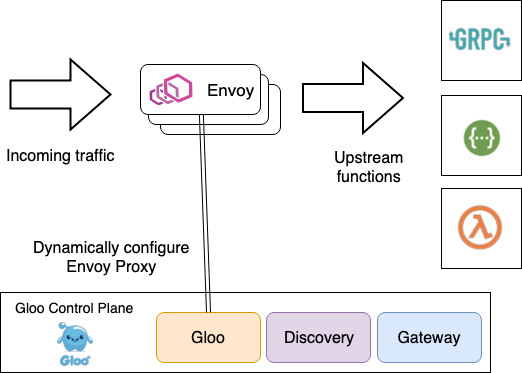
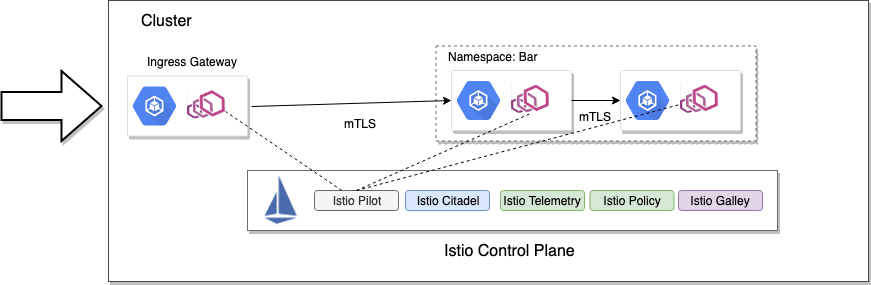
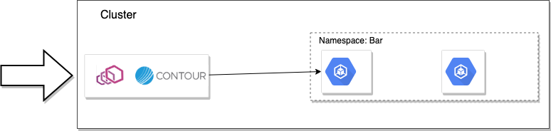

本文为翻译文章，[点击查看原文](https://blog.christianposta.com/envoy/guidance-for-building-a-control-plane-for-envoy-identify-components/)。

编者按

> 本文介绍如何为 Envoy 构建控制面指南的第 2 部分：识别控制平面的各个组件。对实施 Envoy 控制平面需要了解的基础知识很有帮助。也算是 Envoy 的概念介绍。

在[这个系列文章的前一篇](https://blog.christianposta.com/envoy/guidance-for-building-a-control-plane-to-manage-envoy-proxy-based-infrastructure/)中，我们浏览了 Envoy 动态配置对于在云原生环境中运行 Envoy 是多么的重要。在这篇文章中，我们来一起看看为了支持控制平面，我们需要如何协调各个组件。

由于操作环境的变化很大，因此为 Envoy 实施控制平面所需的组件也是如此。例如，在一个极端情况下，如果你需要构建时静态生成 Envoy 文件并发送给 Envoy 的需求，你需要以下组件来满足：

- 模板引擎
- 数据存储/ VCS，用于输入模板的值
- 任何特定于服务的配置，可能/可能不与服务/应用程序一起存储
- 一个将各个部分组合在一起的编排器
- 一种将这些传递给 Envoy 的方法
- 一种触发配置文件重新加载/热重启的方法

另一方面，如果您选择使用 gRPC 流式 xDS 实现，则需要：

- 核心 xDS 服务接口和实现
- 用于处理向服务注册表注册/取消注册服务的组件
- 服务注册表
- 描述您的 Envoy 配置的抽象对象模型（可选）
- 用于保存配置的数据存储

您最有可能需要支持 Envoy 操作的其他辅助组件：

- 证书/ CA 存储
- 统计收集引擎
- 分布式跟踪后端/引擎
- 外部认证
- 限速服务

通常，您需要考虑构建控制平面，以便组件独立运行，并且可以松散协作以满足控制平面的需求。您要做的最后一件事是通过部署整体控制平面来支持 Envoy 的微服务部署。例如，在[开源 Gloo 项目](https://gloo.solo.io/) 中，我们有以下驱动控制平面的组件：

- `Gloo` - 一个事件驱动的组件，负责为核心 xDS 服务生成配置并为其提供服务，并配置自定义 Envoy 过滤器

- `Discovery` - 一个可选组件，知道如何使用服务发现服务（Consul，Kubernetes 等）来发现和通告上游集群和端点。它还可以发现 REST 端点（通过 swagger），gRPC 功能（基于 gRPC 反射）和 AWS / GCP / Azure 云功能。该组件创建配置（在 Kubernetes 上，用[CustomResourceDefinitions](https://kubernetes.io/docs/concepts/extend-kubernetes/api-extension/custom-resources/)表示）`Gloo`组件可用于 构建通过 xDS 表示的规范 Envoy 配置。我们将在本系列博客的后续部分中看到更多内容。

- `Gateway` - 该组件允许用户使用更舒适的对象模型来根据其角色（即边缘网关，共享代理，knative 群集入口等）配置 Envoy 代理。控制平面的这一部分还生成“Gloo”控制平面可用于通过 xDS 生成 Envoy 配置的配置。

  

正如您所看到的，这些基本组件被部署为协同工作的服务，以构建通过 xDS 提供的相应 Envoy 配置。Gloo 通过使用这些松散协调的控制平面组件来实现其强大的发现功能，对函数的语义理解等，这些组件可用于服务 Envoy 配置。当 Gloo 部署到 Kubernetes 时，存储和配置非常具有“kube-native”的感觉：所有内容都由[自定义资源定义](https://kubernetes.io/docs/concepts/extend-kubernetes/api-extension/custom-resources/)表示。具体而言，所有面向用户的配置以及驱动 xDS 端点的核心配置都是 CRDs。您可以使用 Kubernetes API 和 kubectl 与 Gloo 进行交互。但是，我们还提供了一个`glooctl` [CLI 工具来简化与 Gloo 控制平面的交互](https://gloo.solo.io/cli/) - 特别是如果你不想的话，你不必为了 YAML 而烦恼。通过这种方式，Gloo 非常注重开发人员的体验和简化 YAML 的配置，对开发人员（或任何人？）来说这些可能非常繁琐。

Istio 也采用类似的方法来使用通过 Kubernetes CRDs 配置的松散协调的控制平面组件。Istio 的控制平面由以下部分组成：

- `Istio Pilot`  - 核心 xDS 服务
- `Istio Galley`  - 配置/存储抽象
- `Istio Citadel`  -  CA /证书引擎
- `Istio Telemetry` - 遥测信号的接收器
- `Istio Policy` - 一个可插拔的策略引擎

Heptio Contour 实际上只有两个组件组成了它的控制平面，但是，由于它完全基于 Kubernetes，它实际上利用了很多内置的 Kubernetes 工具，如 Kubernetes API / Storage 和 CRDs 来驱动配置。

- `contour`服务器
- `init-container` 启动引导

Contour 使用`init-container`为 Envoy 生成一个静态引导配置文件，告诉它在哪里找到 xDS 服务。xDS 服务器是控制平面中的第二个组件，默认情况下与数据平面一起部署，并提供单独部署的选项。我们将在本系列“部署控制平面组件”的第 5 部分中介绍这种架构及其权衡。

### 总结

确定控制平面所需的核心组件。不要试图构建一个单体的控制平面抽象，因为这将成为维护和更新的噩梦。在松散耦合的体系结构中构建控制平面所需的组件。如果您可以构建在 Kubernetes 之上，那么这样做：[Kubernetes 提供了一个非常强大的集成数据平面](https://medium.com/@allingeek/kubernetes-as-a-common-ops-data-plane-f8f2cf40cd59 )用于操作分布式系统，例如 Envoy 控制平面。如果你在 Kubernetes 之上构建一个控制平面，你应该利用[自定义资源定义](https://kubernetes.io/docs/concepts/extend-kubernetes/api-extension/custom-resources/)来驱动配置你的控制平面。有些人选择使用[入口定义](https://github.com/kubernetes/ingress-nginx/blob/master/docs/user-guide/nginx-configuration/annotations.md)，[服务注释](https://www.getambassador.io/reference/configuration/)，或[配置映射](https://www.youtube.com/watch?v=a1tXFUrqt5M&list=PLj6h78yzYM2PF_iYEBntfR0m4KAZET18Q&index=14&t=0s)来构建他们的控制平面。在 Kubernetes CRDs 可用之前，这些可能是适当的解决方法，但此时你应该避免这些方法并坚持使用 CRDs。就像[Tim Hockin（Kubernetes 的创始人）在最近的播客中所说的那样](https://kubernetespodcast.com/episode/041-ingress/)，用于驱动 Ingress Gateway 资源的注释是一个糟糕的选择。

本系列的下一篇文章实际上已经发布：[为 Envoy 构建控制平面的指南第 3 部分 - 域特定配置 API](https://blog.christianposta.com/envoy/guidance-for-building-a-control-plane-for-envoy-domain-specific-configuration-api/)
