6 月 30 日，杭州，蚂蚁 Z 空间，一大早就下起了雨，我还心想，这雨要是下大了会不会很多人不来了？而且我们还一早就放出了 IT 大咖说的直播链接。没想到最后现场签到了有 120 多个小伙伴！👍视频直播最高峰值 800 多人同时在线，截止 7 月 1 号显示有 5340 人观看。

- 讲师 PPT：https://github.com/servicemesher/meetup-slides
- 视频直播回放：http://www.itdks.com/eventlist/detail/2311

Meetup 结束时现场观众和讲师的合影。

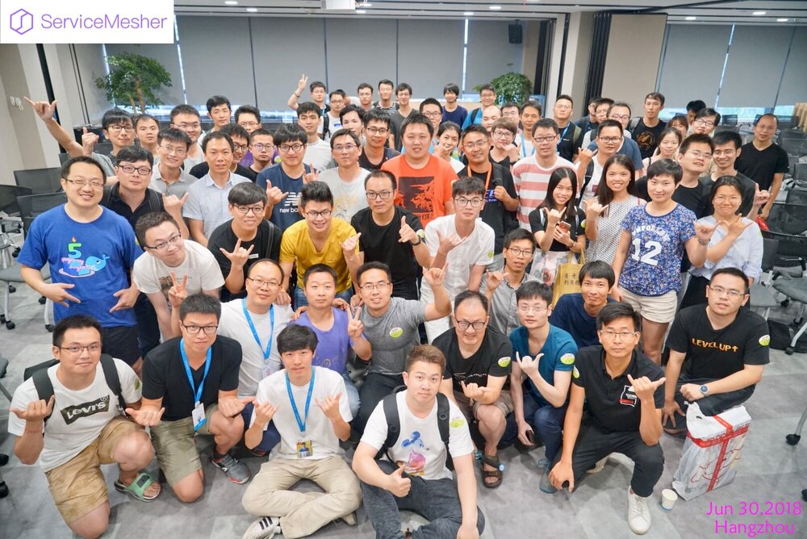

Service Mesh meetup 顺利落幕，感谢到场的小伙伴，线上观众，IT 大咖说的直播支持，来自蚂蚁金服、网易、才云科技、谐云科技老师的精彩分享，蚂蚁金服提供场地支持，电子工业出版社提供赠书支持。下一站北京见！更多 SM 内容请关注我们社区的官方网站 [www.servicemesher.com](http://www.servicemesher.com)，忙活了一天都没饭，真的是很饿，晚上在回北京的高铁上叫了个外卖应付了下。

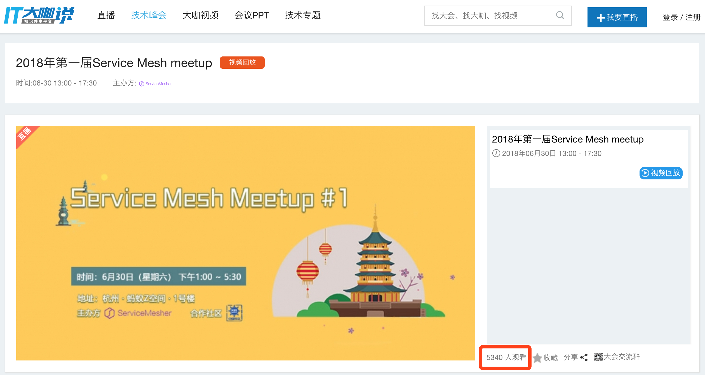

## 现场回顾（多图预警）

当天中午杭州的天气。

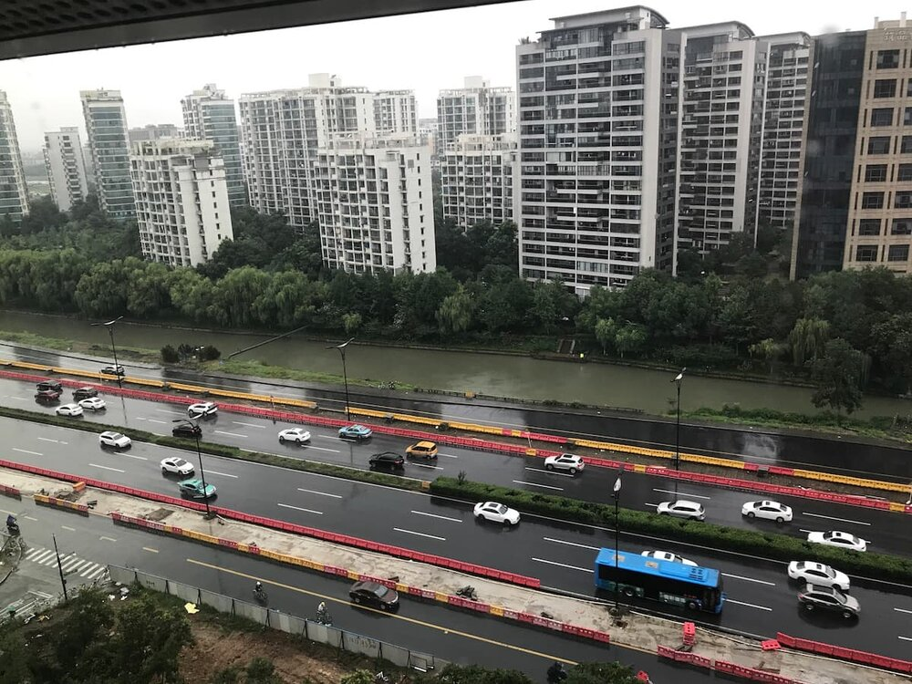

前几天从 LC3 大会上拿来的贴纸（CNCF 展台）。

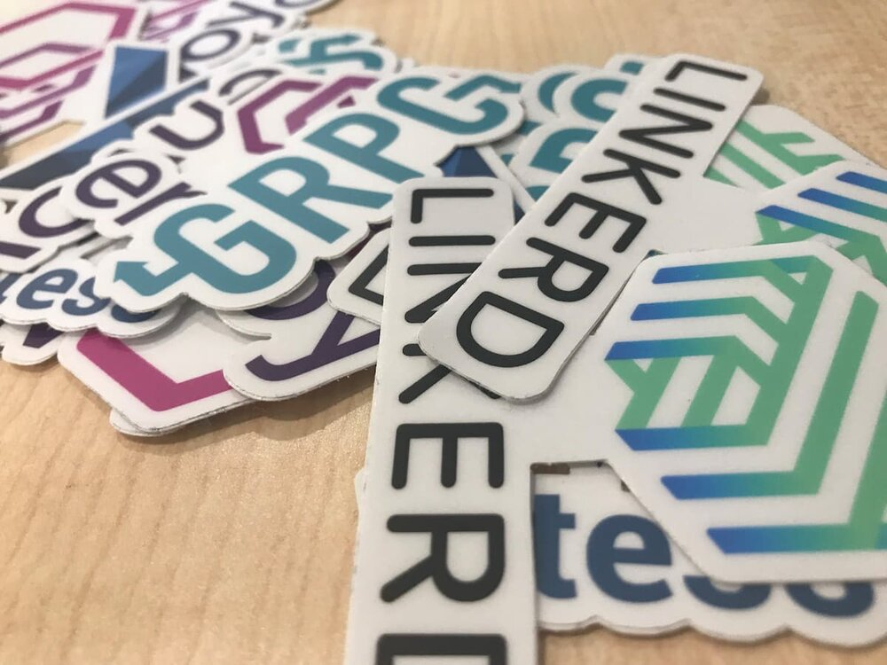

电子工业出版社和蚂蚁金服的赠书。

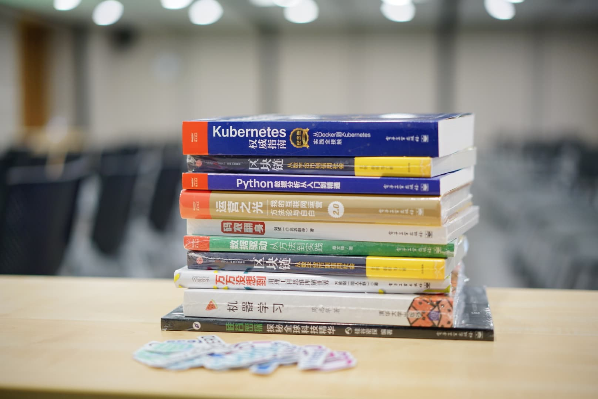

现场蚂蚁金服帮忙负责签到的妹子。

因为天气原因很多人来迟了，我们推迟了半个小时在 1:30 正式开始。

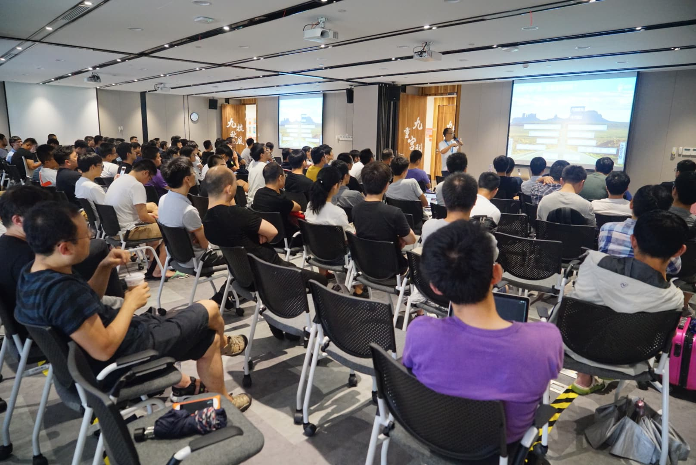

第一场**敖小剑（蚂蚁金服）：大规模微服务架构下的 Service Mesh 探索之路**

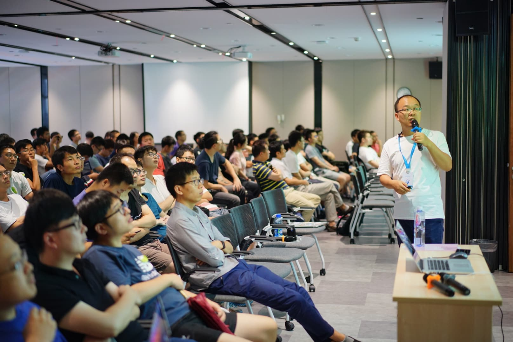

现场观众踊跃提问。

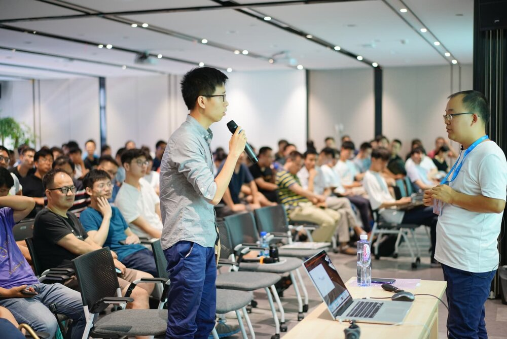

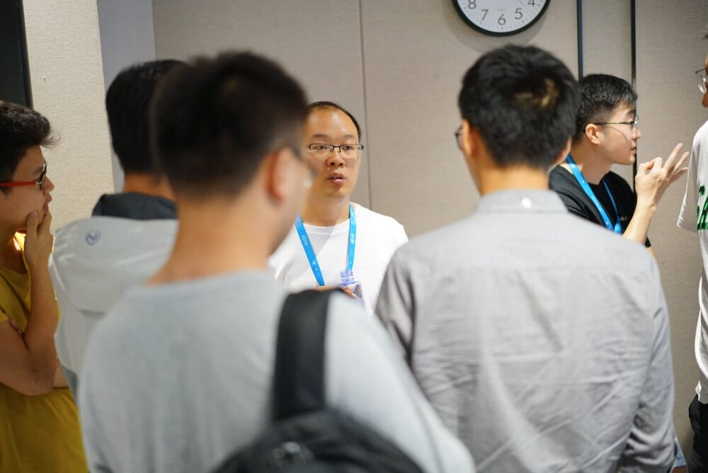

第二场**刘超（网易）：网易云的 Service Mesh 产品架构和实现**

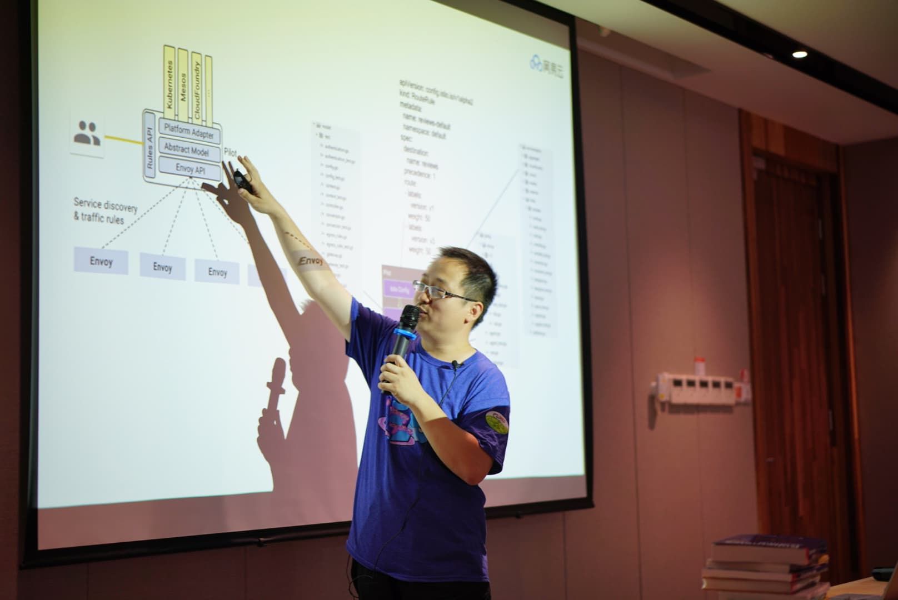

会后讲师都被团团围住。

第三场**唐鹏程（才云科技）：在 Kubernetes 上搭建高可用 Service Mesh 监控**

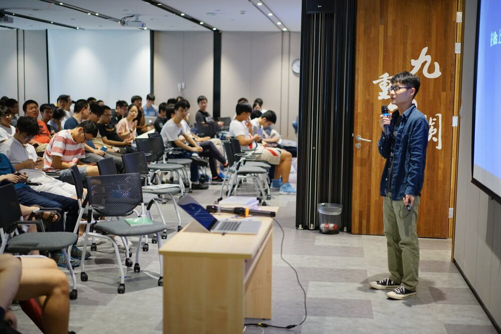

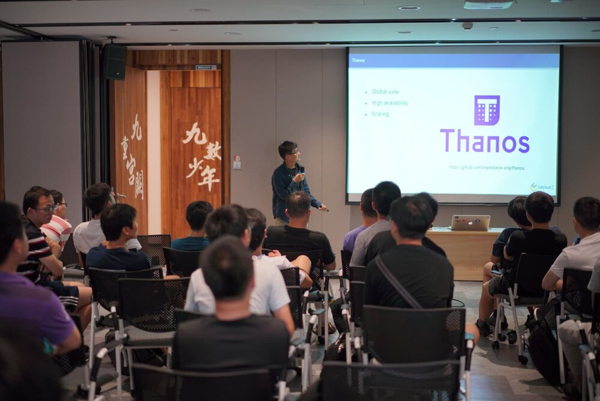

第四场**徐运元（谐云科技）：Service Mesh 结合容器云平台的思考与实践**

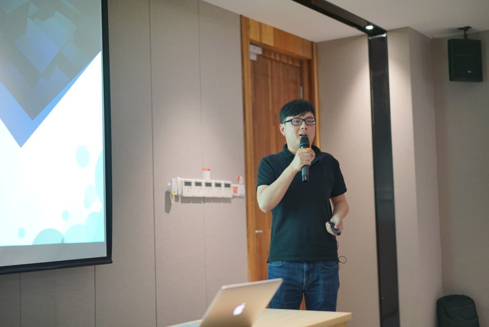

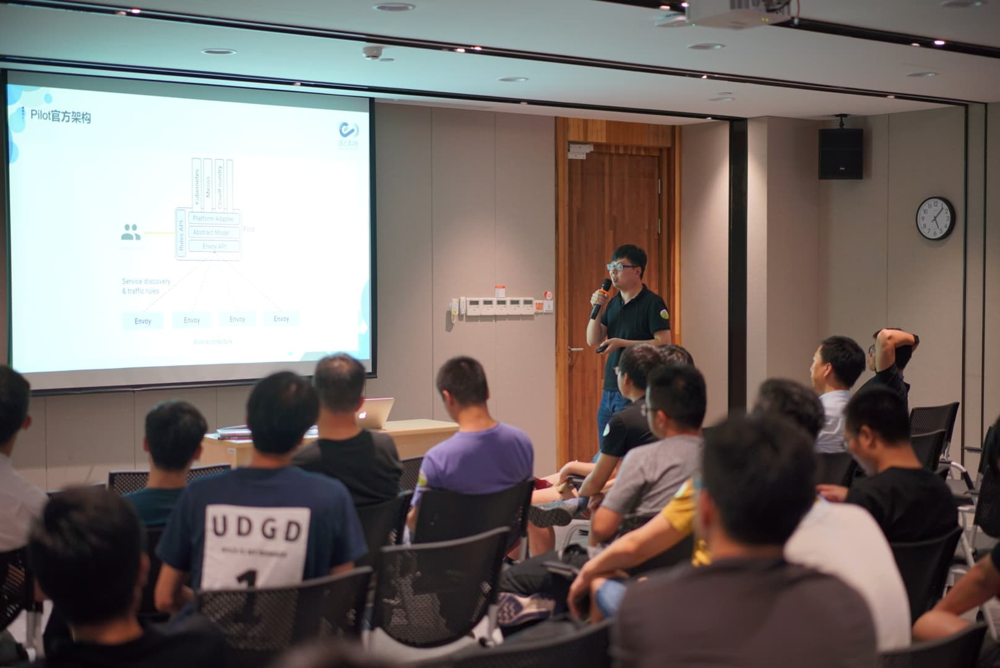

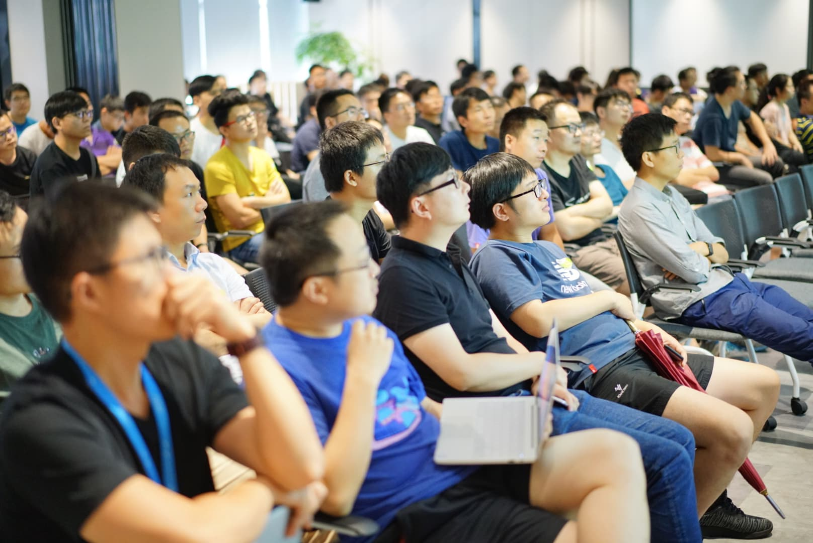

------

历届 meetup 的 PPT 归档地址：https://github.com/servicemesher/meetup-slides
