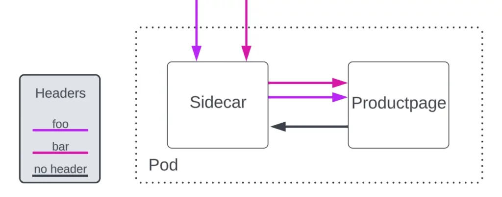
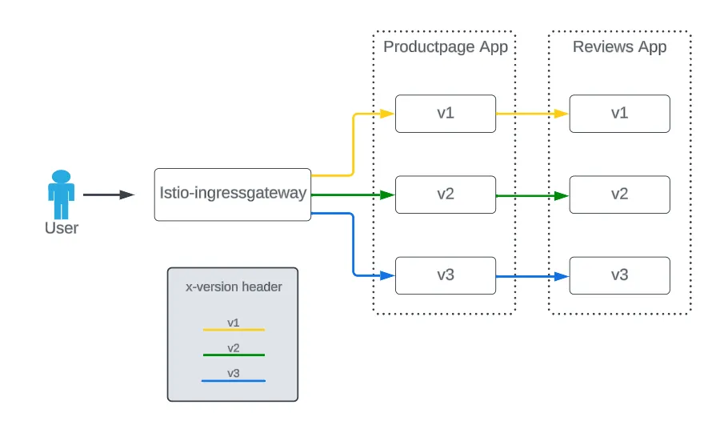

Istio 使用 Envoy 代理作为 Pod sidecar，应用程序将网络责任（例如入站和出站流量）委托给它，但有一个责任仍然属于应用程序容器：标头传播。

Envoy 代理无法将其发送到应用程序的请求与应用程序响应的请求关联起来，因此 Istio 无法自动传播标头。



在大多数情况下，基于标头的路由需要应用程序开发人员实现标头转发。例如，在 Istio 的 Bookinfo 应用程序中， `productpage` 微服务是[这样](https://github.com/istio/istio/blob/master/samples/bookinfo/src/productpage/productpage.py#L102)实现的。这让我们想到一个问题：

> 平台管理员如何在不修改应用程序内部的情况下使用基于标头的路由？

## 泳道方法

使用 Bookinfo 应用程序，我们将根据 `x-version` 标头对请求路径进行分段，如下图 2 所示：



没有 `x-version` 标头的请求可能会被路由到任意后端。

## 部署工作负载

我们将使用 Istio 的 Bookinfo [示例](https://istio.io/latest/docs/examples/bookinfo/) ，并对版本控制应用程序进行一些细微的更改作为示例实现。

首先，我们创建三个 productpage 部署，仅更改 `version` 标签。

```yaml
apiVersion: apps/v1
kind: Deployment
metadata:
  name: productpage-v{1,2,3}
  labels:
    app: productpage
    version: v{1,2,3}
spec:
  replicas: 1
  selector:
    matchLabels:
      app: productpage
      version: v{1,2,3}
  template:
    metadata:
      labels:
        app: productpage
        version: v{1,2,3}
...
```

为它们创建服务：

```yaml
apiVersion: v1
kind: Service
metadata:
  name: productpage
  labels:
    app: productpage
    service: productpage
spec:
  ports:
  - port: 9080
    name: http
  selector:
    app: productpage
```

然后，为 reviews 应用程序创建三个部署：

```yaml
apiVersion: apps/v1
kind: Deployment
metadata:
  name: reviews-v{1,2,3}
  labels:
    app: reviews
    version: v{1,2,3}
spec:
  replicas: 1
  selector:
    matchLabels:
      app: reviews
      version: v{1,2,3}
  template:
    metadata:
      labels:
        app: reviews
        version: v{1,2,3}
...
```

rating 和 details 应用程序与原始示例中的内容相同。

## 部署 Istio 配置

这就是 Istio 的路由功能发挥作用的地方。每个版本的 `productpage` 的 `DestinationRule subsets` 定义为：

```yaml
apiVersion: networking.istio.io/v1alpha3
kind: DestinationRule
metadata:
  name: productpage
spec:
  host: productpage
  trafficPolicy:
    loadBalancer:
      simple: RANDOM
  subsets:
  - name: v1
    labels:
      version: v1
  - name: v2
    labels:
      version: v2
  - name: v3
    labels:
      version: v3
```

其中有几个 `VirtualService` 实现了泳道标头逻辑的前半部分。以下负责前缀匹配并使用 `delegate` 功能来使用第二个 `VirtualService`，因此配置是原子的并且 `mesh` 避免声明网关选择器（参见下面的引用）：

```yaml
apiVersion: networking.istio.io/v1alpha3
kind: VirtualService
metadata:
  name: bookinfo
spec:
  hosts:
  - "*"
  gateways:
  - bookinfo-gateway
  http:
  - match:
    - uri:
        exact: /productpage
    - uri:
        prefix: /static
    - uri:
        exact: /login
    - uri:
        exact: /logout
    - uri:
        prefix: /api/v1/products
    delegate:
      name: productpage-route
```

现在指派 `productpage-route`：

```yaml
apiVersion: networking.istio.io/v1alpha3
kind: VirtualService
metadata:
  name: productpage-route
spec:
  http:
  - name: "productpage-v1-route"
    match:
    - headers:
        x-version:
          exact: v1
    route:
    - destination:
        host: productpage
        subset: v1
  - name: "productpage-v2-route"
    match:
    - headers:
        x-version:
          exact: v2
    route:
    - destination:
        host: productpage
        subset: v2
  - name: "productpage-v3-route"
    match:
    - headers:
        x-version:
          exact: v3
    route:
    - destination:
        host: productpage
        subset: v3
  - name: "productpage-default-route"
    match:
    - withoutHeaders:
        x-version: {}
    route:
    - destination:
        host: productpage
```

然后，在 `Reviews` 级别，在 `httpMatchRequest` 中使用 `sourceLabels` 配置制作泳道的后半部分：

> 一个或多个标签，这些标签约束规则对具有给定标签的源 (客户机) 工作负载的适用性。如果 VirtualService 有一个在顶级 `gateways` 字段中指定的网关列表，那么它必须包含该字段适用的保留网关 `mesh`。
>
> *来源：* [*Istio 虚拟服务文档*](https://istio.io/latest/docs/reference/config/networking/virtual-service/#HTTPMatchRequest)

这是 `VirtualService` 使用该 `sourceLabels` 功能：

```yaml
apiVersion: networking.istio.io/v1alpha3
kind: VirtualService
metadata:
  name: reviews-route
spec:
  hosts:
  - reviews
  http:
  - name: "reviews-v1-route"
    match:
    - sourceLabels:
        version: v1
    route:
    - destination:
        host: reviews
        subset: v1
  - name: "reviews-v2-route"
    match:
    - sourceLabels:
        version: v2
    route:
    - destination:
        host: reviews
        subset: v2
  - name: "reviews-v3-route"
    match:
    - sourceLabels:
        version: v3
    route:
    - destination:
        host: reviews
        subset: v3
```

## 在没有标头传播的情况下测试标头路由

首先，从无标头场景开始，您可以从所有通道获得响应：

```
 —————»  ns:bookinfo ❯ for i in {1..5}; do curl -s localhost:8080/productpage | grep -A1 "Reviews served by"; done
        <dt>Reviews served by:</dt>
        <u>reviews-v2-955b74755-t4jkb</u>
        <dt>Reviews served by:</dt>
        <u>reviews-v3-797fc48bc9-wsg26</u>
        <dt>Reviews served by:</dt>
        <u>reviews-v1-5cf854487-hjtrg</u>
        <dt>Reviews served by:</dt>
        <u>reviews-v3-797fc48bc9-wsg26</u>
        <dt>Reviews served by:</dt>
        <u>reviews-v2-955b74755-t4jkb</u>
```

然后检查 `x-version: v1` header 是否有作用。您可以看到工作负载发出的所有对 `productpage-v1` 的调用均由  `reviews-v1` 专门提供服务。

```
 —————»  ns:bookinfo ❯ for i in {1..10}; \
do curl -s localhost:8080/productpage -H "x-version: v1" \
| grep -A1 "Reviews served by"; done
        <dt>Reviews served by:</dt>
        <u>reviews-v1-5cf854487-hjtrg</u>
        <dt>Reviews served by:</dt>
        <u>reviews-v1-5cf854487-hjtrg</u>
        <dt>Reviews served by:</dt>
        <u>reviews-v1-5cf854487-hjtrg</u>
        <dt>Reviews served by:</dt>
        <u>reviews-v1-5cf854487-hjtrg</u>
        <dt>Reviews served by:</dt>
        <u>reviews-v1-5cf854487-hjtrg</u>
        <dt>Reviews served by:</dt>
        <u>reviews-v1-5cf854487-hjtrg</u>
        <dt>Reviews served by:</dt>
        <u>reviews-v1-5cf854487-hjtrg</u>
        <dt>Reviews served by:</dt>
        <u>reviews-v1-5cf854487-hjtrg</u>
        <dt>Reviews served by:</dt>
        <u>reviews-v1-5cf854487-hjtrg</u>
        <dt>Reviews served by:</dt>
        <u>reviews-v1-5cf854487-hjtrg</u>
```

使用 `v3` 标头值完成测试：

```
  —————»  ns:bookinfo ❯ for i in {1..10}; \
do curl -s localhost:8080/productpage -H "x-version: v3" \
| grep -A1 "Reviews served by"; done
        <dt>Reviews served by:</dt>
        <u>reviews-v3-797fc48bc9-wsg26</u>
        <dt>Reviews served by:</dt>
        <u>reviews-v3-797fc48bc9-wsg26</u>
        <dt>Reviews served by:</dt>
        <u>reviews-v3-797fc48bc9-wsg26</u>
        <dt>Reviews served by:</dt>
        <u>reviews-v3-797fc48bc9-wsg26</u>
        <dt>Reviews served by:</dt>
        <u>reviews-v3-797fc48bc9-wsg26</u>
        <dt>Reviews served by:</dt>
        <u>reviews-v3-797fc48bc9-wsg26</u>
        <dt>Reviews served by:</dt>
        <u>reviews-v3-797fc48bc9-wsg26</u>
        <dt>Reviews served by:</dt>
        <u>reviews-v3-797fc48bc9-wsg26</u>
        <dt>Reviews served by:</dt>
        <u>reviews-v3-797fc48bc9-wsg26</u>
        <dt>Reviews served by:</dt>
        <u>reviews-v3-797fc48bc9-wsg26</u>
```

## 结论

在本文中，我们在标头上使用 `match` ，在 Istio 中使用 `subsets` 和 `sourceLabels` 基于标头进行路由，而无需标头传播。您还可以查看 `delegate` 功能以及 `withoutHeaders` 匹配的使用情况。

---

如果您是服务网格新手，Tetrate[在 Tetrate Academy](https://tetr8.io/academy)提供了一系列免费在线课程，可帮助您快速熟悉 Istio 和 Envoy。如果您正在寻找使用 Istio 进行生产的最可靠方法，请查看 [Tetrate Istio Subscription](https://tetr8.io/tid)。Tetrate Istio 订阅拥有在高度监管和任务关键型生产环境中运行 Istio 和 Envoy 所需的一切。它包括 [Tetrate Istio Distro](https://istio.tetratelabs.io/)，这是 Istio 和 Envoy 的 100% 上游发行版，经过 FIPS 验证并准备好 FedRAMP。对于需要开源 Istio 和 Envoy 而无需专有供应商依赖的团队，Tetrate 提供唯一 100% 上游 Istio 企业支持产品。
