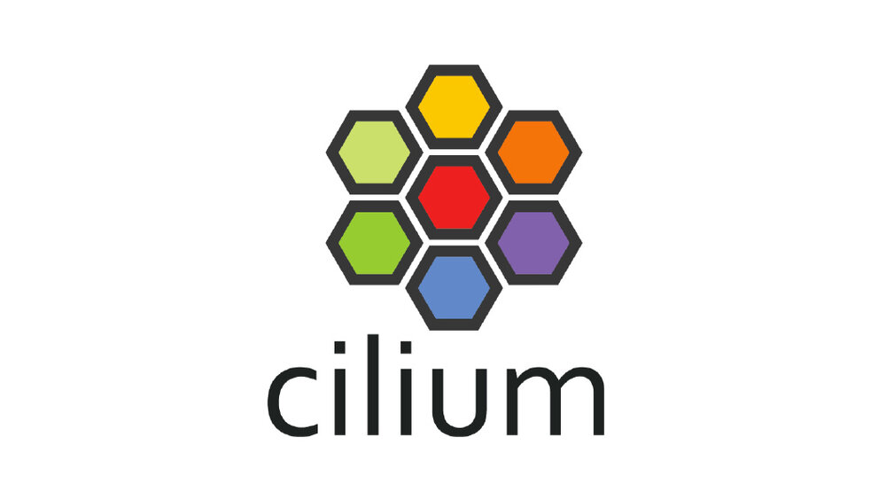
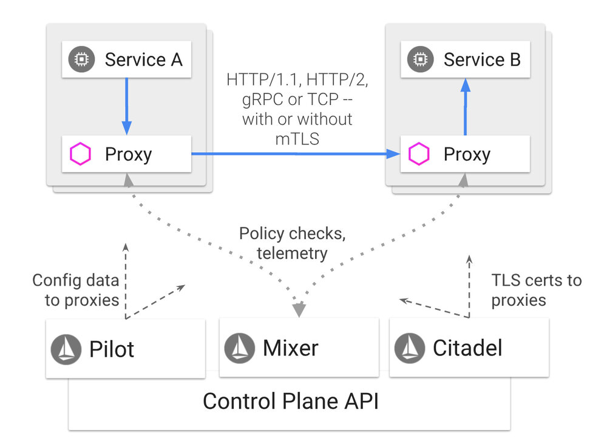
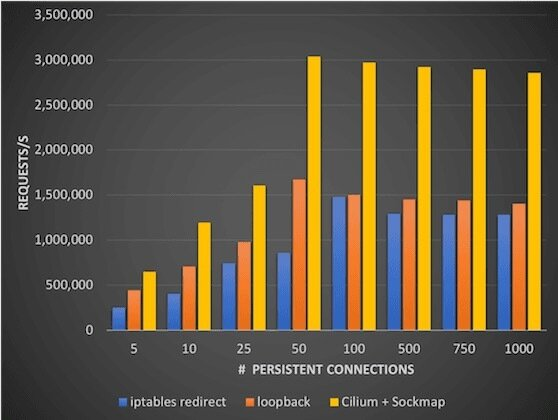
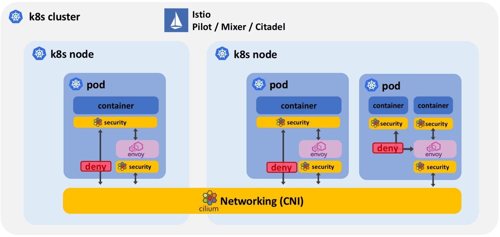
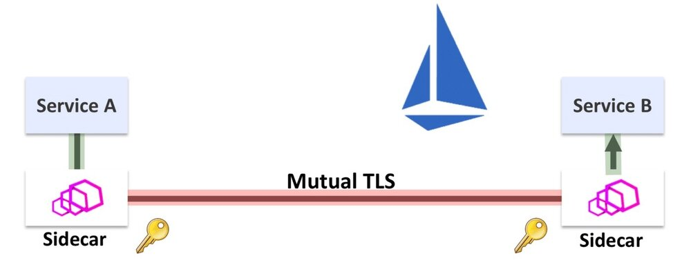
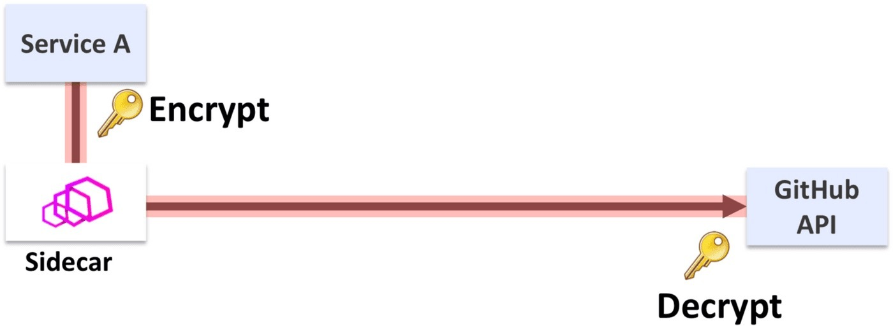
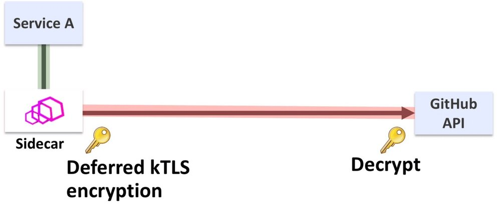
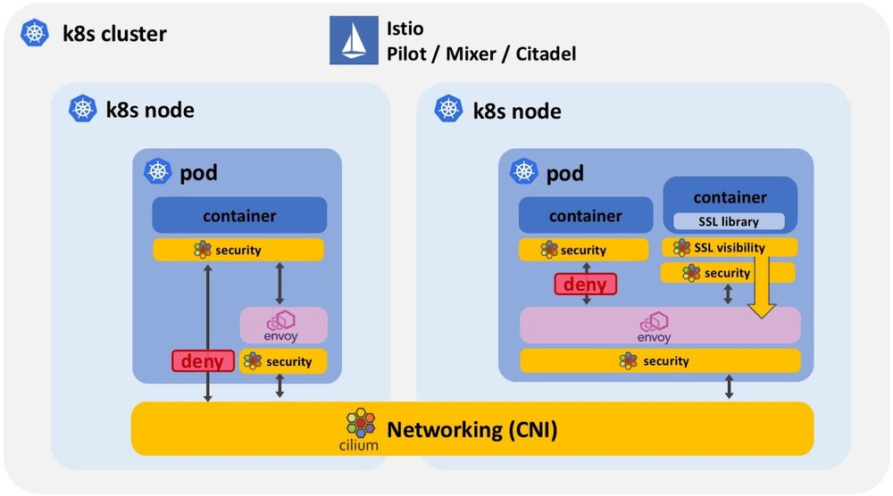

本文为翻译文章，[点击查看原文](https://cilium.io/blog/2018/08/07/istio-10-cilium/)。

8 月 1 日 Istio 1.0 发布，Cilium 社区感谢所有 Istio 贡献者为此付出的巨大努力。我们很幸运能够参与社区活动，为 Istio 做出贡献，并帮助一些用户通过 Istio 和 Cilium 进行生产部署。如果您有兴趣在深入了解技术细节之前了解 Istio + Cilium 的用户故事，请考虑阅读 HP FitStation 团队（最大的 Cilium + Istio 用户之一）发布的以下 Istio 博客：[Istio 是惠普 FitStation 平台的游戏规则的改变者](https://istio.io/blog/2018/hp/)。

本博客将介绍 BPF 和 Cilium 如何增强 Istio 的一些细节：
- 增强安全
    - 使用 socket 感知 BPF 程序为多容器 pod 提供最小权限
    - 防止受损的 sidecar 代理和绕过 sidecar 协议
    - 使用 BPF 强制所有应用程序流量经过 sidecar 代理
- 开启 Istio 对外部服务的支持
    - 使用 socket 感知 BPF 程序和 kTLS 提供 TLS 链接加密的可视化和控制管理
- 性能
    - 高效网络和 socket 重定向加速 istio 性能

## Cilium 是什么？

Cilium 是一个开源软件，用于透明保护在使用 Kubernetes、Docker 和 Mesos 等 Linux 容器管理平台部署的应用程序服务之间的网络和 API 连接。

Cilium 的基础是一种名为 BPF 的新 Linux 内核技术，这使得能够在 Linux 自身内动态植入强大的安全性，可见性和网络控制逻辑。除了提供传统的网络级安全性之外，BPF 的灵活性还可以在 API 和进程级别上实现安全性，以保护容器或容器内的通信。由于 BPF 在 Linux 内核中运行，因此无需对应用程序代码或容器配置进行任何更改便可以应用和更新 Cilium 安全策略。

有关 Cilium 的更详细的介绍，请参阅[Cilium 简介](http://docs.cilium.io/en/v1.1/intro/)部分。

## Istio 是什么？

Istio 提供了一种通过负载均衡、服务间身份验证、监控等且没有侵入性创建部署服务网络的简便方法。可以通过在整个环境中部署特殊的 sidecar 代理来添加对服务的支持，该代理拦截微服务之间的所有网络通信，使用 Istio 的控制平面功能进行配置和管理。

您可以在[Istio 文档](https://istio.io/zh/docs)中阅读有关 Istio 概念和架构的更多信息。

## Istio 高效网络
Istio 和 Cilium 之间最基本的协作形式是 Cilium CNI 插件通过将所有 sidecar 代理连接在一起并通过提供代理和 Istio 控制平面之间的连接，为 Istio 提供网络连接。Cilium 还确保 Istio 托管服务可以与不受 Istio 管理的 pod 进行通信。

下图说明了 Istio 控制平面、sidecar 代理和 CNI 插件如何相互叠加：

在这种模式下，所有 Istio 系统组件都受益于 Cilium 在 Linux 内核中基于 BPF 的高效网络功能。BPF 是网络和数据包过滤技术（如 iptables 等）的替代方案。您可以在以下博客文章中找到有关 BPF 推动这一转变的原因的更多信息：[为什么内核社区用 BPF 替换 iptables？](https://cilium.io/blog/2018/04/17/why-is-the-kernel-community-replacing-iptables/)

## Socket 级别重定向加速 Istio 和 Envoy

Istio 服务网格架构要求将参与服务网格的所有 pod 的出站和入站请求的所有网络流量都要重定向到 sidecar 代理。Sidecar 代理将终止所有 TCP 连接并执行诸如遥测、重试、路由、双向 TLS 之类的服务和代表服务的授权，并使用辅助所谓的上游 TCP 连接来到达目的地服务，这正是服务之间支持双向 TLS，没有代码侵入性原因所在。然而，当使用标准的基于 IP 的工具（如 iptables）实现重定向时，这种重定向可能会很费事，因为必须多次遍历整个 TCP/IP 堆栈。

Cilium 充分使用了一个叫 sockmap 的令人兴奋的 BPF 功能。它允许过滤和重定向，基于套接字级别，使 Cilium 可以 socket 感知。此 socket 是应用程序用于发送和接收网络流量的接口。这允许在相同节点上实质上短路 TCP socket，从而以完全透明的方式大幅加速应用程序和服务网格的 sidecar 代理的通信速度。应用程序和 sidecar 代理都不需要以任何方式进行修改。如果您有兴趣了解有关此用例的更多信息，请参阅位于奥斯汀的 KubeCon 2018 上的演示文稿——**使用 CIlium 加速 Envoy、Istio 和 Linux 内核（[录像](https://t.co/cx6CQhn1xl)、[幻灯片](https://www.slideshare.net/ThomasGraf5/accelerating-envoy-and-istio-with-cilium-and-the-linux-kernel)）**。

## 用 Cilium 增强 Istio 安全性

Cilium 与 Istio 整合，以增强 Istio 的安全性。我们来看看 Istio 提供的安全属性：
- 双向 TLS：如果发送者由 Istio 控制，则能够验证发件人的身份。这可以保护服务免受来自非法源服务欺骗 IP 地址的攻击请求。它还可以在 Istio 管理的所有服务之间启用基于 TLS/SSL 的加密。
- 授权：能够授权请求，包括过滤元数据（如 HTTP 协议字段，IP 寻址和身份信息）以及调用其他授权插件（例如，执行令牌验证）。

## LEVEL 1: 保护不受支持的协议和受损的 sidecar（Cilium 1.0）

所需的第一个基本保护级别是将安全策略应用于 Istio 不支持的所有网络协议，包括 UDP、ICMP 和所有 IPv6 流量。任何此类流量都会绕过 sidecar 代理，从而通过 Istio 强制执行任何最终安全策略。无论协议如何，Cilium 将 pod 之外所有网络流量应用 L3/L4 安全策略。如果遇到不支持的协议，则将丢弃该数据包。

**安全化非IPv4/TCP协议**

Cilium 在 pod 之外提供安全策略，对于协议不受支持、重定向或由于某些其他原因而失败，将完全阻止或应用细粒度的安全规则到任何绕过代理的流量。

**防止受损的 sidecar**

sidecar 代理本身不受 Istio 安全规则的约束。受损的 sidecar 可以不受限制地访问网络。它还可以操纵自己的安全规则以变得更加宽松。除了 Istio 之外，Cilium 还允许定义服务级别安全策略，并确保受损的 sidecar 代理只能以最小权限运行。

## LEVEL2: 安全的多容器 Pod（正在开发中）

Level 1 安全级别以 pod、service 为级别保护服务网格。它不提供容器内部的任何安全性，例如用于应用容器和 sidecar 容器之间的通信。

Level 2 安全级别通过使用 socket 感知 BPF 程序在 socket 级别提供分段，在同一个 pod 中引入容器和进程之间的分段。

- 强制所有应用流量流经 sidecar: 通过使用 socket 感知 BPF 策略，Cilium 可以确保应用程序的所有通信都必须通过 sidecar 进行入站和出站连接。保证应用程序容器本身不能从 pod 外部接收连接，或者在不通过 sidecar 代理的情况下向 pod 外部发出请求。

- Pod 中的最小安全权限：通过使用 socket 感知 BPF 程序锁定容器内部和进程级别的通信，其中一个容器中的安全漏洞不再导致整个容器被泄露。这尤其重要，因为 sidecar 容器可以直接访问 pod 中的任何其他容器，并且可以访问潜在的敏感信息。

## 有趣的事实

支持 socket 的 BPF 程序不仅限于基于 IP 的 socket。安全策略也可以扩展到涵盖 UNIX 域 socket。

## 外部服务的 TLS 可见性（正在开发中）

Istio 依赖于对应用程序协议层（如 HTTP）的可见性，以提供诸如基于 URI 的路由，基于 HTTP 头的授权和 API 请求级别遥测和跟踪等功能。通过将双向 TLS 与 Istio Citadel 管理的证书相互应用，可以在未加密的服务之间保持应用程序流量并在源服务器和目标服务的 sidecar 代理之间执行 TLS 加密来实现此可见性。

这适用于网格内部服务之间的连接。与网格之外的服务的通信几乎由应用程序本身进行 TLS 加密保证，以便在不可信的因特网上保护通信。

Linux 的 kTLS（内核 TLS）工作原理最初是由 Facebook 的 Dave Watson 提出。它包括将数据的对称加密从应用程序中的 SSL 库迁移到 Linux 内核中的 socket 功能。这项工作的最初动机是纯粹的性能优化，因为使用 kTLS 比 SSL 库快 3-4％。这对于经过 SSL 静态数据的提供者有足够的兴趣去继续。这项工作已经合并，并且可以在最新的 Linux 内核中使用。结合在 Linux socket 层注入的 BPF 程序的功能，kTLS 实现了数据的透明可见性，否则此时已加密。

我们仍在研究这个功能，但有一个初始的功能原型，证明了获得可见性和控制数据的概念，这些数据通常是在应用程序本身中进行 TLS 加密的。下一步是将此数据提供给 sidecar，以便在与外部服务的连接上释放 Istio。

## 在没侵入应用程序的情况下 kTLS 是如何实现透明化的？

公平地说，应用程序使用的 SSL 库必须感知 kTLS，并且用户必须选择系统级别的行为。在应用程序运行时升级 SSL 版本和启动可视化一样简单，没有侵入应用程序。由于可见性是在 socket 级别获得的，这也意味着应用程序在排队后无法再更改此数据。如果数据用于授权请求，则这一点至关重要。

## 概要

- 增强 Istio 安全
    - pod 中最小权限：通过使用 socket 感知 BPF 程序锁定容器内部和进程级别的通信，其中一个容器中的安全漏洞不再导致整个容器被泄露。
    - 安全化非IPv4/TCP协议：目前，Istio仅支持TCP和IPv4。任何其他协议（如UDP或IPv6）都将绕过sidecar代理和任何Istio安全规则，Cilium将通过完全阻止这些协议或应用细粒度的安全规则来介入。
    - 防止受损的 sidecar：sidecar 代理本身不受 Istio 安全规则的约束。受损的 sidecar 可以不受限制地访问网络。它还可以操纵自己的安全规则以变得更加宽松。除了 Istio 之外，Cilium 还允许定义服务级别安全策略，并确保受损的边车代理只能以最小的权限运行。
    - 前置应用流量经过 sidecar：通过使用 socket 感知 BPF 策略，Cilium 可以确保应用程序的所有通信都必须通过 sidecar 进行入站和出站连接。保证应用程序容器本身不能从 pod 外部接收连接，或者在不通过 sidecar 代理的情况下向 pod 外部发出请求。
- 外部服务
    - 使用 SSL 为 Istio 加密链接：与群集外部服务的 TCP 连接通常是 TLS 加密的，并且 Istio 无法检查此类连接的 HTTP 头。通过利用 kTLS 集成到内核中的 BPF，Cilium 将能够提供对 TLS 加密数据的可见性和控制管理。
- 性能
    - 高效网络：Istio 需要一个 CNI 插件来提供 pod 之间的网络连接。Cilium 实现了 CNI 插件接口，并利用 BPF 在 sidecar 代理和 Istio 控制平面之间提供高效的数据路径。
    - socket 重定向加速 Istio：通过使用 socket 感知 BPF 程序在 Linux socket 级别执行流量重定向，Cilium 可以加速流量重定向到 sidecar 代理。这允许绕过很费事的 TCP/IP 堆栈遍历而且对应用程序或 sidecar 代码没有侵入性。

## 如果您有兴趣了解更多信息：

- [试用入门指南](http://docs.cilium.io/en/stable/gettingstarted/)
- [了解有关 Cilium 概念的更多信息](http://docs.cilium.io/en/stable/concepts/) 
- [加入我们的 Slack Channel](https://cilium.io/slack)
