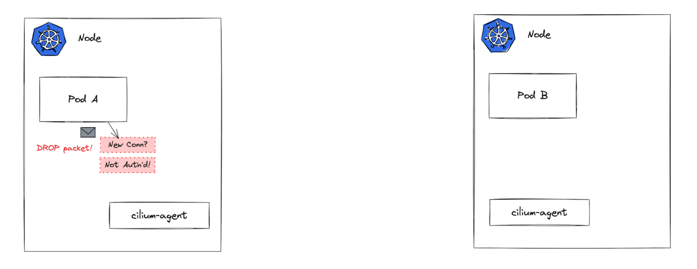
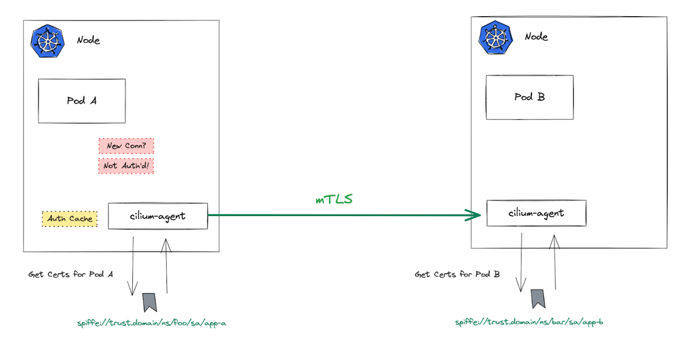
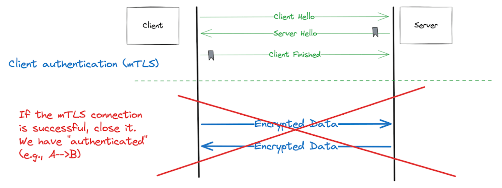
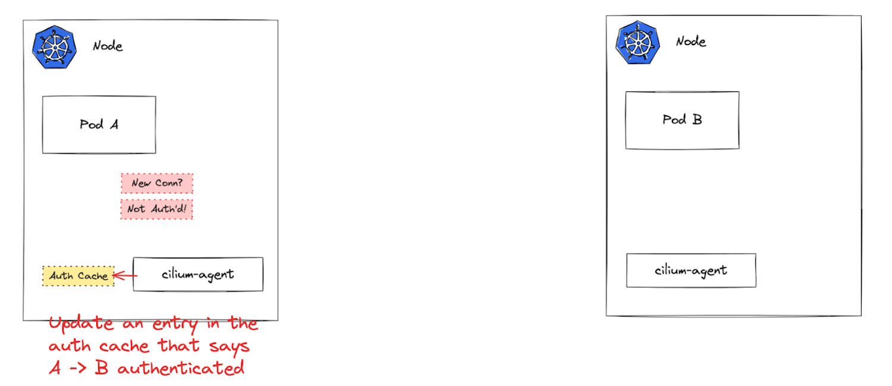
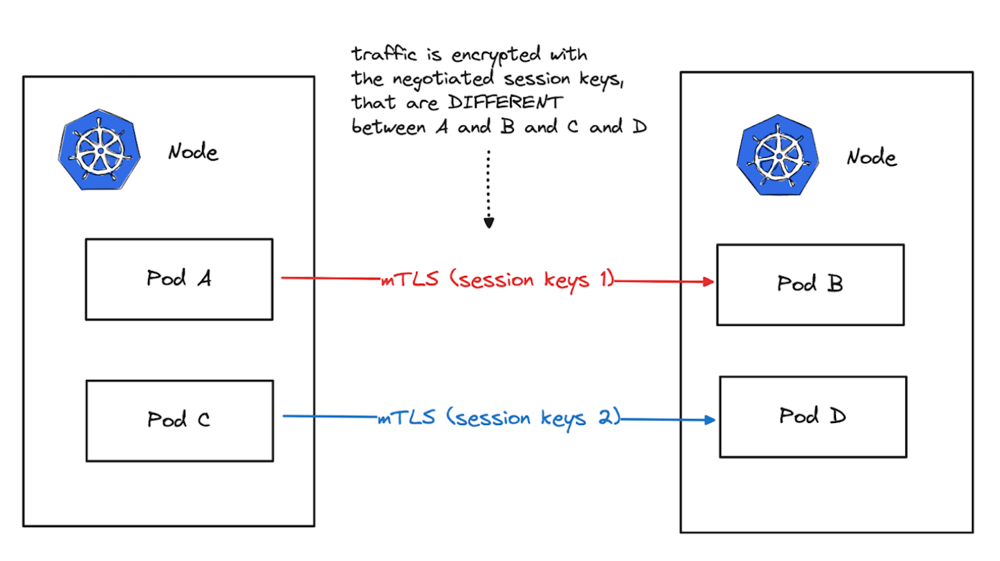
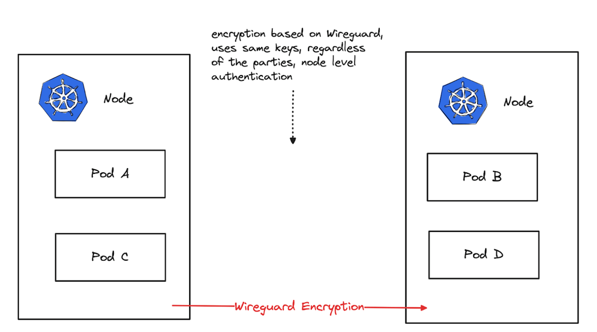
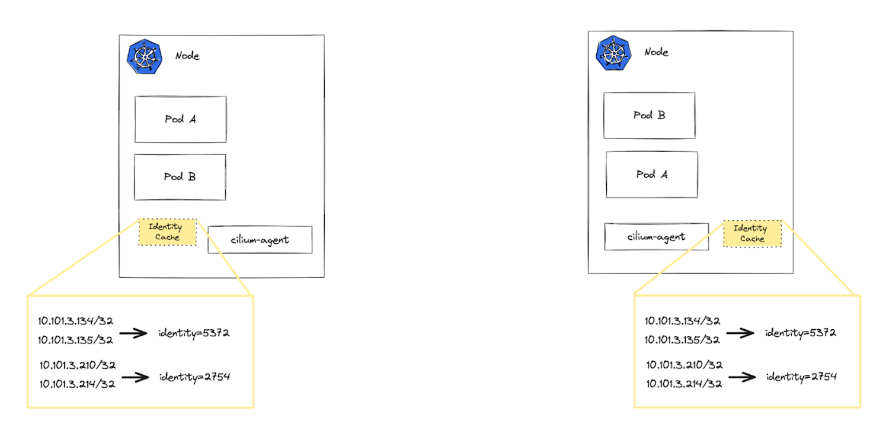
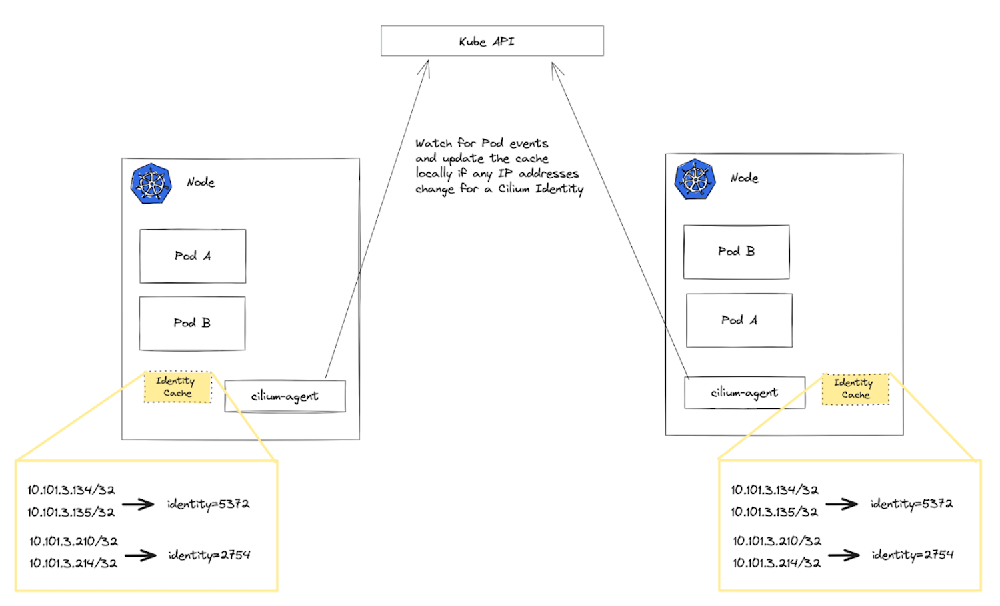
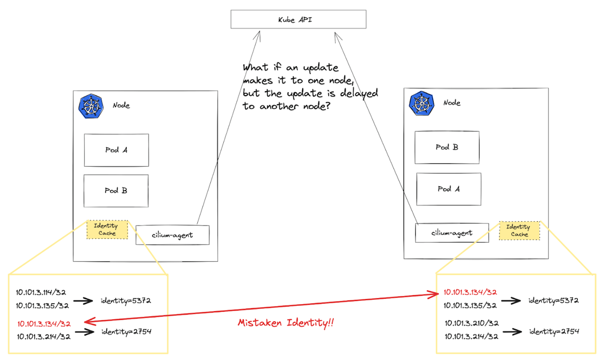

本文译自：<https://thenewstack.io/how-ciliums-mutual-authentication-can-compromise-security/>

摘要：这篇文章是关于如何使用 Cilium 来实现 互相认证 (mTLS) 的，以及这种方法可能带来的安全问题。文章介绍了 Cilium 的特点和功能，以及如何使用 Cilium CLI 或 Hubble UI 来创建和管理证书和策略。文章还分析了 Cilium 的互相认证的局限和风险，例如证书过期，撤销，泄露和伪造等。文章的目的是帮助用户了解和使用 Cilium 来提高服务间的安全性。

---

最近，Cilium 项目宣布支持一种[新的双向认证机制](https://docs.cilium.io/en/latest/network/servicemesh/mutual-authentication/mutual-authentication/)，可以通过简单的配置标志透明地部署到应用程序中。从表面上看，这似乎是一种简单的方法，可以使用 Cilium 为 Kubernetes 工作负载实现服务之间的双向认证。然而，这种设计存在一个严重的缺陷，不容忽视：

Cilium 中的双向认证的整个基础是*最终一致性*。

在安全实现的数据路径中，最终一致性可能导致意图中的安全属性失败，并且可能导致在不应该允许的情况下服务之间的流量继续传递。

## Cilium 双向认证的工作原理

Cilium 的自定义双向认证机制会透明地对服务之间的流进行身份验证，并构建在 Cilium 的现有扩展伯克利数据包过滤器（[eBPF](https://thenewstack.io/ebpf-offers-a-new-way-to-secure-cloud-native-systems/)）数据平面之上。Cilium 使用 eBPF 来实现诸如服务网络、网络策略和连接处理等功能。

Cilium 使用“无双向传输层安全（mTLS-less）”（或 mTLess）来对服务进行身份验证。我称之为“less”，因为它没有使用 mTLS 来完成 mTLS 设计的任务：验证、加密和检查在两个对等方之间传输的数据的完整性。Cilium 的双向认证实现*不是 mTLS*，我将在下面解释。

当服务（或 Pod）A 想要与服务（或 Pod）B 通信时，Cilium 会尝试对这两个对等方进行身份验证，然后标记一个特殊的本地节点“身份验证缓存”，指示是否允许特定流。

当 Pod A 想要与 Pod B 通信时，它会通过正常的 Cilium eBPF 数据平面流动，但 eBPF 代码会检查该连接是否已通过检查本地节点身份验证缓存进行身份验证。在第一次尝试时，该调用将不会得到身份验证，因此[Cilium 将丢弃数据包](https://github.com/cilium/cilium/issues/23808)。但这将触发一个在幕后进行的机制，尝试对 Pod A 和 Pod B 之间的流进行身份验证。如果成功，它将更新本地节点身份验证缓存。

期望的是，在幕后的机制能够快速进行 Pod A 呼叫 Pod B 的身份验证，以便最初丢弃的数据包将被重试，不会导致太多延迟。在幕后使用的机制是从运行在 Pod B 所在节点上的 cilium-agent（使用[Go](https://roadmap.sh/golang)编写）到另一个 cilium-agent 的“mTLess”连接。所有这些都不会在 eBPF 数据平面中发生，而是在用户空间的 Cilium 代理中进行。

我将这个连接称为“mTLess”，因为它用于测试身份验证并立即关闭，并且所有用于加密和完整性的协商的会话密钥都会被丢弃。也就是说，Cilium 不会在连接的整个生命周期内保留 mTLS 安全属性；它只使用握手的身份验证部分。

如果此 mTLess 连接成功（即握手成功），Cilium 将考虑将来自 Pod A 到 Pod B 的流程视为“已验证”。此时，本地节点身份验证缓存中的条目将被更新，以指示应允许来自 Pod A 到 Pod B 的流程。

现在，当它重试连接数据包时，身份验证缓存将指示流程已经通过身份验证，应允许连接并继续 eBPF 数据平面的其余部分（该部分强制执行网络和其他策略）。这个本地节点身份验证缓存确实表现出最终一致性的迹象，可能会失去同步，但这并不是最令人担忧的最终一致性属性。

## Cilium 方法的主要问题

对于真正的 mTLS 连接，在成功握手之后，您希望使用在参与各方之间协商的密钥来加密剩余的数据。Cilium 中流的成功认证并不意味着它是加密的（它将是纯文本），也不保证流量以一种仅对相关方可见的方式进行加密。如果您需要加密，可以使用基于 WireGuard（或 IPSec）的 Cilium 加密选项，但这只是两个 Kubernetes 节点之间的加密，而不是特定的已认证的工作负载。在“mTLess”连接检查和将实际（敏感）数据放入线路之间，可能会发生很多事情。

随着一些 Cilium 开发人员继续迭代这个实现，有关将 mTLS 连接中协商的某些密钥转移到底层节点到节点加密方法（例如 IPSec）的谈论。这个实现还有待观察。

Cilium 最终一致性双向认证实现的真正问题出现在 Cilium 的核心身份模型周围。我在上面简要介绍了 TLS 握手，但如果您阅读 Cilium 文档，您会看到用于“mTLess”的 X509 证书具有可选基于[SPIFFE](https://thenewstack.io/the-rise-of-workload-identity-in-cloud-native-with-spiffe-spire/)（Secure Production Identity Framework For Everyone）的身份模型。实际上，在部署实现 Cilium 双向认证所需的组件时，您可以选择部署 SPIFFE Runtime Environment（SPIRE），这是 SPIFFE 的一个实现，Cilium 使用它来生成代表工作负载及其身份的证书。

这个 SPIFFE 身份用于握手所使用的证书，*但 SPIFFE 不是 Cilium 中使用的基础通用工作负载身份*。SPIFFE 用作独立的身份层，映射到 Cilium 现有身份实现。Cilium 在其[核心身份](https://doc.crds.dev/github.com/cilium/cilium/cilium.io/CiliumIdentity/v2@1.9.3)概念周围构建了所有的网络策略。CiliumIdentity 实现将一个整数映射到一组 IP 地址（与一组 Pod 关联的 Pod IP）。这个“整数”及其映射到 Pod IP 地址的方式代表了*Cilium 中的核心身份原语*。

我们在博客文章“[网络基于缓存的身份可能会被误解吗？](https://www.solo.io/blog/could-network-cache-based-identity-be-mistaken/)”中详细讨论了这个问题。由于这个问题，我们建议在考虑使用依赖身份到 IP 地址映射的容器网络接口（CNI）和[服务网格](https://thenewstack.io/secure-your-service-mesh-a-13-item-checklist/)进行网络安全时采取深度防御姿态。

问题的关键在于：

为集群中的每个身份的所有 IP 映射*都存在于集群中每个节点上的本地缓存中*。

为了使 Cilium 的双向认证和策略执行正常工作，必须使用正确的 IP 到身份映射更新这些缓存。然而，在集群中的所有节点上更新单独的缓存*是一种最终一致性操作*。当 Cilium 的 eBPF 数据平面尝试推理连接策略时，它将参考其节点本地缓存中的 IP 到身份映射。*如果该缓存过期或延迟*，将导致不正确的网络策略（可能不符合要求，允许恶意活动，威胁数据等）。无论您是否使用 WireGuard 或 IPSec 来加密节点之间的流量，这都不会影响此身份混淆场景。

这个演示说明了在使用 Cilium 的双向认证时可能导致违反网络策略的身份混淆：

## 总结

因此，总结一下：

- Cilium 项目引入了一种新颖的 Kubernetes 工作负载的双向认证机制。
- Cilium 中的双向认证建立在最终一致性之上，可能会危及安全性。
- Cilium 使用“mTLess”进行身份验证，但不会维护整个连接的加密。
- Cilium 的身份模型包括 SPIFFE，但其核心身份是一个基于整数的单独身份层。
- 核心问题在于，IP 到身份的映射存储在每个节点上的本地缓存中，这可能导致最终一致性的更新。
- 在 Cilium 的双向认证中的最终一致性可能导致不正确的网络策略和安全漏洞。

要正确使用依赖身份到 IP 地址映射的 CNI，请考虑采用深度防御姿态，将一个服务网格（如 Istio Ambient）叠加在其上。Istio Ambient 实现了一种无 sidecar 的服务网格，在服务之间的数据路径上使用 mTLS（无论其 IP 地址如何）。在[像 Istio 这样的服务网格](https://thenewstack.io/solo-io-istio-is-winning-the-service-mesh-war/)中，身份模型是由 SPIFFE 定义的，并根据负责签署用于身份验证流量的证书的证书颁发机构建立的。
