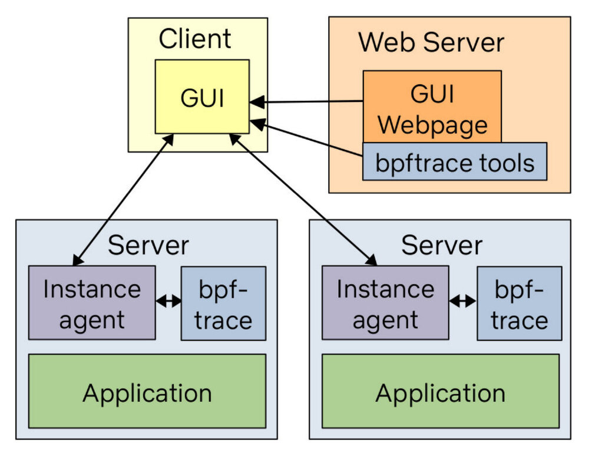

## 编者按

本文译自 [How To Add eBPF Observability To Your Product](https://www.brendangregg.com/blog/2021-07-03/how-to-add-bpf-observability.html)，原文发布于 2021 年 7月 3 日。本文作者 Brendan Gregg 是 eBPF 领域的专家，出版过多本相关书籍，本文是他给想要在产品中引入 eBPF 增加可观察性人员的忠告。

## 正文

现在有一场军备竞赛，即增加 [eBPF](https://www.brendangregg.com/blog/2021-07-03/BPF) 的军备竞赛，在这篇文章中，我将介绍如何快速做到这一点。这也适用于人们将其添加到自己的内部监测系统中。

人们喜欢在他们建立了原型或构建了产品之后向我展示他们的 BPF 可观察性产品，但我常常在他们开始之前给出建议。作为 BPF 可观察性的领导者，这是我在最近的谈话中一直包含的建议，现在我把它纳入这篇文章中。

首先，我知道你很忙。你甚至可能不喜欢 BPF。为了务实起见，我将描述如何花最少的精力来获得最大的价值。把这看成是 “第一版”。一个相当有用的出发点。无论你是否遵循这个建议，至少请你理解它，以避免以后的遗憾和痛苦。

如果你正在使用开源监控平台，首先检查它是否已经有一个 BPF 代理。这篇文章假设它没有，而且你将首次添加一些东西。

## 1. 运行第一个工具

首先安装 [bcc](https://github.com/iovisor/bcc) 或 [bpftrace](https://github.com/iovisor/bpftrace) 工具。例如，Ubuntu 上的 bcc。

```sh
# apt-get install bpfcc-tools
```

然后尝试运行一个工具。例如，使用 execsnoop (8) 查看带有时间戳的进程执行情况。

```sh
# execsnoop-bpfcc -T
TIME     PCOMM            PID    PPID   RET ARGS
19:36:15 service          828567 6009     0 /usr/sbin/service --status-all
19:36:15 basename         828568 828567   0 
19:36:15 basename         828569 828567   0 /usr/bin/basename /usr/sbin/service
19:36:15 env              828570 828567   0 /usr/bin/env -i LANG=en_AU.UTF-8 LANGUAGE=en_AU:en LC_CTYPE= LC_NUMERIC= LC_TIME= LC_COLLATE= LC_MONETARY= LC_MESSAGES= LC_PAPER= LC_NAME= LC_ADDRESS= LC_TELEPHONE= LC_MEASUREMENT= LC_IDENTIFICATION= LC_ALL= PATH=/opt/local/bin:/opt/local/sbin:/usr/local/git/bin:/home/bgregg/.local/bin:/home/bgregg/bin:/opt/local/bin:/opt/local/sbin:/ TERM=xterm-256color /etc/init.d/acpid 
19:36:15 acpid            828570 828567   0 /etc/init.d/acpid status
19:36:15 run-parts        828571 828570   0 /usr/bin/run-parts --lsbsysinit --list /lib/lsb/init-functions.d
19:36:15 systemctl        828572 828570   0 /usr/bin/systemctl -p LoadState --value show acpid.service
19:36:15 readlink         828573 828570   0 /usr/bin/readlink -f /etc/init.d/acpid
[...]
```

虽然很基本，但我仅用这个工具就解决了很多 perf 问题，包括针对配置错误的系统，其中一个 shell 脚本正在循环启动失败的进程，以及当一些小程序崩溃并每隔几分钟就重启但还没有被注意到时。

## 2. 为你的产品添加一个工具

现在想象一下将 execsnoop (8) 添加到你的产品中。你可能已经在你所有的客户系统上运行了代理。他们是否有办法运行一个命令并返回文本输出？或者运行一个命令并将输出发送到其他地方进行聚合（S3、Hive、Druid 等）？有很多选择，这实际上是你自己基于现有系统和客户环境的偏好。

当你把第一个工具添加到你的产品中时，让它在短时间内运行，比如 10 到 60 秒。我刚刚注意到 execsnoop (8) 还没有持续时间选项，所以在这期间你可以用 `watch -s2 60 execsnoop-bpfcc` 来包装它。 如果你想 24 小时运行这些工具，首先要研究开销以了解成本。低频率的事件，如进程的执行，捕捉起来应该是可以忽略不计的。

不使用 bcc，你也可以使用 [bpftrace](https://github.com/iovisor/bpftrace) 版本。这些通常没有封装选项（-v、-l 等），但有一个 json 输出模式。例如：

```sh
# bpftrace -f json execsnoop.bt 
{"type": "attached_probes", "data": {"probes": 2}}
{"type": "printf", "data": "TIME(ms)   PID   ARGS\n"}
{"type": "printf", "data": "2737       849176 "}
{"type": "join", "data": "ls -F"}
{"type": "printf", "data": "5641       849178 "}
{"type": "join", "data": "date"}
```

添加这种模式是为了使 BPF 的可观测性产品可以建立在 bpftrace 之上。

## 3. 不要担心依赖性问题

我建议你在客户系统上安装 bcc 或 bpftrace，它们目前有 llvm 依赖。这可能会增加到几十 MB，这对一些资源有限的环境（嵌入式）是个问题。我们一直在做大量的工作，以便在未来解决这个问题。 [BTF and CO-RE](https://www.brendangregg.com/blog/2020-11-04/bpf-co-re-btf-libbpf.html)（而不是 Python），最终将意味着你可以安装 100KB 的无依赖性的工具二进制版本。bpftrace 也有一个类似的计划，使用较新的内核特性生成一个小的无依赖性的二进制版本。

这确实需要至少 Linux 5.8 才能很好地工作，而你的客户可能几年都不会运行这个系统。在这期间，我建议暂时不要担心 llvm 的依赖关系，因为它以后会被修复。

请注意，并不是所有的 Linux 发行版都启用了 `CONFIG_DEBUG_INFO_BTF=y`，这对于 BTF 和 CO-RE 的未来是必要的。主要的发行版已经设置了它，比如在 Ubuntu 20.10、Fedora 30 和 RHEL 8.2。但如果你知道你的一些客户正在运行一些不常见的东西，请检查并鼓励他们或发行商设置 `CONFIG_DEBUG_INFO_BTF=y` 和 `CONFIG_DEBUG_INFO_BTF_MODULES=y`，以避免未来的痛苦。

## 4. 第 1 版仪表板

现在你的产品中有了一个 BPF 可观察性工具，是时候增加更多的工具了。下面是你可以运行的十大工具，并作为一个通用的 BPF 可观察性仪表盘来展示，同时还有建议的可视化。

| 编号 | 工具       | 展示                    | 可视化           |
| ---- | ---------- | ----------------------- | ---------------- |
| 1.   | execsnoop  | 新进程（通过 exec (2)） | 表格             |
| 2.   | opensnoop  | 打开的文件              | 表格             |
| 3.   | ext4slower | 慢速文件系统 I/O        | 表格             |
| 4.   | biolatency | 磁盘 I/O 延迟柱状图     | 热力图           |
| 5.   | biosnoop   | 每个事件的磁盘 I/O 细节 | 表格，偏移热图   |
| 6.   | cachestat  | 文件系统高速缓存统计    | 线状图           |
| 7.   | tcplife    | TCP 连接                | 表格，分布式图表 |
| 8.   | tcpretrans | TCP 重传                | 表格             |
| 9.   | runqlat    | CPU 调度器的延迟        | 热力图           |
| 10.  | profile    | CPU 堆栈跟踪样本        | 火焰图           |

这是在我的 [bcc Tutorial](https://github.com/iovisor/bcc/blob/master/docs/tutorial.md) 的，而且很多也存在于 bpftrace 中。我选择这些是为了用最少的工具找到最大的性能优势。

请注意，runqlat 和 profile 会有明显的开销，所以我只运行这些工具 10 到 60 秒，然后生成一份报告。有些工具的开销很低，如果需要的话可以 24 小时运行（例如 execsnoop、biolatency、tcplife、tcpretrans）。

在 bcc 和 bpftrace 资源库中，已经有以手册和实例文件形式存在的文档，你可以链接到这些文档，以帮助你的客户了解工具的输出。例如，在 [bcc](https://github.com/iovisor/bcc/blob/master/tools/execsnoop_example.txt) 和 [bpftrace](https://github.com/iovisor/bpftrace/blob/master/tools/execsnoop_example.txt) 有 execsnoop (8) 的示例文件。

完成这些后，你就有了第一版的仪表板。

## bcc 与 bpftrace

bcc 工具是最容易使用的，因为它们通常有很多命令行选项。bpftrace 工具更容易编辑和定制，而且 bpftrace 有一个 json 输出模式。

如果你是追踪的新手，就用 bcc 吧。如果你想做一些黑客和定制的工具，就用 bpftrace。最后，它们都是不错的选择。

## 案例研究：Netflix

Netflix 正在建立一个新的 GUI，在这些工具的 bpftrace 版本的基础上，做这个工具仪表盘和更多的工作。架构如图。

 

虽然 bpftrace 二进制文件安装在所有目标系统上，但 bpftrace 工具（文本文件）却在网络服务器上，并在需要时被推送出去。这意味着我们可以通过在一个地方更新工具来确保我们一直在运行最新版本的工具。

这是目前我们 FlameCommander 用户界面的一部分，它也在云端运行火焰图。我们以前的 BPF GUI 是 [Vector](https://github.com/Netflix/vector) 的一部分，并使用了 bcc，但我们后来废弃了它。我们可能会在某个时候开源新的 GUI，并在 Netflix 技术博客上发表相关文章。

## 案例研究：Facebook

Facebook 是 BPF 的高级用户，但他们如何在整个集群中运行工具的深层细节并没有完全公开。根据 bcc 的活动，以及他们对 BTF 和 CO-RE 技术的开发，我十分怀疑他们的解决方案是基于 bcc 的 libbpf-tool 版本。

## 移植的陷阱

BPF 追踪工具就像应用程序和内核的补丁。它们需要不断的更新以保持在不同的软件版本中工作。把它们移植到不同的语言，然后不维护它们，可能就像试图把 Linux 4.15 的补丁应用于 Linux 5.12。如果你运气好，它就会工作！如果你不走运，补丁就会应用，但会以一种微妙的方式破坏一些东西，直到后来你才注意到。这取决于工具。

作为一个极端的例子，我在 2014 年休假时写了 cachestat (8)，用于 Netflix cloud，当时是 Linux 3.2 和 3.13 的混合版本。BPF 在这些版本上并不存在，所以我使用了 Linux 3.2 上的基本 Ftrace 功能。我把这种方法描述为 [brittle](https://www.brendangregg.com/blog/2014-12-31/linux-page-cache-hit-ratio.html)， [sandcastle](https://github.com/brendangregg/perf-tools/blob/master/fs/cachestat) 需要随着内核的变化而进行维护。后来，它被移植到了带有 kprobes 的 BPF 上，现在已经被重写并包含在商业可观察性产品中。我听说它在较新的内核上有问题，打印的输出没有意义。它真的需要一次大修。当我（或某人）做了这个工作，任何从 bcc 上拉取更新的人都会自动得到固定的版本，不需要费力。那些重写的人将需要重写自己的版本。我担心他们不会这样做，而客户将在多年来一直运行一个错误的 cachestat (8) 版本。

请注意，如果在我写 cachestat (8) 的时候，BPF 在我的目标环境中是可用的，我的编码方式就会完全不同。人们正在移植为 Linux 3.2 编写的东西，并在 Linux 5.x 上运行它。

在以前的一篇博文 [An Unbelievable Demo](https://www.brendangregg.com/blog/2021-06-04/an-unbelievable-demo.html) 中，谈到了很多年前发生的类似情况，即在没有更新的情况下使用旧的追踪工具版本。

我所描述的问题是针对 BPF 软件和内核追踪的。作为一个不同的例子，我的火焰图软件已经被重写了十几次，由于它是一个简单而完备的算法，我不认为这有什么大问题。我更喜欢人们帮助更新 [d3 version](https://github.com/spiermar/d3-flame-graph) 但如果人们自己做，那也没什么大不了的。你可以给它编码，它将永远工作。基于 uprobe 和 kprobe 的 BPF 工具就不是这样了，因为它们确实需要维护。

## 像系统管理员一样思考，而不是像程序员一样思考

总之，首先检查你的监控系统是否已经有一个 BPF 代理，如果没有，就在现有的基础上构建一个 [bcc](https://github.com/iovisor/bcc) 或 [bpftrace](https://github.com/iovisor/bpftrace) 工具，而不是从头开始重写一切。这是像一个安装和维护软件的系统管理员那样思考，而不是像一个编码所有东西的程序员那样思考。安装 bcc 或 bpftrace 工具，把它们添加到你的可观察性产品中，并根据需要拉取包的更新。这将是一个快速而有用的版本。BPF 启动和运行了！

我看到人们反而像程序员一样思考，觉得他们必须从深入学习 bcc 和 BPF 编程。然后，在发现所有的东西都是 C 语言或 Python 写的之后，有些人就用不同的语言重写了。

首先，学好 bcc 和 BPF 需要几周时间；学习系统跟踪的微妙之处和陷阱可能需要几个月或几年。为了让你了解你所面临的情况，请看我的 [BPF Internals](https://www.brendangregg.com/blog/2021-06-15/bpf-internals.html) 讲座。如果你真的想做这个，并且有时间，你当然可以（你可能会在 Tracing 会议上遇到我。在 Linux Plumber’s 或追 Tracing 会上见！）但是，如果你在某个期限内要增加 BPF 的可观察性，那就试着像一个系统管理员那样思考，并在现有的工具基础上进行构建。这是快速的方法。以后再像程序员那样思考，如果你有时间的话。

第二，BPF 软件，特别是某些基于 kprobe 的工具，需要持续的维护。一个工具可能在 Linux 5.3 上工作，但在 5.4 上就会坏掉，因为一个被追踪的函数被重新命名或增加了一个新的代码路径。BPF 库和框架也在变化和发展，最近的一次是 BTF 和 CO-RE 支持。这是我希望人们在选择重写它们之前要考虑的问题。你是否也有计划重写所有的更新，或者你最终会被困在一个旧的库的端口上？拉取所有的更新比维护你自己的版本更容易。

最后，如果你有一个比我们在 bcc 和 bpftrace 中使用的更好的 BPF 库或框架的好主意呢？和我们谈谈，试试，创新一下。我们正处于 BPF 时代的开端，还有很多东西需要探索。但请先了解现有的情况以及你所承担的维护负担。你的精力可能会被用来在现有的基础上创造新的东西，而不是移植旧的东西。
