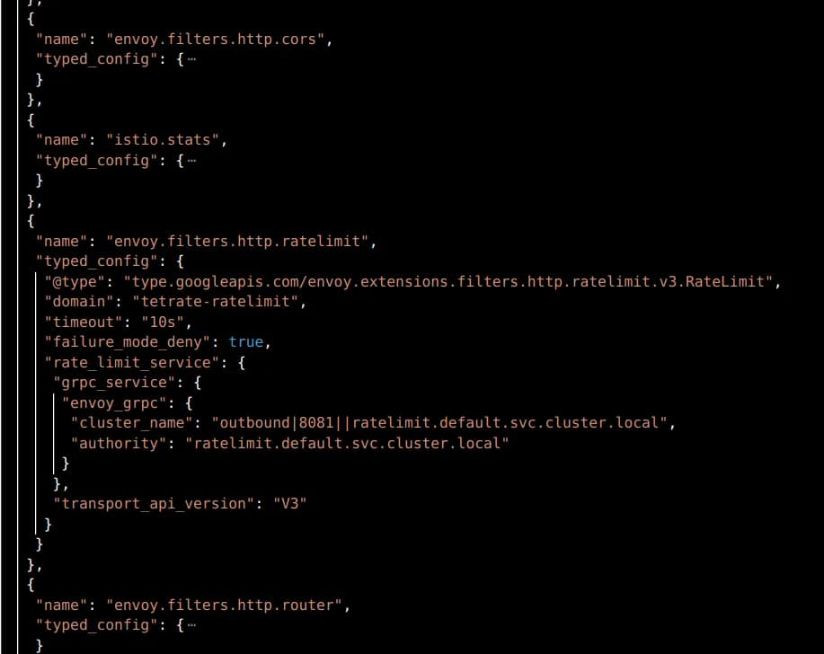
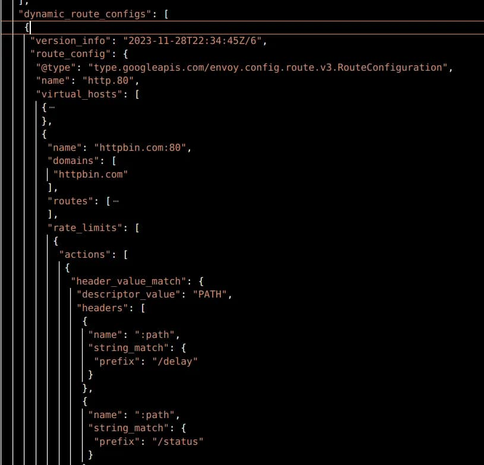

本文是为那些刚开始使用 Istio 速率限制功能，希望了解基于请求路径的速率限制如何工作的人而写的。它源于我的实践，并澄清了关于`rate_limit`操作中 AND/OR 操作的困惑。我花了比预期更多的时间来弄清楚我将在这里为你总结的内容，以便你在几分钟内学习。

## 基础知识

Istio 在 Envoy 之上运行，而我们将讨论的主要技术是 Envoy。Envoy 有在代理本身上实现的本地速率限制和在 L4 或 L7 上调用外部服务的全局速率限制的选项。

## 外部速率限制服务

外部速率限制服务（RLS）与 Redis 数据库配合使用，通过 gRPC 与 envoy 实例连接。该 RLS 是由 [filter](https://www.envoyproxy.io/docs/envoy/latest/configuration/http/http_filters/rate_limit_filter#rate-limit) 在 HTTP 路由过滤器之前的侦听器链中添加而被调用的。

这个外部过滤器将描述符组织成域组。每个描述符都是一个键值对，由速率限制过滤器填充，并传递给 RLS 供其在规则执行逻辑中使用。请参阅 https://github.com/envoyproxy/ratelimit#overview 进行实现。

RLS 需要由集群操作员（你）安装和管理，并且不会随 Istio 一起提供，尽管可以在你安装时从 Istio 包的示例目录中找到它。

## Envoy HTTP 速率限制过滤器

Envoy 的设置由应用于入口网关的两个 Envoy 配置组成，一个在侦听器组件中添加速率限制过滤器，另一个在动态路由组件中定义虚拟主机级别的操作。



带有速率限制过滤器的侦听器组件 filter_chains.filters[] 在路由器之前。



*注意：你可以通过以下方式从任何 envoy 代理（当然是网关）获取此转储：*

```
k exec <POD> -c istio-proxy -- curl 'localhost:15000/config_dump' > config_dump.json
```

侦听器过滤器配置了如何到达 RLS、它正在监视的域以及一些其他设置。当满足路由中定义的操作时，此过滤器将访问在路由中定义的操作，并触发到 RLS 上游的 gRPC 调用，其中包括域、描述符键和值，以便它返回一个判断。

## Istio 中按请求路径设置速率限制的示例

你需要按照[此](https://istio.io/latest/docs/tasks/policy-enforcement/rate-limit/)开始。花点时间分析基于前文介绍的配置。供你参考，我使用的是你也可以在 Istio 包的示例目录中访问的 `httpbin` 服务。

### 错误的方法

所以，我希望根据两个路径 `/delay` 和 `/status` 进行速率限制。看起来很容易，所以我配置了我的 Envoy Filter 和 RLS 如下：

```yaml
# EnvoyFilter 配置路由操作
      patch:
        operation: MERGE
        value:
          rate_limits:
            - actions:
              - header_value_match:
                  descriptor_key: "PATH"
                  descriptor_value: "yes"
                  headers:
                    - name: ":path"
                      safe_regex_match:
                        google_re2: {}
                        regex: ".*delay.*"
              - header_value_match:
                  descriptor_key: "PATH"
                  descriptor_value: "no

"
                  headers:
                    - name: ":path"
                      safe_regex_match:
                        google_re2: {}
                        regex: ".*status.*"
# RLS configmap
...
data:
  config.yaml: |
    domain: tetrate-ratelimit
    descriptors:
      - key: PATH
        value: "yes"
        rate_limit:
          unit: minute
          requests_per_unit: 3
      - key: PATH
        value: "no"
        rate_limit:
          unit: minute
          requests_per_unit: 1
```

有了这个，我期望通过调用以下命令来使其工作：

```
curl http://127.0.0.1:8080/delay/1 -H"host: httpbin.com" -v -o /dev/null
```

但是 RLS 甚至没有注意到这个调用，所以速率限制没有发生：

```
# k logs -n default -f ratelimit-57bf5688c-f8q5k
time="2023-11-29T17:34:10Z" level=debug msg="[gostats] Flush() called, all stats would be flushed"
time="2023-11-29T17:34:20Z" level=debug msg="[gostats] flushing counter ratelimit.go.mallocs: 460"
time="2023-11-29T17:34:20Z" level=debug msg="[gostats] flushing counter ratelimit.go.frees: 26"
time="2023-11-29T17:34:20Z" level=debug msg="[gostats] flushing counter ratelimit.go.totalAlloc: 15624"
time="2023-11-29T17:34:20Z" level=debug msg="[gostats] flushing gauge ratelimit.go.sys: 0"
```

*为了设置调试模式，你可以编辑 ratelimit-server 部署的容器参数。在那里，你将找到日志级别标志。*

我尝试了所有种类的组合在 `rate_limits.actions` 设置中，使用 `string_match` 和 `prefix_match` 替代了 `safe_regex_match`，但没有成功。

还尝试使用单个 `descriptor_key`，不同的值以及甚至不设置它并使用默认的 `header_match`。

## 顿悟时刻

我发现过滤器没有发送任何东西到 RLS，因为前者在任何请求上都保持沉默。然后，通过文档我读到：

> "如果操作不能添加描述符条目，则不会为配置生成描述符"，见[这里](https://www.envoyproxy.io/docs/envoy/latest/api-v3/config/route/v3/route_components.proto#config-route-v3-ratelimit)。

然后，发起调用：

```
curl http://127.0.0.1:8080/status/delay -H"host: httpbin.com" -v -o /dev/null
```

结果如下：

```
time="2023-11-29T16:07:07Z" level=debug msg="got descriptor: (PATH=yes),(PATH=no)"
time="2023-11-29T16:07:07Z" level=debug msg="starting get limit lookup"
time="2023-11-29T16:07:07Z" level=debug msg="looking up key: PATH_yes"
time="2023-11-29T16:07:07Z" level=debug msg="found rate limit: PATH_yes"
```

所以，只有当我的路径满足 *两个* `header_value_match` 时，描述符才会传递给 RLS。我的当前配置正如一个 AND 运算符一样工作。

然后，一切都归结为：*如何在 rate_limit 操作中设置 OR 逻辑而不是 AND？*

## 解决方案

原始配置略有变化，如下：

```
# EnvoyFilter 配置路由操作   
        value:
          rate_limits:
            - actions: # 任何操作在此处
              - header_value_match:
                  descriptor_key: "PATH_DELAY"
                  descriptor_value: "yes"
                  headers:
                    - name: ":path"
                      safe_regex_match:
                        google_re2: {}
                        regex: ".*delay.*"
            - actions:
              - header_value_match:
                  descriptor_key: "PATH_STATUS"
                  descriptor_value: "yes"
                  headers:
                    - name: ":path"
                      safe_regex_match:
                        google_re2: {}
                        regex: ".*status.*"
```

看起来像一个有效的配置，就像：

```
❯ curl http://127.0.0.1:8080/delay/1 -H"host: httpbin.com" -v -s -o /dev/null 
*   Trying 127.0.0.1:8080...
* Connected to 127.0.0.1 (127.0.0.1) port 8080 (#0)
> GET /delay/1 HTTP/1.1
> Host: httpbin.com
> User-Agent: curl/7.81.0
> Accept: */*
> 
* Mark bundle as not supporting multiuse
< HTTP/1.1 200 OK
< server: istio-envoy
< date: Wed, 29 Nov 2023 20:17:02 GMT
< content-type: application/json
< content-length: 703
< access-control-allow-origin: *
< access-control-allow-credentials: true
< x-envoy-upstream-service-time: 1005
< 
{ [703 bytes data]
* Connection #0 to host 127.0.0.1 left intact

❯ curl http://127.0.0.1:8080/delay/1 -H"host: httpbin.com" -v -s -o /dev/null 
*   Trying 127.0.0.1:8080...
* Connected to 127.0.0.1 (127.0.0.1) port 8080 (#0)
> GET /delay/1 HTTP/1.1
> Host: httpbin.com
> User-Agent: curl/7.81.0
> Accept: */*
> 
* Mark bundle as not supporting multiuse
< HTTP/1.1 429 Too Many Requests <---------- 参见
< x-envoy-ratelimited: true
< date: Wed, 29 Nov 2023 20:17:06 GMT
< server: istio-envoy
< content-length: 0
< 
* Connection #0 to host 127.0.0.1 left intact
```

和 RLS 日志：

```
time="2023-11-29T16:33:57Z" level=debug msg="starting cache lookup"
time="2023-11-29T16:33:57Z" level=debug msg="looking up cache key: tetrate-ratelimit_PATH_DELAY_yes_1701275580"
time="2023-11-29T16:33:57Z" level=debug msg="cache key: tetrate-ratelimit_PATH_DELAY_yes_1701275580 current: 1"
time="2023-11-29T16:33:57Z" level=debug msg="returning normal response"
time="2023-11-29T16:33:57Z" level=debug msg="[gostats] flushing time ratelimit_server.ShouldRateLimit.response_time: 0.000000"
time="2023-11-29T16:33:59Z" level=debug msg="got descriptor: (PATH_DELAY=yes)"
time="2023-11-29T16:33:59Z" level=debug msg="starting get limit lookup"
time="2023-11-29T16:33:59Z" level=debug msg="looking up key: PATH_DELAY_yes"
time="2023-11-29T16:33:59Z" level=debug msg="found rate limit: PATH_DELAY_yes"
time="2023-11-29T16:33:59Z" level=debug msg="applying limit: 1 requests per MINUTE, shadow_mode: false"
```

相信我，`/status` 的限制也是存在的。

AND/OR逻辑用于速率限制 `rate_limits` 配置在其数组中支持多个位置，因此 AND/OR 逻辑操作取决于动作是否嵌套到相同的 `actions` 子集中。

------

**注意**：可能有一种更安全、更有效的路径匹配方式，而不是像这个例子中那样打开正则表达式。它很简单，所以我们专注于主题。