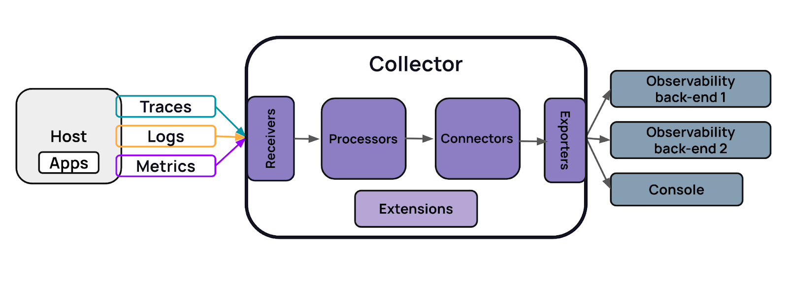
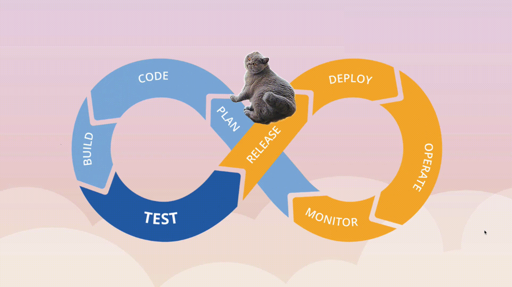
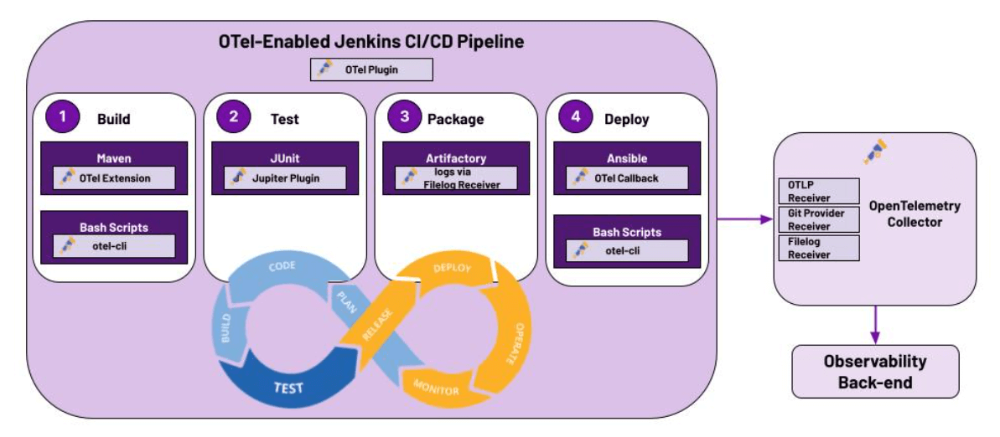

本文译自：<https://thenewstack.io/how-to-observe-your-ci-cd-pipelines-with-opentelemetry>

摘要：这篇文章介绍了 OpenTelemetry 这个开源框架，它可以帮助你生成、收集换和导出 CI/CD 管道的遥测数据，以实现性能、可靠性、安全性等方面的度量、监控、告警、分析等功能。

---

如今的软件比 20 多年前的软件复杂得多，这带来了在故障排除代码时面临新挑战。幸运的是，通过将可观测性引入我们的系统，我们在理解应用程序的性能如何以及问题发生在何处方面取得了相当大的进展。

然而，不仅软件发生了演变 - 创建和开发软件的过程也发生了变化。[DevOps](https://roadmap.sh/devops)引入了[CI/CD的概念](https://thenewstack.io/a-primer-continuous-integration-and-continuous-delivery-ci-cd/)。随着交付周期从每月、每季度，到现在每周甚至一天多次，我们正在全面采用自动化来进行软件交付。

不幸的是，与应用程序软件相比，[CI/CD流水线](https://thenewstack.io/ci-cd/ "CI/CD pipelines")的可观测性进展不大。考虑到这些流水线是软件交付流程的基础，这令人惊讶：如果你没有可见性，那么当出现问题且无法将软件投入生产时，你该如何排除问题？

这正是本文将重点讨论的内容：CI/CD 流水线的可观测性。首先，我们将定义一些概念；然后，我们将深入探讨观察流水线的重要性以及如何使其可观测；最后，我们将讨论一些尚未解决的挑战。

## 关键概念

以下是一些需要了解的定义：

### 可观测性

有关[可观测性](https://thenewstack.io/observability/)有多种定义，因此我们将其缩小为我们最喜欢的定义：

可观测性，或简称 o11y（发音为“ollie”），允许你通过不了解系统内部运作方式就能从外部了解系统。有趣的是：“o11y”中的数字 11 代表了“可观测性”一词中的字母“o”和“y”之间的字符数。

这意味着即使你不了解系统的所有细节业务逻辑，系统仍会发出足够的信息，使你能够通过跟踪线索来回答：“为什么会发生这种情况？”但是，如果你的系统不发出信息，那么你就无法进行观察。你如何获取这些信息呢？一种方式是使用 OpenTelemetry。

### OpenTelemetry

[OpenTelemetry（OTel）](https://thenewstack.io/introducing-opentelemetry-in-your-organization-3-steps/)是一个用于生成、收集、转换和导出遥测数据的开源可观测性框架。它提供了一组 API、软件开发工具包（SDK）、仪器库和工具，帮助你完成这些任务。自 2019 年正式成立以来，它已成为应用程序仪器和遥测生成和收集的事实标准，被包括[eBay](https://innovation.ebayinc.com/tech/engineering/why-and-how-ebay-pivoted-to-opentelemetry/)和[Skyscanner](https://www.infoq.com/presentations/opentelemetry-observability/)在内的公司使用。

其最大的好处之一是不受供应商锁定的限制。你可以为应用程序添加遥测一次，并将遥测发送到最适合你的后端。它还提供一些非常酷的工具，例如 Collector。

Collector 是一个供应商中立的服务，用于接收、转换和导出数据到一个或多个可观测性后端。

Collector 由四个主要组件组成，这些组件访问遥测：

- **Receivers** 接收数据，无论是来自你的应用程序代码还是基础架构。
- **Processors** 转换数据。处理器可以执行诸如模糊化数据、添加属性、删除属性或过滤数据等操作。
- **Exporters** 将数据转换为与你选择的可观测性后端兼容的格式。
- **Connectors** 允许你连接两个流水线。

你可以将 OTel Collector 视为数据管道。

### CI/CD 流水线

CI/CD 是一种自动化的软件交付方法，依赖于两个关键实践：

- 连续集成（CI）是指在进行代码更改时构建、打包和测试软件。
- 连续交付（CD）是指立即将该软件包部署到生产环境中。

自动化的流水线通过允许你更快地向客户提供新功能、修复错误和一般更新来实现快速的产品迭代。它们消除了手动错误的风险，并标准化了对开发人员的反馈循环。

## 为何 CI/CD 流水线的可观测性很重要

当你的流水线健康时，你的团队可以持续编写、构建、测试和部署代码和配置更改到生产环境。你还可以改进或实现开发敏捷性，这意味着你可以更改运营方式并最小化确定这些修改是否对应用程序的健康产生了积极或消极影响所需的时间。

相反，当你的流水线不健康时，你可能会遇到以下一种或多种问题：

- **部署缓慢**：修复错误可能不够快，以制止用户的不满，问题可能会变得严重。
- **测试问题**：不得不等待测试完成，或没有足够的时间来测试不同的配置，可能会导致延迟的部署和难以在用户群中实现足够的应用程序性能。
- **技术债务**：难以确定底层问题可能导致技术债务。

### 流水线是 DevOps 工程师的生产系统

虽然流水线可能不是外部用户与之互动的生产环境，但它们绝对是内部用户 - 例如，软件工程师和[站点可靠性工程师](https://thenewstack.io/our-2023-site-reliability-engineering-wish-list/)（SRE）- 与之互动的生产环境。能够观察你的生产环境意味着：

- 避免不必要的长周期时间或更改的引导时间，这会影响提交进入生产所需的时间。
- 减少推出新功能和错误修复的等待时间。
- 缩短用户等待时间。

### 代码可能会失败

CI/CD 流水线由定义其工作方式的代码运行，尽管你付出了最大的努力，代码仍然可能会失败。使应用程序代码可观测有助于你在遇到生产问题时理清头绪。同样，了解你的流水线可以帮助你了解它们失败时发生了什么。

### 故障排除更容易

具有可观测的流水线有助于回答以下问题：

- 什么失败了？
- 为什么失败了？
- 是否曾经失败过？
- 最常发生了什么失败？
- 流水线的正常运行时间是多少？
- 是否存在任何瓶颈？如果有，它们是什么？
- 你能够缩短修复流水线问题的导向时间吗？

### 想要收集什么样的数据？

要回答这些问题，你需要收集有关你的流水线的信息。但是这些信息应该是什么呢？捕获诸如：

- 分支名称。
- 提交的安全哈希算法（SHA）。
- 机器 IP。
- 运行类型（按计划执行，由合并/推送触发）。
- 失败的步骤。
- 步骤持续时间。
- 构建编号。

## 如何观察流水线

请记住，当系统发出足够的信息来回答问题：“为什么会发生这种情况？”时，系统就是可观测的。首先，你需要一种方法来发出这些信息；然后，你需要一个发送信息的地方；最后，你需要分析信息并找出需要修复的问题。

这就是 OpenTelemetry 的用武之地。你可以在系统中实施 OpenTelemetry，以发出你需要实现系统可观测性的信息。与用于应用程序的方式一样，你也可以将其用于 CI/CD 流水线！仍然需要将生成的遥测数据发送到后端进行分析，但我们将专注于第一个部分，即仪器化。

### 使用 OpenTelemetry

对于仪器化 CI/CD 流水线来说，OpenTelemetry 是一个很合理的选择，因为许多人已经在应用程序中使用它进行仪器化；在过去的几年中，采用和实施逐渐增加。

### 有哪些选项？

目前，情况有些复杂。存在以下选项：

- 商业 SaaS 监控解决方案，如[Datadog](https://www.datadoghq.com/product/ci-cd-monitoring/)和[Splunk](https://www.splunk.com/en_us/blog/learn/ci-cd-devops-analytics.html)。
- 供应商创建的工具，你可以将其插入现有的 CI/CD 工具中，以帮助实现 CI/CD 可观测性（例如，[Honeycomb buildevents](https://github.com/honeycombio/buildevents)、[New Relic 的 Codestream 与 CircleCI 集成](https://docs.newrelic.com/docs/codestream/how-use-codestream/cicd/)和[GitHub Actions 的更改跟踪](https://docs.newrelic.com/docs/change-tracking/ci-cd/change-tracking-github-actions/)）。
- 自制的 GitHub actions（请参阅[这里](https://github.com/inception-health/otel-export-trace-action)、[这里](https://words.boten.ca/GitHub-Action-to-OTLP/)和[这里](https://cloud-native.slack.com/archives/C0598R66XAP/p1698393723861129)的示例），以在 CI/CD 流水线中启用可观测性。
- 自制的 [CircleCI OTel webhook](https://github.com/DavidS/circleci-hook)。
- 自制的 [Drone CI OTel webhook](https://cloud-native.slack.com/archives/C0598R66XAP/p1698408390701199)。
- 将 OpenTelemetry 原生集成到 [Jenkins](https://plugins.jenkins.io/opentelemetry/) 和 [Tekton](https://github.com/tektoncd/community/blob/main/teps/0124-distributed-tracing-for-tasks-and-pipelines.md) 中。

你还可以将这些工具集成到你的 CI/CD 流水线中；它们会发出 OpenTelemetry 信号，从而帮助使你的流水线可观测：

- [Maven 构建 OTel 扩展](https://github.com/open-telemetry/opentelemetry-java-contrib/blob/main/maven-extension/README.md)发出 Java 构建的分布式跟踪。
- [Ansible OpenTelemetry 回调](https://docs.ansible.com/ansible/latest/collections/community/general/opentelemetry_callback.html)跟踪 Ansible playbooks。
- [Dynatrace 的 JUnit Jupiter OpenTelemetry 扩展](https://github.com/dynatrace-oss/junit-jupiter-open-telemetry-extension)是用于通过 OpenTelemetry 收集 JUnit 测试执行数据的 Gradle 插件。还有一个[Maven 版本](https://github.com/dynatrace-oss/junit-jupiter-open-telemetry-extension/packages/1061205)。
- [pytest-otel](https://pypi.org/project/pytest-otel/)记录执行的 Python 测试的分布式跟踪。
- [otel-cli](https://github.com/equinix-labs/otel-cli)是用 Go 编写的命令行界面（CLI）工具，可使 shell 脚本发出跟踪信号。
- [Filelog 接收器](https://github.com/open-telemetry/opentelemetry-collector-contrib/tree/main/receiver/filelogreceiver)（OTel Collector）从文件中读取和解析日志。
- [Git 提供商接收器](https://github.com/open-telemetry/opentelemetry-collector-contrib/tree/main/receiver/gitproviderreceiver)（OTel Collector）从 Git 供应商处获取数据。

## 可观测的流水线示例

以下图表显示了如何使用上述提到的一些工具实现流水线可观测性。假设你正在构建和部署一个 Java 应用程序。你正在使用 Jenkins 来编排构建和部署过程。

1. Jenkins CI/CD 流水线可以通过[Jenkins OTel 插件](https://plugins.jenkins.io/opentelemetry/)发出遥测信号。
2. 在构建阶段中：
   - 你可以使用[Maven OTel 扩展](https://github.com/open-telemetry/opentelemetry-java-contrib/blob/main/maven-extension/README.md)发出 Java 构建的分布式跟踪。
   - 如果你的构建包括 shell 脚

本，你可以使用[otel-cli](https://github.com/equinix-labs/otel-cli)工具来使你的 shell 脚本能够发出跟踪信号。
3. 在测试阶段中，[Maven 的 JUnit Jupiter 插件](https://github.com/dynatrace-oss/junit-jupiter-open-telemetry-extension/packages/1061205)允许你通过 OpenTelemetry 收集 JUnit 测试执行数据。
4. 在打包阶段中，使用 Artifactory 来打包你的应用程序，你可以将其日志发送给 OTel Collector，通过[Filelog 接收器](https://github.com/open-telemetry/opentelemetry-collector-contrib/blob/main/receiver/filelogreceiver/README.md)进行解析，该接收器会从文件中读取和解析日志。
5. 在部署阶段，使用 Ansible 来编排你的部署，[Ansible OpenTelemetry 回调](https://docs.ansible.com/ansible/latest/collections/community/general/opentelemetry_callback.html)会将跟踪添加到你的 Ansible playbooks 中。如果你的 Ansible playbook 还使用 shell 脚本，它可以利用[otel-cli](https://github.com/equinix-labs/otel-cli)工具，使你的 shell 脚本发出额外的跟踪数据。
6. 各种插件发出的信号被 OTel Collector 捕获。可以使用标准的[OTLP 接收器](https://github.com/open-telemetry/opentelemetry-collector/tree/main/receiver/otlpreceiver)来接收遥测数据，以及[Git 提供商接收器](https://github.com/open-telemetry/opentelemetry-collector-contrib/tree/main/receiver/gitproviderreceiver)和[Filelog 接收器](https://github.com/open-telemetry/opentelemetry-collector-contrib/blob/main/receiver/filelogreceiver/README.md)。然后，Collector 将遥测信号发送到可观测性后端。
7. 一旦你的数据到达可观测性后端，你可以查看和查询数据，设置警报等等。

## 实现可观测流水线的挑战

虽然使用 OpenTelemetry 实现 CI/CD 流水线可观测性是有道理的，但缺乏标准化，工具情况有点混乱。

OpenTelemetry 并未集成到大多数 CI/CD 工具中。虽然有人希望将观察能力添加到诸如 GitLab 和 GitHub Actions 等 CI/CD 工具中，但这些倡议进展缓慢。例如，尽管[GitLab 有关使用 OTel 进行流水线可观测性的请求](https://gitlab.com/gitlab-org/gitlab/-/issues/338943)存在活动，但该请求已经开放了两年。[有关 CI/CD 流水线可观测性的 OTel 提案](https://github.com/open-telemetry/oteps/pull/223)于 2023 年 1 月提出，但（截至 2023 年 11 月）自 7 月以来尚未有任何活动。

因此，如果你想使用这些工具，你将取决于创建自己工具的个人和组织是否愿意维护这些工具。如果他们决定不再维护这些工具，会发生什么呢？

## 了解更多

使你的 CI/CD 流水线可观测有助于更有效地排除问题，实现开发敏捷性，并深入了解其内部工作原理，以便你可以调整它们以使其运行更高效。

健康的流水线意味着你可以连续编写、构建、测试和部署新代码。相反，不健康的流水线可能意味着部署较慢，测试问题和技术债务。

你可以使用 OpenTelemetry 在流水线中添加可观测性；尽管当前选项有限，但事情正在朝着正确的方向发展，我们对 CI/CD 的未来充满期待！

进一步阅读：

- [解决慢和不稳定的 CI/CD 流水线始于可观测性](https://logz.io/learn/cicd-observability-jenkins)
- [利用 OpenTelemetry 增强 Ansible 的 Jaeger 跟踪](https://www.linkedin.com/pulse/leveraging-opentelemetry-enhance-ansible-jaeger-tracing-infralovers)
- [CI/CD 流水线监控：简介](https://www.splunk.com/en_us/blog/learn/monitoring-ci-cd.html)
- 在[CNCF Slack](https://communityinviter.com/apps/cloud-native/cncf)的[cicd-o11y](https://cloud-native.slack.com/archives/C0598R66XAP)频道中查看更多信息。
