在启用了 Istio 服务网格的 Kubernetes 集群中，缺省情况下只能在集群内部访问网格中的服务，要如何才能从外部网络访问这些服务呢？Kubernetes 和 Istio 提供了 NodePort，LoadBalancer，Kubernetes Ingress，Istio Gateway 等多种外部流量入口的方式，面对这么多种方式，我们在产品部署中应该如何选择？

本文将对 Kubernetes 和 Istio 对外提供服务的各种方式进行详细介绍和对比分析，并根据分析结果提出一个可用于产品部署的解决方案。

> 说明：阅读本文要求读者了解 Kubernetes 和 Istio 的基本概念，包括 Pod、Service、NodePort、LoadBalancer、Ingress、Gateway、VirtualService 等。如对这些概念不熟悉，可以在阅读过程中参考文后的相关链接。

## 内部服务间的通信

首先，我们来回顾一下 Kubernetes 集群内部各个服务之间相互访问的方法。

## Cluster IP

Kubernetes 以 Pod 作为应用部署的最小单位。Kubernetes 会根据 Pod 的声明对其进行调度，包括创建、销毁、迁移、水平伸缩等，因此 Pod 的 IP 地址不是固定的，不方便直接采用 Pod IP 对服务进行访问。

为解决该问题，Kubernetes 提供了 Service 资源，Service 对提供同一个服务的多个 Pod 进行聚合。一个 Service 提供一个虚拟的 Cluster IP，后端对应一个或者多个提供服务的 Pod。在集群中访问该 Service 时，采用 Cluster IP 即可，Kube-proxy 负责将发送到 Cluster IP 的请求转发到后端的 Pod 上。

Kube-proxy 是一个运行在每个节点上的 go 应用程序，支持三种工作模式：

### userspace 模式

该模式下 Kube-proxy 会为每一个 Service 创建一个监听端口。发向 Cluster IP 的请求被 Iptables 规则重定向到 Kube-proxy 监听的端口上，Kube-proxy 根据 LB 算法选择一个提供服务的 Pod 并和其建立链接，以将请求转发到 Pod 上。<br>
该模式下，Kube-proxy 充当了一个四层 Load balancer 的角色。由于 Kube-proxy 运行在 userspace 中，在进行转发处理时会增加两次内核和用户空间之间的数据拷贝，效率较另外两种模式低一些；好处是当后端的 Pod 不可用时，Kube-proxy 可以重试其他 Pod。

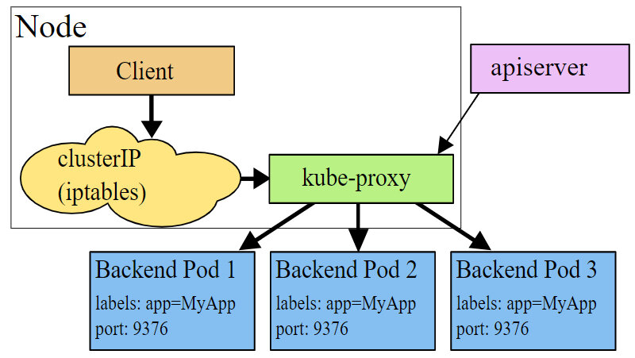

图片来自：[Kubernetes 官网文档](https://kubernetes.io/docs/concepts/services-networking/service/#virtual-ips-and-service-proxies/)

### iptables 模式

为了避免增加内核和用户空间的数据拷贝操作，提高转发效率，Kube-proxy 提供了 iptables 模式。在该模式下，Kube-proxy 为 service 后端的每个 Pod 创建对应的 iptables 规则，直接将发向 Cluster IP 的请求重定向到一个 Pod IP。<br>
该模式下 Kube-proxy 不承担四层代理的角色，只负责创建 iptables 规则。该模式的优点是较 userspace 模式效率更高，但不能提供灵活的 LB 策略，当后端 Pod 不可用时也无法进行重试。

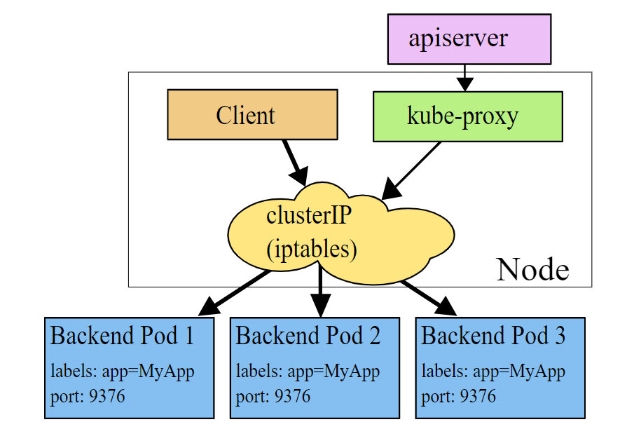

图片来自：[Kubernetes 官网文档](https://kubernetes.io/docs/concepts/services-networking/service/#virtual-ips-and-service-proxies/)

### ipvs 模式
该模式和 iptables 类似，Kube-proxy 监控 Pod 的变化并创建相应的 ipvs rules。ipvs 也是在 kernel 模式下通过 netfilter 实现的，但采用了 hash table 来存储规则，因此在规则较多的情况下，Ipvs 相对 iptables 转发效率更高。除此以外，ipvs 支持更多的 LB 算法。如果要设置 Kube-proxy 为 ipvs 模式，必须在操作系统中安装 IPVS 内核模块。

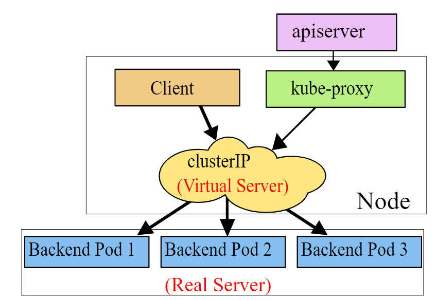

图片来自：[Kubernetes 官网文档](https://kubernetes.io/docs/concepts/services-networking/service/#virtual-ips-and-service-proxies/)

## Istio Sidecar Proxy

Cluster IP 解决了服务之间相互访问的问题，但从上面 Kube-proxy 的三种模式可以看到，Cluster IP 的方式只提供了服务发现和基本的 LB 功能。如果要为服务间的通信应用灵活的路由规则以及提供 Metrics collection，distributed tracing 等服务管控功能，就必须得依靠 Istio 提供的服务网格能力了。

在 Kubernetes 中部署 Istio 后，Istio 通过 iptables 和 Sidecar Proxy 接管服务之间的通信，服务间的相互通信不再通过 Kube-proxy，而是通过 Istio 的 Sidecar Proxy 进行。请求流程是这样的：Client 发起的请求被 iptables 重定向到 Sidecar Proxy，Sidecar Proxy 根据从控制面获取的服务发现信息和路由规则，选择一个后端的 Server Pod 创建连接，代理并转发 Client 的请求。

Istio Sidecar Proxy 和 Kube-proxy 的 userspace 模式的工作机制类似，都是通过在用户空间的一个代理来实现客户端请求的转发和后端多个 Pod 之间的负载均衡。两者的不同点是：Kube-Proxy 工作在四层，而 Sidecar Proxy 则是一个七层代理，可以针对 HTTP，gRPC 等应用层的语义进行处理和转发，因此功能更为强大，可以配合控制面实现更为灵活的路由规则和服务管控功能。

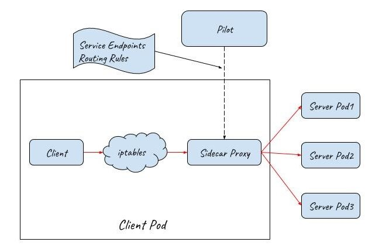

# 如何从外部网络访问

Kubernetes 的 Pod IP 和 Cluster IP 都只能在集群内部访问，而我们通常需要从外部网络上访问集群中的某些服务，Kubernetes 提供了下述几种方式来为集群提供外部流量入口。

## NodePort

NodePort 在集群中的主机节点上为 Service 提供一个代理端口，以允许从主机网络上对 Service 进行访问。Kubernetes 官网文档只介绍了 NodePort 的功能，并未对其实现原理进行解释。下面我们通过实验来分析 NodePort 的实现机制。

www.katacoda.com 这个网站提供了一个交互式的 Kubernetes playground，注册即可免费实验 Kubernetes 的相关功能，下面我们就使用 Katacoda 来分析 Nodeport 的实现原理。

在浏览器中输入这个网址：https://www.katacoda.com/courses/kubernetes/networking-introduction，打开后会提供了一个实验用的 Kubernetes 集群，并可以通过网元模拟 Terminal 连接到集群的 Master 节点。

执行下面的命令创建一个 nodeport 类型的 service。

```bash
master $ cat nodeport.yaml
apiVersion: v1
kind: Service
metadata:
  name: webapp1-nodeport-svc
  labels:
    app: webapp1-nodeport
spec:
  type: NodePort
  ports:
  - port: 80
    nodePort: 30080
  selector:
    app: webapp1-nodeport
---
apiVersion: extensions/v1beta1
kind: Deployment
metadata:
  name: webapp1-nodeport-deployment
spec:
  replicas: 2
  template:
    metadata:
      labels:
        app: webapp1-nodeport
    spec:
      containers:
      - name: webapp1-nodeport-pod
        image: katacoda/docker-http-server:latest
        ports:
        - containerPort: 80
---
master $ kubectl apply -f nodeport.yaml
```


查看创建的 service，可以看到 Kubernetes 创建了一个名为 webapp-nodeport-svc 的 service，并为该 service 在主机节点上创建了 30080 这个 Nodeport。

```bash
master $ kubectl get svc
NAME                   TYPE        CLUSTER-IP      EXTERNAL-IP   PORT(S)        AGE
kubernetes             ClusterIP   10.96.0.1       <none>        443/TCP        36m
webapp1-nodeport-svc   NodePort    10.103.188.73   <none>        80:30080/TCP   3m
```

webapp-nodeport-svc 后端对应两个 Pod，其 Pod 的 IP 分别为 10.32.0.3 和 10.32.0.5。

```bash
master $ kubectl get pod -o wide
NAME                                           READY     STATUS    RESTARTS   AGE       IPNODE      NOMINATED NODE
webapp1-nodeport-deployment-785989576b-cjc5b   1/1       Running   0          2m        10.32.0.3
webapp1-nodeport-deployment-785989576b-tpfqr   1/1       Running   0          2m        10.32.0.5
```

通过 netstat 命令可以看到 Kube-proxy 在主机网络上创建了 30080 监听端口，用于接收从主机网络进入的外部流量。

```bash
master $ netstat -lnp|grep 30080
tcp6       0      0 :::30080                :::*                    LISTEN      7427/Kube-proxy
```

下面是 Kube-proxy 创建的相关 iptables 规则以及对应的说明。可以看到 Kube-proxy 为 Nodeport 创建了相应的 IPtable 规则，将发向 30080 这个主机端口上的流量重定向到了后端的两个 Pod IP 上。

```bash
iptables-save > iptables-dump
# Generated by iptables-save v1.6.0 on Thu Mar 28 07:33:57 2019
*nat
# Nodeport规则链
:KUBE-NODEPORTS - [0:0]
# Service规则链
:KUBE-SERVICES - [0:0]
# Nodeport和Service共用的规则链
:KUBE-SVC-J2DWGRZTH4C2LPA4 - [0:0]
:KUBE-SEP-4CGFRVESQ3AECDE7 - [0:0]
:KUBE-SEP-YLXG4RMKAICGY2B3 - [0:0]

# 将host上30080端口的外部tcp流量转到KUBE-SVC-J2DWGRZTH4C2LPA4链
-A KUBE-NODEPORTS -p tcp -m comment --comment "default/webapp1-nodeport-svc:" -m tcp --dport 30080 -j KUBE-SVC-J2DWGRZTH4C2LPA4

#将发送到Cluster IP 10.103.188.73的内部流量转到KUBE-SVC-J2DWGRZTH4C2LPA4链
KUBE-SERVICES -d 10.103.188.73/32 -p tcp -m comment --comment "default/webapp1-nodeport-svc: cluster IP" -m tcp --dport 80 -j KUBE-SVC-J2DWGRZTH4C2LPA4

#将发送到webapp1-nodeport-svc的流量转交到第一个Pod（10.32.0.3）相关的规则链上，比例为50%
-A KUBE-SVC-J2DWGRZTH4C2LPA4 -m comment --comment "default/webapp1-nodeport-svc:" -m statistic --mode random --probability 0.50000000000 -j KUBE-SEP-YLXG4RMKAICGY2B3
#将发送到webapp1-nodeport-svc的流量转交到第二个Pod（10.32.0.5）相关的规则链上
-A KUBE-SVC-J2DWGRZTH4C2LPA4 -m comment --comment "default/webapp1-nodeport-svc:" -j KUBE-SEP-4CGFRVESQ3AECDE7

#将请求重定向到Pod 10.32.0.3
-A KUBE-SEP-YLXG4RMKAICGY2B3 -p tcp -m comment --comment "default/webapp1-nodeport-svc:" -m tcp -j DNAT --to-destination 10.32.0.3:80
#将请求重定向到Pod 10.32.0.5
-A KUBE-SEP-4CGFRVESQ3AECDE7 -p tcp -m comment --comment "default/webapp1-nodeport-svc:" -m tcp -j DNAT --to-destination 10.32.0.5:80
```

从上面的实验可以看到，通过将一个 Service 定义为 NodePort 类型，Kubernetes 会通过集群中 node 上的 Kube-proxy 为该 Service 在主机网络上创建一个监听端口。Kube-proxy 并不会直接接收该主机端口进入的流量，而是会创建相应的 Iptables 规则，并通过 Iptables 将从该端口收到的流量直接转发到后端的 Pod 中。

NodePort 的流量转发机制和 Cluster IP 的 iptables 模式类似，唯一不同之处是在主机网络上开了一个“NodePort”来接受外部流量。从上面的规则也可以看出，在创建 Nodeport 时，Kube-proxy 也会同时为 Service 创建 Cluster IP 相关的 iptables 规则。

>备注：除采用 iptables 进行流量转发，NodePort 应该也可以提供 userspace 模式以及 ipvs 模式，这里未就这两种模式进行实验验证。

从分析得知，在 NodePort 模式下，集群内外部的通讯如下图所示：

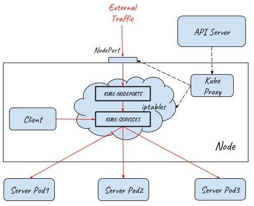

## LoadBalancer

NodePort 提供了一种从外部网络访问 Kubernetes 集群内部 Service 的方法，但该方法存在下面一些限制，导致这种方式主要适用于程序开发，不适合用于产品部署。

* Kubernetes cluster host 的 IP 必须是一个 well-known IP，即客户端必须知道该 IP。但 Cluster 中的 host 是被作为资源池看待的，可以增加删除，每个 host 的 IP 一般也是动态分配的，因此并不能认为 host IP 对客户端而言是 well-known IP。
* 客户端访问某一个固定的 host IP 的方式存在单点故障。假如一台 host 宕机了，Kubernetes cluster 会把应用 reload 到另一节点上，但客户端就无法通过该 host 的 nodeport 访问应用了。
* 通过一个主机节点作为网络入口，在网络流量较大时存在性能瓶颈。

为了解决这些问题，Kubernetes 提供了 LoadBalancer。通过将 Service 定义为 LoadBalancer 类型，Kubernetes 在主机节点的 NodePort 前提供了一个四层的负载均衡器。该四层负载均衡器负责将外部网络流量分发到后面的多个节点的 NodePort 端口上。

下图展示了 Kubernetes 如何通过 LoadBalancer 方式对外提供流量入口，图中 LoadBalancer 后面接入了两个主机节点上的 NodePort，后端部署了三个 Pod 提供服务。根据集群的规模，可以在 LoadBalancer 后面可以接入更多的主机节点，以进行负荷分担。

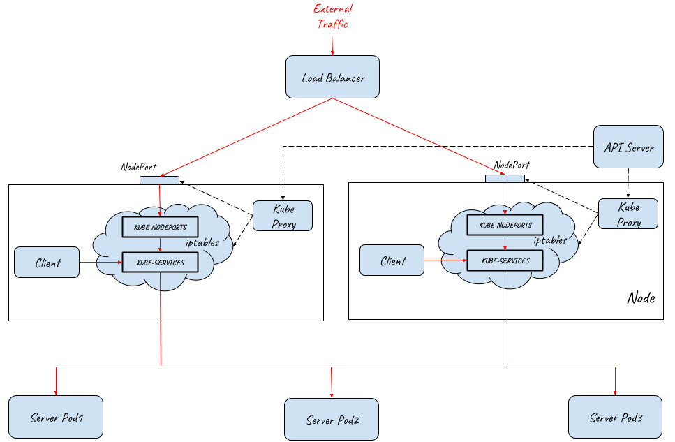

> 备注：LoadBalancer 类型需要云服务提供商的支持，Service 中的定义只是在 Kubernetes 配置文件中提出了一个要求，即为该 Service 创建 Load Balancer，至于如何创建则是由 Google Cloud 或 Amazon Cloud 等云服务商提供的，创建的 Load Balancer 的过程不在 Kubernetes Cluster 的管理范围中。
>
> 目前 AWS、Azure、CloudStack、GCE 和 OpenStack 等主流的公有云和私有云提供商都可以为 Kubernetes 提供 Load Balancer。一般来说，公有云提供商还会为 Load Balancer 提供一个 External IP，以提供 Internet 接入。如果你的产品没有使用云提供商，而是自建 Kubernetes Cluster，则需要自己提供 LoadBalancer。

## Ingress

LoadBalancer 类型的 Service 提供的是四层负载均衡器，当只需要向外暴露一个服务的时候，采用这种方式是没有问题的。但当一个应用需要对外提供多个服务时，采用该方式则要求为每一个四层服务（IP+Port）都创建一个外部 Load balancer。

一般来说，同一个应用的多个服务/资源会放在同一个域名下，在这种情况下，创建多个 Load balancer 是完全没有必要的，反而带来了额外的开销和管理成本。另外直接将服务暴露给外部用户也会导致了前端和后端的耦合，影响了后端架构的灵活性，如果以后由于业务需求对服务进行调整会直接影响到客户端。

在这种情况下，我们可以通过使用 Kubernetes Ingress 来统一网络入口。Kubernetes Ingress 声明了一个应用层（OSI 七层）的负载均衡器，可以根据 HTTP 请求的内容将来自同一个 TCP 端口的请求分发到不同的 Kubernetes Service，其功能包括：

### 按 HTTP 请求的 URL 进行路由

同一个 TCP 端口进来的流量可以根据 URL 路由到 Cluster 中的不同服务，如下图所示：

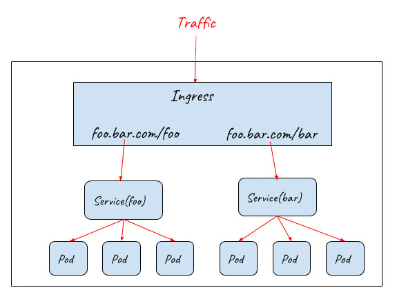

### 按 HTTP 请求的 Host 进行路由

同一个 IP 进来的流量可以根据 HTTP 请求的 Host 路由到 Cluster 中的不同服务，如下图所示：

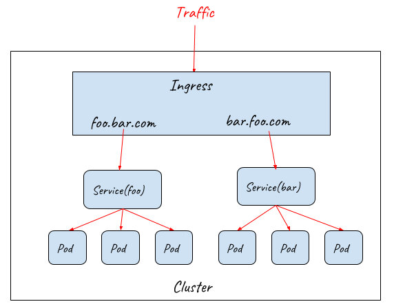

Ingress 规则定义了对七层网关的要求，包括 URL 分发规则，基于不同域名的虚拟主机，SSL 证书等。Kubernetes 使用 Ingress Controller 来监控 Ingress 规则，并通过一个七层网关来实现这些要求，一般可以使用 Nginx，HAProxy，Envoy 等。

虽然 Ingress Controller 通过七层网关为后端的多个 Service 提供了统一的入口，但由于其部署在集群中，因此并不能直接对外提供服务。实际上 Ingress 需要配合 NodePort 和 LoadBalancer 才能提供对外的流量入口，如下图所示：

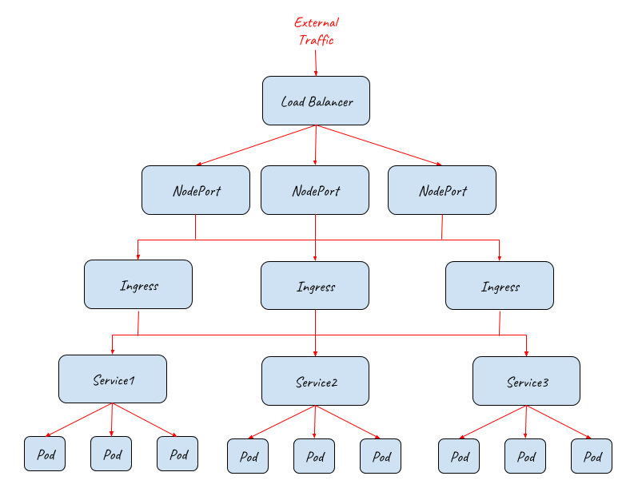

上图描述了如何采用 Ingress 配合 NodePort 和 Load Balancer 为集群提供外部流量入口，从该拓扑图中可以看到该架构的伸缩性非常好，在 NodePort，Ingress，Pod 等不同的接入层面都可以对系统进行水平扩展，以应对不同的外部流量要求。

上图只展示了逻辑架构，下面的图展示了具体的实现原理：

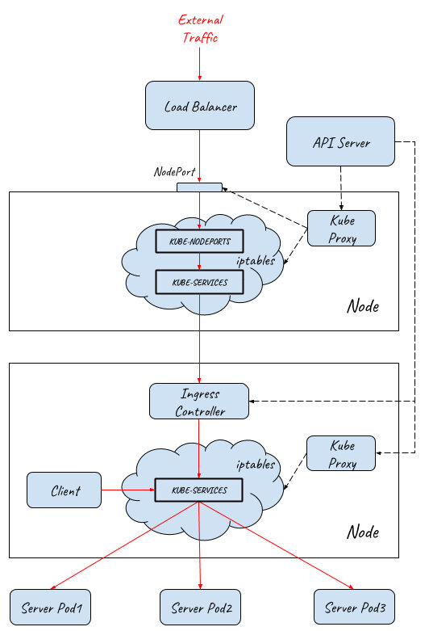

流量从外部网络到达 Pod 的完整路径如下：

1. 外部请求先通过四层 Load Balancer 进入内部网络
1. Load Balancer 将流量分发到后端多个主机节点上的 NodePort (userspace 转发)
1. 请求从 NodePort 进入到 Ingress Controller (iptabes 规则，Ingress Controller 本身是一个 NodePort 类型的 Service)
1. Ingress Controller 根据 Ingress rule 进行七层分发，根据 HTTP 的 URL 和 Host 将请求分发给不同的 Service (userspace 转发)
1. Service 将请求最终导入到后端提供服务的 Pod 中 (iptabes 规则)

从前面的介绍可以看到，K8S Ingress 提供了一个基础的七层网关功能的抽象定义，其作用是对外提供一个七层服务的统一入口，并根据 URL/HOST 将请求路由到集群内部不同的服务上。

# 如何为服务网格选择入口网关？

在 Istio 服务网格中，通过为每个 Service 部署一个 sidecar 代理，Istio 接管了 Service 之间的请求流量。控制面可以对网格中的所有 sidecar 代理进行统一配置，实现了对网格内部流量的路由控制，从而可以实现灰度发布，流量镜像，故障注入等服务管控功能。但是，Istio 并没有为入口网关提供一个较为完善的解决方案。

## K8s Ingress

在 0.8 版本以前，Istio 缺省采用 K8s Ingress 来作为 Service Mesh 的流量入口。K8s Ingress 统一了应用的流量入口，但存在两个问题：

* K8s Ingress 是独立在 Istio 体系之外的，需要单独采用 Ingress rule 进行配置，导致系统入口和内部存在两套互相独立的路由规则配置，运维和管理较为复杂。
* K8s Ingress rule 的功能较弱，不能在入口处实现和网格内部类似的路由规则，也不具备网格 sidecar 的其它能力，导致难以从整体上为应用系统实现灰度发布、分布式跟踪等服务管控功能。

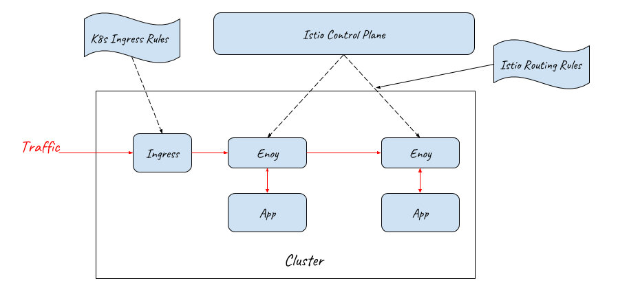

## Istio Gateway

Istio 社区意识到了 Ingress 和 Mesh 内部配置割裂的问题，因此从 0.8 版本开始，社区采用了 Gateway 资源代替 K8s Ingress 来表示流量入口。

Istio Gateway 资源本身只能配置 L4-L6 的功能，例如暴露的端口，TLS 设置等；但 Gateway 可以和绑定一个 VirtualService，在 VirtualService 中可以配置七层路由规则，这些七层路由规则包括根据按照服务版本对请求进行导流，故障注入，HTTP 重定向，HTTP 重写等所有 Mesh 内部支持的路由规则。

Gateway 和 VirtualService 用于表示 Istio Ingress 的配置模型，Istio Ingress 的缺省实现则采用了和 Sidecar 相同的 Envoy proxy。

通过该方式，Istio 控制面用一致的配置模型同时控制了入口网关和内部的 sidecar 代理。这些配置包括路由规则，策略检查、Telementry 收集以及其他服务管控功能。

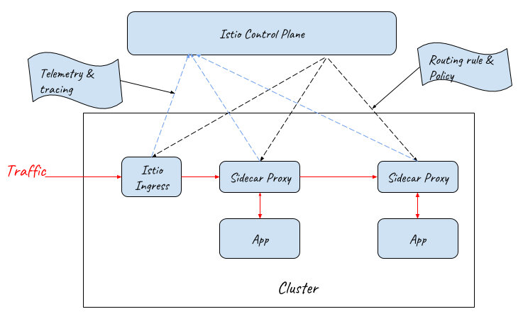

## 应用对 API Gateway 的需求

采用 Gateway 和 VirtualService 实现的 Istio Ingress Gateway 提供了网络入口处的基础通信功能，包括可靠的通信和灵活的路由规则。但对于一个服务化应用来说，网络入口除了基础的通讯功能之外，还有一些其他的应用层功能需求，例如：

* 第三方系统对 API 的访问控制
* 用户对系统的访问控制
* 修改请求/返回数据
* 服务 API 的生命周期管理
* 服务访问的 SLA、限流及计费
* ….

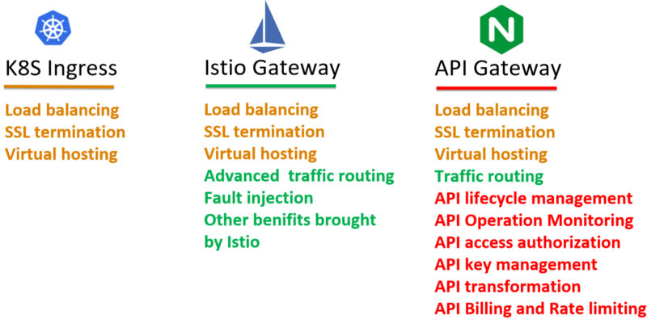

API Gateway 需求中很大一部分需要根据不同的应用系统进行定制，目前看来暂时不大可能被纳入 K8s Ingress 或者 Istio Gateway 的规范之中。为了满足这些需求，涌现出了各类不同的 k8s Ingress Controller 以及 Istio Ingress Gateway 实现，包括 Ambassador、Kong、Traefik、Solo 等。

这些网关产品在实现在提供基础的 K8s Ingress 能力的同时，提供了强大的 API Gateway 功能，但由于缺少统一的标准，这些扩展实现之间相互之间并不兼容。而且遗憾的是，目前这些 Ingress controller 都还没有正式提供和 Istio 控制面集成的能力。

>备注：
>
> * Ambassador 将对 Istio 路由规则的支持纳入了 Roadmap https://www.getambassador.io/user-guide/with-istio/
> * Istio 声称支持 Istio-Based Route Rule Discovery (尚处于实验阶段) https://gloo.solo.io/introduction/architecture/

## 采用 API Gateway + Sidecar Proxy 作为服务网格的流量入口

在目前难以找到一个同时具备 API Gateway 和 Istio Ingress 能力的网关的情况下，一个可行的方案是使用 API Gateway 和 Sidecar Proxy 一起为服务网格提供外部流量入口。

由于 API Gateway 已经具备七层网关的功能，Mesh Ingress 中的 Sidecar 只需要提供 VirtualService 资源的路由能力，并不需要提供 Gateway 资源的网关能力，因此采用 Sidecar Proxy 即可。网络入口处的 Sidecar Proxy 和网格内部应用 Pod 中 Sidecar Proxy 的唯一一点区别是：该 Sidecar 只接管 API Gateway 向 Mesh 内部的流量，并不接管外部流向 API Gateway 的流量；而应用 Pod 中的 Sidecar 需要接管进入应用的所有流量。

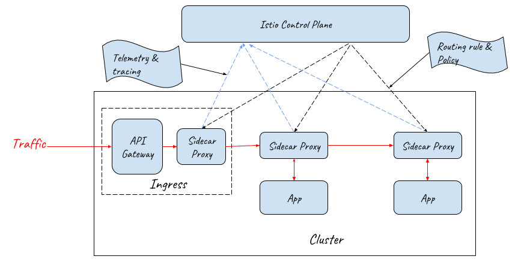

> 备注：在实际部署时，API Gateway 前端需要采用 NodePort 和 LoadBalancer 提供外部流量入口。为了突出主题，对上图进行了简化，没有画出 NodePort 和 LoadBalancer。

采用 API Gateway 和 Sidecar Proxy 一起作为服务网格的流量入口，既能够通过对网关进行定制开发满足产品对 API 网关的各种需求，又可以在网络入口处利用服务网格提供的灵活的路由能力和分布式跟踪，策略等管控功能，是服务网格产品入口网关的一个理想方案。


性能方面的考虑：从上图可以看到，采用该方案后，外部请求的处理流程在入口处增加了 Sidecar Proxy 这一跳，因此该方式会带来少量的性能损失，但该损失是完全可以接受的。

对于请求时延而言，在服务网格中，一个外部请求本来就要经过较多的代理和应用进程的处理，在 Ingress 处增加一个代理对整体的时延影响基本忽略不计，而且对于绝大多数应用来说，网络转发所占的时间比例本来就很小，99% 的耗时都在业务逻辑。如果系统对于增加的该时延非常敏感，则建议重新考虑该系统是否需要采用微服务架构和服务网格。

对于吞吐量而言，如果入口处的网络吞吐量存在瓶颈，则可以通过对 API Gateway + Sidecar Proxy 组成的 Ingress 整体进行水平扩展，来对入口流量进行负荷分担，以提高网格入口的网络吞吐量。

## 参考

- <a id="ref01">[Virtual IPs and Service Proxie - kubernetes.io](https://kubernetes.io/docs/concepts/services-networking/service/#virtual-ips-and-service-proxies)
- [如何从外部访问 Kubernetes 集群中的应用？ - zhaohuabing.com](https://zhaohuabing.com/2017/11/28/access-application-from-outside/)
- [The obstacles to put Istio into production and how we solve them - kubernetes.io](https://zhaohuabing.com/post/2018-12-27-the-obstacles-to-put-istio-into-production/#service-mesh-and-api-gateway)
- [Kubernetes NodePort vs LoadBalancer vs Ingress? When should I use what? - medium.com](https://medium.com/google-cloud/kubernetes-nodeport-vs-loadbalancer-vs-ingress-when-should-i-use-what-922f010849e0)
