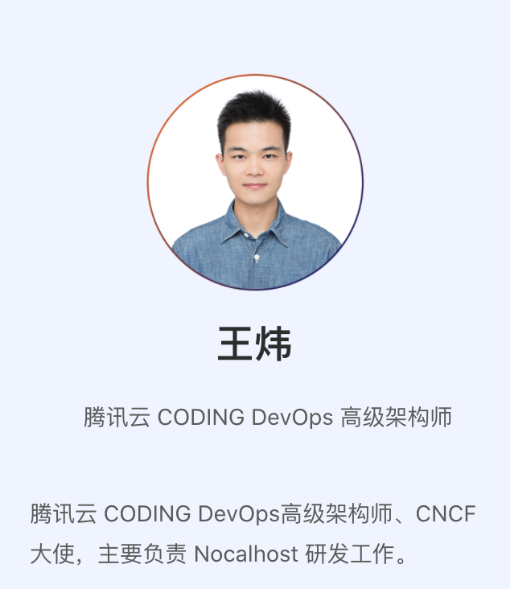
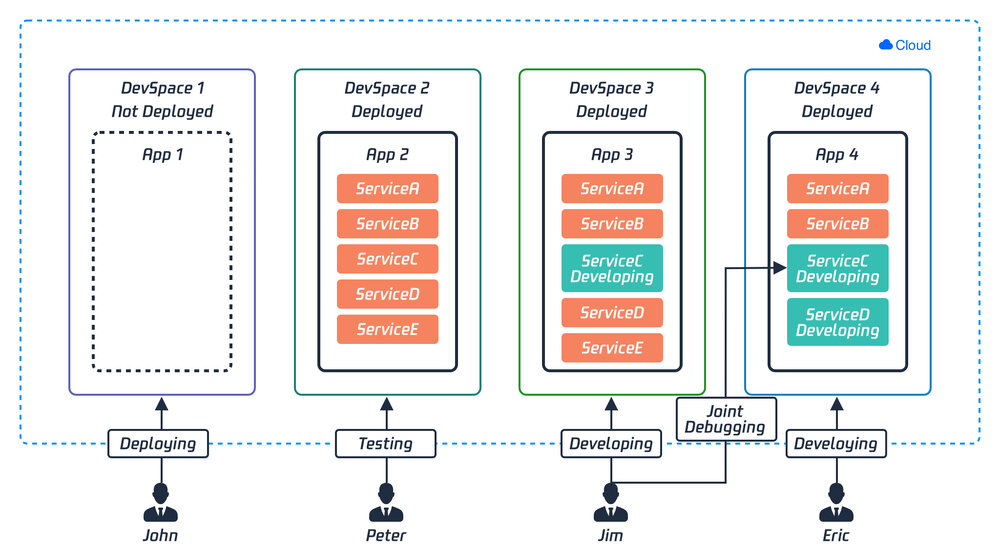
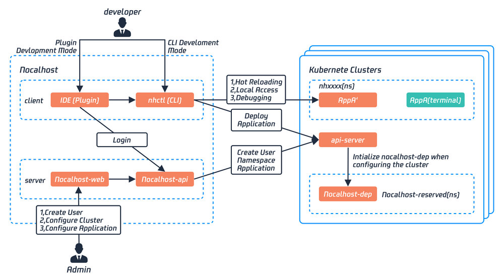
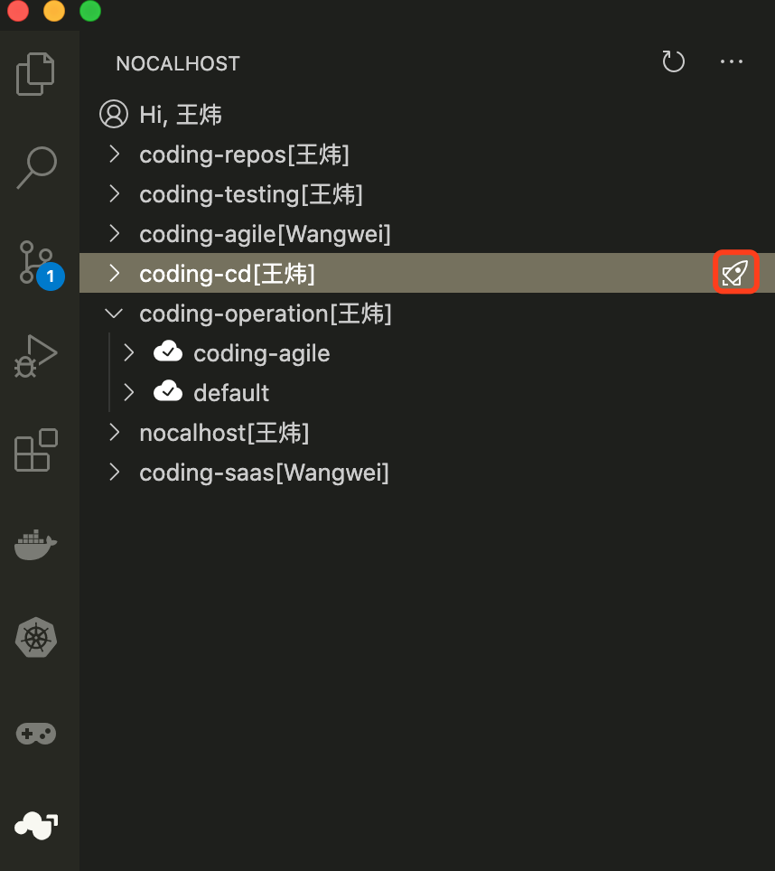
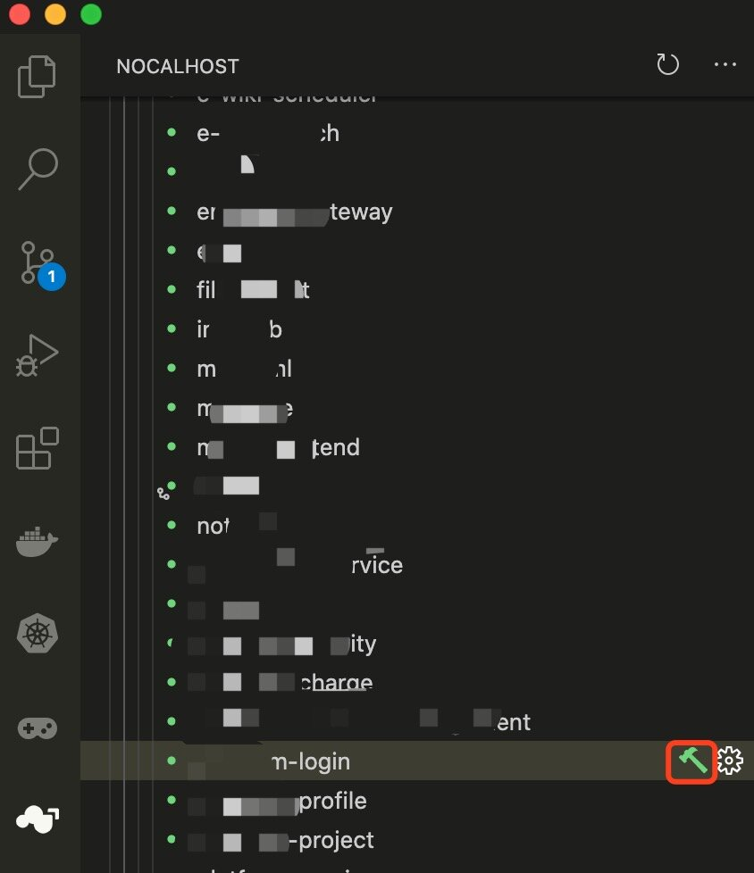
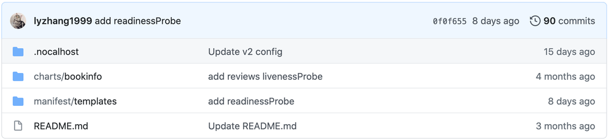
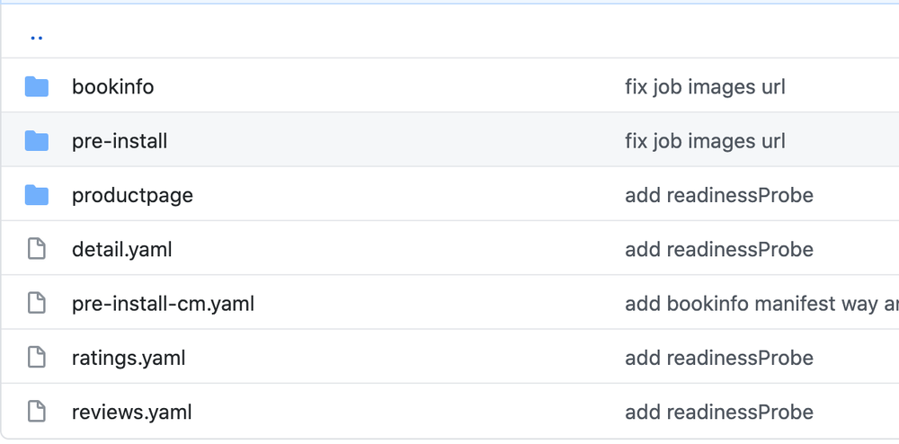

近期，腾讯云 CODING DevOps 开源了云原生开发环境 - Nocalhost。

根据官方文档介绍，Nocalhost 来源于 No Localhost，其含义是开发者不再依赖本地计算机的编码、调试和测试过程。他是一个云原生开发环境，旨在解决云原生下开发难的问题。

例如，在 Kubernetes 环境下进行微服务开发，通常会面临以下问题：

* **每次修改代码，都需要经过构建映像->推送映像->拉取映像->重新启动应用程序（Pod）的过程，开发的反馈循环非常长（10 分钟以上）；**
* 为了开发某个微服务，必须要在本地启动整个环境和所有微服务，这带来了过度依赖本地资源的问题；
* 开发人员只专注于他们自己的服务，随着迭代的进行，本地启动或更新完整的开发环境越来越难；
* 微服务之间的依赖关系和启动顺序难以控制；
* **新入职的员工一般需要 2-3 周的时间来熟悉开发环境的搭建及学习背景知识**

那么，Nocalhost 到底是怎么解决以上问题的？Nocalhost 的开源，又会给 K8s 生态带来哪些影响呢？带着这些问题，我们与 Nocalhsot 的设计者之一、新晋 CNCF 大使、云原生社区成员，来自腾讯云 CODING DevOps 的王炜，详细聊聊关于 Nocalhost 的产品、技术和生态。

## 采访嘉宾



以下为采访原文：

### Q: 首先跟大家介绍一下 Nocalhost 的起源吧

<王炜>：Nocalhost 的起源其实是解决 CODING 自身开发难的问题。CODING 在早期已经拥抱微服务、云原生和 Kubernetes，但在我们日常开发过程中，发现 Kubernetes 虽然解决了部署和运维的问题，但同时也带来了开发难的问题。

最典型的痛处是每写几行代码，要观察代码效果或者调试，就不得不重新构建镜像->推送镜像->修改工作负载镜像版本->等待 Pod 重建的漫长过程。这个过程虽然可以用自动化的 CI/CD 来解决一部分人工手动运行问题，但其核心不变。

此外，本地全量运行 CODING 所需的资源要求非常高，早期开发人员不得不配备一台 8 核 64G 的电脑来开发，后续也尝试过为每个人都配备了一台远程的高配开发机，但开发效率仍然无法提升。

针对这种场景，我们开始探索相应的解决方案，并最终将该实践开源成为了 Nocalhost 项目。

### Q：在云原生环境下，开发难除了体现在每次编码需要重新构建镜像以外，在实践中还遇到了其他痛点吗？

<王炜>：痛点非常多！以后端同学为例，从入职开始，熟悉和配置开发环境需要花大量的时间和精力。另外，好不容易搭建好了开发环境，需要更新微服务组件时往往出现大量组件无法启动。当然这可能更多的是应用管理问题了，目前社区也有非常好的应用模型实践。

但问题是，统一维护这套应用模型是非常吃力的，如果使用它的场景非常低频，那么问题暴露会越来越迟，最终与无人维护没有多大差别。而所有开发者的环境又是独立的，遇到问题总是自己解决而不是往上层去更新应用模型，这会进一步导致应用版本越来越老旧。

**所以，我们考虑开发环境是必须要集中化管理，开发环境的部署来源只能是独立维护的应用模型，业务组协同维护并产生部署 - 修改循环效应，才能实现一致性的应用管理。**

### Q：所以 Nocalhost 会管理应用和开发环境吗？

<王炜>：是的。应用管理是使用外部标准，例如 Manifest 文件组合成的应用、Helm 应用和 Kustomize 应用等，它是用于拉起开发环境的标准安装方法，不同的开发者的开发环境在 Nocalhost 里的定义是开发空间（DevSpace），目前是采用 Namespace 的方式进行隔离和管理的，不同开发空间后续将支持协作开发。应用和开发空间的管理都可以在 Nocalhost 控制台来实现。





### Q：Nocalhost 有哪些组件组成？

<王炜>：Nocalhost 主要由这几个组件组成：

* **管理侧（面对开发环境的管理人员）**
	* Nocalhost 控制台：提供开发人员管理、应用管理、开发空间管理等功能
    * Nocalhost Dep 组件：提供应用依赖管理，控制微服务依赖启动顺序

* **用户侧（开发者）**
	* nhctl-cli：Nocalhost 命令行工具，提供完整的功能
    * IDE 插件：提供 VS Code 插件和 JetBrains 插件

Nocalhost 工作示意图：




### Q：Nocalhost 对开发者来说最直观的使用感受是什么？

<王炜>：对开发者来说，最直观的使用感受是开发过程变得非常简单，从部署开发环境到开发只需要在 IDE 插件上进行简单的**四步**操作：

1. 一键拉起开发环境

	

2. 点击“锤子”进入待开发组件的“开发模式”

	

3. 在本地 IDE 编写代码，保存

4. **无需重新构建镜像，新代码在远端容器直接生效**

在使用 Nocalhost 进行服务开发时，屏蔽了开发所需的复杂背景知识，只需要具备语言开发基础，就能够立即进行业务代码的开发工作。

**目前在 CODING 最快的实践是：刚入职的新同学，中午接到需求后，下午就已经提交了业务代码。令人兴奋的是，他面对的需求是一套由 100 多个微服务组成的系统，这一切都是建立在他不了解任何 CODING 微服务架构、开发环境、甚至是业务代码的仓库地址（Nocalhost 已提前配置好）的背景下独立完成，这在以前的开发模式下是无法想象的。**

### Q：比如我已有一套业务系统，怎么使用 Nocalhost？

<王炜>：对于已有的业务系统，首先确认是否为 Kubernetes 标准的应用安装方式，例如 Manifest、Helm 和 Kustomize。

其次，Nocalhost 不侵入任何的业务逻辑，只需要使用声明式的配置方式提供开发参数配置即可，以开发 Istio 提供的 Bookinfo 为例。

以下是存放 Bookinfo 安装文件的 Git 仓库：https://github.com/nocalhost/bookinfo。

该仓库的目录结构如下图所示。



其中，`manifest/templates` 目录包含 Bookinfo Manifest 类型的安装文件：



当有了应用之后，我们便能够为该仓库创建 `.nocalhost/config.yaml` 来为 Nocalhost 提供开发参数。例如，这是 Bookinfo 应用以及 `productpage` 服务的部分开发参数：

```yaml
configProperties:
  version: v2

application:
  name: bookinfo
  # 应用类型
  manifestType: rawManifest
  # 应用 Manifest 的目录
  resourcePath: ["manifest/templates"]
  ignoredPath: []
  onPreInstall: []
  services:
    # 要开发的服务名称
    - name: productpage
      # 要开发的服务类型
      serviceType: deployment
      # 声明依赖服务，将会等待依赖启动后自身才会启动
      dependLabelSelector: 
        jobs:
          - "dep-job"
      containers:
        - name: productpage
          # 应用安装后自动端口转发
          install: 
            portForward:   
              - 39080:9080
          dev:
            # 定义源码仓库地址
            gitUrl: https://e.coding.net/codingcorp/nocalhost/bookinfo-productpage.git
            # 定义开发镜像
            image: codingcorp-docker.pkg.coding.net/nocalhost/dev-images/python:3.7.7-slim-productpage
            # 定义进入开发容器的 bash
            shell: bash
            workDir: /home/nocalhost-dev
            # 定义文件同步
            sync: 
              type: send
              filePattern: 
                - ./
              ignoreFilePattern:
                - ".git"
             # 开发模式自动端口转发
            portForward:
            - 39080:9080
```

在该配置文件中，我们为 Nocalhost 提供了 `productpage` 服务的一些开发参数。最后，再通过 Nocalhost 控制台创建该应用并提供仓库地址即可。

通过以上配置，便能够实现应用无缝迁移到 Nocalhost 进行开发。

### Q：Nocalhost 下一步的计划是什么？

<王炜>：Nocalhost 目前在 CODING 日常开发几乎已全员覆盖，但仍然有很多优化空间。

正如 Nocalhost 的 Slogan 一样，Nocalhost 的初心是让云原生开发回归原始而又简单。希望能为云原生开发环境提供探索和示范，并成为云原生生态不可缺少的一部分。

目前 Nocalhost 已进入 CNCF Landscape，后续将推进与 CNCF 更加深入的合作。

### Q：能否谈谈国内的云原生发展趋势和个人看法？

<王炜>：根据 Gartner 研究报告指出：到 2022 年，云原生和容器化的普及率将达到 75% 以上，这意味着云原生的大趋势已成为定局。K8s 作为强大的基础设施底座，为企业应用提供了极强的生产稳定性。

但随着我们对 K8s 的使用程度越来越深，会发现 K8s 面向“工作负载”的设计在一些场景下是需要提升的。围绕着这些问题的焦点，社区不断地在为 K8s 进行插件式的扩展。CNCF Landscape 中已有接近 400 个开源产品为 K8s 提供了额外能力，这些技术方向大致被分为了数据库、消息、应用定义和镜像构建等，产品数量仍然不断上升。

K8s 生态发展至今，个人认为目前有两大方向是急需社区来解决的：第一是应用定义模型，代表有 OAM 标准和 Kubevela，该方向与 DevOps、GitOps 具有紧密联系。第二是一直被忽略的应用开发。这两个方向都是提升大规模组织开发效率的关键。

尤其是应用开发方向，目前仍然没有标准规范和优秀的实践，我相信社区也一定会有标准诞生。

最后，欢迎大家加入云原生社区参与 Nocalhost 话题讨论。另外 Nocalhost 正在招聘，也欢迎对云原生领域感兴趣的同学加入我们。
