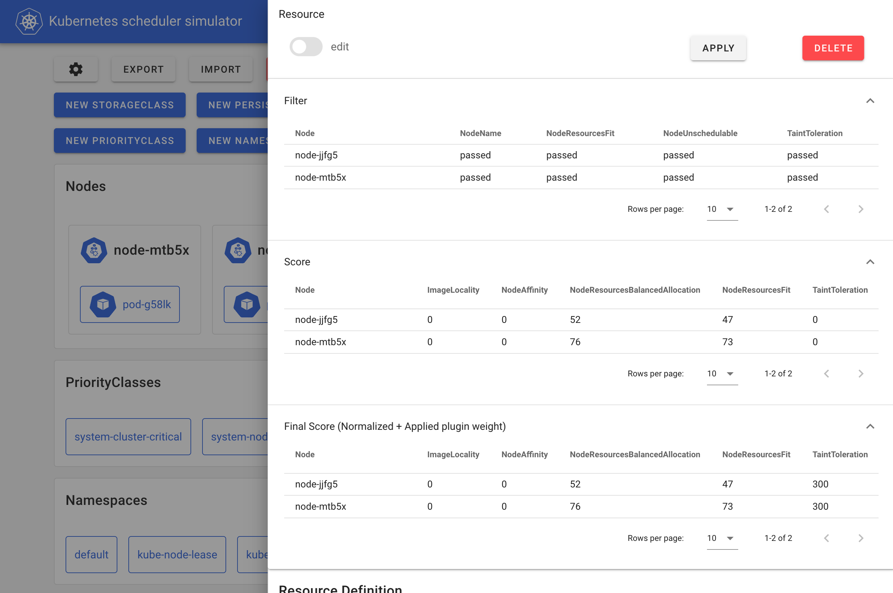

Kubernetes Scheduler 是控制面中的核心组件之一，负责决定每个 Pod 运行在哪个节点上。换句话说，所有使用 Kubernetes 的用户，其 Pod 的命运都掌握在调度器手中。

[kube-scheduler-simulator](https://github.com/kubernetes-sigs/kube-scheduler-simulator) 是一个 Kubernetes 调度器的“模拟器”，最初是我（Kensei Nakada）在 [Google Summer of Code 2021](https://summerofcode.withgoogle.com/) 中启动的项目，后续得到了众多贡献者的支持。这个工具的目标是帮助用户深入观察调度器的行为和决策逻辑。

无论你是使用诸如 [Pod 亲和性](https://kubernetes.io/zh-cn/docs/concepts/scheduling-eviction/assign-pod-node/#affinity-and-anti-affinity) 等调度约束的普通用户，还是开发自定义调度插件的调度器专家，这款模拟器都将成为你理解和测试调度策略的重要助手。

## 为什么我们需要一个调度器模拟器？

Kubernetes Scheduler 本质上是一个插件驱动的“黑盒”，每个插件从不同的角度参与调度决策，理解它的行为并不容易。

即使你在测试集群中看到 Pod 正常调度，也不能保证它是按你预期的逻辑调度的。这种“表面正常，实则偏差”的问题，往往会在生产环境中带来意想不到的调度后果。

此外，调度器的测试也非常具有挑战性。真实集群中的调度场景复杂多样，无法通过有限的测试用例全面覆盖。即使是 Kubernetes 官方的 upstream 调度器，也经常是在发布后才被用户发现问题。

虽然开发环境或沙箱集群是常用的测试手段，但这类环境通常规模较小、工作负载有限，与实际生产集群的行为存在巨大差异。因此，仅靠传统方法，很难预知调度器在真实环境中的表现。

kube-scheduler-simulator 诞生正是为了填补这一空白：

- 用户可以验证调度约束、调度器配置、自定义插件的行为；
- 可以在模拟环境中测试调度效果，而不影响实际的工作负载；
- 还能观察调度过程中的每一个决策细节，真正“把调度器变成白盒”。

## 模拟器具有什么能力？

kube-scheduler-simulator 的核心能力是：**揭示调度器内部的决策过程**。Kubernetes Scheduler 是基于 [调度框架（Scheduling Framework）](https://kubernetes.io/zh-cn/docs/concepts/scheduling-eviction/scheduling-framework/) 实现的，整个调度流程分为多个扩展点，如 Filter、Score、Bind 等，每个阶段会调用对应插件进行判断和打分。

模拟器提供了图形化界面，用户可以在其中创建 Pod、Node、Deployment 等 Kubernetes 资源，并清晰地看到调度器每个插件的执行结果和得分情况。



在这个模拟器中，我们运行的是一个 **可调试版本的调度器**，它会将各插件在不同阶段的执行结果写入 Pod 的注解中，前端界面再将这些信息进行可视化展示。

例如，你可以查看调度器在 Filter 阶段如何判断某个节点是否可用，在 Score 阶段各插件打了多少分，最终选择了哪个节点作为目标节点。这些信息都能在 Pod 的注解中查阅：

```yaml
kind: Pod
apiVersion: v1
metadata:
  # The JSONs within these annotations are manually formatted for clarity in the blog post. 
  annotations:
    kube-scheduler-simulator.sigs.k8s.io/bind-result: '{"DefaultBinder":"success"}'
    kube-scheduler-simulator.sigs.k8s.io/filter-result: >-
      {
        "node-jjfg5":{
            "NodeName":"passed",
            "NodeResourcesFit":"passed",
            "NodeUnschedulable":"passed",
            "TaintToleration":"passed"
        },
        "node-mtb5x":{
            "NodeName":"passed",
            "NodeResourcesFit":"passed",
            "NodeUnschedulable":"passed",
            "TaintToleration":"passed"
        }
      }      
    kube-scheduler-simulator.sigs.k8s.io/finalscore-result: >-
      {
        "node-jjfg5":{
            "ImageLocality":"0",
            "NodeAffinity":"0",
            "NodeResourcesBalancedAllocation":"52",
            "NodeResourcesFit":"47",
            "TaintToleration":"300",
            "VolumeBinding":"0"
        },
        "node-mtb5x":{
            "ImageLocality":"0",
            "NodeAffinity":"0",
            "NodeResourcesBalancedAllocation":"76",
            "NodeResourcesFit":"73",
            "TaintToleration":"300",
            "VolumeBinding":"0"
        }
      }       
    kube-scheduler-simulator.sigs.k8s.io/permit-result: '{}'
    kube-scheduler-simulator.sigs.k8s.io/permit-result-timeout: '{}'
    kube-scheduler-simulator.sigs.k8s.io/postfilter-result: '{}'
    kube-scheduler-simulator.sigs.k8s.io/prebind-result: '{"VolumeBinding":"success"}'
    kube-scheduler-simulator.sigs.k8s.io/prefilter-result: '{}'
    kube-scheduler-simulator.sigs.k8s.io/prefilter-result-status: >-
      {
        "AzureDiskLimits":"",
        "EBSLimits":"",
        "GCEPDLimits":"",
        "InterPodAffinity":"",
        "NodeAffinity":"",
        "NodePorts":"",
        "NodeResourcesFit":"success",
        "NodeVolumeLimits":"",
        "PodTopologySpread":"",
        "VolumeBinding":"",
        "VolumeRestrictions":"",
        "VolumeZone":""
      }      
    kube-scheduler-simulator.sigs.k8s.io/prescore-result: >-
      {
        "InterPodAffinity":"",
        "NodeAffinity":"success",
        "NodeResourcesBalancedAllocation":"success",
        "NodeResourcesFit":"success",
        "PodTopologySpread":"",
        "TaintToleration":"success"
      }      
    kube-scheduler-simulator.sigs.k8s.io/reserve-result: '{"VolumeBinding":"success"}'
    kube-scheduler-simulator.sigs.k8s.io/result-history: >-
      [
        {
            "kube-scheduler-simulator.sigs.k8s.io/bind-result":"{\"DefaultBinder\":\"success\"}",
            "kube-scheduler-simulator.sigs.k8s.io/filter-result":"{\"node-jjfg5\":{\"NodeName\":\"passed\",\"NodeResourcesFit\":\"passed\",\"NodeUnschedulable\":\"passed\",\"TaintToleration\":\"passed\"},\"node-mtb5x\":{\"NodeName\":\"passed\",\"NodeResourcesFit\":\"passed\",\"NodeUnschedulable\":\"passed\",\"TaintToleration\":\"passed\"}}",
            "kube-scheduler-simulator.sigs.k8s.io/finalscore-result":"{\"node-jjfg5\":{\"ImageLocality\":\"0\",\"NodeAffinity\":\"0\",\"NodeResourcesBalancedAllocation\":\"52\",\"NodeResourcesFit\":\"47\",\"TaintToleration\":\"300\",\"VolumeBinding\":\"0\"},\"node-mtb5x\":{\"ImageLocality\":\"0\",\"NodeAffinity\":\"0\",\"NodeResourcesBalancedAllocation\":\"76\",\"NodeResourcesFit\":\"73\",\"TaintToleration\":\"300\",\"VolumeBinding\":\"0\"}}",
            "kube-scheduler-simulator.sigs.k8s.io/permit-result":"{}",
            "kube-scheduler-simulator.sigs.k8s.io/permit-result-timeout":"{}",
            "kube-scheduler-simulator.sigs.k8s.io/postfilter-result":"{}",
            "kube-scheduler-simulator.sigs.k8s.io/prebind-result":"{\"VolumeBinding\":\"success\"}",
            "kube-scheduler-simulator.sigs.k8s.io/prefilter-result":"{}",
            "kube-scheduler-simulator.sigs.k8s.io/prefilter-result-status":"{\"AzureDiskLimits\":\"\",\"EBSLimits\":\"\",\"GCEPDLimits\":\"\",\"InterPodAffinity\":\"\",\"NodeAffinity\":\"\",\"NodePorts\":\"\",\"NodeResourcesFit\":\"success\",\"NodeVolumeLimits\":\"\",\"PodTopologySpread\":\"\",\"VolumeBinding\":\"\",\"VolumeRestrictions\":\"\",\"VolumeZone\":\"\"}",
            "kube-scheduler-simulator.sigs.k8s.io/prescore-result":"{\"InterPodAffinity\":\"\",\"NodeAffinity\":\"success\",\"NodeResourcesBalancedAllocation\":\"success\",\"NodeResourcesFit\":\"success\",\"PodTopologySpread\":\"\",\"TaintToleration\":\"success\"}",
            "kube-scheduler-simulator.sigs.k8s.io/reserve-result":"{\"VolumeBinding\":\"success\"}",
            "kube-scheduler-simulator.sigs.k8s.io/score-result":"{\"node-jjfg5\":{\"ImageLocality\":\"0\",\"NodeAffinity\":\"0\",\"NodeResourcesBalancedAllocation\":\"52\",\"NodeResourcesFit\":\"47\",\"TaintToleration\":\"0\",\"VolumeBinding\":\"0\"},\"node-mtb5x\":{\"ImageLocality\":\"0\",\"NodeAffinity\":\"0\",\"NodeResourcesBalancedAllocation\":\"76\",\"NodeResourcesFit\":\"73\",\"TaintToleration\":\"0\",\"VolumeBinding\":\"0\"}}",
            "kube-scheduler-simulator.sigs.k8s.io/selected-node":"node-mtb5x"
        }
      ]      
    kube-scheduler-simulator.sigs.k8s.io/score-result: >-
      {
        "node-jjfg5":{
            "ImageLocality":"0",
            "NodeAffinity":"0",
            "NodeResourcesBalancedAllocation":"52",
            "NodeResourcesFit":"47",
            "TaintToleration":"0",
            "VolumeBinding":"0"
        },
        "node-mtb5x":{
            "ImageLocality":"0",
            "NodeAffinity":"0",
            "NodeResourcesBalancedAllocation":"76",
            "NodeResourcesFit":"73",
            "TaintToleration":"0",
            "VolumeBinding":"0"
        }
      }      
    kube-scheduler-simulator.sigs.k8s.io/selected-node: node-mtb5x
```

不仅如此，用户还可以集成自己开发的 [调度插件](https://kubernetes.io/zh-cn/docs/concepts/scheduling-eviction/scheduling-framework/) 或 [调度扩展器（Extender）](https://github.com/kubernetes/design-proposals-archive/blob/main/scheduling/scheduler_extender.md)，并在模拟器中观察其行为，调试效果显著提升。

该可调试调度器还可以脱离模拟器独立运行，用于集成测试、自定义调度器的开发或真实集群中的调试分析。

## 模拟器 = 更好的开发环境？

如前所述，真实调度场景复杂多样，单靠开发集群无法覆盖全部可能性。模拟器提供了一个更强大的方案：

通过使用 [集群资源导入功能](https://github.com/kubernetes-sigs/kube-scheduler-simulator/blob/master/simulator/docs/import-cluster-resources.md)，用户可以将生产集群的资源同步到模拟器中，**在不影响实际业务的前提下测试新版本调度器**。

你可以在模拟器中验证 Pod 的调度行为是否符合预期，再将调度器部署到生产集群，极大降低了调度相关的变更风险。

## 使用场景总结

1. **集群用户**：验证调度约束（如 PodAffinity、TopologySpread）是否按预期工作；
2. **集群管理员**：评估调度器配置变更对调度结果的影响；
3. **调度器插件开发者**：在模拟器中测试自定义插件、使用同步功能进行更真实的验证。

## 如何上手？

这个项目无需 Kubernetes 集群，只需要本地安装 Docker 即可：

```bash
git clone git@github.com:kubernetes-sigs/kube-scheduler-simulator.git
cd kube-scheduler-simulator
make docker_up
```

默认情况下，Web 界面将运行在 `http://localhost:3000`，即可开始你的调度实验！

👉 项目地址：https://github.com/kubernetes-sigs/kube-scheduler-simulator

## 如何参与贡献？

该项目由 [Kubernetes SIG Scheduling](https://github.com/kubernetes/community/blob/master/sig-scheduling/README.md#kube-scheduler-simulator) 维护。欢迎你提出 Issues、提交 PR，也欢迎加入社区参与讨论。

Slack 频道：[#sig-scheduling](https://kubernetes.slack.com/messages/sig-scheduling)

## 鸣谢

这个模拟器的发展离不开众多志愿者工程师的坚持和贡献，感谢所有为之付出心力的 [贡献者们](https://github.com/kubernetes-sigs/kube-scheduler-simulator/graphs/contributors)！

