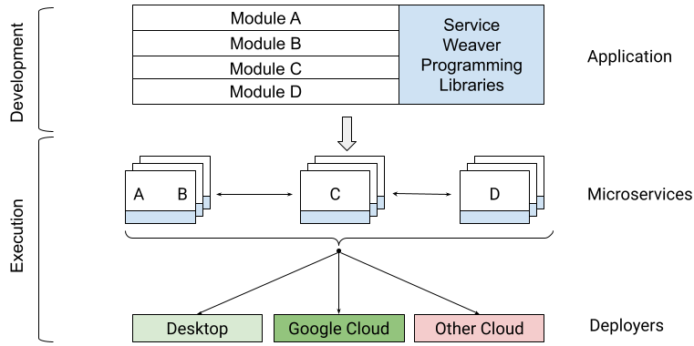
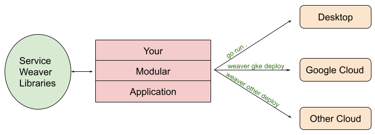

> 编者按：近日 Google 开源了一个名为 Service Weaver 的开源框架，它可以帮助开发者构建和部署分布式应用程序。Service Weaver 的特点是，它允许开发者以模块化单体的方式编写应用程序，然后使用自定义部署器将其部署为一组微服务。这样，开发者可以在不改变代码的情况下，灵活地调整应用程序的架构和性能。[Google 开源博客](https://opensource.googleblog.com/2023/03/introducing-service-weaver-framework-for-writing-distributed-applications.html)介绍了该项目，并给出了开源地址：https://github.com/ServiceWeaver/weaver

**Service Weaver 是一个用于构建和部署分布式应用程序的开源框架**。Service Weaver 允许您将应用程序编写为**模块化单体**，并将其部署为一组微服务。

更具体地说，Service Weaver 由两个核心部分组成：

1. 一组编程库，可让您将应用程序编写为单个**模块化**二进制文件，仅使用本机数据结构和方法调用，以及
2. 一组部署器，可让您配置应用程序的运行时拓扑并将其部署为一组微服务，可以在本地或在您选择的云上部署。

 

通过将应用程序编写过程与运行时考虑因素（例如应用程序如何拆分为微服务、使用何种数据序列化格式以及如何发现服务）分离，Service Weaver 旨在提高分布式应用程序开发速度和性能。

### 构建 Service Weaver 的动机

在编写基于微服务的应用程序时，我们发现维护多个不同的微服务二进制文件（具有它们自己的配置文件、网络端点和可序列化数据格式）的开销大大降低了我们的开发速度。

更重要的是，**微服务严重影响我们进行跨二进制更改的能力**。 使得我们不得不做一些事情，比如在每个二进制文件中标记新功能，仔细地改进我们的数据格式，并深入了解我们的上线过程。 最后，拥有预定数量的特定微服务会有效地冻结我们的 API； 它们变得如此难以更改，以至于将我们所有的更改都压缩到现有的 API 中而不是改进它们。

因此，我们希望我们有一个单一的整体二进制文件来使用。 单体二进制文件易于编写：它们仅使用语言原生类型和方法调用。 它们也很容易更新：只需编辑源代码并重新部署。 它们很容易在本地或虚拟机中运行：只需执行二进制文件即可。

**Service Weaver 是一个提供两全其美的框架：单体应用程序的开发速度，以及微服务的可扩展性、安全性和容错性。**

## 服务编织器概述

Service Weaver 的核心思想是它的**模块化单体**模型。 您编写单个二进制文件，仅使用语言的原生数据结构和方法调用。 您将二进制文件组织成一组称为组件的模块，它们是您的编程语言中的原生类型。 例如，这是一个使用 Service Weaver 用 Go 语言编写的简单应用程序。 它由一个 main() 函数和一个 Adder 组件组成：

```go
type Adder interface { 
    Add(context.Context, int, int) (int, error)
} 
type adder struct{ 
    weaver.Implements[Adder]
}
func (adder) Add(_ context.Context, x, y int) (int, error) {
  return x + y, nil
}

func main() {
  ctx := context.Background()
  root := weaver.Init(ctx)
  adder, err := weaver.Get[Adder](root)
  sum, err := adder.Add(ctx, 1, 2)
}
```

运行上述应用程序时，您可以进行简单的配置选择，即是将 Adder 组件放置在 main() 函数中还是单独放置。 当 Adder 组件分离时，Service Weaver 框架自动将 Add 调用翻译成跨机 RPC； 否则，Add 调用仍然是本地方法调用。

要更改上述应用程序，例如向 Add 方法添加无限数量的参数，您所要做的就是更改 Add 的签名，更改其调用站点，然后重新部署您的应用程序。 Service Weaver 确保新版本的 main() 只与新版本的 Adder 通信，无论它们是否位于同一位置。 这种行为与使用语言原生数据结构和方法调用相结合，使您可以专注于编写应用程序逻辑，而不必担心部署拓扑和服务间通信（例如，代码中没有原型、存根或 RPC 通道）。

当需要运行您的应用程序时，Service Weaver 允许您在任何地方运行它——在您的本地桌面环境或本地机器机架上，或在云中——而无需对您的应用程序代码进行任何更改。 这种级别的可移植性是通过将关注点明确分离到 Service Weaver 框架中来实现的。 一方面，我们有应用程序开发的编程框架。 另一方面，我们有各种 **deployer** 实现，每个部署环境一个。

 

这种关注点分离允许您通过 go run 在单个进程中本地运行您的应用程序。 或者通过 weaver gke deploy 在谷歌云上运行它； 或者在其他平台上启用并运行它。 在所有这些情况下，您无需修改或重新编译您的应用程序即可获得相同的应用程序行为。

## Service Weaver v0.1 中有什么？

Service Weaver 的 v0.1 版本包括：

- 用于编写应用程序的 核心[Go 库](https://github.com/ServiceWeaver/weaver)
- 许多用于在[本地](https://github.com/ServiceWeaver/weaver/tree/main/cmd/weaver)或[GKE 上](https://github.com/ServiceWeaver/weaver-gke)运行您的应用程序的部署程序
- [一组 API](https://github.com/ServiceWeaver/weaver/tree/main/runtime)，允许您为任何其他平台编写自己的部署程序

所有库都是在 Apache 2.0 许可下发布的。请注意，在发布 v1.0 版之前， **我们可能会引入重大更改**。