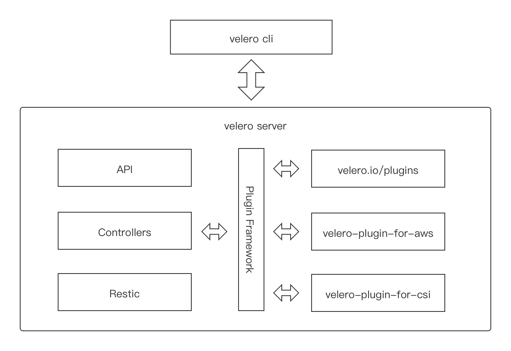
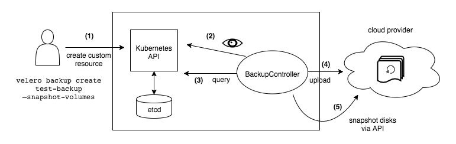

# 1 简介
Velero前身是Heptio Ark ，是由GO语言编写的一款用于灾难恢复和迁移工具，可以安全的备份、恢复和迁移Kubernetes集群资源和持久卷。

**Velero主要提供以下能力**
- 备份Kubernetes 集群资源，并在资源丢失情况下进行还原
- 将集群资源迁移到其他集群
- 将生产集群复制到开发和测试集群

**Velero 主要组件**
- Velero 组件主要包括服务器端和客户端两部分
- 服务端：运行在你Kubernetes 的集群中
- 客户端：运行在本地的命令行工具，本地环境需要配置好Kubernetes 集群的kubeconfig 及kubectl 客户端工具

**Velero 支持备份存储**
- Azure BloB 存储
- Google Cloud 存储
- AWS S3 及兼容S3 的存储（比如：MinIO）
- Aliyun OSS 存储

# 2 原理
Velero 的基本原理就是将Kubernetes 集群资源对象数据备份到对象存储中，并能从对象存储中拉取备份数据来恢复集群资源对象数据。不同于etcd 备份——将集群的全部资源备份起来——Velero 是对Kubernetes 集群内资源对象级别进行备份，可以通过对Type、Namespace、Label等对象进行分类备份或者恢复。Velero的操作（backup, scheduled backup, restore）都是CRD自定义资源，存储etcd中。
Velero的整体模块架构如下图1，首先，客户端是一个简单的交互客户端Velero-cli，封装了各种命令参数，可以执行安装、配置、备份、恢复等操作。服务端则可以类比成一个典型的kubebuild 的operator，首先是不同的CR，也就是API。中间Controller 层需要用到一些相对比较独立的服务时，都会通过插件系统来对接到内部或者外部的插件服务。底层的数据拷贝层是对接Restic。其它都是外部的插件实现，velero.io/plugins 就代表内部的插件实现，由Velero 或者第三方厂商来实现。


## 2.1 按需备份（On-demand backups）
**backup：** 将复制的Kubernetes 资源对象上传到对象存储中，且可选择调用云环境提供的API 来创建持久化卷快照，以及可选择指定在备份期间执行backup hook操作（比如：可能需要在快照之前告诉数据库将其内存中的缓存刷新到磁盘）。
**Tips：** backup操作并不是严格的原子性备份，在备份期间，若是有Kubernetes 资源对象被新建或编辑操作，则这个操作变动可能不会被包含在backup备份中。
**指令：**
`velero backup create test-backup`
**流程：**
- Velero客户端向Kubernetes API server 发起创建Backup对象的请求
- BackupController 检测到新建Backup对象，并进行参数验证
- BackupController 开始备份执行过程。通过与API server交互，获取需要备份的资源数据
- BackupController 向对象存储服务（如：AWS S3）发起上传备份数据请求
- 默认情况，backup操作是会对持久卷（PV）进行磁盘快照备份的，不过是可以通过--snapshot-volumes=false进行取消



## 2.2 备份还原（Restores）
**restore：** 对历史备份的Kubernetes 资源对象和持久卷进行还原，且允许按需选择指定部分资源对象还原到指定命名空间（Namespace）中。且可以选择在备份还原期间或还原后执行restore hook操作（比如：执行自定义数据库的还原操作之后，再执行数据库应用容器启动动作）。
**Tips：** 默认情况下，Velero进行的是非破坏性还原操作（non-destructive restore），这意味着它不会删除目标集群上的任何数据——即如果备份中的资源对象已经存在于目标集群中，restore操作将会跳过该资源的还原。当然，也可通配置更新策略(--existing-resource-policy=update)，尝试更新目标集群中已存在资源，以匹配备份中的资源数据。
**指令：**
`velero restore create`
**流程：**
- Velero客户端向Kubernetes API server 发起创建Restore对象的请求
- RestoreController 检测到新建Restore 对象，并进行参数验证
- RestoreController 从对象存储服务处获取待还原备份资源数据信息，并进行备份资源还原前的一些预处理工作（比如：备份资源的API versions版本验证）
- RestoreController 开始备份还原执行过程，一次性还原所有指定待还原资源

## 2.3 定时备份（Scheduled backups）
**schedule：** 可以定期备份数据。在schedule 创建后，便创建第一次备份，随后备份将按照指定调度周期（由 Cron 表达式指定）进行备份。定时备份保存的名称为 <SCHEDULE NAME>-<TIMESTAMP>，其中 <TIMESTAMP> 格式为 YYYYMMDDhhmmss。

## 2.4 API versions
Velero备份资源时，使用Kubernetes API 首选版本为每个组（group）/资源（CRD）备份。而还原备份的目标集群中，必须存在相同API 组（group）/资源（CRD）版本。需要注意的是：只是需要存在，而并不是需要首选版本。例如，如果正在备份的集群在 things API 组中有一个 gizmos 资源，group/versions为 things/v1alpha1、things/v1beta1 和 things/v1，并且服务器的首选group/versions 是 things/v1，那么所有 gizmos 将从 things/v1 API 端点备份。 当从该集群恢复备份时，目标集群必须具有 things/v1 端点才能恢复 Gizmo。

## 2.5 备份存储
Velero有2种备份存储方式：

**1.Restic方式备份**
Restic 是一款 GO 语言开发的开源免费且快速、高效和安全的跨平台备份工具。它是文件系统级别备份持久卷数据并将其发送到 Velero 的对象存储。执行速度取决于本地IO能力，网络带宽和对象存储性能，相对快照方式备份慢。 但如果当前集群或者存储出现问题，由于所有资源和数据都存储在远端的对象存储上， 用Restic方式备份可以很容易的将应用恢复。
**Tips：** 使用 Restic 来对 PV 进行备份会有一些限制：
- 不支持备份 hostPath，支持EFS、AzureFile、NFS、emptyDir、local 或其他没有本地快照概念的卷类型
- 备份数据标志只能通过 Pod 来识别
- 单线程操作大量文件比较慢

**2.快照方式备份**
Velero使用一组 BackupItemAction 插件针对 PersistentVolumeClaims 进行备份，执行速度快。它创建一个以 PersistentVolumeClaim 作为源的 VolumeSnapshot 对象， 此 VolumeSnapshot 对象与用作源的 PersistentVolumeClaim 位于同一命名空间中，与VolumeSnapshot对应的 VolumeSnapshotContent 对象是一个集群范围的资源，将指向存储系统中基于磁盘的实际快照。Velero 备份时将所有 VolumeSnapshots 和 VolumeSnapshotContents 对象上传到对象存储系统， 但是Velero 备份后的数据资源仍然保存在集群的存储上。数据可用性依赖于本地存储的高可用性，因为如果是由于存储故障导致的应用问题，Velero的快照备份机制并不能恢复应用数据。

# 3 部署
## 3.1 MinIO对象存储部署
Velero 依赖对象存储保存备份数据，这里部署MinIO 替代公有云对象存储。

**1. Yaml文件——minio.yaml**
```
apiVersion: v1
kind: Namespace
metadata:
  name: velero
---
apiVersion: apps/v1
kind: Deployment
metadata:
  namespace: velero
  name: minio
  labels:
    component: minio
spec:
  strategy:
    type: Recreate
  selector:
    matchLabels:
      component: minio
  template:
    metadata:
      labels:
        component: minio
    spec:
      nodeSelector:
        kubernetes.io/hostname: k8smaster1
      volumes:
      - hostPath:
          path: /data/minio
          type: DirectoryOrCreate
        name: storage
      - name: config
        emptyDir: {}
      containers:
      - name: minio
        image: nexus.cmss.com:8086/minio/minio:latest
        imagePullPolicy: IfNotPresent
        args:
        - server
        - /data
        - --config-dir=/config
        - --console-address=:9001
        env:
        - name: MINIO_ROOT_USER
          value: "admin"
        - name: MINIO_ROOT_PASSWORD
          value: "minio123"
        ports:
        - containerPort: 9000
        - containerPort: 9001
        volumeMounts:
        - name: storage
          mountPath: /data
        - name: config
          mountPath: "/config"
        resources:
          limits:
            cpu: "1"
            memory: 2Gi
          requests:
            cpu: "1"
            memory: 2Gi
---
apiVersion: v1
kind: Service
metadata:
  namespace: velero
  name: minio
  labels:
    component: minio
spec:
  sessionAffinity: None
  type: NodePort
  ports:
  - name: port-9000
    port: 9000
    protocol: TCP
    targetPort: 9000
    nodePort: 30080
  - name: console
    port: 9001
    protocol: TCP
    targetPort: 9001
    nodePort: 30081
  selector:
    component: minio
---
apiVersion: batch/v1
kind: Job
metadata:
  namespace: velero
  name: minio-setup
  labels:
    component: minio
spec:
  template:
    metadata:
      name: minio-setup
    spec:
      nodeSelector:
        kubernetes.io/hostname: k8smaster1
      restartPolicy: OnFailure
      volumes:
      - name: config
        emptyDir: {}
      containers:
      - name: mc
        image: nexus.cmss.com:8086/minio/mc:latest
        imagePullPolicy: IfNotPresent
        command:
        - /bin/sh
        - -c
        - "mc --config-dir=/config config host add velero http://minio.velero.svc.cluster.local:9000 admin minio123 && mc --config-dir=/config mb -p velero/velero"
        volumeMounts:
        - name: config
          mountPath: "/config"
```

**2.执行指令**
```
➜~ kubectl apply -f minio.yaml
➜~ kubectl get all -n velero
NAME                          READY   STATUS              RESTARTS   AGE
pod/minio-787b7d55d8-8cvbr    1/1     Running             0          5m50s
pod/minio-setup-xprzx         0/1     Completed           0          5m50s

NAME            TYPE       CLUSTER-IP     EXTERNAL-IP   PORT(S)                         AGE
service/minio   NodePort   10.233.53.74   <none>        9000:30080/TCP,9001:30081/TCP   5m50s

NAME                     READY   UP-TO-DATE   AVAILABLE   AGE
deployment.apps/minio    1/1     1            1           5m50s

NAME                                DESIRED   CURRENT   READY   AGE
replicaset.apps/minio-787b7d55d8    1         1         1       5m50s

NAME                    COMPLETIONS   DURATION   AGE
job.batch/minio-setup   1/1           5s         5m50s
```
**3.验证**
然后我们可以通过 http://<nodeip>:30081，访问 MinIO的 console 页面

**Tips：** 当然如果需要在不同 Kubernetes 和存储池集群备份与恢复数据，需要将 MinIO 服务端安装在 Kubernetes 集群外，保证在集群发生灾难性故障时，不会对备份数据产生影响，可以通过二进制的方式进行安装。

## 3.2 Velero客户端
在 Github (https://github.com/vmware-tanzu/velero/releases)下载指定的 velero 二进制客户端，解压放置$PATH路径

```
➜~ wget https://github.com/vmware-tanzu/velero/releases/download/v1.8.1/velero-v1.8.1-linux-amd64.tar.gz
➜~ tar -zxvf velero-v1.8.1-linux-amd64.tar.gz && cd velero-v1.8.1-linux-amd64
➜~ tree .
.
├── LICENSE
├── examples
│   ├── README.md
│   ├── minio
│   │   └── 00-minio-deployment.yaml
│   └── nginx-app
│       ├── README.md
│       ├── base.yaml
│       └── with-pv.yaml
└── velero
➜~ cp velero /usr/local/bin && chmod +x /usr/local/bin/velero
➜~ velero version
Client:
        Version: v1.8.1
        Git commit: 18ee078dffd9345df610e0ca9f61b31124e93f50
Server:
        Version: v1.8.1
```

## 3.3 Velero 服务端
1. 首先准备密钥文件，access key id 和 secret access key 为MinIO 的用户名和密码
```
# 秘钥文件credentials-velero
[default]
aws_access_key_id=<access key id>
aws_secret_access_key=<secret access key>
```
2. 可以使用 velero 客户端来安装服务端，也可以使用 Helm Chart 来进行安装。比如本文以客户端来安装，velero 命令默认读取 kubectl 配置的集群上下文，所以前提是 velero 客户端所在的节点有可访问集群的 kubeconfig 配置。
```
➜~ velero install \
--provider aws \
--bucket velero \
--image nexus.cmss.com:8086/velero/velero:v1.8.1 \
--plugins nexus.cmss.com:8086/velero/velero-plugin-for-aws:v1.4.1 \
--namespace velero \
--secret-file /home/qm/velero/velero-v1.8.1-linux-amd64/credentials-velero \
--use-volume-snapshots=false \
--default-volumes-to-restic=true \
--kubeconfig=/root/.kube/config \
--use-restic \
--backup-location-config region=minio,s3ForcePathStyle="true",s3Url=http://36.133.114.143:30080

......  
DaemonSet/restic: created  
Velero is installed! ⛵ Use 'kubectl logs deployment/velero -n velero' to view the status.  

# 根据实际Kubernetes 部署环境修改hostPath路径
➜~ kubectl -n velero patch daemonset restic -p '{"spec":{"template":{"spec":{"volumes":[{"name":"host-pods","hostPath":{"path":"/apps/data/kubelet/pods"}}]}}}}' 

# 查看服务启动情况
➜~ kubectl get all -n velero 
NAME                          READY   STATUS              RESTARTS   AGE
pod/minio-787b7d55d8-8cvbr    1/1     Running             0          6m40s
pod/minio-setup-xprzx         0/1     Completed           0          6m40s 
pod/restic-2prk8              1/1     Running             0          22s
pod/restic-fhv4p              1/1     Running             0          22s
pod/restic-x7rsd              1/1     Running             0          22s
pod/velero-6c766b88cd-6cc8p   1/1     Running             0          22s

NAME            TYPE       CLUSTER-IP     EXTERNAL-IP   PORT(S)                         AGE
service/minio   NodePort   10.233.53.74   <none>        9000:30080/TCP,9001:30081/TCP   6m40s

NAME                    DESIRED   CURRENT   READY   UP-TO-DATE   AVAILABLE   NODE SELECTOR   AGE
daemonset.apps/restic   3         3         3       3            3           <none>         22s

NAME                     READY   UP-TO-DATE   AVAILABLE   AGE
deployment.apps/minio    1/1     1            1           6m40s
deployment.apps/velero   1/1     1            1           22s

NAME                                DESIRED   CURRENT   READY   AGE
replicaset.apps/minio-787b7d55d8    1         1         1       6m40s
replicaset.apps/velero-6c766b88cd   1         1         1       22s

NAME                    COMPLETIONS   DURATION   AGE
job.batch/minio-setup   1/1           5s         6m40s
```
**Tips：**
- 这里使用 MinIO 作为对象存储，MinIO 是兼容 S3 的，所以配置的 provider（声明使用的 Velero 插件类型）是 AWS，
- --secret-file 用来提供访问 MinIO 的密钥
- --use-restic 表示使用开源免费备份工具 restic 备份和还原持久卷数据，启用该参数后会部署一个名为 restic 的 DaemonSet 对象
- --plugins 使用的 velero 插件，本文使用 AWS S3 兼容插件。
- s3Url 配置MinIO 服务对外暴露的nodePort端口及部署节点IP
- 需要注意的是启动需要修改Restic DaemonSet spec 配置，调整为实际环境中Kubernetes 指定pod 保存路径的hostPath

# 4 测试
 本次测试服务使用的是一个多集群查询服务Clusterpedia（包含使用本底存储的MySQL+3个deployment等资源）。具体使用细节可以参考相关官方文档（https://clusterpedia.io/zh-cn/docs/installation/kubectl-apply/）
1. 部署Clusterpedia服务
```
➜~ kubectl get all -n clusterpedia-system
NAME                                                       READY   STATUS    RESTARTS   AGE
pod/clusterpedia-apiserver-c5884f6f5-gqmnn                 1/1     Running   0          1m
pod/clusterpedia-clustersynchro-manager-7c7b47d6ff-vrlwp   1/1     Running   0          1m
pod/clusterpedia-controller-manager-f5d84c777-jpm2d        1/1     Running   0          1m
pod/clusterpedia-internalstorage-mysql-785597b897-ghkhl    1/1     Running   0          2m

NAME                                         TYPE        CLUSTER-IP                EXTERNAL-IP   PORT(S)    AGE
service/clusterpedia-apiserver               ClusterIP   fd11:1111:1111:15::16f2   <none>        443/TCP    1m
service/clusterpedia-internalstorage-mysql   ClusterIP   fd11:1111:1111:15::6910   <none>        3306/TCP   2m

NAME                                                  READY   UP-TO-DATE   AVAILABLE   AGE
deployment.apps/clusterpedia-apiserver                1/1     1            1           1m
deployment.apps/clusterpedia-clustersynchro-manager   1/1     1            1           1m
deployment.apps/clusterpedia-controller-manager       1/1     1            1           1m
deployment.apps/clusterpedia-internalstorage-mysql    1/1     1            1           2m

NAME                                                             DESIRED   CURRENT   READY   AGE
replicaset.apps/clusterpedia-apiserver-c5884f6f5                 1         1         1       1m
replicaset.apps/clusterpedia-clustersynchro-manager-7c7b47d6ff   1         1         1       1m
replicaset.apps/clusterpedia-controller-manager-f5d84c777        1         1         1       1m
replicaset.apps/clusterpedia-internalstorage-mysql-785597b897    1         1         1       2m
```
2. 接入集群，其他集群（具体可参考https://clusterpedia.io/zh-cn/docs/usage/import-clusters/）
```
➜~ ll pediacluster-*
-rw-r--r-- 1 root root 3366 Jul 14 19:23 pediacluster-37-k8s.yaml
➜~ more pediacluster-37-k8s.yaml
apiVersion: cluster.clusterpedia.io/v1alpha2
kind: PediaCluster
metadata:
  name: 37-k8s
spec:
  apiserver: "https://100.71.10.37:6443"
  caData: LS0tLS1CRUd...LQo=
  tokenData: ZXlKaGJHY2lP...IQQ==
  syncResources:
  - group: apps
    resources:
    - "*"
  - group: ""
    resources:
    - "*"

➜~ kubectl apply -f pediacluster-37-k8s.yaml
pediacluster.cluster.clusterpedia.io/37-k8s created
➜~ kubectl get pediacluster -owide
NAME     READY   VERSION         APISERVER                   VALIDATED   SYNCHRORUNNING   CLUSTERHEALTHY
37-k8s   True    v1.21.5-eki.0   https://100.71.10.37:6443   Validated   Running          Healthy
```
3. 查看数据
```
➜~ kubectl exec -it pod/clusterpedia-internalstorage-mysql-785597b897-ghkhl -n clusterpedia-system -- bash
root@clusterpedia-internalstorage-mysql-785597b897-ghkhl:/#  mysql -uroot -p'dangerous0'
mysql: [Warning] Using a password on the command line interface can be insecure.
Welcome to the MySQL monitor.  Commands end with ; or \g.
Your MySQL connection id is 41
Server version: 8.0.27 MySQL Community Server - GPL

Copyright (c) 2000, 2021, Oracle and/or its affiliates.

Oracle is a registered trademark of Oracle Corporation and/or its
affiliates. Other names may be trademarks of their respective
owners.

Type 'help;' or '\h' for help. Type '\c' to clear the current input statement.
mysql> show databases;
+--------------------+
| Database           |
+--------------------+
| clusterpedia       |
| information_schema |
| mysql              |
| performance_schema |
| sys                |
+--------------------+
5 rows in set (0.00 sec)

mysql> use clusterpedia;
Reading table information for completion of table and column names
You can turn off this feature to get a quicker startup with -A

Database changed
mysql> select count(1) from clusterpedia.resources;
+----------+
| count(1) |
+----------+
|     3392 |
+----------+
1 row in set (0.01 sec)

mysql> select r.id, r.group, r.version, r.resource, r.kind, r.name, r.namespace from clusterpedia.resources r order by id limit 10;
+----+-----------------+---------+-------------------+------------------+----------------------------------------------------------------------+---------------+
| id | group           | version | resource          | kind             | name                                                                 | namespace     |
+----+-----------------+---------+-------------------+------------------+----------------------------------------------------------------------+---------------+
|  1 | storage.k8s.io  | v1      | csinodes          | CSINode          | k8snode3                                                             |               |
|  2 |                 | v1      | limitranges       | LimitRange       | ingress-nginx                                                        | ingress-nginx |
|  3 | storage.k8s.io  | v1      | volumeattachments | VolumeAttachment | csi-9b8f084b5225ec3f483ccd9ad9acc01e1827c33e504fb440e8c07f527cf8256d |               |
|  4 | storage.k8s.io  | v1      | storageclasses    | StorageClass     | csi-qcfs                                                             |               |
|  5 | storage.k8s.io  | v1      | storageclasses    | StorageClass     | csi-qcfs-archive                                                     |               |
|  6 |                 | v1      | nodes             | Node             | k8snode2                                                             |               |
|  7 | storage.k8s.io  | v1      | storageclasses    | StorageClass     | csi-qcfs-data                                                        |               |
|  8 | storage.k8s.io  | v1      | storageclasses    | StorageClass     | local-storage                                                        |               |
|  9 |                 | v1      | nodes             | Node             | k8snode3                                                             |               |
| 10 | proxy.orain.com | v1      | maxscales         | Maxscale         | a7ced5ba066-bf53e-proxy                                              | qfusion-admin |
+----+-----------------+---------+-------------------+------------------+----------------------------------------------------------------------+---------------+
10 rows in set (0.00 sec)

# 使用clusterpedia服务查询指定集群（37-k8s）资源数据信息
➜~ kubectl --cluster 37-k8s get deployments -n kube-system
CLUSTER   NAME                      READY   UP-TO-DATE   AVAILABLE   AGE
37-k8s    calico-kube-controllers   1/1     1            1           194d
37-k8s    calico-typha              1/1     1            1           194d
37-k8s    cloudmonitor              1/1     1            1           123d
37-k8s    coredns                   2/2     2            2           194d
37-k8s    emop-gateway              1/1     1            1           123d
37-k8s    event-exporter            1/1     1            1           123d
37-k8s    grafana                   1/1     1            1           123d
37-k8s    kube-dns-autoscaler       1/1     1            1           194d
37-k8s    kube-exporter             1/1     1            1           123d
37-k8s    kube-state-metrics        1/1     1            1           123d
37-k8s    kubernetes-dashboard      1/1     1            1           123d
37-k8s    mysql-common              1/1     1            1           123d
37-k8s    mysqld-exporter           3/3     3            3           123d
37-k8s    suyanorder                0/0     0            0           74d
37-k8s    webserver                 1/1     1            1           69d
```
4. 创建备份
```
➜~ velero backup create my-backup-1009 --include-namespaces clusterpedia-system --default-volumes-to-restic -n velero
Backup request "my-backup-1009" submitted successfully.
Run `velero backup describe my-backup-1009` or `velero backup logs my-backup-1009` for more details.
➜~ velero get backup
NAME             STATUS       ERRORS   WARNINGS   CREATED                         EXPIRES   STORAGE LOCATION   SELECTOR
my-backup-1009   InProgress   0        0          2022-10-09 15:00:16 +0800 +08   29d       default            <none>

➜~ velero get backup
NAME             STATUS      ERRORS   WARNINGS   CREATED                         EXPIRES   STORAGE LOCATION   SELECTOR
my-backup-1009   Completed   0        0          2022-10-09 15:00:16 +0800 +08   29d       default            <none>
```
5. 删除clusterpedia服务——具体可以参考（https://clusterpedia.io/zh-cn/docs/installation/kubectl-apply/#%E5%8D%B8%E8%BD%BD）
```
# 快速删除
# 清理 PediaCluster
kubectl get clusterimportpolicy
➜~ kubectl get pediacluster -owide
NAME     READY   VERSION         APISERVER                   VALIDATED   SYNCHRORUNNING   CLUSTERHEALTHY
37-k8s   True    v1.21.5-eki.0   https://100.71.10.37:6443   Validated   Running          Healthy
➜~ kubectl delete pediacluster 37-k8s

# 卸载 Clusterpedia 相关组件
# delete compontents
➜~ kubectl delete -f ./deploy/clusterpedia_apiserver_apiservice.yaml
➜~ kubectl delete -f ./deploy/clusterpedia_apiserver_deployment.yaml
➜~ kubectl delete -f ./deploy/clusterpedia_clustersynchro_manager_deployment.yaml
➜~ kubectl delete -f ./deploy/clusterpedia_controller_manager_deployment.yaml
➜~ kubectl delete -f ./deploy/clusterpedia_apiserver_rbac.yaml

# delete crds
➜~ kubectl delete -f ./deploy/cluster.clusterpedia.io_clustersyncresources.yaml
➜~ kubectl delete -f ./deploy/cluster.clusterpedia.io_pediaclusers.yaml
➜~ kubectl delete -f ./deploy/policy.clusterpedia.io_clusterimportpolicies.yaml
➜~ kubectl delete -f ./deploy/policy.clusterpedia.io_pediaclusterlifecycles.yaml

# 卸载存储组件
➜~ kubectl delete -f ./deploy/internalstorage/mysql

# 清理 Local PV 以及数据
➜~ kubectl delete pv clusterpedia-internalstorage-mysql

# 登录数据所在节点，清理数据。
➜~ rm /var/local/clusterpedia/internalstorage/mysql
```
6. 备份还原
```
➜~ velero restore create --from-backup my-backup-1009
Restore request "my-backup-1009-20221009153041" submitted successfully.
Run `velero restore describe my-backup-1009-20221009153041` or `velero restore logs my-backup-1009-20221009153041` for more details.
➜~ velero get restore
NAME                            BACKUP           STATUS       STARTED                         COMPLETED   ERRORS   WARNINGS   CREATED                         SELECTOR
my-backup-1009-20221009153041   my-backup-1009   InProgress   2022-10-09 15:30:41 +0800 +08   <nil>       0        0          2022-10-09 15:30:41 +0800 +08   <none>

➜~ velero get restore
NAME                            BACKUP           STATUS       STARTED                         COMPLETED                           ERRORS   WARNINGS   CREATED                         SELECTOR
my-backup-1009-20221009153041   my-backup-1009   Completed   2022-10-09 15:30:41 +0800 +08    2022-10-09 15:35:28 +0800 +08       0        0          2022-10-09 15:30:41 +0800 +08   <none>
```
7. 验证
- [x] 验证服务
```
➜~ kubectl get ns |grep clusterpedia-system
clusterpedia-system           Active   1m17s
➜~ kubectl get all -n clusterpedia-system

NAME                                                       READY   STATUS    RESTARTS   AGE
pod/clusterpedia-apiserver-c5884f6f5-gqmnn                 1/1     Running   0          1m17s
pod/clusterpedia-clustersynchro-manager-7c7b47d6ff-vrlwp   1/1     Running   0          1m17s
pod/clusterpedia-controller-manager-f5d84c777-jpm2d        1/1     Running   0          1m17s
pod/clusterpedia-internalstorage-mysql-785597b897-ghkhl    1/1     Running   0          1m58s

NAME                                         TYPE        CLUSTER-IP                EXTERNAL-IP   PORT(S)    AGE
service/clusterpedia-apiserver               ClusterIP   fd11:1111:1111:15::e0dc   <none>        443/TCP    1m17s
service/clusterpedia-internalstorage-mysql   ClusterIP   fd11:1111:1111:15::9fd8   <none>        3306/TCP   1m58s

NAME                                                  READY   UP-TO-DATE   AVAILABLE   AGE
deployment.apps/clusterpedia-apiserver                1/1     1            1           1m17s
deployment.apps/clusterpedia-clustersynchro-manager   1/1     1            1           1m17s
deployment.apps/clusterpedia-controller-manager       1/1     1            1           1m17s
deployment.apps/clusterpedia-internalstorage-mysql    1/1     1            1           1m58s

NAME                                                             DESIRED   CURRENT   READY   AGE
replicaset.apps/clusterpedia-apiserver-c5884f6f5                 1         1         1       1m17s
replicaset.apps/clusterpedia-clustersynchro-manager-7c7b47d6ff   1         1         1       1m17s
replicaset.apps/clusterpedia-controller-manager-f5d84c777        1         1         1       1m17s
replicaset.apps/clusterpedia-internalstorage-mysql-785597b897    1         1         1       1m58s
```
- [x] 验证数据
```
➜~ kubectl exec -it pod/clusterpedia-internalstorage-mysql-785597b897-ghkhl -n clusterpedia-system -- bash
root@clusterpedia-internalstorage-mysql-785597b897-ghkhl:/#  mysql -uroot -p'dangerous0'
mysql: [Warning] Using a password on the command line interface can be insecure.
Welcome to the MySQL monitor.  Commands end with ; or \g.
Your MySQL connection id is 41
Server version: 8.0.27 MySQL Community Server - GPL

Copyright (c) 2000, 2021, Oracle and/or its affiliates.

Oracle is a registered trademark of Oracle Corporation and/or its
affiliates. Other names may be trademarks of their respective
owners.

Type 'help;' or '\h' for help. Type '\c' to clear the current input statement.
mysql> show databases;
+--------------------+
| Database           |
+--------------------+
| clusterpedia       |
| information_schema |
| mysql              |
| performance_schema |
| sys                |
+--------------------+
5 rows in set (0.00 sec)

mysql> use clusterpedia;
Reading table information for completion of table and column names
You can turn off this feature to get a quicker startup with -A

Database changed
mysql> select count(1) from clusterpedia.resources;
+----------+
| count(1) |
+----------+
|     3392 |
+----------+
1 row in set (0.01 sec)

mysql> select r.id, r.group, r.version, r.resource, r.kind, r.name, r.namespace from clusterpedia.resources r order by id limit 10;
+----+-----------------+---------+-------------------+------------------+----------------------------------------------------------------------+---------------+
| id | group           | version | resource          | kind             | name                                                                 | namespace     |
+----+-----------------+---------+-------------------+------------------+----------------------------------------------------------------------+---------------+
|  1 | storage.k8s.io  | v1      | csinodes          | CSINode          | k8snode3                                                             |               |
|  2 |                 | v1      | limitranges       | LimitRange       | ingress-nginx                                                        | ingress-nginx |
|  3 | storage.k8s.io  | v1      | volumeattachments | VolumeAttachment | csi-9b8f084b5225ec3f483ccd9ad9acc01e1827c33e504fb440e8c07f527cf8256d |               |
|  4 | storage.k8s.io  | v1      | storageclasses    | StorageClass     | csi-qcfs                                                             |               |
|  5 | storage.k8s.io  | v1      | storageclasses    | StorageClass     | csi-qcfs-archive                                                     |               |
|  6 |                 | v1      | nodes             | Node             | k8snode2                                                             |               |
|  7 | storage.k8s.io  | v1      | storageclasses    | StorageClass     | csi-qcfs-data                                                        |               |
|  8 | storage.k8s.io  | v1      | storageclasses    | StorageClass     | local-storage                                                        |               |
|  9 |                 | v1      | nodes             | Node             | k8snode3                                                             |               |
| 10 | proxy.orain.com | v1      | maxscales         | Maxscale         | a7ced5ba066-bf53e-proxy                                              | qfusion-admin |
+----+-----------------+---------+-------------------+------------------+----------------------------------------------------------------------+---------------+
10 rows in set (0.00 sec)

# 使用clusterpedia服务查询指定集群（37-k8s）资源数据信息
➜~ kubectl --cluster 37-k8s get deployments -n kube-system
CLUSTER   NAME                      READY   UP-TO-DATE   AVAILABLE   AGE
37-k8s    calico-kube-controllers   1/1     1            1           194d
37-k8s    calico-typha              1/1     1            1           194d
37-k8s    cloudmonitor              1/1     1            1           123d
37-k8s    coredns                   2/2     2            2           194d
37-k8s    emop-gateway              1/1     1            1           123d
37-k8s    event-exporter            1/1     1            1           123d
37-k8s    grafana                   1/1     1            1           123d
37-k8s    kube-dns-autoscaler       1/1     1            1           194d
37-k8s    kube-exporter             1/1     1            1           123d
37-k8s    kube-state-metrics        1/1     1            1           123d
37-k8s    kubernetes-dashboard      1/1     1            1           123d
37-k8s    mysql-common              1/1     1            1           123d
37-k8s    mysqld-exporter           3/3     3            3           123d
37-k8s    suyanorder                0/0     0            0           74d
37-k8s    webserver                 1/1     1            1           69d
```
 
可以看到我们的创建的 Clusterpedia 服务，数据依然存在，证明已经完全恢复了。
只要将每个 Velero 实例指向相同的对象存储（MinIO），Velero 就能将资源从一个群集迁移到另一个群集。此外还支持定时备份，触发备份 Hooks 等操作，更多资料请查阅官方文档：https://velero.io/docs/

**限制/注意事项**
- Velero支持BackupStorageLocation的多个凭证，按需指定使用，但使用此功能需要插件支持所使用的对象存储服务
- Velero 仅支持VolumeSnapshotLocations 的一组凭据。 Velero 将始终使用安装时提供的凭据（存储在 cloud-credentials 密钥中）进行卷快照
- 卷快照仍然受到提供商允许您创建快照的位置的限制。例如，AWS 和 Azure 不允许您在与卷所在的区域不同的区域中创建卷快照。
- 每个 Velero 备份有一个 BackupStorageLocation，一个 VolumeSnapshotLocation。 不可能同时将单个 Velero 备份发送到多个备份存储位置，或者同时将单个卷快照发送到多个位置。但是可以设置多个存储位置不同的计划备份。
- 不支持跨提供商快照。如果您的集群具有多种类型的卷，例如 EBS 和 Portworx，但您只有为 EBS 配置的 VolumeSnapshotLocation，则 Velero 将仅对 EBS 卷进行快照。
- Restic 数据存储在 Velero 主存储桶的前缀/子目录下，并将进入与用户在创建备份时选择的 BackupStorageLocation 对应的存储桶中。
- Velero 的备份分为两部分——存储在对象存储中的元数据，以及持久卷数据的快照/备份。目前，Velero 本身并没有加密它们中的任何一个，而是依赖于对象和快照系统中的本机机制。一种特殊情况是 restic，它在文件系统级别备份持久卷数据并将其发送到 Velero 的对象存储。
- Velero 对对象元数据的压缩是有限的，使用 Golang 的 tar 实现。在大多数情况下，Kubernetes 对象的大小限制为 1.5MB，但很多都没有达到这个要求，这意味着可能不需要压缩。请注意，restic 尚未实现压缩，但确实具有重复数据删除功能。
- 如果配置了多个 VolumeSnapshotLocation，则在创建备份时必须始终指定有效的 VolumeSnapshotLocation，即使使用 Restic 进行卷备份也是如此。可以配置 --default-volume-snapshot-locations 指定在创建备份时默认 VolumeSnapshotLocation。如果只有一个 VolumeSnapshotLocation，Velero 将自动使用该位置作为默认位置。

## 参考
- [Velero 官网](https://velero.io)
- [Clusterpedia](https://clusterpedia.io/zh-cn/docs/)
- [kubernetes备份恢复](https://cloud.tencent.com/developer/article/1781525)