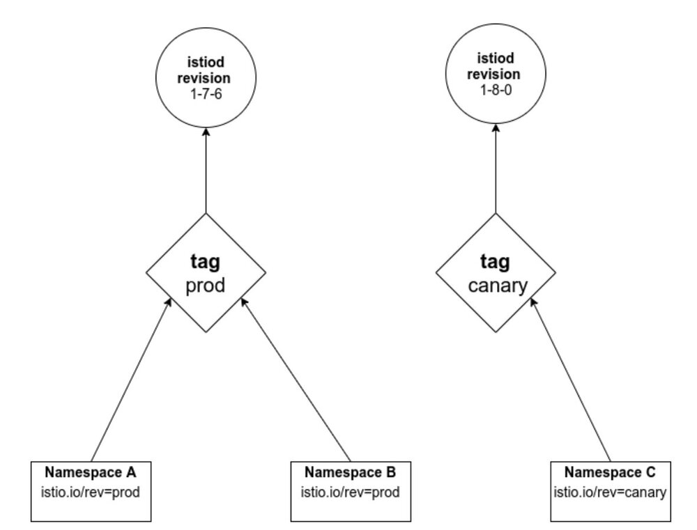
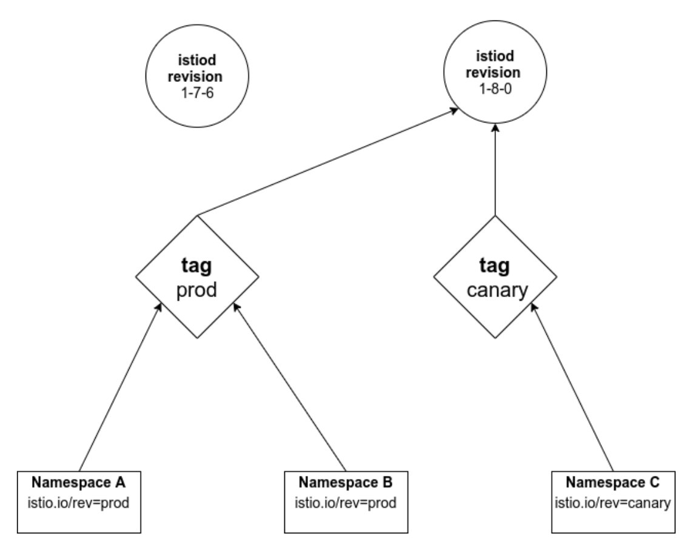
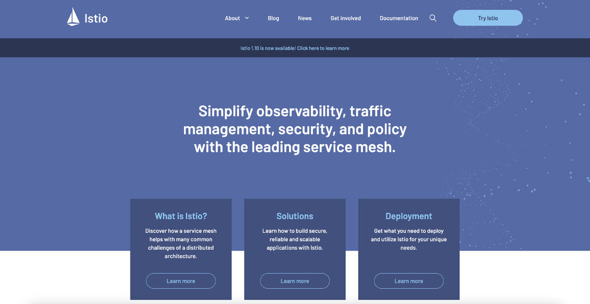
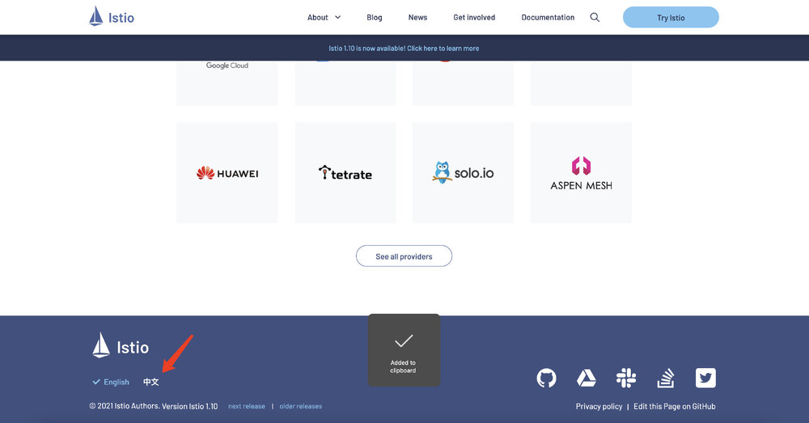

本文译自 [Istio 官方文档](https://istio.io/latest/news/releases/1.10.x/announcing-1.10/)，有部分修改。

北京时间 5 月 19 日，我们很高兴地宣布 Istio 1.10 的发布！我们要特别感谢我们的发布经理 [Sam Naser](https://github.com/Monkeyanator) 和 [张之晗](https://github.com/ZhiHanZ)，以及整个测试和发布工作组在 1.10 中的工作。

这是我们 2021 年的第二个版本，和过去几个版本一样，我们继续为 Istio 用户改善 Day 2 操作。

该版本的亮点如下。

## 发现选择器

在以前的 Istio 版本中，Istio 的控制平面一直在观察和处理集群中它所关心的所有 Kubernetes 资源的更新。这在大型集群或配置快速变化的集群中可能是一个可扩展性瓶颈。发现选择器（Discovery Selector）限制了 Istiod 监视的资源集，所以你可以很容易地忽略那些与网格无关的命名空间的变化（例如一组 Spark Job）。

你可以认为它们有点像 Istio 的 Sidecar API 资源，但对于 Istiod 本身来说：Sidecar 资源限制了 Istiod 将发送至 Envoy 的配置集。发现选择器限制了 Istio 从 Kubernetes 接收和处理的配置集。

请看 Lin、Christian 和 Harvey 的[精彩文章](https://istio.io/latest/blog/2021/discovery-selectors/)，深入了解这项新功能的情况。

## 稳定的修订版标签

早在 [1.6 版本](https://istio.io/latest/blog/2020/multiple-control-planes/)中，Istio 就增加了对安全部署多个控制平面的支持，并且我们一直在稳步提高支持度。关于修订版的一个主要的可用性抱怨是需要大量的命名空间重新标记来改变修订版（revision），因为一个标签（label）直接映射到一个特定的 Istio 控制平面部署。

有了修订版标签，现在有了一个间接层：你可以创建像 `canary` 和 `prod` 这样的标签，把使用这些标签的命名空间标记为修订版（即 `istio.io/rev=prod`），并把特定的 Istiod 修订版与该标签联系起来。

例如，假设你有两个修订版，`1-7-6` 和 `1-8-0`。你创建一个指向 `1-7-6` 版本的修订标签 `prod`，并创建一个指向较新的 `1-8-0` 版本的修订标签 `canary`

命名空间 A 和 B 指向 `1-7-6`，命名空间 C 指向 `1-8-0`。

现在，当你准备将 `1-8-0` 修订版从 `canary` 推到 `prod` 时，你可以将 `prod` 标签与 `1-8-0` Istiod 修订版重新关联。现在，所有使用 `istio.io/rev=prod` 的命名空间将使用较新的 `1-8-0` 版本进行注入。

命名空间 A、B 和 C 指向 `1-8-0`

请查看[更新后的 Canary 升级指南](https://istio.io/latest/docs/setup/upgrade/canary/#stable-revision-labels-experimental)。

## Sidecar 网络变化

在以前的 Istio 版本中，Istio 已经重写了 pod 网络，从 `eth0` 捕获流量，并将其发送到 `lo` 上的应用程序。大多数应用程序都绑定了这两个接口，并没有注意到任何区别；但有些应用程序被特别编写为只期望在其中一个接口上获得特定的流量（例如，通常只在 `lo` 上暴露管理端点，而从不通过 `eth0`，或者有状态的应用程序只绑定 `eth0`）。这些应用程序的行为可能会受到 Istio 引导流量进入 pod 的影响。

在 1.10 版本中，Istio 正在更新 Envoy，默认在 `eth0` 而不是 `lo` 上向应用程序发送流量。对于新用户来说，这应该只是一个改进。对于现有的用户，`istioctl experimental precheck` 将识别出监听 localhost 的 pod，并可能受到影响，如 [IST0143](https://istio.io/latest/docs/reference/config/analysis/ist0143/)。

请参阅 John Howard 的[文章](https://istio.io/latest/blog/2021/upcoming-networking-changes/)，以更深入地了解这一变化，如何以及为什么它可能会影响你，以及如何实现无缝迁移。

## Istio.io 改版

我们对 Istio.io 进行了改造，采用了全新的外观！这是 Istio 项目启动近四年以来，网站的第一个重大变化（我们将在 5 月 24 日，北京时间 5 月 25 日，庆祝这个周年纪念日！）。我们希望这些变化有助于使网站更方便用户，更容易浏览，总体上更有可读性。

Istio 官网全新改版，效果如图。

网站左下角有中英文切换功能。

感谢云原生社区 Istio SIG 翻译和维护了 Istio 官网中文文档。

这项工作由 Google Cloud 赞助，我们要特别感谢 [Craig Box](https://twitter.com/craigbox)、[Aizhamal Nurmamat kyzy](https://twitter.com/iamaijamal) 和 Srinath Padmanabhan 推动这项工作，并感谢所有帮助审查和提供早期修订反馈的人们。

请在 [istio.io 资源库](https://github.com/istio/istio.io)上提交问题，给我们任何反馈。

## 开放我们的设计文件

从 2021 年 5 月 20 日开始，Istio 的设计和规划文件将向互联网上的所有人开放，无需登录。此前，查看这些文件需要谷歌登录和群组成员资格。这一变化将使技术文件的分享更容易、更开放。文件将保持在与以前相同的 URL，但 Community Drive 及其文件夹将改变位置。我们将在本周内联系所有的贡献者和 Drive 成员，并告知新的细节。

## 弃用

在 1.10 版本中，有两个功能将被废弃。

- Kubernetes 第一方 JWT 支持（`values.global.jwtPolicy=first-party-jwt`）将被删除；它的安全性较低，仅用于向后兼容旧版 Kubernetes。
- `values.global.arch` 选项已经被 Kubernetes 配置中的 Affinity 设置所取代。

请参阅 1.10 [变更说明](https://istio.io/latest/news/releases/1.10.x/announcing-1.10/change-notes/)以了解这些废弃的详细情况。

## 反馈

如果你已经将你的服务网格升级到 Istio 1.10，我们想听听你的意见！请考虑参加这个简短的（约 2 分钟）[调查](https://docs.google.com/forms/d/e/1FAIpQLSfzonL4euvGgUM7kyXjsucP4UV8mH9M2snKVFQnT-L7eIXp_g/viewform?resourcekey=0-pWz7V0MsuFrdfJ_-NTQwXQ)，以帮助我们了解我们在哪些方面做得好，以及在哪些方面还需要改进。

## Istio 大咖说 B 站直播：Istio 开源四周年回顾与展望

想了解 Istio 的来历吗？想知道 Istio 自我救赎般的架构重构吗？想窥探 Istio 开发背后的趣事吗？想一起解读最新版本的新特性吗？北京时间 5 月 25 日晚上 8 点，相约 B 站，让我们一起回顾 Istio发布四周年的点点滴滴，[B 站直播间](https://live.bilibili.com/23095515)不见不散！

《Istio 大咖说》是由 Tetrate 冠名的以 Istio 和服务网格为主题的直播活动，分享开源技术及实践。第一期直播将在 Istio 开源四周年之际，邀请 Istio 大咖马若飞，共同回顾 Istio 开源走过的历程及展望未来，主持人宋净超（Jimmy Song）。
