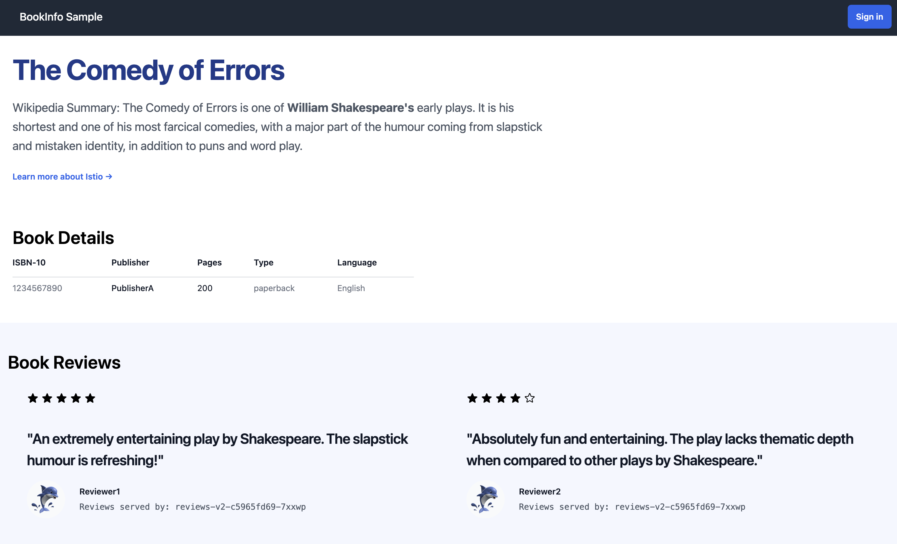

2024 年 8 月 16 日，Istio 1.23 发布。该版本带来了环境模式的重大改进，包括性能提升、功能增强以及 DNS 自动分配和重试策略的优化，同时宣布集群内 Operator 将被弃用。

## 环境模式

紧随最近将 [环境模式升级到 Istio 1.22 的 Beta 版](https://istio.io/latest/blog/2024/ambient-reaches-beta/)之后，Istio 1.23 带来了一系列重大改进。在与众多采用环境模式的用户紧密合作的基础上，我们一直在努力解决收到的所有反馈。这些改进包括更广泛的平台支持、新增功能、错误修复和性能改善。

一小部分亮点：

- 在 waypoint 代理中支持 `DestinationRule`。
- 在 waypoint 和 ztunnel 中支持 DNS `ServiceEntries`。
- 支持跨命名空间共享 waypoint。
- 支持新的 `Service` 字段 `trafficDistribution`，允许保持流量在本地区域/地区。
- 支持双栈和 IPv6 集群。
- 为 ztunnel 提供一个新的 Grafana 仪表板。
- 一个 Helm chart，用于一次性安装所有环境模式组件。
- 性能改进：我们的测试显示与 Istio 1.22 相比，吞吐量提高了高达 50%。
- 大量的错误修复：改善 pod 启动、支持无选择器的 Services、改善日志记录等！

### DNS 自动分配改进

多年来，Istio 一直有一个 [地址分配选项](https://istio.io/latest/docs/ops/configuration/traffic-management/dns-proxy/#address-auto-allocation)用于 DNS 代理模式。这解决了一些服务路由的问题。

在 Istio 1.23 中，新增了这个功能的实现方式。在新的方法中，分配的 IP 地址会持久保存在 `ServiceEntry` 的 `status` 字段中，确保它们不会改变。这解决了旧方法的长期可靠性问题，其中分配有时会随机更换并导致问题。此外，这种方法更标准，更易于调试，并使该功能与环境模式兼容！

在 1.23 版本中，此模式默认关闭，但可以通过 `PILOT_ENABLE_IP_AUTOALLOCATE=true` 启用。

### 重试改进预览

在此版本中，实现了对默认重试策略的改进的功能预览。历史上，重试仅在 *出站* 流量上进行。在许多情况下，这是你想要的：请求可以重试到不同的 pod，这有更好的成功机会。然而，这留下了一个缺口：经常地，一个请求会失败，仅仅因为应用程序已经关闭了我们保持活动的并尝试重用的连接。

我们已经添加了检测这种情况，并重试的功能。这预计会减少网格中常见的 503 错误的来源。

这可以通过 `ENABLE_INBOUND_RETRY_POLICY=true` 启用。预计在未来版本中默认启用。

### Bookinfo 的新涂装

1.23 版本的改进不仅限于 Istio 本身：在此版本中，大家喜爱的示例应用 Bookinfo 也进行了翻新！

新的应用特性更现代的设计，并且性能改进解决了 `productpage` 和 `details` 服务中的一些意外缓慢问题。

### 其他亮点

- 使用 [Wolfi](https://github.com/wolfi-dev) 容器基础 OS 升级了无发行版镜像。
- `istioctl proxy-status` 命令进行了改进，包括自最后更改以来的时间，以及更多相关的状态值。

## 弃用集群内 Operator

三年前，我们 [更新了我们的文档](https://istio.io/latest/docs/setup/install/operator/)，不鼓励在新的 Istio 安装中使用集群内 operator。我们现在准备在 Istio 1.23 中正式标记它为已弃用。利用 operator 的用户 — 我们估计不到我们用户基础的 10% — 将需要迁移到其他安装和升级机制，以便升级到 Istio 1.24 或更高版本。1.24 版本的预计发布日期为 2024 年 11 月。

我们建议用户转移到 Helm 和 istioctl，这些仍然得到 Istio 项目的支持。迁移到 istioctl 是微不足道的；迁移到 Helm 将需要工具，我们将在 1.24 发布时发布。

希望继续使用 operator 模式的用户在 [istio-ecosystem](https://github.com/istio-ecosystem/) 组织中有两个第三方选项。

请查看 [我们的弃用公告博客文章](https://istio.io/latest/blog/2024/in-cluster-operator-deprecation-announcement/)，以获取更多关于变更的详情。

关于本次发布的详情请见 [Istio 博客](https://istio.io/latest/news/releases/1.23.x/announcing-1.23/)。
