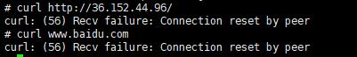
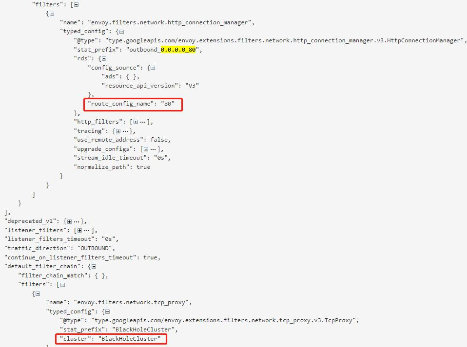

## 背景

在生产环境使用 Istio 的时候，可能最需要考虑的问题一个是安全问题一个是性能问题，在这里和大家一起探讨下一个安全问题，如何在 Istio 网格中访问外部服务。Istio 提供了两种模式来配置对外部请求的访问策略，并通过配置项 outboundTrafficPolicy.mode 来指定。 默认的模式是 ALLOW_ANY，也就是允许在网格内请求所有外部的未知服务；另外一个模式是 REGISTRY_ONLY，表示只允许请求注册到服务网格注册表中的服务。默认的 ALLOW_ANY 模式虽然使用方便，但是存在一定的安全隐患，建议的做法是切换到 REGISTRY_ONLY 模式。那么在 REGISTRY_ONLY 模式下如何访问外部服务？实现机制是什么呢？在这里针对这两个问题和大家一起探讨下。

## 方案调研

目前我们安装部署 Istio 使用的是helm，可以在安装中添加相应的配置 `--set meshConfig.outboundTrafficPolicy.mode=REGISTRY_ONLY` 修改 outboundTrafficPolicy.mode 的值；如果 Istio 已经安装好，通过 `kubectl edit cm istio -n istio-system` 可以动态修改此值。
```yaml
apiVersion: v1
data:
  mesh: |-
    defaultConfig:
      discoveryAddress: istiod.istio-system.svc:15012
      proxyMetadata:
        DNS_AGENT: ""
      tracing:
        zipkin:
          address: zipkin.istio-system:9411
    outboundTrafficPolicy:
      mode: REGISTRY_ONLY
```
配置完 REGISTRY_ONLY 后，我们在 pod 中无法访问外部服务



那么在 REGISTRY_ONLY 模式下，如何才能访问外部服务呢？首先我们通过[下图](https://jimmysong.io/blog/sidecar-injection-iptables-and-traffic-routing/) 看下 Istio 在什么时机可以访问外部服务，在这种时机下怎么修改配置才能访问到外部服务？

图中描述了 product 服务访问 review 服务，这里我们假设 review 服务会继续调用 36.152.44.96 这个外部服务。


当 reviews 应用需要访问 36.152.44.96 这个外部服务时，会在 reviews 的应用容器中往上游发送请求信息，下面按照图中的顺序介绍如何访问外部请求。
1. reviews 服务访问外部服务，这一步对 reviews 服务来说属于出口流量，被 iptables 规则拦截转发至出口流量 OUTPUT 链。 
2. OUTPUT 链转发流量至 ISTIO_OUTPUT 链。
3. 在 ISTIO_OUTPUT 链中默认有九个规则，决定 reviews 服务访问外部服务的流量发往何处，在这里我们可以自定义一个规则 `-A ISTIO_OUTPUT -d 36.152.44.0/24 -j RETURN`，使访问 36.152.44.96 这个外部服务的流量跳出当前链，调用 `POSTROUTING 链`，直接访问外部服务；如果使用默认规则，流量被转发至 ISTIO_REDIRECT 链。
4. ISTIO_REDIRECT链直接重定向至 Envoy监听的15001出口流量端口。
5. 外部服务的流量策略并不在 Istio 服务网格中，如果不进行相关配置把外部服务注册到服务网格内，经过 Envoy 一系列出口流量治理动作后将会返回错误信息。因此这里我们需要配置 `ServiceEntry`，把外部服务纳入服务网格中，然后通过 Envoy 的流量治理后可以继续发送外部请求，访问外部请求时又会被 iptables 拦截转发至出口流量 OUTPUT 链。
6. OUTPUT 链转发流量至 ISTIO_OUTPUT 链。
7. 在这里会匹配到 ISTIO_OUTPUT 链的第四条规则 `-A ISTIO_OUTPUT -m owner --uid-owner 1337 -j RETURN`，流量直接 RETURN 到下一个链 `POSTROUTING 链`，经 POSTROUTING 链流出访问外部服务。

我们看到通过第11步、第13步两种方式修改配置都可以使 Istio 内部的服务访问外部服务，具体应该怎么做呢？ 

## 通过iptables规则访问

如果想在第11步直接跳出 ISTIO_OUT 链调用 POSTROUTING 链，需要添加一个自定义的 iptables 规则 `-A ISTIO_OUTPUT -d 36.152.44.0/24 -j RETURN`，我们知道 iptables 规则是在 istio-init 里定义的，istio-init 启动时执行的是 istio-iptables 命令，我们在 manifests 的 `injection-template.yaml` 文件里看到 istio-iptables 默认的部分配置。
```yaml
 - "-i"
    - "{{ annotation .ObjectMeta `traffic.sidecar.istio.io/includeOutboundIPRanges` .Values.global.proxy.includeIPRanges }}"
    - "-x"
    - "{{ annotation .ObjectMeta `traffic.sidecar.istio.io/excludeOutboundIPRanges` .Values.global.proxy.excludeIPRanges }}"
    - "-b"
    - "{{ annotation .ObjectMeta `traffic.sidecar.istio.io/includeInboundPorts` `*` }}"
    - "-d"
  {{- if excludeInboundPort (annotation .ObjectMeta `status.sidecar.istio.io/port` .Values.global.proxy.statusPort) (annotation .ObjectMeta `traffic.sidecar.istio.io/excludeInboundPorts` .Values.global.proxy.excludeInboundPorts) }}
    - "15090,15021,{{ excludeInboundPort (annotation .ObjectMeta `status.sidecar.istio.io/port` .Values.global.proxy.statusPort) (annotation .ObjectMeta `traffic.sidecar.istio.io/excludeInboundPorts` .Values.global.proxy.excludeInboundPorts) }}"
  {{- else }}
    - "15090,15021,15020"
```

- `-i` 默认为`*`，所有出站流量都会被重定向到 Envoy 代理
- `-x` 默认为空，当-i参数为`*`时，用来指明哪些地址不用重定向 Envoy 代理，直接进行转发 
- `-b` 默认为`*`，逗号分隔的端口，指定端口的流量将重定向到 Envoy
- `-d` 默认为15090,15021,15020，逗号分隔的端口，指定哪些端口的流量不用重定向到 Envoy

根据上面配置我们可以在 Istio 服务中通过 global.proxy.* 进行全局配置，还可以在服务的 deployment 里通过 `traffic.sidecar.istio.io/*` 配置相应的参数。我们现在的目的是需要把访问 36.152.44.96 的请求不重定向到 Envoy 代理，直接进行转发，因此我们在 deployment 里添加 `traffic.sidecar.istio.io/excludeOutboundIPRanges: 36.152.44.0/24`，执行完后我们 describe pod 的详细信息，获取到 pod 中的部分配置如下，可以看到设置生效，36.152.44.0/24 不会重定向到 Envoy 中

```yaml
  -i
  *
  -x
  36.152.44.0/24
  -b
  *
  -d
  15090,15021,15020
```
继续查看 pod 中的 iptables 规则，可以看到在原来的 ISTIO_OUTPUT 九条 iptables 规则中插入了一个自定义的规则 `A ISTIO_OUTPUT -d 36.152.44.0/24 -j RETURN`

```bash
 -A ISTIO_OUTPUT -s 127.0.0.6/32 -o lo -j RETURN
 -A ISTIO_OUTPUT ! -d 127.0.0.1/32 -o lo -m owner --uid-owner 1337 -j ISTIO_IN_REDIRECT
 -A ISTIO_OUTPUT -o lo -m owner ! --uid-owner 1337 -j RETURN
 -A ISTIO_OUTPUT -m owner --uid-owner 1337 -j RETURN
 -A ISTIO_OUTPUT ! -d 127.0.0.1/32 -o lo -m owner --gid-owner 1337 -j ISTIO_IN_REDIRECT
 -A ISTIO_OUTPUT -o lo -m owner ! --gid-owner 1337 -j RETURN
 -A ISTIO_OUTPUT -m owner --gid-owner 1337 -j RETURN
 -A ISTIO_OUTPUT -d 127.0.0.1/32 -j RETURN
 -A ISTIO_OUTPUT -d 36.152.44.0/24 -j RETURN
 -A ISTIO_OUTPUT -j ISTIO_REDIRECT
```

## 通过ServiceEntry访问

Istio 在 15001 端口使用 VirtualOutboundListener 处理出向请求，Iptable 将 Envoy 所在 Pod 的对外请求拦截后发向本地的 15001 端口，该监听器接收后并不进行业务处理，而是根据请求的目的端口分发给其他独立的监听器处理。 我们访问的外部服务为 36.152.44.96:80，因此 Envoy 根据目的端口匹配到 `0.0.0.0_80` 这个 Outbound listener，并转交给该 listener。



当 0.0.0.0_80 接收到出向请求后，并不会直接发送到目的 cluster，其实通过查看 0.0.0.0_80 的 listener 的信息，我们也找不到目的 cluster 或 endpoint，在这个 listener 中配置了一个路由规则80，在该路由规则中会根据不同的请求目的地进行路由匹配处理。


通过 name 为80的路由规则我们没找到符合 36.152.44.96 的请求，因此会被 listener 里的 `default_filter_match` 处理，进入到 BlackHoleCluster 集群里，请求被丢弃。
这里我们简单介绍下 Envoy 中的两个特殊 cluster：`BlackHoleCluster` 和 `PassthroughCluster`，
`BlackHoleCluster` 中没有配置任何处理请求的host。请求进入该 cluster 后将被丢弃掉，而不是发向一个 host，如果 `outboundTrafficPolicy.mode=REGISTRY_ONLY`，默认情况下请求的外部服务都会直接进入 BlackHoleCluster 中丢掉。`PassthroughCluster` 的 type 被设置为 `ORIGINAL_DST`，表明任何发向该 cluster 的请求都会被直接发送到其请求中的原始目的地，如果 `outboundTrafficPolicy.mode=ALLOW_ANY`，Envoy 不会对请求进行重新路由直接发送到原始目的地。

在 `outboundTrafficPolicy.mode=REGISTRY_ONLY` 模式下，为了流量不进入 `BlackHoleCluster` 中，我们需要添加 ServiceEntry，把外部请求注册到服务网格中，以便Envoy可以找到外部服务的 route 进行流量处理。

```yaml
apiVersion: networking.istio.io/v1beta1
kind: ServiceEntry
metadata:
  name: baidu-ip
spec:
  hosts:
  - www.baidu.com
  addresses:
  - 36.152.44.96
  location: MESH_EXTERNAL
  ports:
  - number: 80
    name: baidu-http
    protocol: HTTP
  resolution: NONE
```

配置完 ServiceEntry 后我们再次查询 review 的 route 信息，可以看到36.152.44.96已经被加入 route 中了，直接在pod中访问外部服务36.152.44.96可以得到正确的请求。


## 总结

通过对 Istio 访问外部服务的方案进行调研，我们学习了 Istio 是如何通过 iptables 处理进入网格中的流量，也大体了解了 Envoy 处理 Outbound 流量的流程。以上的调研基于 Istio 1.8 版本，内容可能存在错误或不准确的地方，欢迎大家交流指正。

