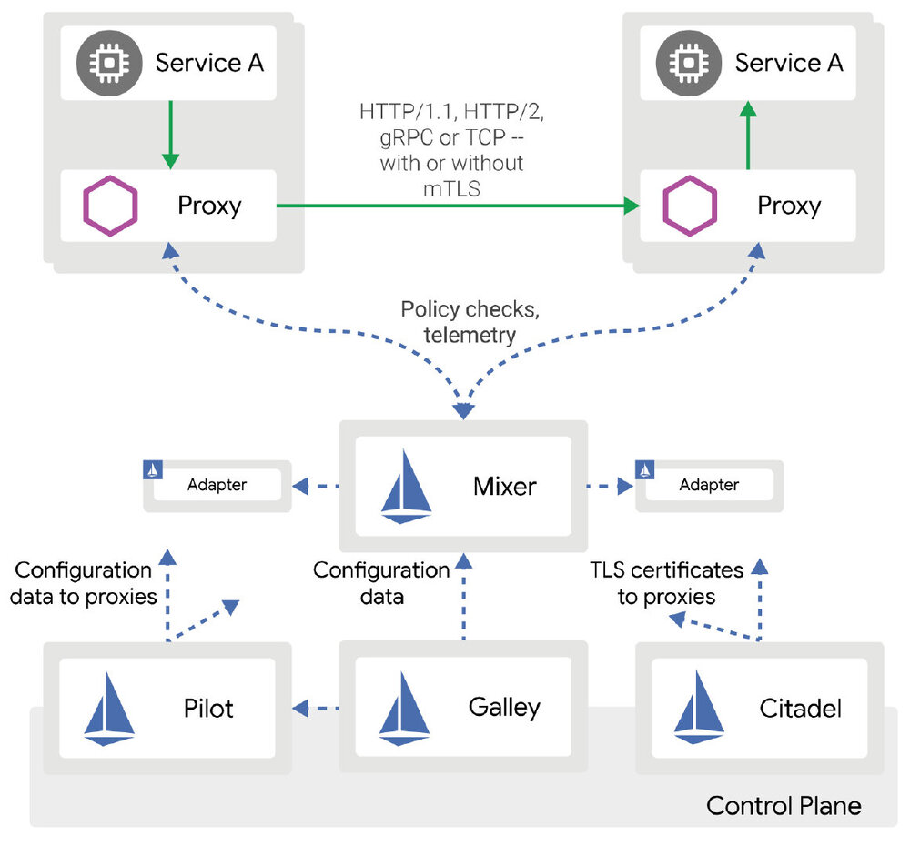
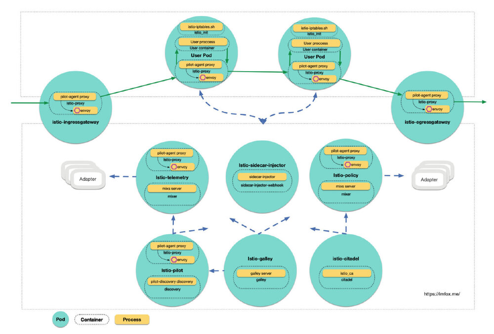

作者: 钟华，腾讯云容器团队高级工程师，热衷于容器、微服务、service mesh、istio、devops 等领域技术。

Istio 作为 Service Mesh 领域的集大成者, 提供了流控, 安全, 遥测等模型, 其功能复杂, 模块众多, 有较高的学习和使用门槛, 本文会对istio 1.1 的各组件进行分析, 希望能帮助读者了解istio各组件的职责、以及相互的协作关系.

## 1. istio 组件构成

以下是istio 1.1 官方架构图:



虽然Istio 支持多个平台, 但将其与 Kubernetes 结合使用，其优势会更大, Istio 对Kubernetes 平台支持也是最完善的, 本文将基于Istio + Kubernetes 进行展开.

如果安装了grafana, prometheus, kiali, jaeger等组件的情况下, 一个完整的控制面组件包括以下pod:

```bash
% kubectl -n istio-system get pod
NAME                                          READY     STATUS
grafana-5f54556df5-s4xr4                      1/1       Running
istio-citadel-775c6cfd6b-8h5gt                1/1       Running
istio-galley-675d75c954-kjcsg                 1/1       Running
istio-ingressgateway-6f7b477cdd-d8zpv         1/1       Running
istio-pilot-7dfdb48fd8-92xgt                  2/2       Running
istio-policy-544967d75b-p6qkk                 2/2       Running
istio-sidecar-injector-5f7894f54f-w7f9v       1/1       Running
istio-telemetry-777876dc5d-msclx              2/2       Running
istio-tracing-5fbc94c494-558fp                1/1       Running
kiali-7c6f4c9874-vzb4t                        1/1       Running
prometheus-66b7689b97-w9glt                   1/1       Running
```

将istio系统组件细化到进程级别, 大概是这个样子:



[查看高清原图](006tKfTcgy1g0z3wp5comj315m0u0kjr.jpg)

Service Mesh 的Sidecar 模式要求对数据面的用户Pod进行代理的注入, 注入的代理容器会去处理服务治理领域的各种「脏活累活」, 使得用户容器可以专心处理业务逻辑.

从上图可以看出, Istio 控制面本身就是一个复杂的微服务系统, 该系统包含多个组件Pod, 每个组件 各司其职, 既有单容器Pod, 也有多容器Pod, 既有单进程容器, 也有多进程容器, 每个组件会调用不同的命令, 各组件之间会通过RPC进行写作, 共同完成对数据面用户服务的管控.

------

## 2. Istio 源码, 镜像和命令

Istio 项目代码主要由以下2个git 仓库组成:

| 仓库地址                         | 语言 | 模块                                                         |
| -------------------------------- | ---- | ------------------------------------------------------------ |
| <https://github.com/istio/istio> | Go   | 包含istio控制面的大部分组件: pilot, mixer, citadel, galley, sidecar-injector等, |
| <https://github.com/istio/proxy> | C++  | 包含 istio 使用的边车代理, 这个边车代理包含envoy和mixer client两块功能 |

### 2.1 istio/istio

<https://github.com/istio/istio> 包含的主要的镜像和命令:

| 容器名                   | 镜像名                 | 启动命令          | 源码入口                          |
| ------------------------ | ---------------------- | ----------------- | --------------------------------- |
| Istio_init               | istio/proxy_init       | istio-iptables.sh | istio/tools/deb/istio-iptables.sh |
| istio-proxy              | istio/proxyv2          | pilot-agent       | istio/pilot/cmd/pilot-agent       |
| sidecar-injector-webhook | istio/sidecar_injector | sidecar-injector  | istio/pilot/cmd/sidecar-injector  |
| discovery                | istio/pilot            | pilot-discovery   | istio/pilot/cmd/pilot-discovery   |
| galley                   | istio/galley           | galley            | istio/galley/cmd/galley           |
| mixer                    | istio/mixer            | mixs              | istio/mixer/cmd/mixs              |
| citadel                  | istio/citadel          | istio_ca          | istio/security/cmd/istio_ca       |

另外还有2个命令不在上图中使用:

| 命令       | 源码入口                      | 作用                                                         |
| ---------- | ----------------------------- | ------------------------------------------------------------ |
| mixc       | istio/mixer/cmd/mixc          | 用于和Mixer server 交互的客户端                              |
| node_agent | istio/security/cmd/node_agent | 用于node上安装安全代理, 这在Mesh Expansion特性中会用到, 即k8s和vm打通. |

### 2.2 istio/proxy

<https://github.com/istio/proxy> 该项目本身不会产出镜像, 它可以编译出一个`name = "Envoy"`的二进制程序, 该二进制程序会被ADD到istio的边车容器镜像`istio/proxyv2`中.

istio proxy 项目使用的编译方式是Google出品的bazel, bazel可以直接在编译中引入第三方库，加载第三方源码.

这个项目包含了对Envoy源码的引用，还在此基础上进行了扩展，这些扩展是通过Envoy filter（过滤器）的形式来提供，这样做的目的是让边车代理将策略执行决策委托给Mixer，因此可以理解istio proxy 这个项目有2大功能模块:

1. Envoy: 使用到Envoy的全部功能
2. mixer client: 测量和遥测相关的客户端实现, 基于Envoy做扩展，通过RPC和Mixer server 进行交互, 实现策略管控和遥测

后续我将对以上各个模块、命令以及它们之间的协作进行探究.

------

## 3. Istio Pod 概述

### 3.1 数据面用户Pod

数据面用户Pod注入的内容包括:

1. initContainer `istio-init`: 通过配置iptables来劫持Pod中的流量, 转发给envoy

2. sidecar container `istio-proxy`: 包含2个进程, 父进程pliot-agent 初始化并管控envoy, 子进程envoy除了包含原生envoy的功能外, 还加入了mixer client的逻辑.

   主要端口:

   - `--statusPort` status server 端口, 默认为0, 表示不启动, istio启动时通常传递为15020
   - `--proxyAdminPort` 代理管理端口, 默认 15000

   注意以上参数虽然是启动时传递给父进程`pliot-agent`, 但实际上监听以上端口的进程是子进程envoy.

### 3.2 istio-sidecar-injector

包含一个单容器, `sidecar-injector-webhook`: 启动一个http server, 接受kube api server 的Admission Webhook 请求, 对用户pod进行sidecar注入.

进程为`sidecar-injector`, 主要监听端口:

- `--port` Webhook服务端口, 默认443, 通过k8s service`istio-sidecar-injector` 对外提供服务。

### 3.3 istio-galley

包含一个单容器 `galley`: 提供 istio 中的配置管理服务, 验证Istio的CRD 资源的合法性.

进程为`galley server ......`, 主要监听端口:

- `--server-address` galley gRPC 地址, 默认是tcp://0.0.0.0:9901
- `--validation-port` https端口, 提供验证crd合法性服务的端口, 默认443.
- `--monitoringPort` http 端口, self-monitoring 端口, 默认 15014

以上端口通过k8s service`istio-galley`对外提供服务。

### 3.4 istio-pilot

pilot组件核心Pod, 对接平台适配层, 抽象服务注册信息、流量控制模型等, 封装统一的 API，供 Envoy 调用获取.

包含以下容器:

1. sidecar container `istio-proxy`

2. container `discovery`: 进程为`pilot-discovery discovery ......`

   主要监听端口:

   - 15010: 通过grpc 提供的 xds 获取接口
   - 15011: 通过https 提供的 xds 获取接口
   - 8080: 通过http 提供的 xds 获取接口, 兼容v1版本, 另外 http readiness 探针 `/ready`也在该端口
   - `--monitoringPort` http self-monitoring 端口, 默认 15014

   以上端口通过k8s service`istio-pilot`对外提供服务

### 3.5 istio-telemetry 和istio-policy

mixer 组件包含2个pod, istio-telemetry 和 istio-policy, istio-telemetry负责遥测功能, istio-policy 负责策略控制, 它们分别包含2个容器:

1. sidecar container`istio-proxy`

2. `mixer`: 进程为 `mixs server ……`

   主要监听端口:

   - 9091: grpc-mixer
   - 15004: grpc-mixer-mtls
   - `--monitoring-port`: http self-monitoring 端口, 默认 15014, liveness 探针`/version`

### 3.7 istio-citadel

负责安全和证书管理的Pod, 包含一个单容器 `citadel`

启动命令`/usr/local/bin/istio_ca --self-signed-ca ......` 主要监听端口:

- `--grpc-port` citadel grpc 端口, 默认8060
- `--monitoring-port `: http self-monitoring 端口, 默认 15014, liveness 探针`/version`

以上端口通过k8s service`istio-citadel`对外提供服务。

后续将对各组件逐一进行分析。
