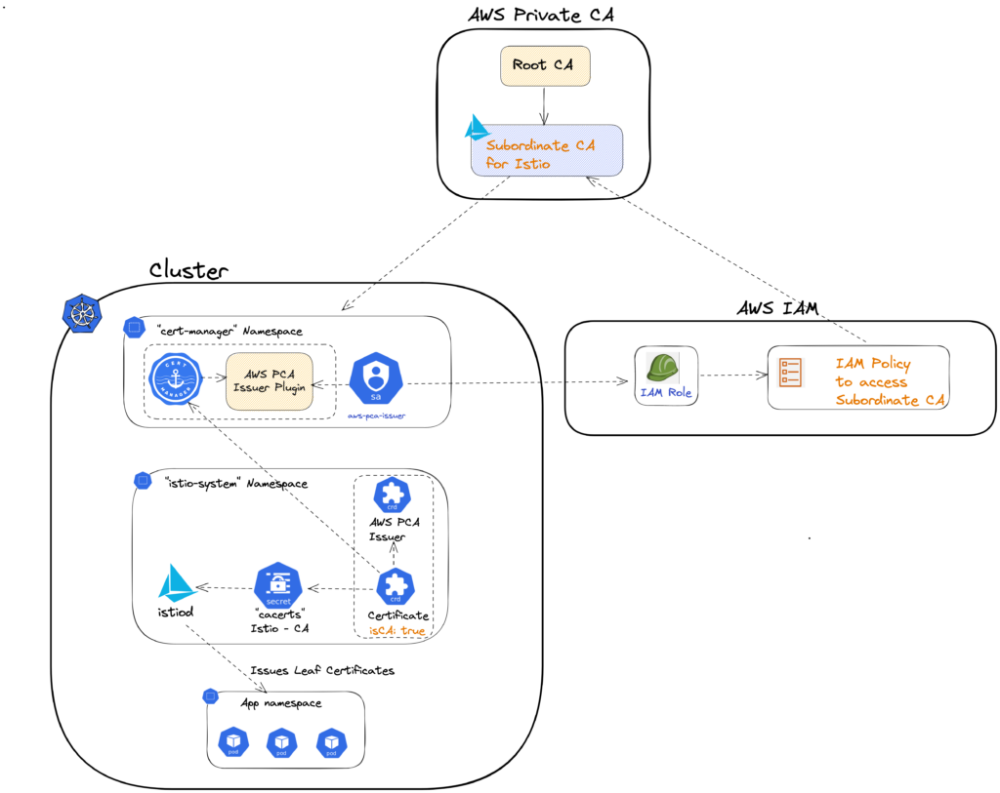
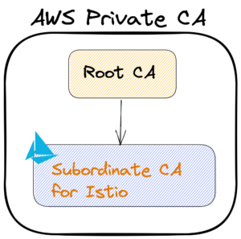
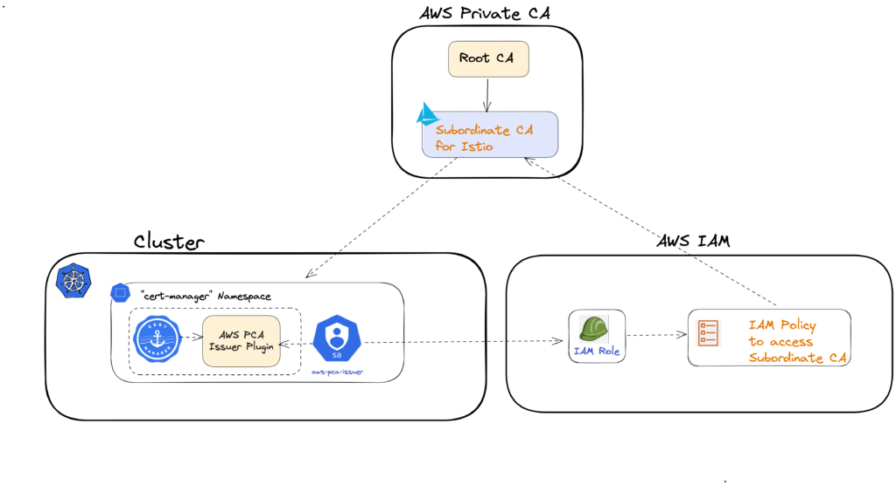
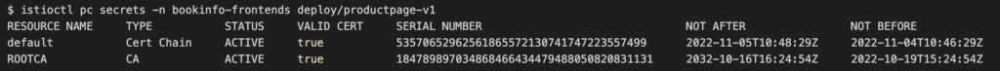
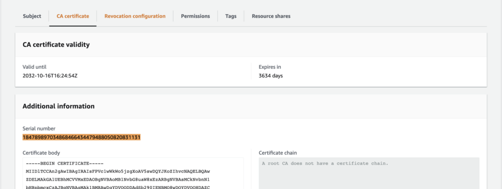

当用户安装 Istio 时，默认会创建一个证书颁发机构（CA），并且 CA 证书是自签名的。然后，CA 证书用于管理运行在 Istio 服务网格上的应用程序的证书生命周期。这使得在 Istio 服务网格上运行的应用程序之间轻松设置开箱即用的 mTLS 通信成为可能。

随着我们向生产环境的实施迈进，Istio 还提供了一个选项，可以使用你自己的 CA 证书，而不是使用默认的自签名 CA 证书。企业倾向于自动化其公钥/私钥基础设施（PKI），以确保、管理和创建证书。作为一般实践，企业会使用由其根证书或其他中间证书签名的私有 CA 证书来设置其服务网格的证书颁发机构。

在众多可用选项中，[AWS 私有 CA](https://aws.amazon.com/private-ca/) 是一个托管的 CA，帮助组织使用 AWS 中的私有证书来保护其应用程序和设备。此外，[Cert Manager](https://cert-manager.io/) 是另一个流行的选择，用于简化获取、续订和使用这些证书的过程。Cert Manager 和 [AWS Private CA issuer](https://github.com/cert-manager/aws-privateca-issuer) 插件通常一起使用，以设置 Istio 服务网格的自定义 CA。

这种集成的一些主要优势包括：

- **证书生命周期管理的自动化**，确保在证书到期前续订，以避免任何停机时间。
- **私钥基础设施的易审计性**。
- **通过 Certificate CRD 提供的灵活配置选项**，以满足更广泛受众的需求。

## 涉及的不同组件的可视化表示



在以下章节中，我们将分享如何为你的 Istio 服务网格设置自定义 CA 的步骤，使用 AWS 私有 CA 作为私钥基础设施。

## 安装 Cert Manager

Cert Manager 简化了获取、续订和使用证书的过程。它支持与包括 AWS 私有 CA 在内的广泛私钥基础设施的集成。在本节中，我们将使用 Helm 安装 Cert Manager。其他安装选项请参见 [此处](https://cert-manager.io/docs/installation/)。

```bash
CERT_MANAGER_VERSION=v1.11.0
helm repo add jetstack https://charts.jetstack.io
helm repo update

helm install cert-manager jetstack/cert-manager \
  --namespace cert-manager \
  --create-namespace \
  --version ${CERT_MANAGER_VERSION} \
  --set installCRDs=true \
  --wait;

# 验证
kubectl -n cert-manager rollout status deploy/cert-manager;
kubectl -n cert-manager rollout status deploy/cert-manager-cainjector;
kubectl -n cert-manager rollout status deploy/cert-manager-webhook;
```

## 在 AWS 中创建 CA 层级结构

在此步骤中，我们在 AWS 私有 CA 中创建一个根证书颁发机构和一个下级证书颁发机构。相关的 [AWS 文档](https://docs.aws.amazon.com/privateca/latest/userguide/ca-hierarchy.html) 讨论了如何设计 CA 层级结构。



**请注意：** 以下脚本将在 AWS 私有 CA 中创建一个根 CA 和一个下级 CA。如果你已经在 AWS 私有 CA 中存在 CA 层级结构，并希望重用该层级结构，而不是从根 CA 创建新的下级 CA，则可以跳过运行以下脚本。

如果你希望重用现有的 AWS 私有 CA 对象，请将其 ARN 保存在环境变量 **`ISTIO_CA_ARN`** 中。我们将在后续步骤中使用此变量。

注意，如果你希望使用此脚本创建私有 CA 层级结构，请根据你的需求编辑 `COUNTRY, ORGANIZATION, ORGANIZATIONAL_UNIT, STATE, LOCALITY`。

运行上述脚本后，请将 ARN 保存在 ***`ISTIO_CA_ARN`*** 中以供后续步骤使用：

```bash
export ISTIO_CA_ARN="arn:aws:acm-pca:[REGION]:[REDACTED]:certificate-authority/[REDACTED]"
```

## 创建 IAM 策略和角色

要访问任何 AWS 资源，我们需要定义正确级别的权限。在本节中，我们将定义一个新的 IAM 策略，仅授予所需的访问级别。

```bash
cat <<EOF > AWSPCAIssuerPolicy.json
{
  "Version": "2012-10-17",
  "Statement": [
    {
      "Sid": "awspcaissuer",
      "Action": [
        "acm-pca:DescribeCertificateAuthority",
        "acm-pca:GetCertificate",
        "acm-pca:IssueCertificate"
      ],
      "Effect": "Allow",
      "Resource": [
        "${ISTIO_CA_ARN}"
        ]
    }
  ]
}
EOF

POLICY_ARN=$(aws iam create-policy \
    --policy-name AWSPCAIssuerPolicy \
    --policy-document file://AWSPCAIssuerPolicy.json \
    --output json | jq -r '.Policy.Arn')

echo "POLICY_ARN = ${POLICY_ARN}"
```

## 创建带有 IAM OIDC 提供商的 IAM 角色

我们使用 “aws-privateca-issuer” Cert Manager 插件与 AWS 私有 CA 交互。该插件需要正确的访问权限来与 AWS 私有 CA 交互。它需要使用我们在上一步创建的 IAM 策略。在这一步中，我们为 “aws-privateca-issuer” 插件创建一个 ServiceAccount，并将其与新创建的 IAM 角色关联，该角色已附加 IAM 策略。

EKS 集群有一个与之关联的 [OpenID Connect](https://openid.net/connect/) (OIDC) 发行者 URL。默认情况下，IAM OIDC 提供商未启用。要使用它，[我们需要先启用它](https://docs.aws.amazon.com/eks/latest/userguide/enable-iam-roles-for-service-accounts.html)。

请确保 IAM 策略 ARN 已设置在 **`POLICY_ARN`** 中。

```bash
# 请在下方编辑集群名称
export CURRENT_CLUSTER=

# 为集群启用 IAM OIDC 提供商
eksctl utils associate-iam-oidc-provider \
    --cluster=${CURRENT_CLUSTER} \
    --approve;

# 创建绑定到服务账户的 IAM 角色
eksctl create iamserviceaccount --cluster=${CURRENT_CLUSTER} \
    --namespace=${PCA_NAMESPACE} \
    --attach-policy-arn=${POLICY_ARN} \
    --override-existing-serviceaccounts \
    --name="aws-pca-issuer" \
    --role-name "ServiceAccountRolePrivateCA-${CURRENT_CLUSTER}" \
    --approve;
```

这将创建一个绑定到 Kubernetes ServiceAccount 的 IAM 角色：“`aws-pca-issuer`“

- IAM 角色将附加 IAM 策略。
- Service Account `aws-pca-issuer` 将由 AWS Private CA Issuer 使用。

## 安装 `aws-privateca-issuer` 插件并使用 ServiceAccount: `aws-pca-issuer`

使用 Helm 安装插件，并使用上一步中创建的 Kubernetes ServiceAccount。



```bash
export PCA_NAMESPACE=cert-manager

# 查看最新版本 https://github.com/cert-manager/aws-privateca-issuer/releases
export AWSPCA_ISSUER_TAG=v1.2.2

# 安装 AWS 私有 CA Issuer 插件 
# https://github.com/cert-manager/aws-privateca-issuer/#setup
helm repo add awspca https://cert-manager.github.io/aws-privateca-issuer
helm repo update
helm upgrade --install aws-pca-issuer awspca/aws-privateca-issuer \
    --namespace ${PCA_NAMESPACE} \
    --set image.tag=${AWSPCA_ISSUER_TAG} \
    --set serviceAccount.create=false \
    --set serviceAccount.name="aws-pca-issuer" \
    --wait;

# 验证部署状态
kubectl -n ${PCA_NAMESPACE} \
    rollout status deploy/aws-pca-issuer-aws-privateca-issuer;
```

## 创建 Issuer

AWSPCAIssuer 是一个 CRD，我们在其中定义了两个关键参数。即我们在步骤 2 中创建的 CA 的 ARN 以及该 CA 所在的 AWS 区域。

注意：请在 **`CA_REGION`**环境变量中设置 AWS 区域，即你的私有 CA 所创建的区域。例如：`export CA_REGION=us-east-1`

```bash
cat << EOF | kubectl apply -f -
apiVersion: awspca.cert-manager.io/v1beta1
kind: AWSPCAIssuer
metadata:
 name: aws-pca-issuer-istio
 namespace: istio-system
spec:
  arn: ${ISTIO_CA_ARN}
  region: ${CA_REGION}
EOF
```

## 为 Istio 创建 CA 证书（`cacerts` 密钥）

在此自定义资源中，我们定义了所需的 Istio CA 证书详细信息，即：

- 证书的持续时间（TTL），
- 证书应自动续订的时间，
- 主题备用名称（SAN），
- 此证书的基本约束（isCA: true），
- 生成的证书应存储的 Kubernetes 密钥名称（**cacerts**）等。

CRD 的参考文档 [在此](https://cert-manager.io/docs/reference/api-docs/#cert-manager.io/v1.Certificate)。

```bash
# 使用 cert-manager 和 aws-pca-issuer 插件从 AWS PCA 颁发 CA 证书
cat << EOF | kubectl apply -f -
apiVersion: cert-manager.io/v1
kind: Certificate
metadata:
  name: istio-ca
  namespace: istio-system
spec:
  isCA: true
  duration: 720h #30天
  renewBefore: 360h #15天
  secretName: cacerts
  commonName: istio-ca
  dnsNames:
    - "*.istiod-${ISTIO_REVISION}" # Istiod 身份
  subject:
    organizations:
    - cluster.local
    - cert-manager
  issuerRef:
# ---------------- Istio CA 的 Issuer ---------------------------
    group: awspca.cert-manager.io
    kind: AWSPCAIssuer
    name: aws-pca-issuer-istio
# ---------------- Istio CA 的 Issuer ---------------------------
EOF
```

等待几秒钟后验证证书创建：

```bash
kubectl -n istio-system get certificate istio-ca
kubectl -n istio-system get secret cacerts
```

## 安装 Istio

一旦 Kubernetes 密钥 **cacerts** 被创建，我们就可以开始使用该证书作为 Istio 的自定义 CA 证书。

Istio 安装文档 [在此](https://istio.io/latest/docs/setup/install/)。如果你是现有的 Gloo Mesh 用户，可以按照步骤使用 [IstioLifeCycleManager 安装 Istio](https://docs.solo.io/gloo-mesh-enterprise/latest/setup/installation/istio/gm_managed_istio/gloo_mesh_managed/)。

## 部署示例应用程序

部署 [Istio 示例 Bookinfo 应用程序](https://istio.io/latest/docs/examples/bookinfo/) 并验证所使用的叶子证书确实来自 AWS 私有 CA 中存在的根 CA。

## 验证证书链并匹配序列号

```bash
istioctl pc secrets -n bookinfo-frontends deploy/productpage-v1
```



在 AWS 私有 CA 控制台中，根 CA 将具有匹配的序列号：



你还可以使用以下命令检查叶子证书的详细信息：

```bash
istioctl pc secret \
    -n [NAMESPACE] deploy/DEPLOYMENT_NAME -o json | \
    jq '[.dynamicActiveSecrets[] | select(.name == "default")][0].secret.tlsCertificate.certificateChain.inlineBytes' -r | \
    base64 -d | \
    openssl x509 -noout -text
```

## 调试建议

**场景**：尽管创建了所需的自定义资源，但 Kubernetes 密钥 cacerts 未被创建：

- 检查 AWSPCAIssuer 对象的状态应该会有所帮助。
- 建议审查 AWSPCAIssuer 规范。
- 当我们创建一个自定义 Certificate 对象时，会创建一个相关的 CertificateRequest 对象。CertificateRequest 对象的状态包含有用的调试信息。
- 还建议检查 cert manager 和 AWS PCA Issuer 插件的日志。
