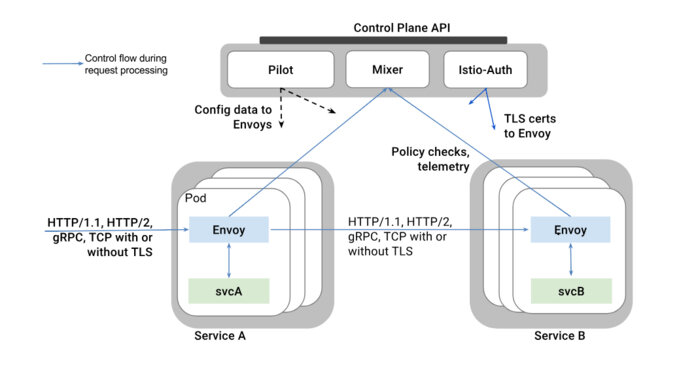

> 本文系转载，作者：郑伟，小米信息部技术架构组
>

本系列文章主要从源码（[35e2b904](https://github.com/istio/istio/tree/35e2b9042fe3d4ebe68772311aa1ebe46b66a1be)）出发，对 istio 做深入剖析，让大家对 istio 有更深的认知，从而方便平时排查问题。不了解 Service Mesh 和 Istio 的同学请先阅读敖小剑老师如下文章进行概念上的理解：

- [Service Mesh：下一代微服务](https://skyao.io/publication/service-mesh-next-generation-microservice/)
- [服务网格新生代-Istio](https://skyao.io/publication/istio-introduction/)

本文主要对 istio 在 ubuntu16.04 下环境搭建做简单介绍，Mac 用户和其他 linux 发行版用户请根据 bash 脚本做相应调整。

## 概述

Istio 为希腊文，意思是“启航”，和“kubernetes（舵手）”遥相呼应，是一个开源的微服务管理、保护、监控的基础设施。Istio 发音**“意丝帝欧”**，重音在“意”上。

前两篇文章主要对 istio 开发环境以及通过服务治理配置生效流程做了介绍。考虑到有些用户可能没有接触过 Istio，本文会对 Istio 整体架构、内部各组件做介绍。

Istio 是逻辑上分为数据平面（Data Plane）和控制平面（Control Plane）。

- 数据平面的含义是什么？官网是这么描述的：

> The data plane is composed of a set of intelligent proxies (Envoy) deployed as sidecars that mediate and control all network communication between microservices.

数据平面由一组作为 sidecar 智能代理（Envoy）和它掌控网络通信的的微服务实例组成。sidecar 的意思是边三轮，一个 Envoy 实例掌控一个微服务实例的入口和出口流量，像边三轮一样。

- 对于控制平面，官网给出的定义是：

> The control plane is responsible for managing and configuring proxies to route traffic, as well as enforcing policies at runtime.

控制平面由 Pliot、Mixer、Istio-Auth 组成，负责管理和配置代理的路由流量以及运行时服务治理策略的执行。

## 整体架构

Istio 架构图如下所示：



- Envoy
   是一个高性能轻量级代理，它掌控了 service 的入口流量和出口流量，它提供了很多内置功能，如动态负载服务发现、负载均衡、TLS 终止、HTTP/2 & gRPC 流量代理、熔断、健康检查等功能。
- Mixer
   翻译过来是混音器，Mixer 负责在整个 Service Mesh 中实施访问控制和使用策略。Mixer 是一个可扩展组件，内部提供了多个模块化的适配器 ([adapter](https://github.com/istio/istio/tree/master/mixer/adapter))。
   Envoy 提供 request 级别的属性（[attributes](https://istio.io/docs/concepts/policy-and-control/attributes.html)）数据。这些数据交由 Mixer 进行评估和处理，Mixer 中的各种适配器 ([adapter](https://github.com/istio/istio/tree/master/mixer/adapter)) 基于这些属性数据，来实现日志记录、监控指标采集展示、配额管理、ACL 检查等功能。
- Pilot
   翻译过来是领航员，Pliot 对 Envoy 的生命周期进行管理，同时提供了智能路由（如 A/B 测试、金丝雀部署）、流量管理（超时、重试、熔断）功能。Pliot 接收用户指定的高级路由规则配置，转换成 Envoy 的配置，使这些规则生效。
- Istio-Auth
   服务间认证和终端用户认证功能。

## 源码结构介绍

Istio 源码托管于[Github](https://github.com/istio/istio)，项目使用 Go 开发。

以[35e2b904](https://github.com/istio/istio/tree/35e2b9042fe3d4ebe68772311aa1ebe46b66a1be)为例，istio 代码结构如下所示：

```bash
.
├── addons                                   
├── bin
├── broker
├── docker
├── galley
├── install
├── istioctl
├── mixer
├── pilot
├── pkg
├── prow
├── release
├── samples
├── security
├── tests
├── tools
├── vendor
├── codecov.requirement
├── codecov.skip
├── CONTRIBUTING.md
├── downloadIstio.sh
├── Gopkg.lock
├── Gopkg.toml
├── istio.deps
├── istio.VERSION
├── istio.yaml
├── LICENSE
├── lintconfig_base.json
├── Makefile
├── OWNERS
└── README.md
```

部分包\文件\文件夹功能列表如下：

| Package/Directory/File | Introduction                                                 |
| ---------------------- | ------------------------------------------------------------ |
| addons                 | 一些插件，比如展示 metrics 的 grafana 和绘制服务调用图的 servicegraph |
| bin                    | 存放初始化依赖、编译、插件证书检查、代码生成的脚本           |
| broker                 | Istio 对 Open Service Broker 的一种实现，该 API 使得外部服务能自动访问 Istio 服务。broker 目前还处于研发阶段。 |
| galley                 | 提供了 Istio 的配置管理功能，目前还处于研发阶段。              |
| install                | 生成各环境（ansible、consul、ereka、kubernetes 等）安装 istio 时需要 yaml 配置清单。 |
| istioctl               | istio 终端控制工具（类似 kubectl 之于 kubernetes），用户通过 istioctl 来修改 istio 运行时配置，执行服务治理策略。 |
| mixer                  | “混音器”，参与到 tracffic 处理流程。通过对 envoy 上报的 attributes 进行处理，结合内部的 adapters 实现日志记录、监控指标采集展示、配额管理、ACL 检查等功能。 |
| pilot                  | “领航员”，pliot 对 Envoy 的生命周期进行管理，同时提供了智能路由（如 A/B 测试、金丝雀部署）、流量管理（超时、重试、熔断）功能。 |
| pkg                    | 顶级公共包，包含 istio 版本处理、tracing、日志记录、缓存管理等。 |
| release                | 包含 Istio 在各平台上进行编译的脚本。                          |
| samples                | Istio 提供的微服务样例，比如 bookinfo。                        |
| security               | Istio 用户身份验证、服务间认证。                              |
| tests                  | 测试用例、脚本等。                                           |
| vendor                 | dep 生成的第三方依赖。                                        |
| Gopkg.*                | dep 需要 version constraint 和 version lock 文件。                |
| Makefile               | Istio Makefile，编译 docker 镜像时会引用 tools/istio-docker.mk 这个 Makefile。 |

## 开发环境搭建

## 安装 docker

参考 https://docs.docker.com/install/linux/docker-ce/ubuntu/#install-docker-ce-1

### 配置 docker 代理[可选]

新建`/etc/systemd/system/docker.service.d/http-proxy.conf`，添加如下配置

```bash
[Service]
Environment="HTTP_PROXY=http://<your_proxy>/" "HTTPS_PROXY=http://<your_proxy>/" "NO_PROXY=192.168.0.0/16,127.0.0.0/8" # your_proxy替换成你自己的代理
```

## 安装 virtualbox

```bash
# virtualbox需要装最新的5.2.10, https://www.virtualbox.org/wiki/Linux_Downloads
# Mac OS
wget https://download.virtualbox.org/virtualbox/5.2.10/VirtualBox-5.2.10-122088-OSX.dmg
# ubuntu AMD64
wget https://download.virtualbox.org/virtualbox/5.2.10/virtualbox-5.2_5.2.10-122088~Ubuntu~xenial_amd64.deb && sudo apt install ./virtualbox-5.2_5.2.10-122088~Ubuntu~xenial_amd64.deb
# centos6 AMD64
wget https://download.virtualbox.org/virtualbox/5.2.10/VirtualBox-5.2-5.2.10_122088_el6-1.x86_64.rpm && yum install ./VirtualBox-5.2-5.2.10_122088_el7-1.x86_64.rpm
# centos7 AMD64
wget https://download.virtualbox.org/virtualbox/5.2.10/VirtualBox-5.2-5.2.10_122088_el7-1.x86_64.rpm && yum install ./VirtualBox-5.2-5.2.10_122088_el7-1.x86_64.rpm
```

## 安装 k8s 集群

### 使用 vagrant 安装 k8s 集群[建议]

参考[Jimmy Song](https://jimmysong.io)的 vagrant 教程[kubernetes-vagrant-centos-cluster](https://github.com/rootsongjc/kubernetes-vagrant-centos-cluster)，其中节点个数根据自己机器配置酌情更改（参考[kubernetes-vagrant-centos-cluster](https://github.com/sevenNt/kubernetes-vagrant-centos-cluster)）。

### 使用[minikube](https://github.com/kubernetes/minikube)安装 k8s 集群[可选]

- 安装 minikube

```bash
curl -Lo minikube https://storage.googleapis.com/minikube/releases/latest/minikube-linux-amd64 && chmod +x minikube && sudo mv minikube /usr/local/bin/ # 下载minikube
curl -Lo kubectl https://storage.googleapis.com/kubernetes-release/release/$(curl -s https://storage.googleapis.com/kubernetes-release/release/stable.txt)/bin/linux/amd64/kubectl && chmod +x kubectl && sudo mv kubectl /usr/local/bin/ # 下载kubectl
```

- 启动 k8s

```bash
# 注minikube可以不使用virtualbox启动k8s，不过需要dockerc处于桥接模式，否则可能导致网络连接不通，配置过程请自行搜索
minikube start \
--extra-config=controller-manager.ClusterSigningCertFile="/var/lib/localkube/certs/ca.crt" \
--extra-config=controller-manager.ClusterSigningKeyFile="/var/lib/localkube/certs/ca.key" \
--extra-config=apiserver.Admission.PluginNames=NamespaceLifecycle,LimitRanger,ServiceAccount,PersistentVolumeLabel,DefaultStorageClass,DefaultTolerationSeconds,MutatingAdmissionWebhook,ValidatingAdmissionWebhook,ResourceQuota \
--kubernetes-version=v1.9.4 \
--logtostderr
```

## 配置 Istio repo

- 配置 github 并拉取代码

```bash
# 配置github代理
git config --global http.https://github.com.proxy http://proxy:1080

# 在github上fork Istio，并clone到自己公共的$GOPATH/src/istio.io/下
mkdir -p $GOPATH/src/istio.io
cd $GOPATH/src/istio.io
git clone https://github.com/$YOU/istio
cd istio
git remote add upstream 'https://github.com/istio/istio'
git config --global --add http.followRedirects 1
```

- 配置环境变量

未避免污染全局环境变量，强烈建议安装[autoenv](https://github.com/kennethreitz/autoenv)。

```bash
cd $GOPATH/src/istio.io/istio
```

在 istio 根目录下新增`.env`文件，配置如下：

```bash
export GOPATH=$YOUR_GOPATH # $YOUR_GOPATH为你的GOPATH路径
export PATH=$PATH:$GOPATH/bin
export ISTIO=$GOPATH/src/istio.io # eg. ~/go/src/istio.io

# Please change HUB to the desired HUB for custom docker container
# builds.
export HUB="docker.io/$USER" # $USER为你的dockerhub账号

# The Istio Docker build system will build images with a tag composed of
# $USER and timestamp. The codebase doesn't consistently use the same timestamp
# tag. To simplify development the development process when later using
# updateVersion.sh you may find it helpful to set TAG to something consistent
# such as $USER.
export TAG=$USER # TAG为你编译Istio各组建后打包镜像的tag，建议Mac/ubuntu当前账号

# If your github username is not the same as your local user name (saved in the
# shell variable $USER), then replace "$USER" below with your github username
export GITHUB_USER=$USER # GITHUB_USER为你的github账号

# Specify which Kube config you'll use for testing. This depends on whether
# you're using Minikube or your own Kubernetes cluster for local testing
# For a GKE cluster:
export KUBECONFIG=${HOME}/.kube/config
# Alternatively, for Minikube:
# export KUBECONFIG=${GOPATH}/src/istio.io/istio/.circleci/config

export ISTIO_DOCKER_HUB="docker.io/$USER" # make build时使用此变量
export ISTIO_VERSION=$USER                # make build时使用此变量
```

使当前.env 生效：

```bash
cd .
```

## Istio 编译组件并测试

- 编译镜像

```bash
# make init # 初始化，检查目录结构、Go版本号、初始化环境变量、检查vendor等
make docker # 对各组件（istioctl、mixer、pilot、istio-auth等）进行二进制包编译、测试、镜像编译
make push # 推送镜像到dockerhub
```

```bash
# 其他指令
make pilot  docker.pilot # 编译pilot组件和镜像
make app  docker.app # 编译app组件和镜像
make proxy  docker.proxy # 编译proxy组件和镜像
make proxy_init  docker.proxy_init # 编译proxy_init组件和镜像
make proxy_debug  docker.proxy_debug # 编译proxy_debug组件和镜像
make sidecar_injector  docker.sidecar_injector # 编译sidecar_injector组件和镜像
make proxyv2  docker.proxyv2 # 编译proxyv2组件和镜像

make push.docker.pilot # 推送pilot镜像到dockerhub，其他组件类似
```

- 其他脚本

```bash
cd $GOPATH/src/istio.io/istio

./bin/get_workspace_status # 查看当前工作目录状态，包括环境变量等
install/updateVersion.sh -a ${HUB},${TAG} # 使用当前环境变量生成Istio清单
samples/bookinfo/build_push_update_images.sh # 使用当前环境变量编译并推送bookinfo镜像
```

- 测试镜像

参考[Istio doc](https://istio.io/docs/setup/kubernetes/quick-start.html)
