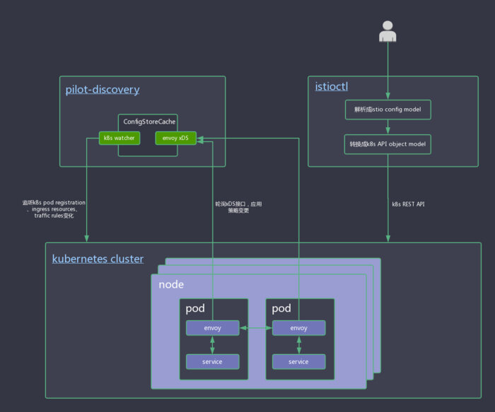

> 本文系转载，原文作者：郑伟，小米信息部技术架构组

本系列文章主要从源码（[35e2b904](https://link.jianshu.com?t=https%3A%2F%2Fgithub.com%2Fistio%2Fistio%2Ftree%2F35e2b9042fe3d4ebe68772311aa1ebe46b66a1be)）出发，对 istio 做深入剖析，让大家对 istio 有更深的认知，从而方便平时排查问题。不了解 Service Mesh 和 Istio 的同学请先阅读敖小剑老师如下文章进行概念上的理解：

- [Service Mesh：下一代微服务](https://link.jianshu.com?t=https%3A%2F%2Fskyao.io%2Fpublication%2Fservice-mesh-next-generation-microservice%2F)
- [服务网格新生代-Istio](https://link.jianshu.com?t=https%3A%2F%2Fskyao.io%2Fpublication%2Fistio-introduction%2F)

# 服务治理配置生效流程解析

如果大家安装[bookinfo](https://link.jianshu.com?t=https%3A%2F%2Fistio.io%2Fdocs%2Fguides%2Fbookinfo.html)并执行过文档中的 task，可以了解到，所有服务治理流程都是通过 istioctl 工具，执行指定 yaml 配置文件来实现。那么从执行 istioctl 指令到配置文件生效，整个流程到底是什么样的呢？下面给大家做一个简单的介绍。

整个配置生效的流程图如下所示：



 配置文件解析

以 task [request-routing](https://link.jianshu.com?t=https%3A%2F%2Fistio.io%2Fdocs%2Ftasks%2Ftraffic-management%2Frequest-routing.html)为例，我们的需求是把名为 jason 的用户访问 reviews 服务的版本切换为 v2。`route-rule-reviews-test-v2.yaml`内容如下所示：

```yaml
apiVersion: config.istio.io/v1alpha2
kind: RouteRule
metadata:
  name: reviews-test-v2
spec:
  destination:
    name: reviews
  precedence: 2
  match:
    request:
      headers:
        cookie:
          regex: "^(.*?;)?(user=jason)(;.*)?$"
  route:
  - labels:
      version: v2
```

### 解析并执行 istioctl create 指令

通过`istioctl create -f samples/bookinfo/kube/route-rule-reviews-test-v2.yaml`指令来使规则生效，执行`istioctl create`指令运行的相关代码入口如下：

`istio/cmd/istioctl/main.go#postCmd`#113 行。

```go
postCmd = &cobra.Command{
        Use:     "create",
        Short:   "Create policies and rules",
        Example: "istioctl create -f example-routing.yaml",
        RunE: func(c *cobra.Command, args []string) error {
                    if len(args) != 0 {
                      c.Println(c.UsageString())
                      return fmt.Errorf("create takes no arguments")
                    }
                    // varr 为转换成功的 istio 内部 model.Config 切片，包括 routeRule、gateway、ingressRule、egressRule、policy 等
                    // others 是不能转换成 model.Config 的 k8s object wrapper 切片，后面会当成 mixer 配置来处理
                    varr, others, err := readInputs()
                    if err != nil {
                        return err
                    }
                    if len(varr) == 0 && len(others) == 0 {
                        return errors.New("nothing to create")
                    }
            ...
        }
} 
```

### 解析出 model.Config 切片、crd.istioKind 切片流程

- **model.Config 为 istio 配置单元**
- **crd.IstioKind 对 k8s API 对象做了一层封装**

`readInput`函数解析`create`命令的相关参数（比如`-f`），如果是-f 指定的文件是有效文件，则会调用`pilot/pkg/config/kube/crd包的ParseInputs`函数解析该文件。

```go
func readInputs() ([]model.Config, []crd.IstioKind, error) {
    var reader io.Reader
        ...
            // 读取指定 yaml 文件
        if in, err = os.Open(file); err != nil {
            return nil, nil, err
        }
        defer func() {
            if err = in.Close(); err != nil {
                log.Errorf("Error: close file from %s, %s", file, err)
            }
        }()
        reader = in
    ... 
    input, err := ioutil.ReadAll(reader)
    ...
    return crd.ParseInputs(string(input))
}
```

`ParseInputs`函数内部逻辑：

```go
func ParseInputs(inputs string) ([]model.Config, []IstioKind, error) {
    var varr []model.Config
    var others []IstioKind
    reader := bytes.NewReader([]byte(inputs))
    var empty = IstioKind{}

    // We store configs as a YaML stream; there may be more than one decoder.
    yamlDecoder := kubeyaml.NewYAMLOrJSONDecoder(reader, 512*1024)
    for {
        obj := IstioKind{}
        // 从 reader 中反序列化出 IstioKind 实例 obj
        err := yamlDecoder.Decode(&obj)
        ...
        schema, exists := model.IstioConfigTypes.GetByType(CamelCaseToKabobCase(obj.Kind))
        ...
        config, err := ConvertObject(schema, &obj, "")
        ...
        if err := schema.Validate(config.Spec); err != nil {
            return nil, nil, fmt.Errorf("configuration is invalid: %v", err)
        }
        varr = append(varr, *config)
    }

    return varr, others, nil
}
```

`ParseInputs`返回三种类型的值[]Config、[]IstioKind、error。

**istio/pilot/pkg/model#[]Config**

其中 Config 为 Istio 内部的配置单元，包含匿名 ConfigMeta 以及 ConfigMeta 序列化的 protobuf message；用户指定的 yaml 配置会被解析成相应的实例。

 **pilot/pkg/config/kube/crd#[]IstioKind**

`IstioKind`为 k8s API object 的一层封装，内部包含两个匿名结构体和一个 map：

```go
  type IstioKind struct {
      meta_v1.TypeMeta   `json:",inline"`
      meta_v1.ObjectMeta `json:"metadata"`
      Spec               map[string]interface{} `json:"spec"`
  }
```

- `IstioKindk8s.io/apimachinery/pkg/apis/meta/v1#TypeMeta`

     TypeMeta 包含了 k8s REST 资源类型（如`RouteRule`）、k8s API 版本号（如`config.istio.io/v1alpha2`）。
- `k8s.io/apimachinery/pkg/apis/meta/v1#ObjectMeta`

     ObjectMeta 包含了 k8s 资源对象包含的各必要字段，包括 Name、Namespace、UID 等。
- `Spec`

     一个存储 Spec 数据的 map。

上述代码将 string 类型的配置反序列化成`IstioKind`实例后，通过`model.IstioConfigTypes.GetByType()`方法获取 istio 的`[]ProtoSchema`实例。

```go
// ConfigDescriptor 是一个由 ProtoSchema 组成的切片
type ConfigDescriptor []ProtoSchema
// ProtoSchema 结构体定义了配置类型名称和 protobuf 消息的双向映射
type ProtoSchema struct {
    Type        string // 配置的 proto 类型，如 route-rule
    Plural      string // type 复数形式，如 route-rules
    Group       string // 配置的 proto 组名，如 config
    Version     string // 配置 API 的版本号，如一 lpha2
    MessageName string // 配置的 proto message 名，如 istio.routing.v1alpha1.RouteRule
    Gogo        bool   // 是否为 gogo protobuf 编码
    Validate    func(config proto.Message) error // protobuf 校验函数
}
```

拿到 schema 后，通过`ConvertObject`方法，将 k8s 风格的 object 实例转换成 istio 内部的 Config 模型实例，并根据 schema 类型调用相应的校验函数对 protobuf message 进行校验。

## 将配置变更提交到 k8s

`istio/cmd/istioctl/main.go#postCmd`#140 行。

```go
for _, config := range varr {
    // 初始化 namespace 数据
    if config.Namespace, err = handleNamespaces(config.Namespace); err != nil {
        return err
    }

    // 构造 k8s crd.Client 实例，crd.Client 包含初始化的 apiVerison 到 restClient 映射的 map。
    // 对每一种 apiVerison（由 schema.Group、"istio.io"、schema.Version 组成的 string，如"config.istio.io/v1alpha2"、"networking.istio.io/v1alpha3"等）
    // 都对应一个 crd.restClient 实例。
    var configClient *crd.Client
    if configClient, err = newClient(); err != nil {
        return err
    }
    var rev string
    // 通过 k8s REST 接口执行配置
    if rev, err = configClient.Create(config); err != nil {
        return err
    }
    fmt.Printf("Created config %v at revision %v\n", config.Key(), rev)
}
```

`configClient.Create`方法执行流程如下：

```go
func (cl *Client) Create(config model.Config) (string, error) {
    rc, ok := cl.clientset[apiVersionFromConfig(&config)]
    ...
    // 根据 config.Type 获取 schema
    schema, exists := rc.descriptor.GetByType(config.Type)
    ...
    // 调用 schema 指定的 Validate 函数，对 Spec 这个 protobuff 进行校验
    if err := schema.Validate(config.Spec); err != nil {
        return "", multierror.Prefix(err, "validation error:")
    }
    // ConvertConfig 函数将 model.Config 实例转换成 IstioObject 实例。
    // IstioObject 是一个 k8s API object 的接口，crd 包下有很多结构体实现了该接口，如 MockConfig、RouteRule 等
    out, err := ConvertConfig(schema, config)
    ...

    // 检索 clientset map，用指定的 restClient 实例发送 POST 请求，使配置生效。
    obj := knownTypes[schema.Type].object.DeepCopyObject().(IstioObject)
    err = rc.dynamic.Post().
        Namespace(out.GetObjectMeta().Namespace).
        Resource(ResourceName(schema.Plural)).
        Body(out).
        Do().Into(obj)
    if err != nil {
        return "", err
    }
    return obj.GetObjectMeta().ResourceVersion, nil
}
```

## pilot-discovery 初始化

`pilot/cmd/pilot-discovery/main.go`#57 行，构造 discoveryServer 实例。

```go
...
discoveryServer, err := bootstrap.NewServer(serverArgs)
if err != nil {
    return fmt.Errorf("failed to create discovery service: %v", err)
}
...
```

### 监听 k8s 相关资源变更

`NewServer`函数内部流程如下：

```go
func NewServer(args PilotArgs) (*Server, error) {
    ...
    // 初始化 pilot 配置控制器，根据 pilot-discovery 启动指令，初始化配置控制器。
    // 默认只会初始化 kube 配置控制器（kubeConfigController，它实现了 model.ConfigStoreCache 接口）。
    // kubeConfigController 会 watch k8s pod registration、ingress resources、traffic rules 等变化。
    if err := s.initConfigController(&args); err != nil {
        return nil, err
    }
    // 初始化服务发现控制器，控制器内部会构造 K8sServiceControllers。
    if err := s.initServiceControllers(&args); err != nil {
        return nil, err
    }
    // 初始化 DiscoveryService 实例，实例内部注册了 envoy xDS 路由。
    // kubeConfigController 中 watch 到变更后，envoy 轮询 xDS 接口，获取变更。
    if err := s.initDiscoveryService(&args); err != nil {
        return nil, err
    }
    ...
}
```

### 注册 envoy xDS 路由

`initDiscoveryServic`方法内部流程如下：

```go
func (s *Server) initDiscoveryService(args *PilotArgs) error {
    // 构造 pilot runtime environment。environment 中保存了 kubeConfigController、serviceController 等。
    environment := model.Environment{
        Mesh:             s.mesh,
        IstioConfigStore: model.MakeIstioStore(s.configController),
        ServiceDiscovery: s.ServiceController,
        ServiceAccounts:  s.ServiceController,
        MixerSAN:         s.mixerSAN,
    }
    // 构造 DiscoveryService 实例。
    discovery, err := envoy.NewDiscoveryService(
        s.ServiceController,
        s.configController,
        environment,
        args.DiscoveryOptions,
    )
}
```

`NewDiscoveryService`方法内部流程如下：

```go
func NewDiscoveryService(ctl model.Controller, configCache model.ConfigStoreCache,
    environment model.Environment, o DiscoveryServiceOptions) (*DiscoveryService, error) {
    out := &DiscoveryService{
        Environment: environment, // 将 environment 赋值给 Environment 成员。
        sdsCache:    newDiscoveryCache("sds", o.EnableCaching),
        cdsCache:    newDiscoveryCache("cds", o.EnableCaching),
        rdsCache:    newDiscoveryCache("rds", o.EnableCaching),
        ldsCache:    newDiscoveryCache("lds", o.EnableCaching),
    }
    container := restful.NewContainer()
    ...
    // 注册 web service 容器。
    out.Register(container)
}
```

`out.Register`方法内部流程如下：

```go
func (ds *DiscoveryService) Register(container *restful.Container) {
    ws := &restful.WebService{}
    ws.Produces(restful.MIME_JSON)
    ...

    // 注册 Envoy xDS（SDS、CDS、RDS、LDS）路由
    // 注册 Envoy RDS(Route discovery service) 路由。https://www.envoyproxy.io/docs/envoy/latest/api-v1/route_config/rds
    // RDS 可以与 SDS、EDS 协同工作，来构建用户指定的路由拓扑（如流量切换、蓝绿部署等）。
    ws.Route(ws.
        GET(fmt.Sprintf("/v1/routes/{%s}/{%s}/{%s}", RouteConfigName, ServiceCluster, ServiceNode)).
        To(ds.ListRoutes).
        Doc("RDS registration").
        Param(ws.PathParameter(RouteConfigName, "route configuration name").DataType("string")).
        Param(ws.PathParameter(ServiceCluster, "client proxy service cluster").DataType("string")).
        Param(ws.PathParameter(ServiceNode, "client proxy service node").DataType("string")))

    // 注册 Envoy LDS(Listener discovery service) 路由。https://www.envoyproxy.io/docs/envoy/latest/configuration/listeners/lds
    // Envoy 可以从通过这个接口动态获取需要新的 Listener 信息，从而在运行时动态实例化 Listener。
    // Listener 可以用来处理不同的代理任务（如速率限制、HTTP 连接管理、原始 TCP 代理等）。
    ws.Route(ws.
        GET(fmt.Sprintf("/v1/listeners/{%s}/{%s}", ServiceCluster, ServiceNode)).
        To(ds.ListListeners).
        Doc("LDS registration").
        Param(ws.PathParameter(ServiceCluster, "client proxy service cluster").DataType("string")).
        Param(ws.PathParameter(ServiceNode, "client proxy service node").DataType("string")))
    ...
}
```

- RDS 路由绑定的`ds.ListRoutes`方法读取 environment 中相关配置，返回给 Envoy 实例需要配置的路由信息。
- LDS 路由绑定的`ds.ListListeners`方法读取 environment 中相关配置，返回给 Envoy 实例需要的 Listener 信息。
   Envoy 实例轮询 xDS 接口，获取变更的配置信息，最终执行具体的服务治理策略。

# 总结

结合上文中贴出的流程图

 

**总结如下**

Istio 的 pilot-discovery 启动

1. 初始化 kube 配置控制器，控制器中 watch k8s pod、ingress 以及流量管理规则等变更。
2. 初始化 envoy 各发现服务，注册 envoy xDS 路由，绑定相应的配置变更 handler。
3. pilot-discovery 等待 envoy 实例轮询 xDS 接口，将变更返给 envoy 实例。

用户通过 istioctl 应用配置

1. istioctl 解析指令（create、delete 等），通过 k8s REST 接口，将变更推送的 k8s。
2. k8s 产生变更，变更同步到`kubeConfigController`中。
3. envoy 实例轮询 xDS 接口，应用变更。
