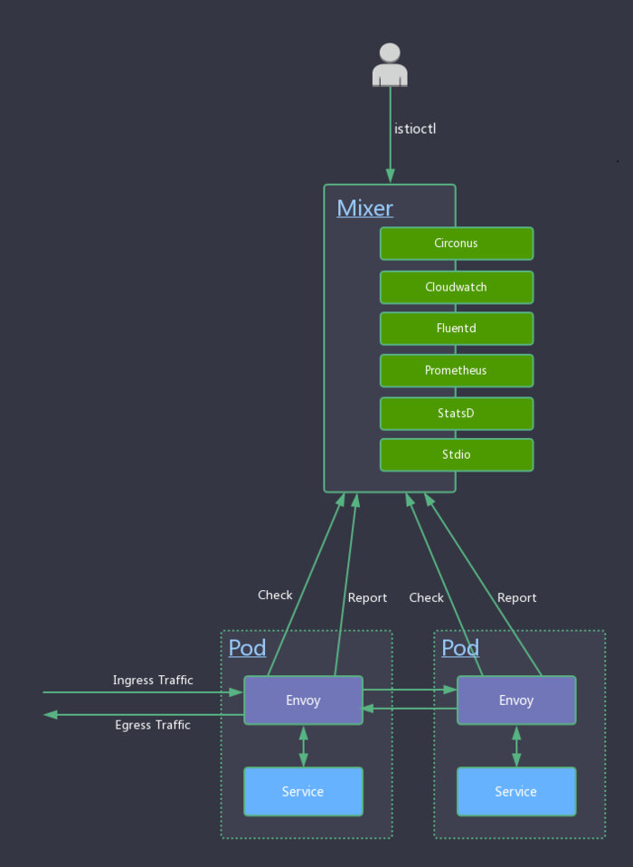

> 本文系转载，作者：郑伟，小米信息部技术架构组
>

本系列文章主要从源码（[35e2b904](https://github.com/istio/istio/tree/35e2b9042fe3d4ebe68772311aa1ebe46b66a1be)）出发，对 istio 做深入剖析，让大家对 istio 有更深的认知，从而方便平时排查问题。不了解 Service Mesh 和 Istio 的同学请先阅读敖小剑老师如下文章进行概念上的理解：

- [Service Mesh：下一代微服务](https://skyao.io/publication/service-mesh-next-generation-microservice/)
- [服务网格新生代-Istio](https://skyao.io/publication/istio-introduction/)

本文主要对 istio 在 ubuntu16.04 下环境搭建做简单介绍，Mac 用户和其他 linux 发行版用户请根据 bash 脚本做相应调整。

# 概念介绍

Mixer 提供三个核心功能：

- 前置条件检查（Precondition Checking）：某一服务响应外部请求前，通过 Envoy 向 Mixer 发送 Check 请求，检查该请求是否满足一定的前提条件，包括白名单检查、ACL 检查等。
- 配额管理（Quota Management）：当多个请求发生资源竞争时，通过配额管理机制可以实现对资源的有效管理。
- 遥测报告上报（Telemetry Reporting）：该服务处理完请求后，通过 Envoy 向 Mixer 上报日志、监控等数据。

要深入了解 Mixer，我们先对如下几个概念做介绍：

## Attribute（属性）

大部分 attributes 由 Envoy 提供。Istio 用[attributes](https://preliminary.istio.io/docs/concepts/policy-and-control/attributes.html)来控制服务在 Service Mesh 中运行时行为。attributes 是有名称和类型的元数据，用来描述入口和出口流量和流量产生时的环境。attributes 携带了一些具体信息，比如：API 请求状态码、请求响应时间、TCP 连接的原始地址等。

### RefrencedAttributes（被引用的属性）

refrencedAttributes 是 Mixer Check 时进行条件匹配后被使用的属性的集合。Envoy 向 Mixer 发送的 Check 请求中传递的是属性的全集，refrencedAttributes 只是该全集中被应用的一个子集。

举个例子，Envoy 某次发送的 Check 请求中发送的 attributes 为`{request.path: xyz/abc, request.size: 234,source.ip: 192.168.0.1}`，如 Mixer 中调度到的多个 adapters 只用到了`request.path`和`request.size`这两个属性。那么 Check 后返回的 refrencedAttributes 为`{request.path: xyz/abc, request.size: 234}`。

为防止每次请求时 Envoy 都向 Mixer 中发送 Check 请求，Mixer 中建立了一套复杂的缓存机制，使得大部分请求不需要向 Mixer 发送 Check 请求。

```ini
request.path: xyz/abc
request.size: 234
request.time: 12:34:56.789 04/17/2017
source.ip: 192.168.0.1
destination.service: example
```

属性词汇由`[_.a-z0-9]`组成，其中`.`为命名空间分隔符，所有属性词汇可以查看[这里](https://preliminary.istio.io/docs/reference/config/mixer/attribute-vocabulary.html)，属性类型可以查看[这里](https://github.com/istio/api/blob/master/policy/v1beta1/value_type.proto)。

## Adapter（适配器）

Mixer 是一个高度模块化、可扩展组件，内部提供了多个适配器 ([adapter](https://link.jianshu.com/?t=https%3A%2F%2Fgithub.com%2Fistio%2Fistio%2Ftree%2Fmaster%2Fmixer%2Fadapter))。

Envoy 提供 request 级别的属性（[attributes](https://link.jianshu.com/?t=https%3A%2F%2Fistio.io%2Fdocs%2Fconcepts%2Fpolicy-and-control%2Fattributes.html)）数据。

adapters 基于这些 attributes 来实现日志记录、监控指标采集展示、配额管理、ACL 检查等功能。Istio 内置的部分 adapters 举例如下：

-  [circonus](https://github.com/istio/istio/tree/master/mixer/adapter/circonus)：一个微服务监控分析平台。
-  [cloudwatch](https://github.com/istio/istio/tree/master/mixer/adapter/cloudwatch)：一个针对 AWS 云资源监控的工具。
-  [fluentd](https://github.com/istio/istio/tree/master/mixer/adapter/fluentd)：一款开源的日志采集工具。
-  [prometheus](https://github.com/istio/istio/tree/master/mixer/adapter/prometheus)：一款开源的时序数据库，非常适合用来存储监控指标数据。
-  [statsd](https://github.com/istio/istio/tree/master/mixer/adapter/statsd)：一款采集汇总应用指标的工具。
-  [stdio](https://github.com/istio/istio/tree/master/mixer/adapter/stdio)：stdio 适配器使 Istio 能将日志和 metrics 输出到本地，结合内置的 ES、Grafana 就可以查看相应的日志或指标了。

 

## Template（模板）

对于一个网络请求，Mixer 通常会调用两个 rpc：Check 和 Report。不同的 adapter 需要不同的 attributes，template 定义了 attributes 到 adapter 输入数据映射的 schema，一个适配器可以支持多个 template。一个上报 metric 数据的模板如下所示：

```yaml
apiVersion: "config.istio.io/v1alpha2"
kind: metric
metadata:
  name: requestsize
  namespace: istio-system
spec:
  value: request.size | 0
  dimensions:
    source_service: source.service | "unknown"
    source_version: source.labels["version"] | "unknown"
    destination_service: destination.service | "unknown"
    destination_version: destination.labels["version"] | "unknown"
    response_code: response.code | 200
  monitored_resource_type: '"UNSPECIFIED"'
```

模板字段的值可以是字面量或者[表达式](https://istio.io/docs/reference/config/mixer/expression-language.html)，如果时表达式，则表达式的值类型必须与字段的数据类型一致。

## Mixer 的配置模型

Mixer 的 yaml 配置可以抽象成三种模型：**Handler**、**Instance**、**Rule**
 这三种模型主要通过 yaml 中的 kind 字段做区分，kind 值有如下几种：

-  [adapter kind](https://preliminary.istio.io/docs/reference/config/policy-and-telemetry/adapters/)：表示此配置为 Handler。
-  [template kind](https://preliminary.istio.io/docs/reference/config/policy-and-telemetry/templates/)：表示此配置为 Template。
- "rule"：表示此配置为 Rule。

#### Handler

一个 Handler 是配置好的 Adpater 的实例。Handler 从 yaml 配置文件中取出 adapter 需要的配置数据。一个典型的 Promethues Handler 配置如下所示：

```yaml
apiVersion: config.istio.io/v1alpha2
kind: prometheus
metadata:
  name: handler
  namespace: istio-system
spec:
  metrics:
  - name: request_count
    instance_name: requestcount.metric.istio-system
    kind: COUNTER
    label_names:
    - destination_service
    - destination_version
    - response_code
```

对于 Handler 而言，`{metadata.name}.{kind}.{metadata.namespace}`是其完全限定名（Fully Qualified name），上述 Handler 的完全限定名是**handler.prometheus.istio-system**，完全限定名是全局唯一的。

adapter 的配置信息定义在 spec 段中，每个 adapter 配置的格式都有所区别，可以从[这里查看](<https://istio.io/docs/reference/config/adapters/>)指定的 adapter 配置格式。上述 Handler 中引用了`requestcount.metric.istio-system`这个 Instance。

#### Instance

Instance 定义了 attributes 到 adapter 输入的映射，一个处理 requestduration metric 数据的 Instance 配置如下所示：

```yaml
apiVersion: config.istio.io/v1alpha2
kind: metric
metadata:
  name: requestduration
  namespace: istio-system
spec:
  value: response.duration | "0ms"
  dimensions:
    destination_service: destination.service | "unknown"
    destination_version: destination.labels["version"] | "unknown"
    response_code: response.code | 200
  monitored_resource_type: '"UNSPECIFIED"'
```

上述 Instance 的完全限定名是**requestduration.metric.istio-system**，Handler 和 Rule 可以通过这个名称对此 Instance 进行引用。

#### Rule

Rule 定义了一个特定的 Instance 何时调用一个特定的 Handler，一个典型的 Rule 配置如下所示：

```yaml
apiVersion: config.istio.io/v1alpha2
kind: rule
metadata:
  name: promhttp
  namespace: istio-system
spec:
  match: destination.service == "service1.ns.svc.cluster.local" && request.headers["x-user"] == "user1"
  actions:
  - handler: handler.prometheus
    instances:
    - requestduration.metric.istio-system
```

上述例子中，定义的 Rule 为：对目标服务为`service1.ns.svc.cluster.local`且`request.headers["x-user"] `为`user1`的请求，Instance: `requestduration.metric.istio-system`才调用 Handler: `handler.prometheus`。

# Mixer 工作流程源码分析

上面简单介绍了 Mixer 相关概念，下面我们从源码出发来对 Mixer 工作流程做分析。

## 编译 mixer 二进制文件和 docker 镜像

先看 Makfile：

```go
···
MIXER_GO_BINS:=${ISTIO_OUT}/mixs ${ISTIO_OUT}/mixc
mixc: # Mixer客户端，通过mixc我们可以和运行的mixer进行交互。
    bin/gobuild.sh ${ISTIO_OUT}/mixc istio.io/istio/pkg/version ./mixer/cmd/mixc
mixs: # Mixer服务端，和Envoy、adapter交互。部署Istio的时候随之启动。
    bin/gobuild.sh ${ISTIO_OUT}/mixs istio.io/istio/pkg/version ./mixer/cmd/mixs
···
include tools/istio-docker.mk # 引入编译docker镜像的Makefile文件。
...
```

Makefile 中定义了`mixs(mixer server)`和`mixc(mixer client)`的编译流程。使用指令`make mixs mixc`编译好二进制文件后，再编译 docker 镜像。`istio-docker.mk`中编译 mixer 镜像相关指令如下：

```go
...
MIXER_DOCKER:=docker.mixer docker.mixer_debug
$(MIXER_DOCKER): mixer/docker/Dockerfile$$(suffix $$@) \
        $(ISTIO_DOCKER)/ca-certificates.tgz $(ISTIO_DOCKER)/mixs | $(ISTIO_DOCKER)
    $(DOCKER_RULE)
...
```

执行`make docker.mixer`会在本地编译 mixer 镜像，依据的 dockerfile 是`mixer/docker/Dockerfile.mixer`，如下所示：

```go
FROM scratch

# obtained from debian ca-certs deb using fetch_cacerts.sh
ADD ca-certificates.tgz /
ADD mixs /usr/local/bin/

ENTRYPOINT ["/usr/local/bin/mixs", "server"]
CMD ["--configStoreURL=fs:///etc/opt/mixer/configroot","--configStoreURL=k8s://"]
```

可以知道容器启动时执行的 mixs 指令为`/usr/local/bin/mixs server --configStoreURL=fs:///etc/opt/mixer/configroot --configStoreURL=k8s://`

## Mixer Server 启动流程

mixs 启动入口：

```go
// supportedTemplates 从mixer/pkg/template包获取所有注册的模板信息。
func supportedTemplates() map[string]template.Info {
    return generatedTmplRepo.SupportedTmplInfo
}
// supportedAdapters 从mixer/pkg/adapter包获取所有注册的适配器信息。
func supportedAdapters() []adptr.InfoFn {
    return adapter.Inventory()
}

func main() {
    // 构造 cobra.Command 实例，mixs server 子命令设计在 serverCmd 中定义。
    rootCmd := cmd.GetRootCmd(os.Args[1:], supportedTemplates(), supportedAdapters(), shared.Printf, shared.Fatalf)

    if err := rootCmd.Execute(); err != nil {
        os.Exit(-1)
    }
}
```

mixs server 子命令在`istio/mixer/cmd/mixs/cmd/server.go#serverCmd`中定义：

```go
func serverCmd(info map[string]template.Info, adapters []adapter.InfoFn, printf, fatalf shared.FormatFn) *cobra.Command {
    ...
    serverCmd := &cobra.Command{
        Use:   "server",
        Short: "Starts Mixer as a server",
        Run: func(cmd *cobra.Command, args []string) {
            // 用户执行 mixs server 命令时，启动 mixer gRPC server
            runServer(sa, printf, fatalf) 
        },
    }
    ...
}

// runServer 函数启动 mixer gRPC server
func runServer(sa *server.Args, printf, fatalf shared.FormatFn) {
    s, err := server.New(sa)
    ...
    s.Run()
    ...
}
```

gRPC server 启动主要逻辑在`istio/mixer/pkg/server/server.go#newServer`：

```go
func newServer(a *Args, p *patchTable) (*Server, error) {
    ...
    s := &Server{}
    // 初始化 API worker 线程池
    s.gp = pool.NewGoroutinePool(apiPoolSize, a.SingleThreaded)
    s.gp.AddWorkers(apiPoolSize)
    // 初始化 adapter worker 线程池
    s.adapterGP = pool.NewGoroutinePool(adapterPoolSize, a.SingleThreaded)
    s.adapterGP.AddWorkers(adapterPoolSize)

    // 构造存放 Mixer 模板仓库
    tmplRepo := template.NewRepository(a.Templates)
    // 构造存放 adapter 的 map
    adapterMap := config.AdapterInfoMap(a.Adapters, tmplRepo.SupportsTemplate)
    ...
    // 构造 Mixer runtime 实例。runtime 实例是 Mixer 运行时环境的主要入口。
    // 它会监听配置变更，配置变更时会动态构造新的 handler 实例和 dispatcher 实例。
    // dispatcher 会基于配置和 attributes 对请求进行调度，调用相应的 adapters 处理请求。
    rt = p.newRuntime(st, templateMap, adapterMap, a.ConfigIdentityAttribute, a.ConfigDefaultNamespace,
        s.gp, s.adapterGP, a.TracingOptions.TracingEnabled())
    // runtime 实例开始监听配置变更，一旦配置变更，runtime 实例会构造新的 dispatcher。
    p.runtimeListen(rt)
    s.dispatcher = rt.Dispatcher()
    ...
    // 注册 Mixer gRPC server
    mixerpb.RegisterMixerServer(s.server, api.NewGRPCServer(s.dispatcher, s.gp))
    // 启动 ControlZ 监听器，ControlZ 提供了 Istio 的内省功能。Mixer 与 ctrlz 集成时，会启动一个
    // web service 监听器用于展示 Mixer 的环境变量、参数版本信息、内存信息、进程信息、metrics 等。
    go ctrlz.Run(a.IntrospectionOptions, nil)

    return s, nil
}
```

其中`istio/mixer/pkg/api/grpcServer.go#NewGRPCServer`函数中初始化了保存 attributes 的 list 和全局字典

```go
func NewGRPCServer(dispatcher dispatcher.Dispatcher, gp *pool.GoroutinePool) mixerpb.MixerServer {
    // 从 globalList 拷贝出 list 切片，list 形如 []string{"source.ip","source.port","request.id"...}
    list := attribute.GlobalList()
    // 将以 attribute.name 作为 key，index 作为 value，构造 map。形如:map[string][int]{"source.ip":1, "source.port":2, "request.id":3...}
    globalDict := make(map[string]int32, len(list))
    for i := 0; i < len(list); i++ {
        globalDict[list[i]] = int32(i)
    }

    return &grpcServer{
        dispatcher:     dispatcher,
        gp:             gp,
        globalWordList: list,
        globalDict:     globalDict,
    }
}
```

Mixer 启动的 gRPC server 定义了两个 rpc：Check、Report。

`istio/vendor/istio.io/api/mixer/v1/service.proto`#48 行

```go
service Mixer {
  // Check 基于活动配置和 Envoy 提供的 attributes，执行前置条件检查和配额管理。
  rpc Check(CheckRequest) returns (CheckResponse) {}

  // Reports 基于活动配置和 Envoy 提供的 attribues 上报遥测数据（如 logs 和 metrics）。
  rpc Report(ReportRequest) returns (ReportResponse) {}
}
```

CheckRequest、CheckResponse 结构如下所示：

```go
message CheckRequest {
  // QuotaParams 定义了配额管理相关的参数。
  message QuotaParams {
    int64 amount = 1;     // amount 为可分配的配额总数
    bool best_effort = 2; // best_effort 为真时，表示返回的配额数小于请求的配额数
  }
  // CompressedAttributes 为压缩过的本次请求的 attributes 
  CompressedAttributes attributes = 1 [(gogoproto.nullable) = false];
  // global_word_count 为 attribute 字典单词总数，用于判断客户端和 Mixer gRPC server 所用的字典是否同步
  uint32 global_word_count = 2;
  // deduplication_id 用于某次 rpc 请求失败后重试
  string deduplication_id = 3;
  //  quotas 进行分配的配额表，key 为用户自定义的配额名如“requestCount”
  map<string, QuotaParams> quotas = 4 [(gogoproto.nullable) = false];
}

message CheckResponse {
  // PreconditionResult 前置条件检查结果
  message PreconditionResult {
    // status 请求结果状态码，0 表示成功
    google.rpc.Status status = 1 [(gogoproto.nullable) = false];
    // valid_duration 用于判断本次结果是否合法的时间总数
    google.protobuf.Duration valid_duration = 2 [(gogoproto.nullable) = false, (gogoproto.stdduration) = true];
    // valid_use_count 用于判断本次结果是否合法的使用次数总数
    int32 valid_use_count = 3;
    // CompressedAttributes 返回的 attributes 数据，是请求的 attributes 和 Mixer 配置产生的 attributes 的集合
    CompressedAttributes attributes = 4 [(gogoproto.nullable) = false];
    // ReferencedAttributes Mixer adapters 引用过的 attritbues
    ReferencedAttributes referenced_attributes = 5 [(gogoproto.nullable) = false];
  }

  // QuotaResult 配额检查结果
  message QuotaResult {
    google.protobuf.Duration valid_duration = 1 [(gogoproto.nullable) = false, (gogoproto.stdduration) = true];
    // 授予的配额总数
    int64 granted_amount = 2;
    ReferencedAttributes referenced_attributes = 5 [(gogoproto.nullable) = false];
  }
  PreconditionResult precondition = 2 [(gogoproto.nullable) = false];
  map<string, QuotaResult> quotas = 3 [(gogoproto.nullable) = false];
}
```

ReportRequest、ReportResponse 结构如下所示：

```go
message ReportRequest {
  // CompressedAttributes 本次请求的 attributes 数据
  repeated CompressedAttributes attributes = 1 [(gogoproto.nullable) = false];
  // default_words 默认的 message 级别的 attributes 字典
  repeated string default_words = 2;
  // global_word_count 全局 attribute 字典总数
  uint32 global_word_count = 3;
}

message ReportResponse {
}
```

## Check 请求执行细节

```go
func (s *grpcServer) Check(legacyCtx legacyContext.Context, req *mixerpb.CheckRequest) (*mixerpb.CheckResponse, error) {
    // 构造基于 proto 的属性包 protoBag。protoBag 提供了对一组 attributes 进行访问、修改的机制。
    protoBag := attribute.NewProtoBag(&req.Attributes, s.globalDict, s.globalWordList)
    defer protoBag.Done()

    // 构造可变的（执行 check 方法后会变化）属性包 checkBag 
    checkBag := attribute.GetMutableBag(protoBag)
    defer checkBag.Done()
    // 执行 dispatcher 的预处理过程，s.dispatcher 为 runtime 实例 impl。
    // impl 的 Preprocess 方法会调度生成属性相关的 adapter，比如 kubernetes adapter。
    s.dispatcher.Preprocess(legacyCtx, protoBag, checkBag);
    // 获取属性包中被引用的属性快照 snapApa，snapApa 能在每次 check 和 quota 处理中重复使用。
    snapApa := protoBag.SnapshotReferencedAttributes()
    // 执行 dispatcher 的前置条件检查，Check 方法内部会计算被引用的属性并同步到 protoBag 中。
    cr, err := s.dispatcher.Check(legacyCtx, checkBag)
    ...
    // 构造 Check rpc response 实例
    resp := &mixerpb.CheckResponse{
        Precondition: mixerpb.CheckResponse_PreconditionResult{
            ValidDuration:        cr.ValidDuration,
            ValidUseCount:        cr.ValidUseCount,
            Status:               cr.Status,
            ReferencedAttributes: protoBag.GetReferencedAttributes(s.globalDict, globalWordCount),
        },
    }

    // 如果前置条件检查通过且配额表总数大于 0，则计算新的配额
    if status.IsOK(resp.Precondition.Status) && len(req.Quotas) > 0 {
        resp.Quotas = make(map[string]mixerpb.CheckResponse_QuotaResult, len(req.Quotas))
        // 遍历配额表，计算每个配额是否为引用配额
        for name, param := range req.Quotas {
            qma := &dispatcher.QuotaMethodArgs{
                Quota:           name,
                Amount:          param.Amount,
                DeduplicationID: req.DeduplicationId + name,
                BestEffort:      param.BestEffort,
            }

            protoBag.RestoreReferencedAttributes(snapApa)
            crqr := mixerpb.CheckResponse_QuotaResult{}
            var qr *adapter.QuotaResult
            // 执行 dispacher 的配额处理方法。istio/mixer/pkg/runtime/dispatcher/dispatcher.go#func (d *Impl) Quota(）
            qr, err = s.dispatcher.Quota(legacyCtx, checkBag, qma)
            if err != nil {
                err = fmt.Errorf("performing quota alloc failed: %v", err)
                log.Errora("Quota failure:", err.Error())
            } else if qr == nil {
                crqr.ValidDuration = defaultValidDuration
                crqr.GrantedAmount = qma.Amount
            } else {
                if !status.IsOK(qr.Status) {
                    log.Debugf("Quota denied: %v", qr.Status)
                }
                crqr.ValidDuration = qr.ValidDuration
                crqr.GrantedAmount = qr.Amount
            }
            // 根据全局 attribute 字典来计算被引用的 attributes
            crqr.ReferencedAttributes = protoBag.GetReferencedAttributes(s.globalDict, globalWordCount)
            resp.Quotas[name] = crqr
        }
    }
    // 返回 Check gRPC 相应结果
    return resp, nil
}
```

Report 请求执行整体逻辑和 Check 相似，本文暂不做解析。

## Mixer 适配器工作流程

- Mixer server 启动。
  - 初始化 adapter worker 线程池。
  - 初始化 Mixer 模板仓库。
  - 初始化 adapter builder 表。
  - 初始化 runtime 实例。
  - 注册并启动 gRPC server。
- 某一服务外部请求被 envoy 拦截，envoy 根据请求生成指定的 attributes，attributes 作为参数之一向 Mixer 发起 Check rpc 请求。
- Mixer 进行前置条件检查和配额检查，调用相应的 adapter 做处理，并返回相应结果。
- Envoy 分析结果，决定是否执行请求或拒绝请求。若可以执行请求则执行请求。请求完成后再向 Mixer gRPC 服务发起 Report rpc 请求，上报遥测数据。
- Mixer 后端的 adapter 基于遥测数据做进一步处理。 
