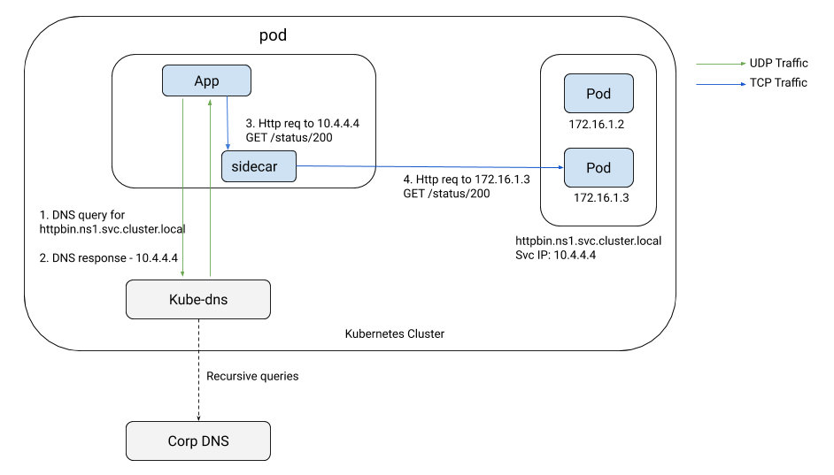
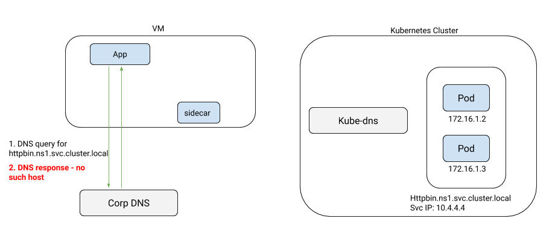
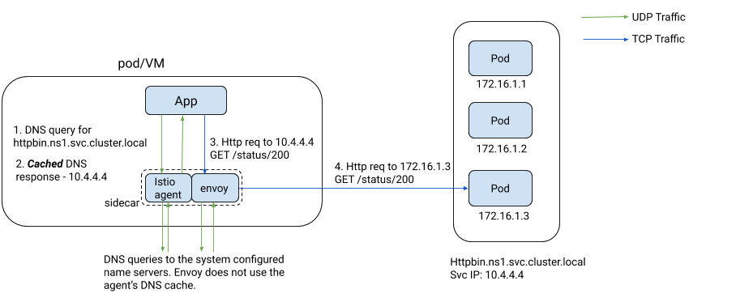

本文译自 Istio 官方博客 [Expanding into New Frontiers - Smart DNS Proxying in Istio](https://istio.io/latest/blog/2020/dns-proxy/)。

DNS 解析是 Kubernetes 上任何应用基础架构的重要组成部分。当你的应用代码试图访问 Kubernetes 集群中的另一个服务，甚至是互联网上的服务时，在发起与服务的连接之前，它必须首先查找服务主机名对应的 IP 地址。这个名称查找过程通常被称为服务发现。在 Kubernetes 中，集群 DNS 服务器，无论是 kube-dns 还是 CoreDNS，如果是 `ClusterIP` 类型的服务，都会将服务的主机名解析成一个唯一的不可路由的虚拟 IP（VIP）。每个节点上的 kube-proxy 将这个 VIP 映射到一组服务的 pod 上，并将流量转发到随机选择的其中一个。当使用服务网格时，sidecar 的工作原理与 kube-proxy 类似，都是为了转发流量。

下图描述了当前的 DNS 的作用。



## DNS 带来的问题

虽然 DNS 在服务网格中的作用看似微不足道，但它一直阻碍着将网格扩展到虚拟机并实现无缝多集群访问。

### 虚拟机访问 Kubernetes 服务

考虑一个带有 sidecar 的虚拟机的情况。如下图所示，虚拟机上的应用会查找 Kubernetes 集群内部服务的 IP 地址，因为它们通常无法访问集群的 DNS 服务器。



如果你愿意参与一些涉及 `dnsmasq` 和使用 `NodePort` 服务对 `kube-dns` 进行外部暴露的复杂工作，那么在技术上是可以在虚拟机上使用 `kube-dns` 作为名称服务器的：假设你能够说服你的集群管理员这样做。即使如此，你也是在为一系列 [安全问题](https://blog.aquasec.com/dns-spoofing-kubernetes-clusters) 打开大门。最后，这些都是临时解决方案，对于那些组织能力和领域专业知识有限的人来说，通常不在范围之内。

### 没有 VIP 的外部 TCP 服务

受 DNS 问题影响的不仅仅是 mesh 中的虚拟机。为了让 sidecar 准确区分 mesh 之外的两个不同 TCP 服务之间的流量，这些服务必须在不同的端口上，或者它们需要有一个全局唯一的 VIP，就像分配给 Kubernetes 服务的 `clusterIP` 一样。但如果没有 VIP 呢？像托管数据库这样的云托管服务，通常没有 VIP。相反，提供商的 DNS 服务器会返回其中一个实例 IP，然后应用程序可以直接访问。例如，考虑下面的两个服务条目，指向两个不同的 AWS RDS 服务。

```yaml
apiVersion: networking.istio.io/v1alpha3
kind: ServiceEntry
metadata:
  name: db1
  namespace: ns1
spec:
  hosts:
  - mysql–instance1.us-east-1.rds.amazonaws.com
  ports:
  - name: mysql
    number: 3306
    protocol: TCP
  resolution: DNS
---
apiVersion: networking.istio.io/v1alpha3
kind: ServiceEntry
metadata:
  name: db2
  namespace: ns1
spec:
  hosts:
  - mysql–instance2.us-east-1.rds.amazonaws.com
  ports:
  - name: mysql
    number: 3306
    protocol: TCP
  resolution: DNS
```

Sidecar 在 `0.0.0.0:3306` 上有一个监听器，它从公共 DNS 服务器上查找 `mysql-instance1.us-east1.rds.amazonaws.com` 的 IP 地址，并将流量转发给它。它无法将流量路由到 db2，因为它无法区分到达 `0.0.0.0:3306` 的流量是指向 `db1` 还是 `db2`。唯一的办法是将解析设置为 `NONE`，使 sidecar 盲目地将 `3306` 端口上的流量转发到应用程序请求的原始 IP。这就好比在防火墙上打了一个洞，允许所有流量进入 3306 端口，而不管目标 IP 是什么。为了让流量流动起来，你现在不得不对系统的安全态势做出妥协。

### 为远程集群中的服务解析 DNS

多集群网格的 DNS 限制是众所周知的。一个集群中的服务无法查询其他集群中的服务的 IP 地址，如果没有在调用者 namespace 中创建存根服务等笨拙的工作方式，就无法实现。

## 控制 DNS

总而言之，DNS 在 Istio 中一直是一个棘手的问题。是时候杀死这头野兽了。我们（Istio 网络团队）决定用一种对终端用户完全透明的方式来彻底解决这个问题。我们的第一次尝试是利用 Envoy 的 DNS 代理。结果发现它非常不可靠，而且由于 Envoy 使用的 c-ares DNS 库不够理想，总体上令人失望。为了解决这个问题，我们决定在用 Go 编写的 Istio sidecar 代理中实现 DNS 代理。我们能够优化实现，在不影响规模和稳定性的情况下处理所有我们想要解决的场景。我们使用的 Go DNS 库与 CoreDNS、Consul、Mesos 等可扩展的 DNS 实现所使用的库相同。它已经在生产中经过了规模和稳定性的实战测试。

从 Istio 1.8 开始，sidecar 上的 Istio 代理将附带一个由 Istiod 动态编程的缓存 DNS 代理。Istiod 会根据集群中的 Kubernetes 服务和服务条目，为应用可能访问的所有服务推送主机名到 IP 地址的映射。来自应用程序的 DNS 查询会被 pod 或 VM 中的 Istio 代理透明地拦截和服务。如果查询是针对网格内的服务，无论该服务在哪个集群中，代理都会直接响应应用程序。如果不是网格内的服务，它将查询转发到 `/etc/resolv.conf` 中定义的上游名称服务器。下图描述了当应用程序试图使用其主机名访问服务时发生的交互。



正如你将在下面的章节中看到的，DNS 代理功能对 Istio 的许多方面都产生了巨大的影响。

### 减少你的 DNS 服务器的负载，加快解析速度

你的集群的 Kubernetes DNS 服务器的负载急剧下降，因为几乎所有的 DNS 查询都是由 Istio 在 pod 内解决的。集群上 mesh 的管理的范围越大，你的 DNS 服务器的负载就越小。在 Istio 代理中实现我们自己的 DNS 代理，使我们能够实现诸如 [CoreDNS auto-path](https://coredns.io/plugins/autopath/) 等很酷的优化，而不会出现 CoreDNS 目前面临的正确性问题。

为了理解这种优化的影响，让我们以一个简单的 DNS 查找场景为例，在一个标准的 Kubernetes 集群中，没有对 pod 进行任何自定义 DNS 设置 —— 即在 `/etc/resolv.conf` 中默认设置为 `ndots:5`。当你的应用程序开始对 `productpage.ns1.svc.cluster.local` 进行 DNS 查询时，它会将 `/etc/resolv.conf` 中的 DNS 搜索 namespace（例如，`ns1.svc.cluster.local`）作为 DNS 查询的一部分，然后再按原样查询主机。因此，实际发出的第一个 DNS 查询将看起来像 `productpage.ns1.svc.cluster.local.ns1.svc.cluster.local`，当 Istio 不参与时，这将不可避免地导致 DNS 解析失败。如果你的 `/etc/resolv.conf` 有 5 个搜索 namespace，应用程序将为每个搜索 namespace 发送两个 DNS 查询，一个是 IPv4 `A` 记录，另一个是 IPv6 `AAAA` 记录，然后再发送最后一对查询，查询内容是代码中使用的准确主机名。在建立连接之前，应用程序要为每个主机执行 12 次 DNS 查找查询！通过 Istio 实现的 CoreDNS 风格的 auto-path 技术，sidecar 代理将在第一次查询中检测到被查询的真实主机名，并返回一个 `cname` 记录给 `productpage.ns1.svc.cluster.local` 作为这个 DNS 响应的一部分，以及 `productpage.ns1.svc.cluster.local` 的 `A/AAAA` 记录。接收到这个响应的应用程序现在可以立即提取 IP 地址，并继续建立到该 IP 的 TCP 连接。Istio 代理中的智能 DNS 代理大大减少了 DNS 查询的次数，从 12 次减少到只有 2 次！

### 虚拟机到 Kubernetes 的集成

由于 Istio 代理为网格内的服务执行本地 DNS 解析，现在可以成功地从虚拟机查询 Kubernetes 服务的 DNS，而不需要笨拙地将 `kube-dns` 暴露在集群外。在集群中无缝解析内部服务的能力现在可以简化单体到微服务的过程，因为虚拟机上的单体现在可以访问 Kubernetes 上的微服务，而无需通过 API 网关的额外层次间接访问。

### 尽可能地自动分配 VIP

你可能会问，代理中的这个 DNS 功能是如何解决区分多个外部 TCP 服务在同一端口上没有 VIP 的问题的？

从 Kubernetes 汲取灵感，Istio 现在将自动为这类服务分配不可路由的 VIP（来自 E 类子网），只要它们不使用通配符主机。Sidecar 上的 Istio 代理将使用这些 VIP 作为对来自应用程序的 DNS 查找的响应。Envoy 现在可以清楚地区分绑定到每个外部 TCP 服务的流量，并将其转发给正确的目标。随着 DNS 代理的引入，你将不再需要使用 `resolution: NONE` 来处理非通配符的 TCP 服务，提高了你的整体安全态势。Istio 对通配符外部服务（如 `*.us-east1.rds.amazonaws.com`）帮不上什么忙。你将不得不求助于 NONE 解析模式来处理此类服务。

### 多集群 DNS 查询

对于冒险的人来说，试图编织一个多集群网格，让应用直接调用远程集群 namespace 中的内部服务，DNS 代理功能就相当方便了。你的应用可以在任何集群上解析任何 namespace 的 Kubernetes 服务，而不需要在每个集群中创建存根 Kubernetes 服务。

DNS 代理的好处超越了目前 Istio 中描述的多集群模型。在 [Tetrate](https://tetrate.io)，我们在客户的多集群部署中广泛使用这种机制，以使 sidecar 能够为暴露在网格中所有集群的入口网关的主机解析 DNS，并通过 mTLS 访问。

## 结束语

在编织一个跨越多个集群、不同环境的网格、整合外部服务时，由于缺乏对 DNS 的控制而导致的问题往往被忽视。在 Istio sidecar 代理中引入缓存 DNS 代理就解决了这些问题。对应用的 DNS 解析进行控制，可以让 Istio 准确识别流量所绑定的目标服务，提升 Istio 在集群内和跨集群的整体安全、路由和遥测态势。

Istio 1.8 的 `preview` 配置文件中启用了智能 DNS 代理。请试一试。
