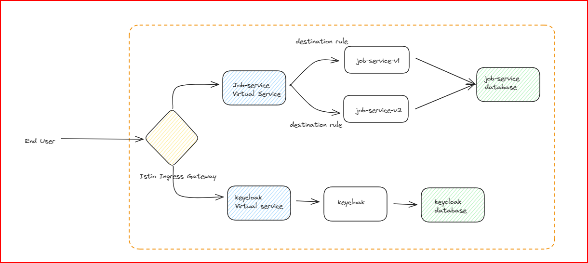
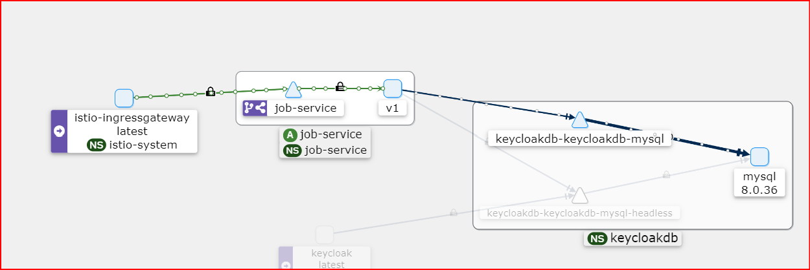
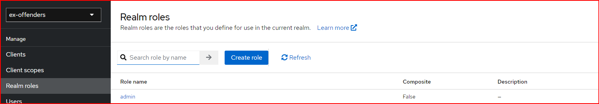
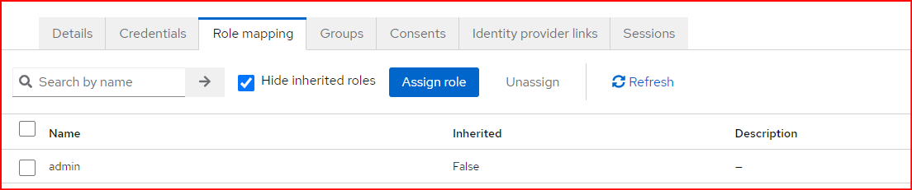
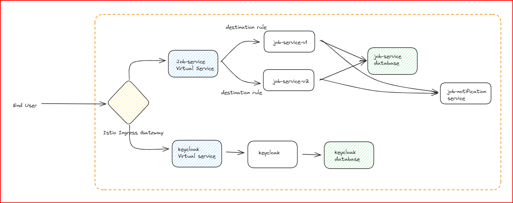

在本指南中，我们将探讨如何利用 Istio 和 Keycloak 实现身份验证和授权。目标是简化开发流程，使开发者可以专注于核心任务，而不需要担心身份验证和授权问题。我们将通过实际示例和有效的示例代码，逐步讲解此过程。



## Keycloak 介绍

Keycloak 是一个开源的身份及访问管理解决方案，提供单点登录（SSO）功能，允许用户一次认证后，使用单一凭证访问多个应用程序和服务。我特别印象深刻的一个功能是 Keycloak 的开发流程简化能力，它支持集成自定义主题，例如登录页面。在这个场景中，我们已将 Keycloak 部署在同一个 Kubernetes 集群内。

以下是我们用于构建自定义 Keycloak 镜像的 Dockerfile。

```
FROM quay.io/keycloak/keycloak:24.0.3
COPY ./ex-offenders-theme /opt/keycloak/themes/ex-offenders-theme
COPY ./providers/create-account-custom-spi.jar /opt/keycloak/providers/create-account-custom-spi.jar
```

我们使用以下部署清单来部署 Keycloak。

```yaml
apiVersion: apps/v1
kind: Deployment
metadata:
  name: keycloak
  namespace: keycloak
  labels:
    app: keycloak
spec:
  replicas: 1
  selector:
    matchLabels:
      app: keycloak
  template:
    metadata:
      labels:
        app: keycloak
    spec:
      serviceAccountName: keycloak
      automountServiceAccountToken: true
      containers:
        - name: keycloak
          image: eocontainerregistry.azurecr.io/keycloak:v1.8.6 # {"$imagepolicy": "flux-system:keycloak"}
          args: ["start"]
          env:
            - name: KEYCLOAK_ADMIN
              value: "admin"
            - name: KEYCLOAK_ADMIN_PASSWORD
              valueFrom:
                secretKeyRef:
                  name: keycloak
                  key: admin-password
            - name: KC_HOSTNAME
              value: auth.ex-offenders.co.uk
            - name: KC_PROXY
              value: "edge"
            - name: KC_DB
              value: mysql
            - name: KC_DB_URL
              value: "jdbc:mysql://keycloakdb-keycloakdb-mysql.keycloakdb.svc.cluster.local:3306/keycloakdb"
            - name: KC_DB_USERNAME
              value: "keycloak-user"
            - name: jgroups.dns.query
              value: keycloak
            - name: KC_DB_PASSWORD
              valueFrom:
                secretKeyRef:
                  name: keycloak
                  key: db-password
          ports:
            - name: http
              containerPort: 8080
            - name: jgroups
              containerPort: 7600
      imagePullSecrets:
        - name: acr-secret
```

请注意，在清单文件中提到的 FluxCD `imagepolicy` 引用。借助此功能，我们可以在镜像库中有新镜像可用时自动化部署。

## Istio 介绍

Istio 是一个开源的服务网格平台，旨在管理微服务的通信和数据共享。它提供了多种功能，以提升微服务应用的可观察性、安全性和管理能力。我们将很快讨论如何配置 Istio。

## FastAPI 介绍

FastAPI 是一个现代的 Python 框架，迅速获得了广泛的流行。它设计用于快速开发并最大化开发者体验。在这个示例中，我们将使用两个版本的 job API（[V1](https://github.com/ex-offenders/job-service-v1), [V2](https://github.com/ex-offenders/job-service-v2)）编写于 FastAPI。这个 API 使用 SQLModel 库与后端数据库进行交互，结合了 SQLAlchemy 和 Pydantic 的功能。

SQLModel 是由与 FastAPI 相同的作者开发的。

## 部署无认证与授权的 job-service 微服务

让我们从更简单的事情开始：一个没有任何认证和授权的job微服务。

这是 job-service v1 和 job-service v2 的部署清单，均在“job-service”命名空间运行。注意每个部署清单中的版本标签。

```yaml
apiVersion: apps/v1
kind: Deployment
metadata:
  labels:
    app: job-service
    version: v1
  name: job-service
  namespace: job-service
spec:
  replicas: 1
  selector:
    matchLabels:
      app: job-service
      version: v1
  template:
    metadata:
      labels:
        app: job-service
        version: v1
    spec:
      serviceAccountName: job-service
      automountServiceAccountToken: true
      containers:
      - image: eocontainerregistry.azurecr.io/job-service:v1.0.3 # {"$imagepolicy": "flux-system:job-service-v1"}
        name: job-service
        env:
        - name: DB_HOST
          value: "keycloakdb-keycloakdb-mysql.keycloakdb.svc.cluster.local"
        - name: DB_PASSWORD
          valueFrom:
            secretKeyRef:
              name: job-service
              key: db-password
        - name: DB_PORT
          value: "3306"
        - name: DB_USER
          value: "job-service"
        - name: DB_NAME
          value: "job-service"
        resources:
          requests:
            memory: "64Mi"
            cpu: "50m"
      imagePullSecrets:
      - name: acr-secret
```

```yaml
apiVersion: apps/v1
kind: Deployment
metadata:
  labels:
    app: job-service
    version: v2
  name: job-service-v2
  namespace: job-service
spec:
  replicas: 1
  selector:
    matchLabels:
      app: job-service
      version: v2
  template:
    metadata:
      labels:
        app: job-service
        version: v2
    spec:
      serviceAccountName: job-service
      automountServiceAccountToken: true
      containers:
      - image: eocontainerregistry.azurecr.io/job-service-v2:v1.1.3 # {"$imagepolicy": "flux-system:job-service-v2"}
        name: job-service
        env:
        - name: DB_HOST
          value: "keycloakdb-keycloakdb-mysql.keycloakdb.svc.cluster.local"
        - name: DB_PASSWORD
          valueFrom:
            secretKeyRef:
              name: job-service
              key: db-password
        - name: DB_PORT
          value: "3306"
        - name: DB_USER
          value: "job-service"
        - name: DB_NAME
          value: "job-service"
        resources:
          requests:
            memory: "64Mi"
            cpu: "50m"
      imagePullSecrets:
      - name: acr-secret
```

我们还有一个 ClusterIP 服务，选择器为“app=job-service”。这个配置确保了 job-service v1 和 job-service v2 都被添加为这个服务的端点。

```yaml
apiVersion: v1
kind: Service
metadata:
  labels:
    app: job-service
    kustomize.toolkit.fluxcd.io/name: flux-system
    kustomize.toolkit.fluxcd.io/namespace: flux-system
  name: job-service
  namespace: job-service
spec:
  ports:
  - port: 80
    name: http
    protocol: TCP
    targetPort: 8080
  selector:
    app: job-service
  type: ClusterIP
```

注意，我们使用同一个数据库实例为 Keycloak 和不同版本的 job-service。然而，各自的用户被限制不得访问对方的数据库。尽管共享同一个实例，这种设置有效地模拟了微服务架构。

首先，我们希望将所有流量独占路由到 v1 部署。（如果你查看 job-service v1，你会看到它编写时没有包括任何认证或授权代码。我们计划在接下来的步骤中使用 Istio 实现这些功能。）

为此，我们创建了如下的虚拟服务和目标规则。

```yaml
apiVersion: networking.istio.io/v1alpha3
kind: VirtualService
metadata:
  name: job-service
  namespace: job-service
spec:
  hosts:
    - "www.ex-offenders.co.uk"
    - "ex-offenders.co.uk"
    - job-service.job-service.svc.cluster.local
  gateways:
    - istio-system/gateway
    - mesh
  http:
    - match:
        - uri:
            prefix: "/api/jobs"
        - uri:
            prefix: "/api/jobcategories"
      route:
        - destination:
            host: job-service.job-service.svc.cluster.local
            subset: v1
          weight: 100
        - destination:
            host: job-service.job-service.svc.cluster.local
            subset: v2
          weight: 0
```

```
apiVersion: networking.istio.io/v1alpha3
kind: DestinationRule
metadata:
  name: job-service
  namespace: job-service
spec:
  host: job-service.job-service.svc.cluster.local
  subsets:
  - name: v1
    labels:
      version: v1
  - name: v2
    labels:
      version: v2
```

注意，在网关部分下，我们指定了我们的入口网关和“mesh”。这是因为我们期望来自外部网关和集群内其他微服务的流量。观察我们如何将100%的流量定向到 v1 部署。

下面是 Istio 网关资源。它处理目标为 ex-offenders.co.uk 域的流量。此外，我们使用 cert-manager 将 Let's Encrypt TLS 证书附加到网关。

```yaml
apiVersion: networking.istio.io/v1alpha3
kind: Gateway
metadata:
  name: gateway
  namespace: istio-system
spec:
  selector:
    istio: ingressgateway
  servers:
    - port:
        number: 443
        name: https
        protocol: HTTPS
      tls:
        mode: SIMPLE
        credentialName: ex-offenders-tls
      hosts:
      - "www.ex-offenders.co.uk"
      - "ex-offenders.co.uk"
      - "auth.ex-offenders.co.uk"
```

我们可以使用 Kiali 仪表板来验证我们的路由配置。注意，`job-service` 连接到同一个 `keycloakdb` MySQL 实例。但实际上，`job-service` 只能访问实例内的特定 `job-service` 数据库。



现在我们准备进行一些测试。

### 创建新的job类别

```bash
curl --location 'https://ex-offenders.co.uk/api/jobcategories/' \
--header 'Content-Type: application/json' \
--data '{
    "name": "Information Technology"
}'
{"name":"Information Technology","id":17}
```

### 创建新 job

```bash
curl --location 'https://ex-offenders.co.uk/api/jobs/' \
--header 'Content-Type: application/json' \
--data '{
  "title": "Software Engineer",
  "description": "Software Engineer with 2 years of experience",
  "owner_id": "5690cc29-5008-4a81-8f08-db92e01d6d44",
  "category_id": 17
}'
{"title":"Software Engineer","description":"Software Engineer with 2 years of experience","owner_id":"5690cc29-5008-4a81-8f08-db92e01d6d44","category_id":17,"id":"f19e68da-e40a-4954-9dbf-6dfaf1f7f4d4"}
```

### 通过 ID 获取 job 类别

```bash
curl --location 'https://ex-offenders.co.uk/api/jobcategories/17'
{"name":"Information Technology","id":17}
```

### 通过 ID 获取 job

```bash
curl --location 'https://ex-offenders.co.uk/api/jobs/bff285f6-34f6-4c5f-9619-2e860bec2d87'
{"title":"Software Engineer","description":"Software Engineer with 2 years of experience","owner_id":"5690cc29-5008-4a81-8f08-db92e01d6d44","category_id":17,"id":"bff285f6-34f6-4c5f-9619-2e860bec2d87"}
```

如您所见，这些端点没有身份验证或授权。任何人都可以创建、更新、删除或检索job和job类别。

请注意，我使用与 FastAPI 集成的 Swagger 生成了样本 curl 请求。

另请注意，当创建新job时，我们手动传递了 `owner_id`。理想

情况下，这应该是已登录用户的用户 ID。我们将在讨论 job-service v2 时进一步深入探讨这个问题。

## 使用 Istio 实现认证

让我们开始保护我们的端点。

首先，我们添加 RequestAuthentication 资源，定义对job负载支持的请求认证。这个配置确保 Istio 拒绝任何具有无效认证信息的请求。下面，我们定义了我们的 Keycloak 发行者 URL 和公开证书 URL，以便 Istio 验证令牌签名。

```yaml
apiVersion: security.istio.io/v1beta1
kind: RequestAuthentication
metadata:
  name: job-service
  namespace: job-service
spec:
  selector:
     matchLabels:
      app: job-service
  jwtRules:
   - issuer: "https://auth.ex-offenders.co.uk/realms/ex-offenders"
     jwksUri: "https://auth.ex-offenders.co.uk/realms/ex-offenders/protocol/openid-connect/certs"
     forwardOriginalToken: true
```

此外，我们设定了“forwardOriginalToken”: true，因为我们需要以“Authorization: Bearer”格式将令牌传递给后端服务。您还可以使用以下代码片段将令牌作为“jwt_parsed”键的值传递给后端服务。

```yaml
   jwtRules:
    - issuer: "https://auth.ex-offenders.co.uk/realms/ex-offenders"
      jwksUri: "https://auth.ex-offenders.co.uk/realms/ex-offenders/protocol/openid-connect/certs"
      outputPayloadToHeader: jwt-parsed
```

现在，RequestAuthentication 将拒绝任何带有无效令牌的请求。然而，没有任何认证信息的请求仍然会被接受，但它们不会有一个经过认证的身份。为了处理这些情况，除了 RequestAuthentication 外，我们需要添加授权政策来拒绝缺少认证身份的请求。因此，我们按如下方式添加一个授权策略：

```yaml
apiVersion: security.istio.io/v1beta1
kind: AuthorizationPolicy
metadata:
  name: job-service
  namespace: job-service
spec:
  selector:
    matchLabels:
       app: job-service
  rules:
  - to:
    - operation:
        methods: ["GET"]
  - from:
    - source:
        requestPrincipals: ["*"]
    to:
    - operation:
        methods: ["POST", "DELETE", "PATCH"]
        paths: ["/api/jobs*"]
    - operation:
        methods: ["POST", "DELETE", "PATCH"]
        paths: ["/api/jobcategories*"]
```

因此，上述 AuthorizationPolicy 允许任何人无限制地访问 GET 方法。然而，对 job 和 jobcategory 端点的任何其他方法都需要认证。

让我们测试一些端点：

### 创建新job

```bash
curl --location 'https://ex-offenders.co.uk/api/jobs/' \
--header 'Content-Type: application/json' \
--data '{
  "title": "Software Engineer II",
  "description": "Software Engineer with 2 years of experience",
  "owner_id": "5690cc29-5008-4a81-8f08-db92e01d6d44",
  "category_id": 17
}'
RBAC: access denied
```

### 通过 ID 获取 job

```bash
curl --location 'https://ex-offenders.co.uk/api/jobs/bff285f6-34f6-4c5f-9619-2e860bec2d87'
{"title":"Software Engineer","description":"Software Engineer with 2 years of experience","owner_id":"5690cc29-5008-4a81-8f08-db92e01d6d44","category_id":17,"id":"bff285f6-34f6-4c5f-9619-2e860bec2d87"}
```

### 创建新的 job 类别

```bash
curl --location 'https://ex-offenders.co.uk/api/jobcategories/' \
--header 'Content-Type: application/json' \
--data '{
    "name": "Computer Science"
}'
RBAC: access denied
```

### 通过 ID 获取 job 类别

```bash
curl --location 'https://ex-offenders.co.uk/api/jobcategories/17'
{"name":"Information Technology","id":17}
```

正如观察到的，我们可以在没有认证的情况下检索信息。然而，添加、修改或删除条目需要认证。

接下来，让我们通过调用 Keycloak 令牌 URL 生成令牌，并使用它来执行添加、修改或删除操作：

### 生成令牌

```bash
curl --location 'https://auth.ex-offenders.co.uk/realms/ex-offenders/protocol/openid-connect/token' \
--header 'Content-Type: application/x-www-form-urlencoded' \
--data-urlencode 'grant_type=password' \
--data-urlencode 'client_id=ex-offenders-platform' \
--data-urlencode 'username=<username>' \
--data-urlencode 'password=<password>'
```

这将返回一个访问令牌，我们可以用它进行后续请求。

### 创建新job

```bash
curl --location 'https://ex-offenders.co.uk/api/jobs/' \
--header 'Content-Type: application/json' \
--header 'Authorization: Bearer <token>' \
--data '{
  "title": "Software Engineer II",
  "description": "Software Engineer with 2 years of experience",
  "owner_id": "5690cc29-5008-4a81-8f08-db92e01d6d44",
  "category_id": 17
}'

{
    "title": "Software Engineer II",
    "description": "Software Engineer with 2 years of experience",
    "owner_id": "5690cc29-5008-4a81-8f08-db92e01d6d44",
    "category_id": 17,
    "id": "571c9ce6-566f-4e57-a780-9af5275ce5ef"
}
```

如所示，经过认证的用户能够成功地添加、修改或删除job和job类别。

## 使用 Istio 实现授权

在这一点上，我们已经配置了认证。就job类别而言，我们不预期数据库中存在大量类别。有理由维持有限数量的job类别，并将创建、修改和删除权限限制给管理员用户。

当前，任何具有有效认证的用户都可以修改job类别。让我们看看如何实现授权。

我们修改授权政策，以确保只有拥有管理员角色的用户可以修改job类别。或者，如果您有更复杂的用户层次结构，您也可以使用“组”。

```yaml
apiVersion: security.istio.io/v1beta1
kind: AuthorizationPolicy
metadata:
  name: job-service
  namespace: job-service
spec:
  selector:
    matchLabels:
      app: job-service
  rules:
  - to:
    - operation:
        methods: ["GET"]
  - from:
    - source:
        requestPrincipals: ["*"]
    to:
    - operation:
        methods: ["POST", "DELETE", "PATCH"]
        paths: ["/api/jobs*"]
  - from:
    - source:
        requestPrincipals: ["*"]
    when:
    - key: request.auth.claims[realm_access][roles]
      values: ["admin"]
    to:
    - operation:
        methods: ["POST", "DELETE", "PATCH"]
        paths: ["/api/jobcategories*"]
```

我们可以通过导航到我们使用的 Keycloak 领域下的“Realm Roles”来创建管理员角色。之后，我们前往要分配管理员角色的相应用户，点击“Role Mapping”标签，并将用户添加到新创建的“admin”角色。





### 创建job类别 - 普通用户

```bash
curl --location 'https://ex-offenders.co.uk/api/jobcategories/' \
--header 'Content-Type: application/json' \
--header 'Authorization: Bearer <token>' \
--data '{
    "name": "Research"
}'
RBAC: access denied
```

### 创建job类别 - 管理员用户

```bash
curl --location 'https://ex-offenders.co.uk/api/jobcategories/' \
--header 'Content-Type: application/json' \
--header 'Authorization: Bearer <token>' \
--data '{
    "name": "Research"
}'
{"name":"Research","id":20}
```

如我们所见，现在只有管理员用户可以创建/更新/删除job类别。

## 微服务间的授权实施

现在我们增加另一个名为“job-notification-service”的微服务。



这个服务不通过网关暴露，并且应仅被“job-service”访问。为实现这一点，我们可以添加以下授权政策。

```yaml
apiVersion: security.istio.io/v1beta1
kind: AuthorizationPolicy
metadata:
  name: job-notification-service
  namespace: job-notification-service
spec:
  selector:
    matchLabels:
      app: job-notification-service
  rules:
  - from:
    - source:
        namespaces: ["job-service"]
        principals: ["cluster.local/ns/job-service/sa/job-service"]
```

## 结论

总结来说，我们使用 Istio 和 Keycloak 实现了对我们的微服务的认证和授权，确保了资源的安全访问。我们配置了基于角色和用户身份的访问控制政策，增强了我们应用的整体安全姿态。

欢迎您提供任何改进建议、可能忽略的方面或增强本文档的建议。

注：本页面是 Cloud Agnostic Platform 指南的一部分。点击[这里](https://github.com/ex-offenders/Cloud-Agnostic-Startup-Platform/tree/main)访问主页。
