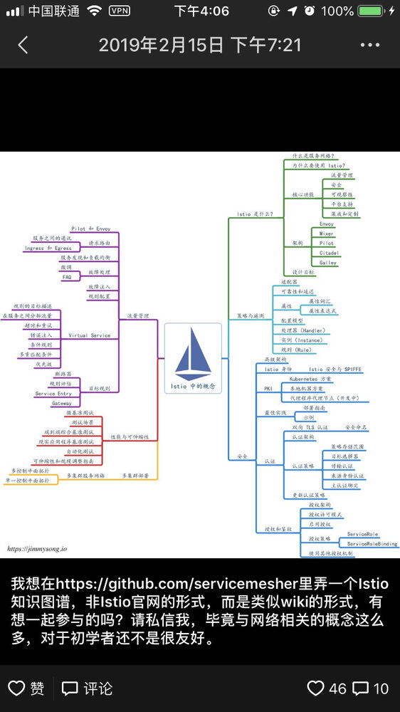
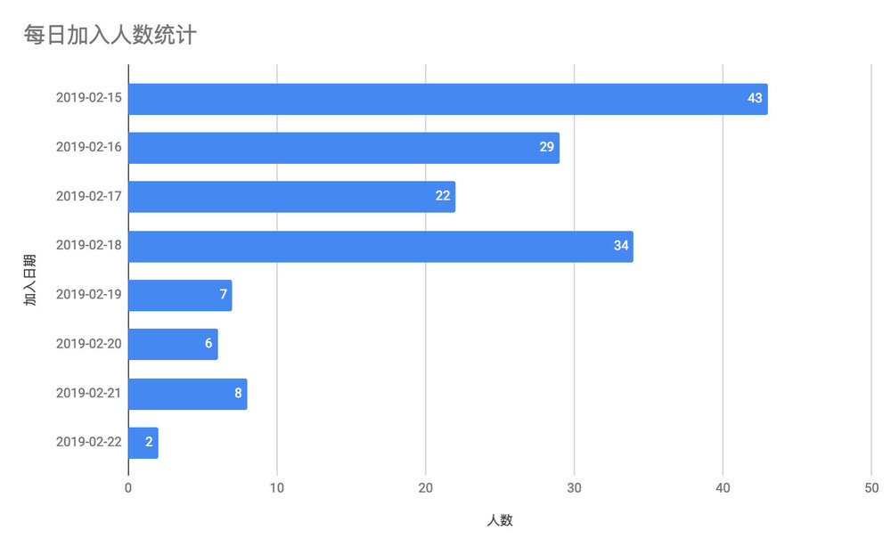
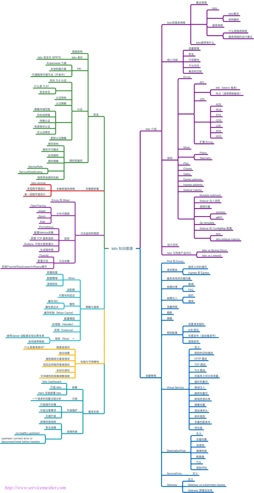
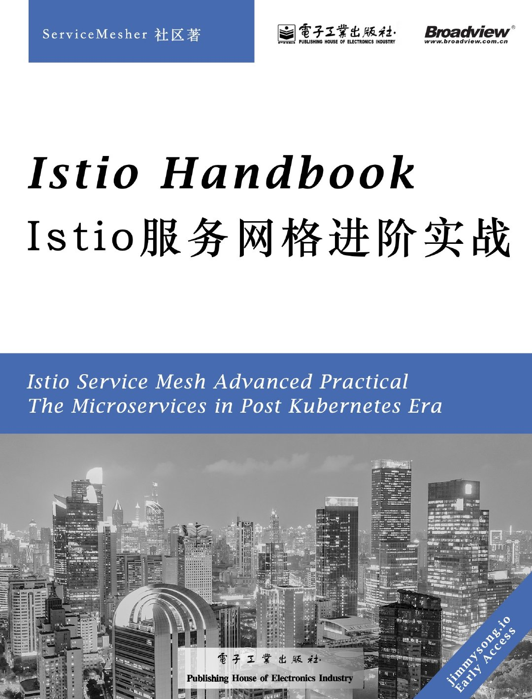

2019年2月15日晚，我在朋友圈里发起了 **Istio 知识图谱**项目。

而后获得 ServiceMesher 社区成员的热烈响应，在此后的一周内陆续有151参与进来。

经过10天的孵化，Istio 知识图谱 v0.1发布了，该版本作为 Istio 知识图谱的启动版本，未来将会进一步细化甚至推出一本开源书籍。

## Istio 知识图谱阅览

Istio 知识图谱提供以下格式，点击下面的链接可以查看：

- [Markdown](https://github.com/servicemesher/istio-knowledge-map/blob/master/istio-knowledge-map.md)
- [MindNode](https://github.com/servicemesher/istio-knowledge-map/blob/master/mindnode)
- [PDF](https://github.com/servicemesher/istio-knowledge-map/blob/master/pdf/istio-knowledge-map.pdf)
- [PNG](https://github.com/servicemesher/istio-knowledge-map/blob/master/png/istio-knowledge-map.png)

## 参与贡献

Istio 知识图谱 v0.1 在 [Google docs](https://docs.google.com/document/d/1nMAC9ZNH3NggQ_79vmdyog_2KtATKFofqP9f9K0rr7M/edit?ts=5c6ac5b7#heading=h.2nl61kfhbfx8) 上协作编辑，参与编辑请参考[贡献指南](https://github.com/servicemesher/istio-knowledge-map/blob/master/CONTRIBUTING.md)。

## 致谢

感谢 Istio 知识图谱工作组的全体人员，特别鸣谢以下参与贡献者（GitHub ID，按字母顺序排序）：

- [dreadbird](https://github.com/dreadbird)
- [haiker2011](https://github.com/haiker2011)
- [icyxp](https://github.com/icyxp)
- [junxy](https://github.com/junxy)
- [kongbo1987](https://github.com/kongbo1987)
- [mgxian](https://github.com/mgxian)
- [nicklv](https://github.com/nicklv)
- [sataqiu](https://github.com/sataqiu)
- [rootsongjc](https://github.com/rootsongjc)
- [wujunze](https://github.com/wujunze)
- [xianyuluo](https://github.com/xianyuluo)

## 关于 Istio 知识图谱工作组

[Istio 知识图谱工作组](https://github.com/orgs/servicemesher/teams/istio-knowledge-map-working-group/members)是 [ServiceMesher 社区](http://www.servicemesher.com)的一个分支，旨在通过协作加强 Service Mesh 的理论学习，共同学习，共同进步，同时推动 Service Mesh 技术的推广。

## 更进一步：参与社区孵化图书

本人自2018年9月16日开始撰写 [istio-handbook](https://github.com/rootsongjc/istio-handbook)，目前已经有5个月的时间了，随着 ServiceMesher 社区的不断壮大，社区对一本关于 Istio 的原理和实践的书籍需求十分迫切，为了方便将社区的知识成果沉淀下来分享给更多的人，我决定：

只要截至到**2019年3月5日中午12点**，征集到**200**人联署签名，我就将本书贡献给 ServiceMesher 社区孵化，以 ServiceMesher 社区的名义出一本关于 Istio 的书也是我一直以来的心愿。我会将其迁移到 https://github.com/servicemesher 中，供所有社区成员合作撰写，并供大家通过 http://www.servicemesher.com 免费阅读！

### 参与方式

如果你想参与本书的撰写或表达对本书的期待，请关注 ServiceMesher 公众号，并在后台回复 `istio` 即可获取联署签名地址和参与方式。

下图为本书封面样图，目前该书籍地址：https://github.com/rootsongjc/istio-handbook

**注**：书籍名称和封面仅为参考，非最终式样。本书纸质出版物版权归电子工业出版社所有。本文档最终解释权归 [ServiceMesher 社区](http://www.servicemesher.com)所有。

