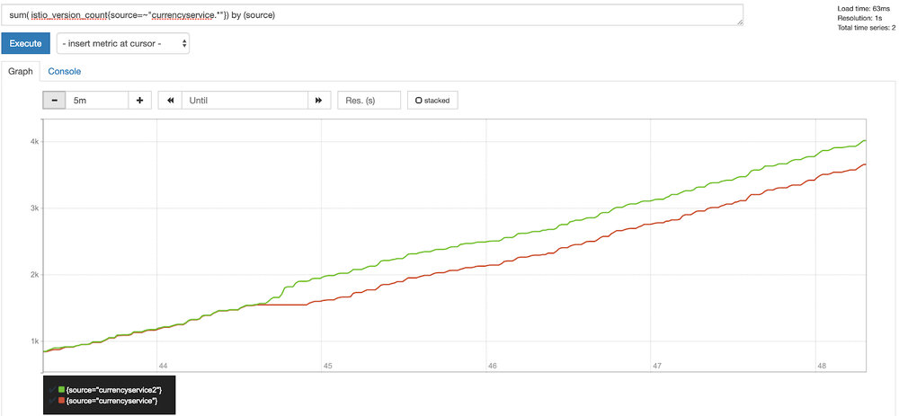

本文为翻译文章，[点击查看原文](https://blog.giantswarm.io/Istio-monitoring-explained/)。

## 编者按

本文先后阐述服务网格中监控的重要性和 Istio 相关名词概念，再由一个实例切入，详解在 Istio 中部署和实现监控的全过程。（注：阅读本文需要有一定的 Kubernetes 实践基础，并了解集群中常用的监控工具 Prometheus。）

## 前言


如果我说“服务网格”是当今技术社区的热门话题，没有人会感到惊讶。这个领域最活跃的项目之一是[Istio](https://istio.io/)。它由 IBM、谷歌和 Lyft 联合创建，作为对微服务体系结构已知问题的解决方案。容器和 Kubernetes 极大地帮助了 Istio 适配微服务体系结构。然而，与此同时，他们也带来了一系列我们以前没有遇到过的新问题。

现如今，我们所有的服务都使用 HTTP/gRPC APIs 来进行它们之间的通信。在过去的单体应用时代，这些只是流经单个应用程序的函数调用。这意味着，在微服务系统中，存在着大量服务间交互，这使得可观察性、安全性和监控更加困难。

已经有很多资源可以解释[Istio 是什么](https://istio.io/docs/concepts/what-is-istio/)以及它是如何工作的。我不想在这里重复这些，所以我将聚焦于一个领域——监控。官方文档中包含了这一点，但我花了不少时间才得以理解。所以在本教程中，我将指导您完成它。这样一来，您对如何使用 Istio 监控任务，将会有更深入的了解。

## 当前发展状况

选择服务网格的主要特征之一是提高可观察性。到目前为止，开发人员必须让他们的应用程序暴露一系列指标，通常使用公共库或供应商的代理，如[New Relic](https://newrelic.com/)或[Datadog](https://www.datadoghq.com/blog/monitor-istio-with-datadog/)。之后，操作人员可以使用监控解决方案来抓取应用程序的 metric 端点，从而了解系统的行为方式。但是必须修改代码是一件痛苦的事情，特别是当有许多更改或添加时。并且，将这种方法扩展到多个团队会使其难以维护。

Istio 采用的方法是暴露和追踪应用程序行为，而不需要接触任何一行代码。这得益于“sidecar”（边车）概念，它是一个与我们的应用程序并肩运行的容器，并向一个中央遥测组件提供数据。由于能够识别正在使用的协议 (redis、mongo、http、grpc 等)，sidecar 能够捕获许多关于请求的信息。

## 核心组件：Mixer

让我们从理解 Mixer 组件开始。它做了什么以及它给监控带来了什么好处。在我看来，定义“Mixer”的最佳方法是将其可视化为一个属性处理器。网格中的每个代理都发送一组不同的属性，比如请求数据或环境信息，然后“Mixer”处理所有这些数据并将其路由到正确的适配器。

“适配器”是一个附加到“Mixer”的处理程序，负责为后端调整属性数据。后端可以是对该数据感兴趣的任何外部服务。例如，监视工具 (如 Prometheus 或 Stackdriver)、授权后端或日志堆栈。


## 概念解析

进入 Istio 世界最困难的事情之一就是熟悉新的术语。当你认为你已经理解了整个 Kubernetes 词汇表时，你会意识到 Istio 为这个领域增加了 50 多个新词汇！

聚焦于监控，让我们描述以下最有趣的概念，将帮助我们受益于 mixer 的设计：

- *Attribute*: mixer 处理的一段数据。大多数情况下，这来自一个 sidecar，但它也可以由 adapter 生成。Attribute 在实例中用于将所需的数据映射到后端。
- *Adapter*: mixer 组件中嵌入的逻辑，用于管理将数据转发到特定后端。
- *Handler*: Adapter 的配置。由于适配器可以服务于多个用例，所以配置是解耦的，因此可以使用多个设置运行同一个 adapter。
- *Instance*:  是将来自 Istio 的数据绑定到 adapter 模型的实体。Istio 有一组由它的 sidecar 容器收集的统一属性。这些数据必须被翻译成后端语言。
- *Template*: 定义 instance 模板的公共接口。https://istio.io/docs/reference/config/policy-and-telemetry/templates/

## 创建一个新的监控用例

在定义了所有关于 Istio 可观察性的概念之后，将其记忆到我们脑海中的最佳方法是在一个真实的场景中去应用它们。

在这个练习中，多亏了 Kubernetes 标签 metadata，我们可以追踪到服务的版本控制信息。这是一种常见的情况，当您迁移到微服务架构时，最终会拥有多个服务版本 ( A/B测试、API版本控制等)。Istio sidecar 将各种 metadata 从集群发送到 mixer。因此，在我们的示例中，我们将利用部署标签来标识服务版本，并观察每个版本的使用状态。

为了简单起见，我们以一个现有的项目为例，[the Google microservices demo project](https://github.com/GoogleCloudPlatform/microservices-demo), 并做一些修改以配合我们的练习。本项目模拟了一个由多个组件组成的微服务架构来构建电子商务网站。

首先，让我们使用 Istio 确保项目在我们的集群中正确运行。让我们使用自动注入特性来部署 namespace 中的所有组件，并让 Istio 自动注入 sidecar。

```bash
$ kubectl label namespace mesh istio-injection=enabled
```

**警告**: 确保预先创建了 namespace: `mesh`，并且让您的`kubectl`上下文指向它。

如果启用了 pod 安全策略，则需要为 init 容器配置一些权限，以便让它正确配置 iptables 规则。为了测试的目的，你可以使用：

```bash
$ kubectl create clusterrolebinding mesh --clusterrole cluster-admin --serviceaccount=mesh:default
```

这条命令将缺省服务帐户绑定到集群管理者 admin。现在，我们可以使用 all-in resources YAML 文档部署所有组件。

```bash
$ kubectl apply -f release/kubernetes-manifests.yaml
```

现在您应该能够看到 pods 在`mesh` namespace 下启动了。其中一些会失败，因为 Istio 资源还没有添加。例如，出口流量将不被允许，并且当前组件将失败。应用以下这些资源来修复问题，并通过 Istio ingress 暴露前端组件。

```bash
$ kubectl apply -f release/istio-manifests.yaml 
```

现在，我们可以使用云提供商提供的 IP 或 domain 浏览前端 (`frontend-external`服务通过云提供商负载均衡器暴露)。

现在我们已经运行了微服务应用程序，让我们更进一步，将其中一个组件配置为具有多个版本。正如您在 microservices YAML 中看到的，部署只有一个带有应用程序名称的标签。如果想使用金丝雀部署或运行应用程序的多个版本，我们可以添加另一个带有版本控制的标签。

```yaml
apiVersion: extensions/v1beta1
kind: Deployment
metadata:
  name: currencyservice
spec:
  template:
    metadata:
      labels:
        app: currencyservice
        version: v1
```

将更改应用到集群之后，我们可以使用不同的名称复制部署并更改版本。

```yaml
apiVersion: extensions/v1beta1
kind: Deployment
metadata:
  name: currencyservice2
spec:
  template:
    metadata:
      labels:
        app: currencyservice
        version: v2
...
```

现在再次将其提交给 API。

```bash
$ kubectl apply -f release/kubernetes-manifests.yaml
```

**注意**: 尽管我们再次应用了所有的清单，但是只有更改过的清单才会被 API 更新。

热心的读者们可能注意到了我们做了一个小技巧，服务选择器只指向“app”标签。这样，流量将在版本之间公平地分配。

## 从理论到实践

接下来便是见证奇迹的时刻。我们将需要在 Prometheus 中创建三个资源来将该版本公开为一个新的 metric 指标。

首先，我们将创建实例。在这里，我们使用`metric`实例模板，通过 sidecar 将值 provider 映射到适配器输入。我们只对负载名称 (source) 和版本 (version) 感兴趣。

```yaml
apiVersion: "config.istio.io/v1alpha2"
kind: metric
metadata:
  name: versioncount
  namespace: mesh
spec:
  value: "1"
  dimensions:
    source: source.workload.name | "unknown"
    version: destination.labels["version"] | "unknown"
  monitored_resource_type: '"UNSPECIFIED"'
```

现在让我们配置 adapter 适配器。在我们的例子中，我们希望将 metric 连接到 Prometheus 后端。因此，我们将在 handler 配置中定义将服务于后端 (Prometheus DSL) 的 metric 名称和值的类型。除此之外，我们还将定义为各种维度使用的标签名称。

```yaml
apiVersion: "config.istio.io/v1alpha2"
kind: prometheus
metadata:
  name: versionhandler
  namespace: mesh
spec:
  metrics:
  - name: version_count # Prometheus metric name
    instance_name: versioncount.metric.mesh # Mixer instance name (fully-qualified)
    kind: COUNTER
    label_names:
    - source
    - version
```

最后，我们需要将这个特定的 handler 与一个特定的实例 (metric) 链接起来。

```yaml
apiVersion: "config.istio.io/v1alpha2"
kind: rule
metadata:
  name: versionprom
  namespace: mesh
spec:
  match: destination.service == "currencyservice
.mesh.svc.cluster.local" 
  actions:
  - handler: versionhandler.prometheus
    instances:
    - versioncount.metric.mesh
```

一旦应用了这些定义，Istio 将指示 Prometheus adapter 开始收集并为新的 metric 服务。如果我们查看 Prometheus 用户界面，并且查找新的 metric，我们应该可以看到以下内容：



## 结论

在微服务体系结构中，良好的可观察性并不容易。Istio 可以帮助开发人员消除复杂性，并将工作留给运维人员。

在开始时，可能很难处理服务网格所增加的复杂性。但是，一旦您熟练使用了它，您将能够使您的监控配置标准化和自动化，并在一定时间内构建一个强大的可观察性系统。

## 更多信息

- 通过观看 webinar 节省您的时间：[Using Istio to Securely Monitor your Services](https://get.alcide.io/using-istio-to-securely-monitor-your-services-webinar).
- [How to install Istio in your cluster](https://docs.giantswarm.io/guides/deploying-istio/)
- [Official documentation with examples](https://istio.io/docs/)

