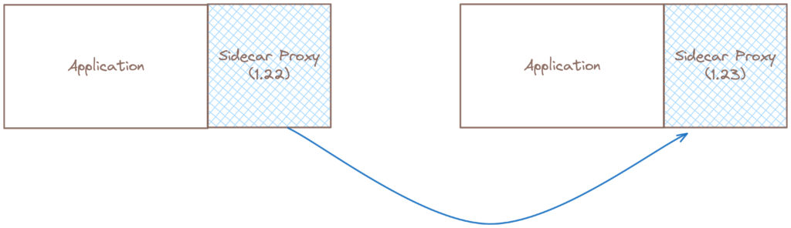
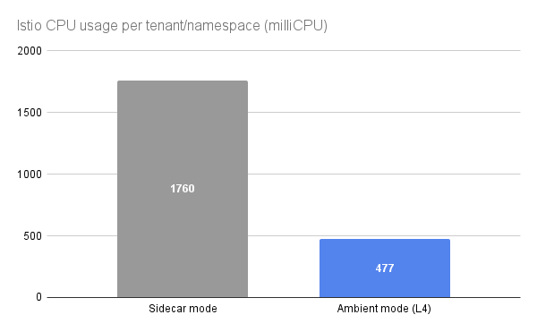

随着 Istio 的环境数据平面模式的推出，平台团队可以高效地采用服务网格功能，并以最小的资源和开销影响为终端用户提供增强功能。

## 什么是 Istio 环境模式？

Istio 的[环境模式](https://www.solo.io/blog/istio-ambient-mesh-evolution-service-mesh/)最初于 2022 年 9 月发布。它是一种新的数据平面模式 —— 无需 sidecar —— 旨在简化操作、扩大应用兼容性和降低基础设施成本。环境模式将 Istio 的功能分为两个独立的层：零信任安全覆盖层（*ztunnel*）和可选的第 7 层处理层（*waypoint*）。与 sidecar 相比，分层方法允许用户从无网格逐渐采用到基于 mTLS 的零信任覆盖，再到完整的第 7 层处理，根据需要进行。这为服务网格用户提供了来自同一专用社区的两个出色选择：传统的 sidecar 方法的 Istio 或无 sidecar 的环境模式。

在这篇博客中，我们将探讨与资源成本和操作挑战相关的一些示例场景，这些场景在采用服务网格时常常会引起紧张。我们还将讨论如何采用环境模式来应对这些挑战，并改善平台的总拥有成本（TCO）。

## Istio 的环境模式降低资源成本

默认情况下，Istio 建议为每个 sidecar 分配 0.1 CPU 核心和 128MB 的内存。虽然服务网格的优势众所周知，但在真实生产工作负载中，资源需求很快就会累积起来。

对于预算紧张的团队来说，遵守这一要求带来了显著的机会成本。他们面临的抉择包括在招聘额外人员或投资于业务的其他领域与承担应用增加的资源成本之间做出决定，这成为一个关键考量。

务网格有一系列 7 层网络功能，包括：

- 高级流量管理和路由控制
- 在应用层的细粒度安全策略
- 高效处理断路器和容错机制
- 促进服务发现和动态服务路由的实施
- 简化 A/B 测试和金丝雀发布策略的部署

然而，如果你近期不需要这些功能，或者不是每个服务都需要？这些功能可能被视为附加价值，并可能不符合你的组织需求或成熟度水平。

让我们考虑一些与实施服务网格成本相关的挑战场景：

#### 场景 1: 控制螺旋升高的 sidecar 成本

*“我们的安全团队要求整个组织采取零信任姿态，因此我们正在考虑采用服务网格。然而，我们发现采用 sidecar 方法将产生额外的成本（在每个应用的资源预留中）。”*

为了遵守安全团队的零信任要求，使用 Istio 的环境模式，你无需为每个应用采用一个 sidecar。相反，你可以利用共享的、每节点 ztunnel 组件，它处理零信任网络的职责。然后，当你准备好时，或只针对需要的服务，可以选择安全地、按命名空间处理第 7 层策略。这种选择方法意味着从非 mTLS 到采用 mTLS 的增量成本现在大大降低了。

#### 场景 2: 减少重复的资源成本

*“我们的组织要求开发、测试和分层环境复制生产设置，以便及早发现问题并维持高质量的发布。采用服务网格意味着每个环境都会产生额外的资源和操作开销，导致整体成本急剧上升。”*

我们经常看到客户环境复制其生产设置，其中较低级别的环境只接收少量的合成流量 —— 或在某些情况下根本没有流量。这对环境所有者来说是一个挑战，他们需要证明在这些流量低或无流量的环境中运行服务网格的价值。分配给 sidecar 代理的资源很大程度上被浪费，导致利用效率低下和更高的支出。通过移除 sidecar 的要求，环境模式降低了基础资源需求，使得在复制生产环境的标准下实施零信任更具成本效益。

#### 场景 3: 在不同架构中驾驭变化的速率模式

*“我们有一个复杂的微服务架构，不同的服务经历广泛不同的流量模式。一些服务每秒处理数千个请求，而其他服务只处理几百个。尽管如此，sidecar 代理通常在所有服务中分配相同的资源，导致资源利率不高。高流量服务遭受性能瓶颈，而低流量服务则浪费资源。”*

我们看到的另一个常见场景是，sidecar 代理通常采用一刀切的方法进行配置，导致资源利用不效率。在缺乏机制（例如，在应用的 Helm chart中暴露 Istio pod 注解）来覆盖默认代理资源预留请求的情况下，以及开发团队缺乏使用可观察性数据来配置和调整这些资源预留的经验的情况下，应用开发团队能否成功取决于他们的应用特征。彻底移除 sidecar 消除了由资源利用不足造成的低效。此外，由于 ztunnel 是用 Rust 构建的高性能组件，它仍然可以处理高吞吐量的情况。

#### 场景 4: 实施服务网格以在边缘环境中实现零信任

*“在资源有限的边缘环境中部署服务网格具有挑战性，因为 sidecar 带来额外的开销。”*

边缘计算将数据处理更靠近数据源，通常在较不安全或不受信任的网络中，且资源有限。实现零信任确保每次互动都经过身份验证和授权，显著降低了违规的风险，但在资源有限的环境中可能很困难。通过利用不需要 sidecar 的资源开销的 Istio 环境模式服务网格，IoT、零售和医疗保健等边缘计算用例可以真实地考虑实现零信任原则并达成合规，以增强其边缘环境的安全策略。

这些只是 Istio 的环境模式可以帮助解决的一些常见 sidecar 挑战。Istio 的环境模式还可以帮助驾驭的其他资源障碍包括减少 sidecar 部署经历的应用程序停机时间和解决出口配置的复杂性。

## Istio 的环境模式有助于简化应用操作

*安全地重启服务以升级 sidecar 版本涉及三种不同的设置：控制 Envoy 排出和拒绝新连接，为活动连接关闭提供宽限时间，以及在所有活动连接关闭时终止 pod。*

我们看到的服务网格采用中最常见的挑战之一是应用所有者管理 sidecar 生命周期的操作开销增加。例如，在从 Istio 1.19 升级到 1.20 时，集群中的每个应用 pod 都必须重新启动以应用新的代理版本。你必须考虑从工作负载中排出流量、终止连接以及如果 pod 因暂时不可用的依赖而无法重新启动会发生什么。

采用无 sidecar 的服务网格架构时，所有这些考虑都消失了！环境模式显著减少了操作负担，为开发人员提供了更多时间专注于开发应用功能，而不是管理大规模代理的基础设施相关问题。

为了帮助具体化这一点，让我们考虑一些与操作服务网格相关的挑战场景：

#### 场景 1: 通过升级 Istio 部署解决复杂性

*“我们有一个复杂的 Istio 部署，其中包含许多自定义设置，升级到新版本一直是一个主要的痛点。升级过程经常导致停机、配置偏移和意外问题，这些都会扰乱我们的操作。”*

Istio 社区的支持时间表目前遵循 N-1 支持状态，这相当于大约每 7-9 个月升级一次 Istio。Istio 的频繁升级可能涉及高度参与，消除 sidecar 大大减少了仅因少数组件升级和管理而扰乱业务操作的风险。

通过专注于节点级管理而不是服务级 sidecar，操作团队可以更高效地执行升级，并且无需依赖或协调应用团队就更有信心。值得考虑的是，操作成本节省可能真的很可观。例如，如果两名工程师完成 Istio 升级所需的时间从 16 小时减少到仅 2 小时，时间和成本的节省可能是实质性的。

#### 场景 2: 管理 sidecar 的人才和资源有限

*“让新的开发团队使用服务网格耗时且需要广泛培训 sidecar 管理。”*

开发人员经常表达对管理 sidecar 的挫败感，多年来的众多社区调查已证明这一点。Istio 的环境模式直接解决了这个问题；通过完全消除 sidecar，不再需要对 sidecar 管理进行广泛培训。使用无 sidecar 的服务网格的用户可以信任，如果应用部署在集群上，其流量默认加密。

#### 场景 3: 集成遗留应用导致中断

*“我们有大量对业务运营至关重要的遗留应用。引入基于 sidecar 的服务网格会扰乱这些应用并需要广泛的修改。”*

使用 Istio 的环境模式，将服务添加到网格现在只需要在命名空间或 pod 上应用一个标签。然后，ztunnel 会拦截流量，而无需重启应用。这大大简化了对容忍中断或修改程度低的关键应用的引导，这些应用此前并未被视为网格的强有力候选者。应用所有者不再需要关心其工作负载中的 sidecar 的存在、sidecar 的生命周期或 sidecar 资源的成本。

## 比较环境模式的使用成本

为了评估服务网格的资源使用情况，我们将在规模上部署一个示例应用。这代表了用户在生产环境中实际使用服务网格的方式，并基于我们与客户关于他们如何使用 Istio 和 Gloo Mesh 的讨论。

我们的测试工作负载代表了一个在 Namespace-Per-Tenant 模式下配置的应用，其中每个租户在一个隔离的命名空间中操作，以确保资源和安全分离。该应用设计为经典的 3 层扇出架构，其中一个初始服务向多个下游服务发送请求，与客户端针对单个服务的简单基准相比，提供了更具代表性的预期性能评估。

我们在每个租户中部署了 8 个容器，分为两个“应用”，每个应用有四个 pod，安排在三层中。在集群中，我们总共有 200 个微服务。

为了确保“保证”的服务质量类别，每个应用都配置为具有相同的 pod 请求和限制：0.7 CPU 核心和 500MB 内存。（我们使用的应用是 [fake-service](https://github.com/nicholasjackson/fake-service)，一个由 CNCF TAG Network 联合主席 Nic Jackson 构建的用于测试服务网格的示例应用。）

考虑到用户倾向于以中等利用率运行他们的集群，我们将我们基线应用在负载下的目标 CPU 利用率设为 < 30%，这相当于一个拥有 n2-standard-8 实例的 21 节点集群。

为了生成合成负载，我们使用 [Vegeta](https://github.com/tsenart/vegeta)，每个应用有一个实例（每个命名空间两个）。还有四个节点用于负载生成器，向每个第 1 层副本每秒发送 200 个请求。这些请求在显示的边缘生成后续请求到第 2 层和第 3 层，给每个租户带来 2000 RPS 的负载，整个集群总共 50000 RPS。我们确保我们在测试中看到的延迟结果符合我们定义的预期，没有请求在 p50 超过 10ms 或在 p95 超过 15ms。

我们对我们的应用进行了基线读数，我们可以从网格数字中减去，以了解每个选项的成本。

然后，我们分别在 Istio sidecar 和环境模式下部署了我们的应用。

[你可以在 GitHub 上找到我们的脚本和输出](https://github.com/solo-io/doing-more-for-less)。

## Istio 的环境模式比 Sidecar 节省超过 70%

除了我们上面列出的所有操作节省之外，**在环境模式下运行的 Istio 显著地比在 sidecar 模式下运行的 Istio 更便宜**。

即使在一个负载重的、配置良好的集群中，L4 下的环境模式使用的 CPU **比 sidecar 模式少 73%**。在我们的示例集群中，Istio 的环境模式每个命名空间减少了 1.28 个核心。鉴于我们 25 个命名空间的环境，这相当于节省 32 个核心，或相当于 4 台 8 核机器。那是每个月节省 1100 美元！

而且，CPU 利用率极低：仅增加 4.78% 的 CPU 以在我们的工作负载中添加 mTLS，而添加 sidecar 相比增加了 24.3%。假设你的集群中的所有节点都至少有 5% 的空闲开销，**你可以在不增加任何额外节点的情况下安装 Istio 的环境模式，从而使其实际上免费运行。**

用户希望在 Istio 的环境模式下实施完整的第 7 层功能和特性，可以放心地进行。你可以按命名空间选择加入，但即使我们为所有租户运行了一个 waypoint —— 与完整的 sidecar 部署的特性相当 —— 我们仍然看到了实质性的 CPU 节省。请留意我们即将发布的博客，它将更深入地讨论第 7 层的成本和价值。

## 总结

我们的研究验证了构建环境数据平面的目标：简化服务网格的操作（无 sidecar），以及降低基础设施成本（与 sidecars 相比的显著成本节省，从基线上满足 mTLS 要求的额外成本很少）。

如果用户决定通过采用 waypoint 代理采用完整的第 7 层功能集，资源成本将远低于 Istio 的传统 sidecar 部署，更不用说更易于管理和改善开发人员的体验了。
