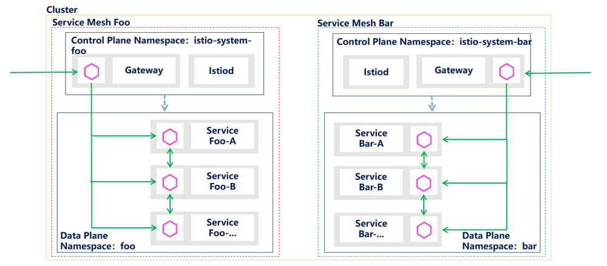
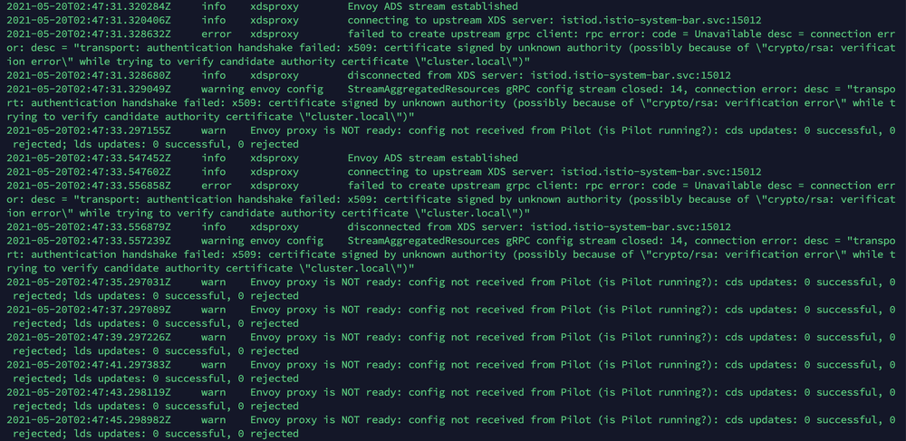
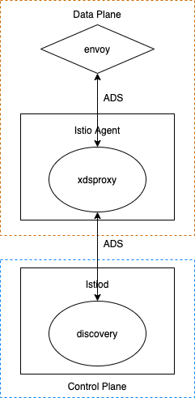
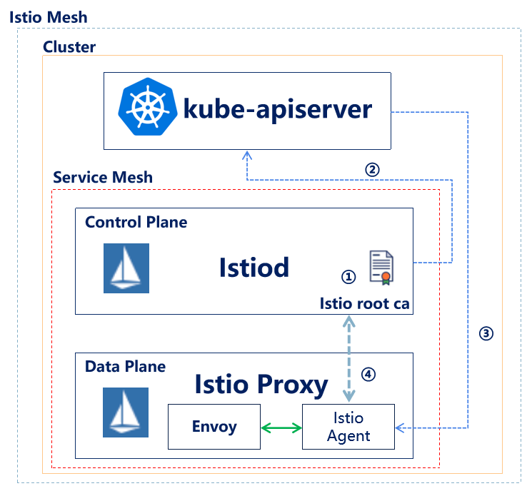
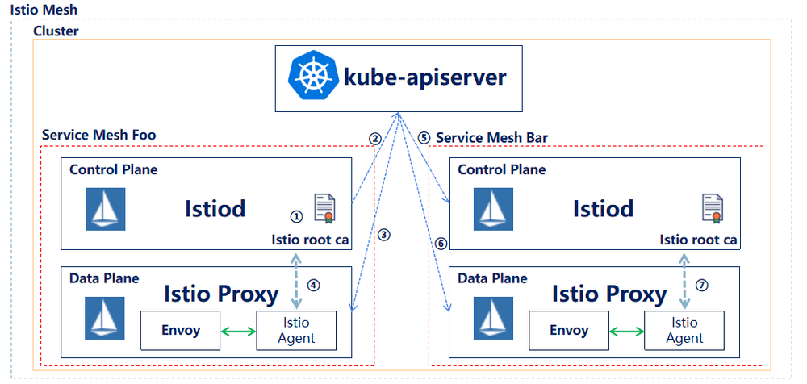
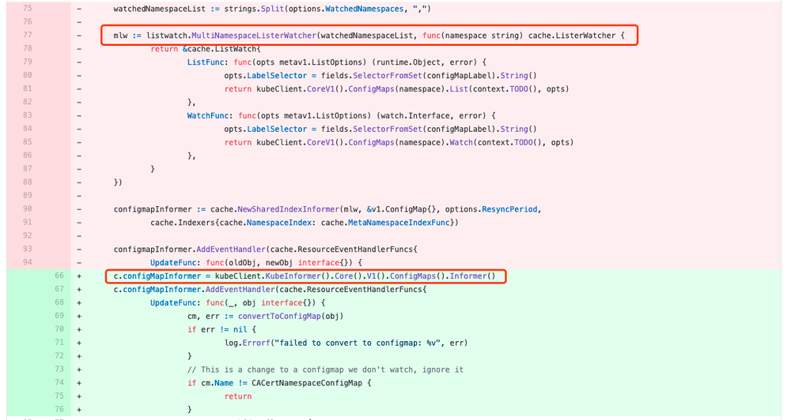
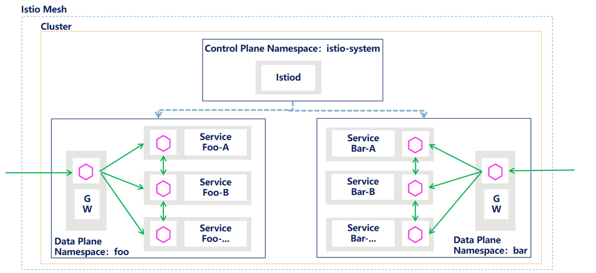

## 背景

随着云原生概念的普及，服务网格技术的流行以及 Istio 的成熟，使用 Istio 进行服务治理的实践也越来越多，正成为服务治理的趋势。 

在这样的背景下，我们也加入到 Istio 的研究中，希望初期通过 Istio 实现公司产品迭代版本的灰度发布，后续基于 Istio 为业务产品提供更多的流量管理及观测追踪能力。

一开始设计 Istio 部署方案时，基于当时对公司产品部署方式的了解，每款产品独占一套 Kubernetes 集群，另外考虑到当时我们对 Istio 的熟悉程度，设计的是最基础的方案：一套 Kubernetes 集群中部署一套 Istio，将该 Kubernetes 集群内唯一的产品纳管到 Istio 服务网格中，即 Kubernetes 集群、产品、Istio 是 1:1:1 的关系。 

随着对公司产品部署方式调研的深入，我们了解到有几款产品部署在一套 Kubernetes 集群中，按照 namespace 进行分割，并且公司开始推行统一 Kubernetes 集群，已经在落地实施。

如果我们继续使用初始的部署方案，在初期 Kubernetes 集群中产品数量不多，规模不大的情况，也是可以支撑的，但存在潜在问题 (主要是性能问题以及故障隔离性的问题)，所以需要调研实现在一套 Kubernetes 集群内，为每一个产品提供一套 Istio 服务网格的方案。

## 初始方案问题

初始方案存在以下两个问题：

### 性能问题

集群规模较大时，多产品共用同一套 Istio，会存在性能问题。在默认情况下，服务网格中的每个 Sidecar 都会收到整个集群所有服务信息。在较大规模的规模中，尤其是由于流量规则批量变更，控制面向数据面短时间内大量下发服务信息的情况下，Sidecar 的 CPU 及内存消耗、XDS 的下发及时性等问题，会变得非常突出。

### 故障隔离性问题

多款产品共用一套 Istio，可能 Istio 本身会出现问题，也可能由于某款产品的配置导致 Istio 出现问题，进而可能导致纳管的所有产品灰度甚至正常访问都出现问题，无法实现故障的隔离。

## 新方案调研

我们需要调研实现在一套 Kubernetes 集群内，为每一个产品提供一套 Istio 服务网格的方案，解决潜在的问题。总结下来，有以下几种方案：

### 官方方案

Istio 官方网站有一篇 2018 年的博文：[Istio 的软性多租户支持](https://istio.io/latest/zh/blog/2018/soft-multitenancy/)给出了方案，可以实现为每个产品提供一套 Istio 网格的目标，每套 Istio 的控制面可以安装到指定的 namespace 中，数据面可以设置为产品部署的 namespace。官方方案是符合我们期望的方案，但 Istio 版本升级太快，博文内容比较陈旧，没办法按文档操作，并且有人反馈实操时有问题（[提出问题的 issue](https://github.com/istio/istio/issues/7608)）。

每个 namespace 装一套 Istio 网格，也是存在一定问题的，但结合目前我们的实际情况，认为下面的两个问题我们是可以接受的。

* 资源消耗问题：每套 Istio 网格都是需要消耗一定量的资源的
* namespace 之间网络请求问题：如果 namespace 之间存在服务互访，按照 Istio 的规范，通过在 namespace 中部署 Ingress Gateway 和 Egress Gateway，控制进入和流出的流量，但这样增加了部署复杂度。

### 单控制面多 Gateway 方案

[Service Mesh (Istio) patterns for Multitenancy](https://medium.com/@sudeep.batra/service-mesh-istio-patterns-for-multitenancy-2462568636f7)提供了另外一种方案，该方案为部署一套 Istio 控制面，纳管多个产品数据面，每个产品以及 Istio 控制面的 namespace 部署一套 Ingress Gateway，相当于产品共用 Istio 控制面，但不共用 Ingress Gateway，一定程度上减少产品的耦合。


### 大厂方案

一些大厂，在开源 Istio 的基础上，增加了多租户的支持，比如[Red Hat OpenShift Service Mesh](https://www.redhat.com/en/topics/microservices/why-choose-openshift-service-mesh)、[腾讯云 TFS Mesh](https://www.infoq.cn/article/id2w4pefjqbusjhmd8jt)及[蚂蚁金服 SOFAMesh](https://www.qbitai.com/2020/06/15846.html)，在这三篇文章中，都各自提到了对多租户的支持。

## 我们的探索

目前我们进行了前两个方案的探索，即上文中官方方案及单控制面多 Gateway 的方案，通过实践和对源码研究，在不修改调研版本（V1.8.1）Istio 源码的情况下，前者是行不通的，而后者是可以顺利实现的 (PS：通过对最新版本 V1.11.4 的 Istio 进行实践，本文对 V1.11.4 版本 Istio 仍然适用)。

两个方案各有优缺点：

* 前者可以实现租户对 Istio 的独占，是在一套 Kubernetes 集群中彻底的分租户方案，比较完美的解决性能问题及故障隔离性问题，但缺点是需要修改源代码，开发成本较高，后期每次 Istio 版本升级，需要将 patch 重新打入，维护成本也较高，另外考虑对 Istio 的熟悉程度，修改源码带来的风险也较大。

* 后者是在不修改源代码的情况下实现多租户的折中方案，租户间虽然共享控制面，但独享数据面，在数据面范围内实现租户隔离，解决用户访问租户产品时的性能问题和故障隔离性问题，保障了产品的正常访问，这也是最重要、最需要保障的部分，缺点是租户共享控制面，控制面出现问题时，影响多产品控制面对数据面的管理，比如流量管理配置变更下发，但考虑一般在周期性上线时，才涉及到控制面对数据面的管理变更，解决问题的紧急程度，比数据面业务访问出问题时的紧急程度低很多，并且我们会通过控制面高可用等方案，降低这种情况的影响。  

下面详细介绍下对两个方案的探索：

### 官方方案

前面已经提到，官方方案内容比较陈旧，没办法按照文档操作，并且有人反馈存在问题，按照博文方案，通过 istioctl 方式多次尝试，没有成功。阅读了更多的其他官方文档，考虑 Istio Operator 方式安装 Istio，可以更方便进行 Istio 部署设置，所以进行了通过 Istio Operator 安装 Istio 的很多尝试，并且深入阅读了 Istio 相关代码，发现在不修改 Istio 源代码的情况下，是行不通的。

以下是通过 Istio Operator 安装 Istio，实现官方方案的一些尝试，并包含一些源代码的分析。

试验 Demo 部署模型如下，在一套 Kubernetes 集群上部署两套服务网格及两套产品 (Foo 和 Bar)，每套服务网格完全隔离，每个产品独占对应的服务网格。

 

1、为 Foo 产品部署独占的 Istio 组件

```
kubectl create namespace istio-system-foo
istioctl operator init --istioNamespace istio-system-foo --watchedNamespaces istio-system-foo --namespace istio-system-foo --operatorNamespace istio-operator-foo
kubectl apply -f istio-operator-foo.yaml
```

istio-operator-foo.yaml 的内容如下：

```yaml
apiVersion: install.istio.io/v1alpha1
kind: IstioOperator
metadata:
  namespace: istio-system-foo
  name: istio-control-plane
spec:
  namespace: istio-system-foo
  profile: default
  values:
    global:
      istioNamespace: istio-system-foo
    meshConfig:
      rootNamespace: istio-system-foo
  components:
    ingressGateways:
      - name: istio-ingressgateway
        k8s:
          service:
            type: NodePort
```

执行以上操作后，过一段时间，查看 istio-system-foo namespace，可以看到 Foo 独占的 Istio 组件部署成功。

2. 类似的方式，为 Bar 应用部署独占的 Istio 组件

```
kubectl create namespace istio-system-bar
istioctl operator init --istioNamespace istio-system-bar --watchedNamespaces istio-system-bar --namespace istio-system-bar --operatorNamespace istio-operator-bar
kubectl apply -f istio-operator-bar.yaml
```

istio-operator-bar.yaml 的内容如下：

```yaml
apiVersion: install.istio.io/v1alpha1
kind: IstioOperator
metadata:
  namespace: istio-system-bar
  name: istio-control-plane
spec:
  namespace: istio-system-bar
  profile: default
  values:
    global:
      istioNamespace: istio-system-bar
    meshConfig:
      rootNamespace: istio-system-bar
  components:
    ingressGateways:
      - name: istio-ingressgateway
        k8s:
          service:
            type: NodePort
```

执行以上的操作，稍等一会，查看 istio-system-bar namespace 下的 Istio 组件部署情况，会发现 Istio Ingress Gateway 的 pod 无法成功启动，查看日志，日志中报如下错误：

```
error   xdsproxy        failed to create upstream grpc client: rpc error: code = Unavailable desc = connection error: desc = "transport: authentication handshake failed: x509: certificate signed by unknown authority (possibly because of \"crypto/rsa: verification error\" while trying to verify candidate authority certificate \"cluster.local\")"
```

更多日志见下面截图：



要解释截图中的错误日志原因，需要先介绍下数据面（Envoy）和控制面（Istiod）的网络交互。下面是网络交互图（ADS 请求部分）：

   

在数据面 Istio Ingress Gateway 容器中或者业务产品 pod 注入的 Sidecar 容器中，启动着两个进程，Envoy 进程及 Pilot Agent 进程（即图中的 Istio Agent），后者扮演着 Istiod 和 Envoy 之间（即控制面和数据面之间）进行网络交互的中间代理角色。Envoy 向 Istio Agent 发送 ADS（Aggregated Discovery Services，即聚合的发现服务，通过一个 gRPC 流来同步所有的配置更新）请求，后者将请求转发给控制面的配置发现服务（一般为 Istiod），然后配置发现服务将全部的配置更新返回给数据面。   

数据面和控制面之间的网络请求，默认基于双向 TLS 认证，即两者进行通信时，双方都需要验证对方的身份，通过阅读源代码及参考赵化冰大佬的文章[一文带你彻底厘清 Isito 中的证书工作机制](https://zhaohuabing.com/post/2020-05-25-istio-certificate/)，了解数据面对控制面的身份认证过程如下：

   

1. Istiod 采用内置的 CA 服务为自身签发一个服务器证书，并采用该服务器证书对外提供基于 TLS 的 gPRC 服务；
2. Istiod 调用 kube-apiserver 生成 configmap：istio-ca-root-cert，在该 configmap 中放入了 Istiod 的 CA 根证书；
3. 数据面 Ingress Gateway 容器或 Sidecar 容器将 istio-ca-root-cert configmap mount 为容器内 /var/run/secrets/istio/root-cert.pem 文件；
4. 在 Pilot Agent 和 Istiod 建立 gRPC 连接时，Pilot Agent 采用 root-cert.pem 文件证书对 Istiod 的身份进行认证；

问题出现：  

     

5. Istio 通过 Kubernetes Informer 机制，将步骤 2 Foo 控制面生成的 Configmap 同步到 Kubernetes 集群里所有的 namespace 下，包括 Bar 网格相关的 Namespace；
6. Bar 数据面 Ingress Gateway 容器或 Sidecar 容器，采用步骤 3 相同的方式，将步骤 5 同步到的 Configmap mount 到容器内；
7. Bar 的 Ingress Gateway 或 Sidecar 使用 Foo 控制面生成的 CA 根证书，对 Bar 的控制面进行身份认证，认证失败。

可以从 Istio 源代码：[pilot/pkg/bootstrap/server.go](https://github.com/istio/istio/blob/1.8.1/pilot/pkg/bootstrap/server.go)和[pilot/pkg/serviceregistry/kube/controller/namespacecontroller.go](https://github.com/istio/istio/blob/1.8.1/pilot/pkg/serviceregistry/kube/controller/namespacecontroller.go)中看到相关的分析内容，Istiod 中 pilot 模块 server 服务时，会进行一系列的初始化工作，包括初始化 namespaceController，而该 namespaceController 会创建 configmapInformer，通过 informer 机制，接受 Kubernetes 集群中的 istio-ca-root-cert configmap 的更新，而该 informer 是一个 SharedIndexInformer，也就是共享的 informer，监听同一个 Kubernetes 集群中所有 namespace 下 configmap 的变化，所以从代码中可以看出，目前的 Istio 不支持在同一个 Kubernetes 集群中存在多套 Istio 控制面，这个变化应该是来自 Istio 2020 年 7 月的一次代码修改，可以查看[namespace controller: use shared informer](https://github.com/istio/istio/commit/9fdec2a68d443b9f9aac85530ac01491b0d24bf2)



所以得出结论，在不修改 Istio 源码的情况下，想要实现官方方案，是行不通的。

### 单控制面多 Gateway 方案  

参照[Service Mesh (Istio) patterns for Multitenancy](https://medium.com/@sudeep.batra/service-mesh-istio-patterns-for-multitenancy-2462568636f7)，进行了实践验证，实践过程很顺利，以下是试验 Demo 部署模型及实践步骤，一套 Kubernetes 集群上部署两款产品（Foo 和 Bar），两款产品共享控制面，独享数据面，数据面范围内实现租户隔离。  

  

1. 部署 Istio Operator

```
istioctl operator init
```

2. 创建 istio-system namespace

```
kubectl create namespace istio-system
```

3. 创建部署控制面的 Istio Operator 自定义资源

```
kubectl apply -f istio-operator.yaml
```

istio-operator.yaml 的内容如下：

```yaml
apiVersion: install.istio.io/v1alpha1
kind: IstioOperator
metadata:
  namespace: istio-system
  name: istio-control-plane
spec:
  namespace: istio-system
  profile: default
  components:
    pilot:
      k8s:
        hpaSpec:
          minReplicas: 2
        env:
          - name: PILOT_SCOPE_GATEWAY_TO_NAMESPACE
            value: "true"
    ingressGateways:
      - name: istio-ingressgateway
        enabled: false
```

需要注意一点，部署 pilot 组件时，为 pilot 组件设置了 `PILOT_SCOPE_GATEWAY_TO_NAMESPACE` 环境变量，值为 true，会限制 gateway 规则只会应用到 gateway 所在 namespace 下 Istio Ingress Gateway 上，这样设置实现租户之间的隔离。

operator controller 会监测到 istio-control-plane 这个 IstioOperator 资源，并按照配置部署相关组件，稍等一段时间，可以看懂 istio-system namespace 下共享的控制面组件已经部署完成。

```
kubectl get all -n istio-system
NAME                          READY   STATUS    RESTARTS   AGE
pod/istiod-6fc49c7d5c-2ljdl   1/1     Running   0          19h
pod/istiod-6fc49c7d5c-mjp5h   1/1     Running   0          19h
NAME             TYPE        CLUSTER-IP      EXTERNAL-IP   PORT(S)                                 AGE
service/istiod   ClusterIP   10.109.247.96   <none>        15010/TCP,15012/TCP,443/TCP,15014/TCP   5d5h
NAME                     READY   UP-TO-DATE   AVAILABLE   AGE
deployment.apps/istiod   2/2     2            2           19h
NAME                                DESIRED   CURRENT   READY   AGE
replicaset.apps/istiod-6fc49c7d5c   2         2         2       19h
replicaset.apps/istiod-f77f59479    0         0         0       19h
NAME                                         REFERENCE           TARGETS         MINPODS   MAXPODS   REPLICAS   AGE
horizontalpodautoscaler.autoscaling/istiod   Deployment/istiod   <unknown>/80%   2         5         2          19h
```   

4. 创建 foo namespace，并为该 namespace 打上标签，支持 istio sidecar 自动注入

```
kubectl create namespace foo
kubectl label namespace foo istio-injection=enabled
```

5. 创建部署 Foo 应用独占的 Istio Ingress Gateway 需要的 Istio Operator 自定义资源

```
kubectl apply -f istio-operator-foo.yaml
```

istio-operator-foo.yaml 的内容如下：

```yaml
apiVersion: install.istio.io/v1alpha1
kind: IstioOperator
metadata:
  namespace: istio-system
  name: foo-ingress-gateway
spec:
  profile: empty
  components:
    ingressGateways:
      - name: istio-ingress-gateway
        namespace: foo 
        enabled: true
        k8s:
          hpaSpec:
            minReplicas: 2
          service:
            type: NodePort
            ports:
              - name: http2
                nodePort: 32180
                port: 80
                protocol: TCP
                targetPort: 8080
```

稍等一段时间，可以看到 foo namespace 下，Foo 应用独占的 Istio Ingress Gateway 部署完成。

```
kubectl get all -n foo
NAME                                         READY   STATUS    RESTARTS   AGE
pod/istio-ingress-gateway-78447867cf-gh4l8   1/1     Running   0          23h
pod/istio-ingress-gateway-78447867cf-nqcb4   1/1     Running   0          23h

NAME                            TYPE        CLUSTER-IP      EXTERNAL-IP   PORT(S)                                                                      AGE
service/istio-ingress-gateway   NodePort    10.233.21.151   <none>        80:32180/TCP   23h

NAME                                    READY   UP-TO-DATE   AVAILABLE   AGE
deployment.apps/istio-ingress-gateway   2/2     2            2           23h

NAME                                               DESIRED   CURRENT   READY   AGE
replicaset.apps/istio-ingress-gateway-78447867cf   2         2         2       23h

NAME                                                        REFERENCE                          TARGETS   MINPODS   MAXPODS   REPLICAS   AGE
horizontalpodautoscaler.autoscaling/istio-ingress-gateway   Deployment/istio-ingress-gateway   8%/80%    2         5         2          23h
```

6. 参照步骤 4、5，在 bar namespace 中部署产品 Bar 独占的 Istio Ingress Gateway。

```
kubectl create namespace bar
kubectl label namespace bar istio-injection=enabled
kubectl apply -f istio-operator-bar.yaml
```

istio-operator-bar.yaml 内容如下：

```yaml
apiVersion: install.istio.io/v1alpha1
kind: IstioOperator
metadata:
  namespace: istio-system
  name: bar-ingress-gateway
spec:
  profile: empty
  components:
    ingressGateways:
      - name: istio-ingress-gateway
        namespace: bar
        enabled: true
        k8s:
          hpaSpec:
            minReplicas: 2
          service:
            type: NodePort
            ports:
              - name: http2
                nodePort: 32280
                port: 80
                protocol: TCP
                targetPort: 8080
```

稍等一段时间，可以看到 bar namespace 下，Bar 应用独占的 Istio Ingress Gateway 部署完成。

```
kubectl get all -n bar
NAME                                         READY   STATUS    RESTARTS   AGE
pod/istio-ingress-gateway-8646b4964b-2q56j   1/1     Running   0          23h
pod/istio-ingress-gateway-8646b4964b-xjvvp   1/1     Running   0          23h

NAME                            TYPE        CLUSTER-IP      EXTERNAL-IP   PORT(S)                                                                      AGE
service/istio-ingress-gateway   NodePort    10.233.41.156   <none>        80:32280/TCP   23h

NAME                                    READY   UP-TO-DATE   AVAILABLE   AGE
deployment.apps/istio-ingress-gateway   2/2     2            2           23h

NAME                                               DESIRED   CURRENT   READY   AGE
replicaset.apps/istio-ingress-gateway-8646b4964b   2         2         2       23h

NAME                                                        REFERENCE                          TARGETS   MINPODS   MAXPODS   REPLICAS   AGE
horizontalpodautoscaler.autoscaling/istio-ingress-gateway   Deployment/istio-ingress-gateway   6%/80%    2         5         2          23h
```

通过步骤 1-6，实现了单控制面多 Gateway 方案的部署，两款产品 Foo 及 Bar 共享 istio-system namespace 中的 Istiod 控制面，独占各自 namespace 中的 Istio Ingress Gateway。

部署 Foo、Bar 两款产品（很简单的 HelloWorld 类型的 Demo），并创建 Istio 流量管理相关的 CRD，可以实现 Foo、Bar 两款产品的灰度发布，下面是实现灰度发布后的效果，部署过程不再赘述。

```
curl http://10.154.0.165:32180/foo/hello
Hello Foo 0.0.1
curl -H 'version:v0-0-2' http://10.154.0.165:32180/foo/hello
Hello Foo 0.0.2
curl http://10.154.0.165:32280/bar/hello
Hello Bar 0.0.1
curl -H 'version:v0-0-2' http://10.154.0.165:32280/bar/hello
Hello Bar 0.0.2
```

## 总结

通过对 Istio 多租户方案的调研和探索，我们总结出同一个 Kubernetes 集群中分 namespace 部署多款产品场景下两种 Istio 部署方案的优缺点，结合我们目前的情况，更倾向采用单控制面多 Gateway 方案。
以上的调研探索，可能存在错误或不准确的地方，欢迎大家交流指正。

## 参考文章

* [2021 年 Istio 大型“入坑”指南](http://blog.itpub.net/31557835/viewspace-2760142/)
* [「Bug」Istio 的 Sidercar 和 IngressGateway 间歇性地报错：Envoy proxy is NOT ready](https://www.cnblogs.com/kirito-c/p/12750063.html)
* [Istio performance in a multi-tenancy Kubernetes cluster](https://medium.com/ww-engineering/istio-performance-in-a-multi-tenancy-kubernetes-cluster-a843ec4e51f7)
* [Istio 的软性多租户支持](https://istio.io/latest/zh/blog/2018/soft-multitenancy/)
* [1.0 Soft multi-tenancy support](https://github.com/istio/istio/issues/7608) 
* [Istio performance in a multi-tenancy Kubernetes cluster](https://medium.com/ww-engineering/istio-performance-in-a-multi-tenancy-kubernetes-cluster-a843ec4e51f7) 
* [Why choose Red Hat OpenShift Service Mesh?](https://www.redhat.com/en/topics/microservices/why-choose-openshift-service-mesh)
* [腾讯云中间件团队在 Service Mesh 中的实践与探索](https://www.infoq.cn/article/id2w4pefjqbusjhmd8jt)
* [Service Mesh：调度千军万马微服务，2.0 妥妥的](https://www.qbitai.com/2020/06/15846.html)
* [一文带你彻底厘清 Isito 中的证书工作机制](https://zhaohuabing.com/post/2020-05-25-istio-certificate/)
* [Istio 流量管理实现机制深度解析](https://zhaohuabing.com/post/2018-09-25-istio-traffic-management-impl-intro/)
