本文为翻译文章，[点击查看原文](https://programmaticponderings.com/2019/04/17/istio-observability-with-go-grpc-and-protocol-buffers-based-microservices/)。

**编者按**

> 本文演示了如何基于 Go 语言、gRPC 和 Protobuf 技术构建一个微服务，并着重介绍了实现 Istio 可观测功能的三大支柱：日志、度量和追踪，以及与之对应的工具 Logrus、Prometheus、Grafana、Jaeger 等。通过文章内容和示例代码，读者会对如何构建 gRPC 技术栈的微服务和使用 Istio 可视化工具观测服务的实现方案有一个全面的认识。

在过去的两篇文章中（[具有 Istio 服务网格的基于 Kubernetes 的微服务可视化](https://programmaticponderings.com/2019/03/10/kubernetes-based-microservice-observability-with-istio-service-mesh-part-1/) 和 [具有 Istio 服务网格的 AKS 可视化](https://programmaticponderings.com/2019/03/31/azure-kubernetes-service-aks-observability-with-istio/)），我们探索了包含在 Istio 服务网格中的可视化工具，包括用于指标收集、监控和报警的[Prometheus](https://prometheus.io/) 和 [Grafana](https://grafana.com/)，用做分布式追踪的[Jaeger](https://www.jaegertracing.io/)，以及基于 Istio 服务网格的微服务可视化和监控工具[Kiali](https://www.kiali.io/)和云平台原生的监控、日志服务相比（例如 GCP 的 [Stackdriver](https://cloud.google.com/monitoring/)，AWS 上的 [CloudWatch](https://aws.amazon.com/cloudwatch/)，Azure 上的 [Azure Monitor](https://docs.microsoft.com/en-us/azure/azure-monitor/overview)），我们有针对现代化的、分布式的云应用的全面的可视化解决方案。

在这篇文章中，我们将考察使用 Istio 可视化工具来监控基于 Go 语言的微服务，它们使用 [Protocol Buffers](https://developers.google.com/protocol-buffers/)、[gRPC](https://grpc.io/)和[HTTP/2](https://en.wikipedia.org/wiki/HTTP/2)作为客户端 - 服务端通信，这与传统的基于 REST JSON 和 HTTP 进行通信是不同的。我们将看到 Kubernetes、Istio、Envoy 和可视化工具如何与 gRPC 无缝地工作，就像在[Google Kubernetes Engine](https://cloud.google.com/kubernetes-engine/)上通过 HTTP 处理 JSON 一样。

## 技术

根据[gRPC 项目](https://grpc.io/)介绍，gRPC 是[CNCF](https://www.cncf.io/)的孵化项目，一个现代化的、高性能、开源和通用的[RPC](https://en.wikipedia.org/wiki/remote_procedurere_call)框架，可以在任何地方运行。它使客户端和服务端应用能够透明地通信，并更加容易的构建连接系统。Google 是 gRPC 最初的开发者，多年来一直使用 gRPC 中的底层技术和概念。当前的实现用于几个谷歌的云产品和对外的 API。许多其他组织也在使用它，比如 Square、Netflix、CoreOS、Docker、CockroachDB、Cisco、Juniper Networks 等。

默认情况下 gRPC 使用 Protocol Buffers。根据[Google 官方的介绍](https://developers.google.com/protocol-buffers/)，Protocol Buffers 是一种与语言和平台无关的、高效的、可扩展的自动序列化结构化的数据的机制，以便在通信协议、数据存储等方面使用。Protocol Buffers 比 XML 小 3 到 10 倍，并且快 20 到 100 倍。使用生成数据访问类编译的`.proto`源文件很容易以编程方式使用。

> Protocol Buffers 比 XML 小 3 到 10 倍，并且快 20 到 100 倍。

Protocol buffers 目前支持生成Java，Python，Objective-C，C++，Dart，Go，Ruby和C#代码。本文我们使用 Go 语言编程。你可以从 Google 的 [开发者页面](https://developers.google.com/protocol-buffers/docs/encoding)了解更多 Protobuf 二进制格式的信息。

根据[Istio 项目](https://istio.io/docs/concepts/what-is-istio/#envoy)的介绍，Istio 使用了一个扩展版本的 [Envoy](https://www.envoyproxy.io/) 代理。Envoy 作为 sidecar 和与它相关的服务部署在同一个 Kubernetes Pod 中。Envoy 由 Lyft 创建，是一个 C++开发的高性能代理，为服务网格中的所有服务传送出入流量。Istio 利用了 Envoy 的许多内置特性，包括动态服务发现，负载均衡，TLS 终止，HTTP/2 和 gRPC 代理，熔断、健康检查，灰度发布，故障注入和富指标等。

根据 Google 的 Harvey Tuch 的文章[Evolving a Protocol Buffer canonical API](https://blog.envoyproxy.io/evolving-a-protocol-buffer-canonical-api-e1b2c2ca0dec)，Envoy 代理兼容 Protocol Buffers，特别是[proto3](https://developers.google.com/protocol-buffers/docs/proto3)，作为 Lyft gRPC API 第二版本的首选规范。

## 涉及的微服务平台

在前两篇文章中，我们探讨了 Istio 的可观察性工具，使用了用 Go 编写的基于 RESTful 的微服务的 API 平台，并使用 JSON 通过 HTTP 进行服务到服务的通信。API 平台由 8 个基于 [Go](https://golang.org/) 的微服务和一个示例 Angular 7，基于[TypeScript](https://en.wikipedia.org/wiki/TypeScript) 的前端 web 客户端组成。对于基于事件队列的通信，各种服务都依赖于 MongoDB 和 RabbitMQ。下面是使用 HTTP 传输 JSON 的平台架构。

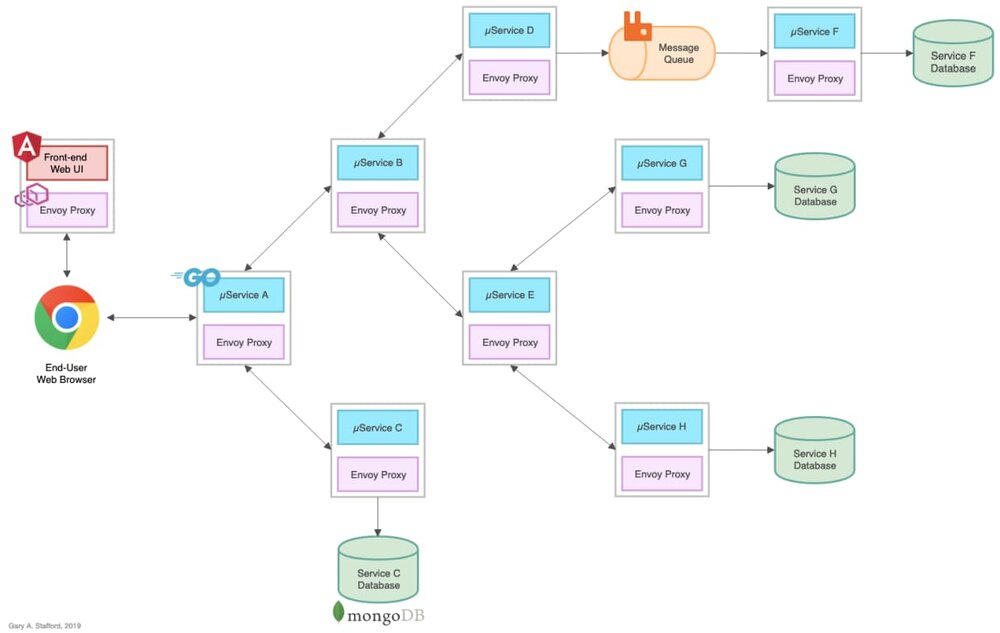

下面是 Angular 7 的 web 客户端接口。

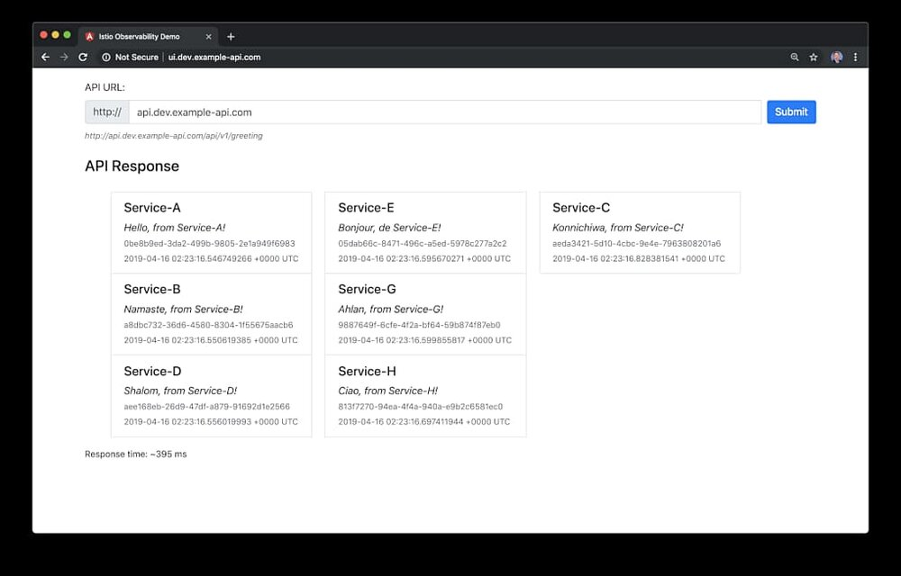

### 转到 gRPC 和 Protocol Buffers

在本文中，我修改了 8 个 Go 微服务使用 [gRPC](https://grpc.io/) 和 [Protocol Buffers](https://developers.google.com/protocol-buffers/)（Google 的数据交换格式）。具体来讲，服务使用了 Protocol Buffers 的[版本 3](https://github.com/protocolbuffers/protobuf/releases)（简称 proto3）。使用 gRPC 的方式，一个 gRPC 客户端会调用 gRPC 服务端。平台的一些服务是 gRPC 服务端，另一些是 gRPC 客户端，而一些同时充当客户端和服务端，如服务 A、B 和 EE。修改后的体系结构如下所示。

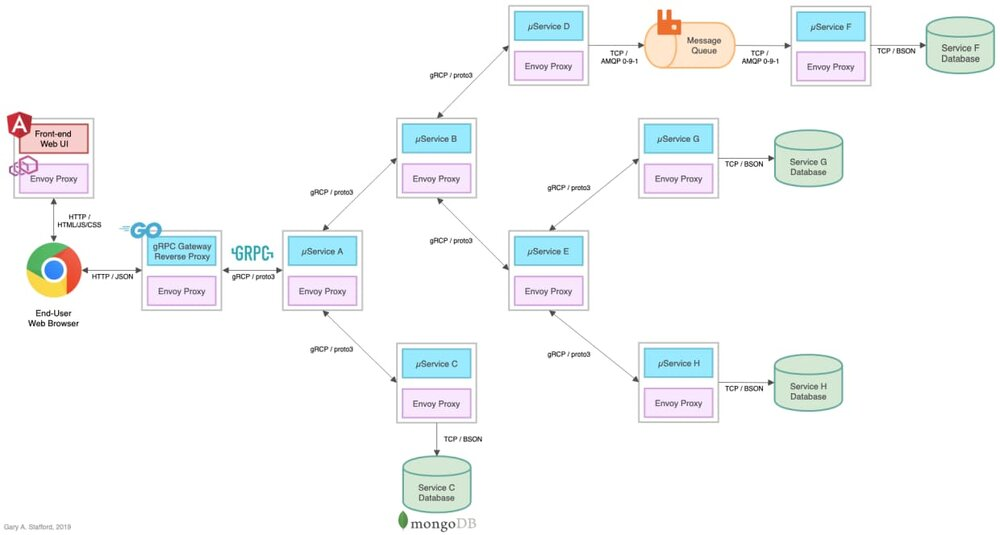

### gRPC 网关

假设为了进行这个演示，API 的大多数消费者仍然希望使用 RESTful JSON 通过 HTTP API 进行通信，我已经向平台添加了一个[gRPC 网关](https://github.com/grpc-ecosystem/grpc-gateway) 作为反向代理。它是一个 gRPC 到 JSON 的反向代理，这是一种通用的架构模式，它通过基于 HTTP 的客户端代理 JSON 与基于 gRPC 的微服务进行通信。来自[grpc-gateway](https://github.com/grpc-ecosystem/grpc-gateway)的 GitHub 项目的图有效地演示了反向代理是如何工作的。

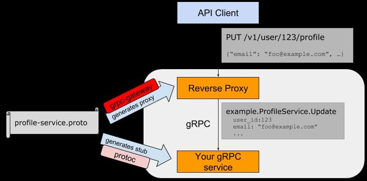

*图像来源： <https://github.com/grpc-ecosystem/grpc-gateway>*

在上面的平台架构图中添加了反向代理，替换了 API 边缘的服务 A。代理位于基于 Angular 的 Web UI 和服务 A 之间。此外，服务之间的通信方式是通过 gRPC 上的 Protobuf，而不是 HTTP 上的 JSON。Envoy 代理（通过 Istio）的使用没有改变，基于 MongoDB Atlas 的数据库和基于 CloudAMQP RabbitMQ 的队列也没有改变，它们仍然位于 Kubernetes 集群的外部。

### 替换 gRPC 网关

作为 gRPC 网关反向代理的替代方案，我们可以将基于 TypeScript 的 Angular UI 客户端转换为 gRPC 和 Protocol Buffers，并继续作为边缘服务直接与服务 A 通信。然而，这将限制 API 的其他消费者依赖 gRPC 而不是 HTTP 和 JSON，除非我们选择发布两个不同的 endpoint：gRPC 和 HTTP JSON（这是另一种常见的模式）。

# 演示

在本文的演示中，我们将重复上一篇文章（[Kubernetes-based Microservice Observability with Istio Service Mesh](https://programmaticponderings.com/2019/03/10/kubernetes-based-microservice-observability-with-istio-service-mesh-part-1/)）中完全相同的安装过程。我们将把修改后的基于 grpc 的平台部署到 GCP 的 GKE 上。你也可以遵循[Azure Kubernetes Service (AKS) Observability with Istio Service Mesh](https://programmaticponderings.com/2019/03/31/azure-kubernetes-service-aks-observability-with-istio/)，轻松的将平台部署到 AKS。

## 源代码

本文的所有源代码都可以在 GitHub 上找到，包含了三个项目。基于 Go 的微服务源代码、所有 Kubernetes 资源和所有部署脚本都位于[k8s-istio-observe-backend](https://github.com/garystafford/k8s-istio-observe-backend)项目代码库的“grpc”分支中。

```bash
git clone \
  --branch grpc --single-branch --depth 1 --no-tags \
  https://github.com/garystafford/k8s-istio-observe-backend.git
```

基于 angular 的 web 客户端源代码在[k8s-istio-observe-frontend](https://github.com/garyst/k8s-istio-observe-frontend)代码库的"grpc"分支。.proto 源文件和使用 Protocol Buffers 编译器生成的代码位于新的[pb-greeting](https://github.com/garystford/pb-greeting)项目代码库中。在本文的演示中，你不需要克隆这些项目中的任何一个。

所有的服务、UI 和反向代理的的 Docker 镜像都在[Docker Hub](https://hub.docker.com/search?q="garystafford&type=image&sort=updated_at&order=desc)。

## 代码变化

本文并不是专门针对 gRPC 和 Protobuf 编写的。但是，为了更好地理解这些技术的可观察性需求和功能，与 HTTP JSON 相比，复查一些源代码是有帮助的。

### 服务 A

首先，将如下所示的服务 A 的源代码与前一篇文章中的原始代码进行比较。服务的代码几乎被完全重写。编写代码时，我依赖于几个参考资料，包括[使用 Istio 追踪 gRPC](https://aspenmesh.io/2018/04/tracing-grpc-with-istio/)，由 Aspen Mesh 的 Neeraj Poddar 编写，和 Masroor Hasan 撰写的[Kubernetes 上的分布式追踪架构 Jaeger](https://medium.com/@masroor.hasan/tracing-infrastructure-with-jaeger-on-kubernetes-6800132a677)。

下面是服务 A 具体的代码变化：

- 导入[pb-greeting](https://github.com/garystafford/pb-greeting) protobuf 包；
- 本地 Greeting 结构体被 `pb.Greeting` 结构体替代；
- 所有的服务都基于 `50051`端口；
- HTTP 服务器和所有的 API 资源处理器函数被移除；
- 用于做 Jaeger 的分布式追踪的请求头信息从 HTTP 的请求对象中移动到了 gRPC context 对象中的 metadata 里；
- 服务 A 作为 gRPC 服务端，被 gRPC 网关反向代理 (客户端) 通过 Greeting 函数调用；
- 主要的 `PingHandler` 函数，返回服务的 Greeting，被 [pb-greeting](https://github.com/garystafford/pb-greeting) protobuf 包的 `Greeting 函数替代；
- 服务 A 作为 gRPC 客户端，使用 CallGrpcService` 函数调用服务 B 和服务 C；
- CORS 被从 Istio 中卸载；
- Logging 方法没有改变；

基于 gRPC 的[服务 A](https://github.com/garystafford/k8s-istio-observe-backend/blob/grpc/services/service-a/main.go) 的源码如下 ([*要点*](https://gist.github.com/garystafford/cb73d9037d2e492c3031a5fd3c8c3a5f)):

```go
// authors: Gary A. Stafford
// site: https://programmaticponderings.com
// license: MIT License
// purpose: Service A - gRPC/Protobuf


package main

import (
	"context"
	"github.com/banzaicloud/logrus-runtime-formatter"
	"github.com/google/uuid"
	"github.com/grpc-ecosystem/go-grpc-middleware/tracing/opentracing"
	ot "github.com/opentracing/opentracing-go"
	log "github.com/sirupsen/logrus"
	"google.golang.org/grpc"
	"google.golang.org/grpc/metadata"
	"net"
	"os"
	"time"

	pb "github.com/garystafford/pb-greeting"
)


const (
	port = ":50051"
)

type greetingServiceServer struct {
}

var (
	greetings []*pb.Greeting
)

func (s *greetingServiceServer) Greeting(ctx context.Context, req *pb.GreetingRequest) (*pb.GreetingResponse, error) {
	greetings = nil

	tmpGreeting := pb.Greeting{
		Id:      uuid.New().String(),
		Service: "Service-A",
		Message: "Hello, from Service-A!",
		Created: time.Now().Local().String(),
	}

	greetings = append(greetings, &tmpGreeting)

	CallGrpcService(ctx, "service-b:50051")
	CallGrpcService(ctx, "service-c:50051")

	return &pb.GreetingResponse{
		Greeting: greetings,
	}, nil
}

func CallGrpcService(ctx context.Context, address string) {
	conn, err := createGRPCConn(ctx, address)
	if err != nil {
		log.Fatalf("did not connect: %v", err)
	}
	defer conn.Close()

	headersIn, _ := metadata.FromIncomingContext(ctx)
	log.Infof("headersIn: %s", headersIn)

	client := pb.NewGreetingServiceClient(conn)
	ctx, cancel := context.WithTimeout(context.Background(), 5*time.Second)

	ctx = metadata.NewOutgoingContext(context.Background(), headersIn)

	defer cancel()

	req := pb.GreetingRequest{}
	greeting, err := client.Greeting(ctx, &req)
	log.Info(greeting.GetGreeting())
	if err != nil {
		log.Fatalf("did not connect: %v", err)
	}
	for _, greeting := range greeting.GetGreeting() {
		greetings = append(greetings, greeting)
	}
}

func createGRPCConn(ctx context.Context, addr string) (*grpc.ClientConn, error) {
	//https://aspenmesh.io/2018/04/tracing-grpc-with-istio/
	var opts []grpc.DialOption
	opts = append(opts, grpc.WithStreamInterceptor(
		grpc_opentracing.StreamClientInterceptor(
			grpc_opentracing.WithTracer(ot.GlobalTracer()))))
	opts = append(opts, grpc.WithUnaryInterceptor(
		grpc_opentracing.UnaryClientInterceptor(
			grpc_opentracing.WithTracer(ot.GlobalTracer()))))
	opts = append(opts, grpc.WithInsecure())
	conn, err := grpc.DialContext(ctx, addr, opts...jpg)
	if err != nil {
		log.Fatalf("Failed to connect to application addr: ", err)
		return nil, err
	}
	return conn, nil
}

func getEnv(key, fallback string) string {
	if value, ok := os.LookupEnv(key); ok {
		return value
	}
	return fallback
}

func init() {
	formatter := runtime.Formatter{ChildFormatter: &log.JSONFormatter{}}
	formatter.Line = true
	log.SetFormatter(&formatter)
	log.SetOutput(os.Stdout)
	level, err := log.ParseLevel(getEnv("LOG_LEVEL", "info"))
	if err != nil {
		log.Error(err)
	}
	log.SetLevel(level)
}

func main() {
	lis, err := net.Listen("tcp", port)
	if err != nil {
		log.Fatalf("failed to listen: %v", err)
	}

	s := grpc.NewServer()
	pb.RegisterGreetingServiceServer(s, &greetingServiceServer{})
	log.Fatal(s.Serve(lis))
}
```

### Greeting Protocol Buffers

下面显示的是 greeting 的 .proto 源文件。最初在服务中定义的 greeting 返回结构体大体上没变。UI 客户端响应看起来也是一样的。

```protocol-buffer
syntax = "proto3";
package greeting;

import "google/api/annotations.proto";

message Greeting {
    string id = 1;
    string service = 2;
    string message = 3;
    string created = 4;
}
message GreetingRequest {
}

message GreetingResponse {
    repeated Greeting greeting = 1;
}
service GreetingService {
    rpc Greeting (GreetingRequest) returns (GreetingResponse) {
        option (google.api.http) = {
            get: "/api/v1/greeting"
        };
    }
}
```

使用基于 Go 的协议编译器插件 protoc 进行编译时，最初的 27 行源代码膨胀到几乎 270 行，生成的数据访问类更容易通过编程使用。

```bash
# Generate gRPC stub (.pb.go)
protoc -I /usr/local/include -I. \
  -I ${GOPATH}/src \
  -I ${GOPATH}/src/github.com/grpc-ecosystem/grpc-gateway/third_party/googleapis \
  --go_out=plugins=grpc:. \
  greeting.proto

# Generate reverse-proxy (.pb.gw.go)
protoc -I /usr/local/include -I. \
  -I ${GOPATH}/src \
  -I ${GOPATH}/src/github.com/grpc-ecosystem/grpc-gateway/third_party/googleapis \
  --grpc-gateway_out=logtostderr=true:. \
  greeting.proto

# Generate swagger definitions (.swagger.json)
protoc -I /usr/local/include -I. \
  -I ${GOPATH}/src \
  -I ${GOPATH}/src/github.com/grpc-ecosystem/grpc-gateway/third_party/googleapis \
  --swagger_out=logtostderr=true:. \
  greeting.proto
```

下面是编译代码的一小段，供参考。编译后的代码包含在 GitHub 上的 [pb-greeting](https://github.com/garystafford/pb-greeting) 项目中，并导入到每个微服务和反向代理（[要点](https://gist.github.com/garystafford/57ab662f19a2d2c85d2882bb9e280430)）。我们还编译了一个单独的版本来实现反向代理。

使用 Swagger，我们可以查看 greeting protocol buffers 的单个 RESTful API 资源，该资源使用 HTTP GET 方法公开。我使用基于 docker 版本的[Swagger UI](https://hub.docker.com/r/swaggerapi/swagger-ui/)来查看原生代码生成的 Swagger 定义。

```bash
docker run -p 8080:8080 -d --name swagger-ui \
  -e SWAGGER_JSON=/tmp/greeting.swagger.json \
  -v ${GOAPTH}/src/pb-greeting:/tmp swaggerapi/swagger-ui
```

Angular UI 向“/api/v1/greeting”资源发出 HTTP GET 请求，该资源被转换为 gRPC 并代理到 Service A，在那里由“greeting”函数处理。

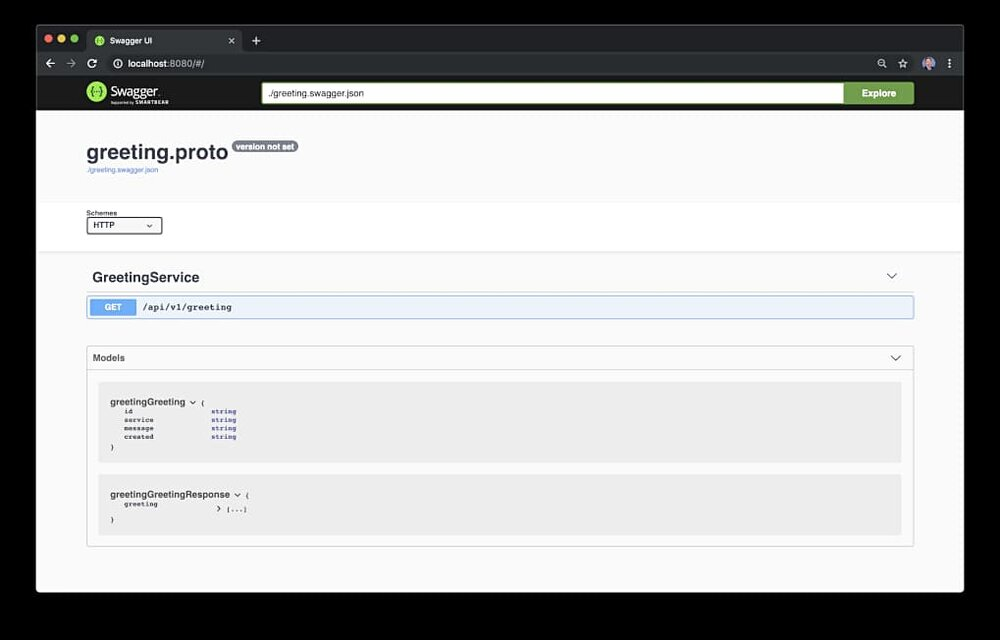

### gRPC 网关反向代理

如前所述，[gRPC 网关](https://github.com/grpc-ecosystem/grpc-gateway) 反向代理是全新的，下面列出了主要的代码特性：

如前所述，gRPC 网关反向代理服务是全新的。

- 导入 [pb-greeting](https://github.com/garystafford/pb-greeting) protobuf 包；
- 代理使用 `80`端口；
- 用于与 Jaeger 一起进行分布式追踪的请求头从传入的 HTTP 请求中收集信息，并传递给 gRPC 上下文中的服务 A；
- 代理被编写为 gRPC 客户端，调用服务 A；
- 日志大部分没有改变；

[反向代理](https://github.com/garystafford/k8s-istio-observe-backend/blob/grpc/services/service-rev-proxy/main.go) 源码如下：

```go
// authors: Gary A. Stafford
// site: https://programmaticponderings.com
// license: MIT License
// purpose: gRPC Gateway / Reverse Proxy
// reference: https://github.com/grpc-ecosystem/grpc-gateway


package main


import (
	"context"
	"flag"
	lrf "github.com/banzaicloud/logrus-runtime-formatter"
	gw "github.com/garystafford/pb-greeting"
	"github.com/grpc-ecosystem/grpc-gateway/runtime"
	log "github.com/sirupsen/logrus"
	"google.golang.org/grpc"
	"google.golang.org/grpc/metadata"
	"net/http"
	"os"
)


func injectHeadersIntoMetadata(ctx context.Context, req *http.Request) metadata.MD {
	//https://aspenmesh.io/2018/04/tracing-grpc-with-istio/
	var (
		otHeaders = []string{
			"x-request-id",
			"x-b3-traceid",
			"x-b3-spanid",
			"x-b3-parentspanid",
			"x-b3-sampled",
			"x-b3-flags",
			"x-ot-span-context"}
	)
	var pairs []string


	for _, h := range otHeaders {
		if v := req.Header.Get(h); len(v) > 0 {
			pairs = append(pairs, h, v)
		}
	}
	return metadata.Pairs(pairs...jpg)
}


type annotator func(context.Context, *http.Request) metadata.MD


func chainGrpcAnnotators(annotators ...annotator) annotator {
	return func(c context.Context, r *http.Request) metadata.MD {
		var mds []metadata.MD
		for _, a := range annotators {
			mds = append(mds, a(c, r))
		}
		return metadata.Join(mds...jpg)
	}
}


func run() error {
	ctx := context.Background()
	ctx, cancel := context.WithCancel(ctx)
	defer cancel()


	annotators := []annotator{injectHeadersIntoMetadata}


	mux := runtime.NewServeMux(
		runtime.WithMetadata(chainGrpcAnnotators(annotators...jpg)),
	)


	opts := []grpc.DialOption{grpc.WithInsecure()}
	err := gw.RegisterGreetingServiceHandlerFromEndpoint(ctx, mux, "service-a:50051", opts)
	if err != nil {
		return err
	}


	return http.ListenAndServe(":80", mux)
}


func getEnv(key, fallback string) string {
	if value, ok := os.LookupEnv(key); ok {
		return value
	}
	return fallback
}


func init() {
	formatter := lrf.Formatter{ChildFormatter: &log.JSONFormatter{}}
	formatter.Line = true
	log.SetFormatter(&formatter)
	log.SetOutput(os.Stdout)
	level, err := log.ParseLevel(getEnv("LOG_LEVEL", "info"))
	if err != nil {
		log.Error(err)
	}
	log.SetLevel(level)
}


func main() {
	flag.Parse()


	if err := run(); err != nil {
		log.Fatal(err)
	}
}
```

在下面显示的 Stackdriver 日志中，我们看到 JSON 有效负载中的一组 HTTP 请求头的示例，它们从 gRPC 网关的反向代理被传播到上游基于 gRPC 的 Go 服务。头传播确保请求在整个服务调用链上生成完整的分布式追踪。


### Istio 虚拟服务和 CORS

根据[GitHub](https://github.com/grpc/grpc-web/issues/435#issuecomment-454113721)项目中反馈的问题，gRPC 网关不直接支持跨源资源共享（Cross-Origin Resource Sharing, CORS）策略。根据我的经验，gRPC 网关不能处理选项 HTTP 方法请求，必须由 Angular 7 的 web UI 发出。因此，我使用虚拟服务资源的 [CorsPolicy](https://istio.io/docs/reference/config/networking/v1alpha3/virtual-service/#CorsPolicy) 配置将 CORS 的职责转移给了 Istio。这使得 CORS 比硬编码到服务代码中更容易管理：

```yaml
apiVersion: networking.istio.io/v1alpha3
kind: VirtualService
metadata:
  name: service-rev-proxy
spec:
  hosts:
  - api.dev.example-api.com
  gateways:
  - demo-gateway
  http:
  - match:
    - uri:
        prefix: /
    route:
    - destination:
        port:
          number: 80
        host: service-rev-proxy.dev.svc.cluster.local
      weight: 100
    corsPolicy:
      allowOrigin:
      - "*"
      allowMethods:
      - OPTIONS
      - GET
      allowCredentials: true
      allowHeaders:
      - "*"
```

## 安装

要将微服务平台部署到 GKE，请遵循本文第一部分的详细说明，或[基于 Kubernetes 的微服务可观察性与 Istio 服务网格：第 1 部分](https://programmaticponderings.com/2019/03/10/kubernetes-based-microservice-observability-with-istio-service-mesh-part-1/)，或针对 AKS 的 [Azure Kubernetes 服务 (AKS) 可观察性与 Istio 服务网格](https://programmaticponderings.com/2019/03/31/azure-kubernetes-service-aks-observability-with-istio/)。

- 创建额外的 MongoDB Atlas 数据库和 CloudAMQP RabbitMQ 集群；
- 为你的环境修改 Kubernetes 资源文件和 bash 脚本；
- 在 GCP 或 Azure 上创建可管理的 GKE 或 AKS；
- 使用 Helm 配置和部署 Istio 到 Kubernetes 集群；
- 为平台暴露出去的资源创建 DNS 记录；
- 在 Kubernetes 集群上部署基于 Go 的微服务、gRPC 网关反向代理、Angular UI 和相关的资源；
- 测试和排查平台部署的问题；
- 观察结果。

# 三大支柱

正如在第一篇文章中介绍的，日志、度量和追踪通常被称为可观察性的三大支柱。这些是我们可以观察到的系统的外部输出。随着现代分布式系统变得越来越复杂，观察这些系统的能力同样需要现代化的工具，具有这种级别的复杂性需要在设计时考虑到。在如今混合云、多语言、基于事件驱动、基于容器和 serverless、可无限扩展的临时计算平台下传统的日志记录和监视系统常常难以胜任。

像[Istio 服务网格](https://istio.io/) 这样的工具尝试通过与几个最好的开源遥测工具集成来解决可观测性的挑战。Istio 的集成包括用于分布式追踪的[Jaeger](https://www.jaegertracing.io/)，用于基于 Istio 服务网格的微服务可视化和监控的[Kiali](https://www.kiali.io/)，以及用于度量收集、监控和报警的[Prometheus](https://prometheus.io/) 和 [Grafana](https://grafana.com/) 。与云平台本地监视和日志服务相结合，例如针对 GKE 的[Stackdriver](https://cloud.google.com/monitoring/)、针对 Amazon 的 EKS 的[CloudWatch](https://aws.amazon.com/cloudwatch/)或针对 AKS 的[Azure Monitor](https://docs.microsoft.com/en-us/azure/azure-monitor/overview) 日志，我们为现代的、分布式的、基于云的应用程序提供了完整的可观察性解决方案。

## 支柱 1: 日志

对基于 Go 语言的服务代码或 Kubernetes 资源的日志配置来说，从 HTTP JSON 转到 gRPC 不需要任何改变。

### 带有 Logrus 的 Stackdriver

正如上一篇文章的第二部分（[基于 kubernetes 的微服务可观察性与 Istio 服务网格](https://programmaticponderings.com/2019/03/21/kubernetes-based-microservice-observability-with-istio-service-mesh-part-2/)）所提到的，我们针对 8 个基于 Go 的微服务和反向代理的日志策略仍然是使用[Logrus](https://github.com/sirupsen/logrus)(流行的 Go 语言结构化日志系统) 和 Banzai Cloud 的[logrus-runtime-formatter](https://github.com/sirupsen/logrus)。

如果您还记得，Banzai formatter会自动将运行时/堆栈信息（包括函数名和行号）标记在日志消息里；在排查故障时非常有用。我们还使用Logrus的JSON formatter。在下面显示的 Stackdriver 控制台中，注意下面的每个日志条目如何在消息中包含 JSON 有效负载，包含日志级别、函数名、日志条目的起始行和消息。

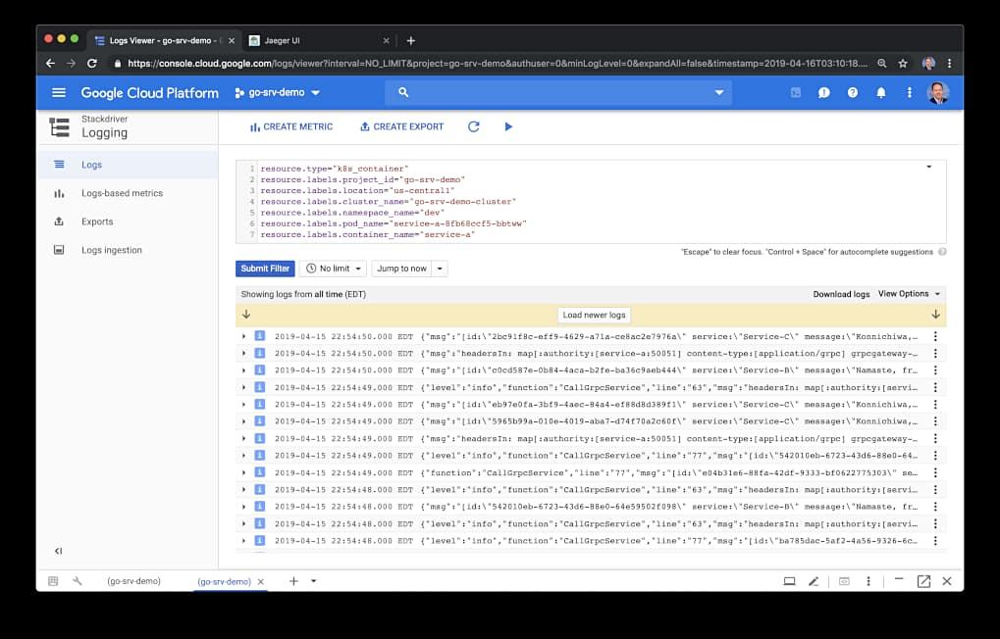

下图是一个特定日志条目的 JSON 有效负载的详细信息。在这个示例中，我们可以看到从下游服务传来的请求头。

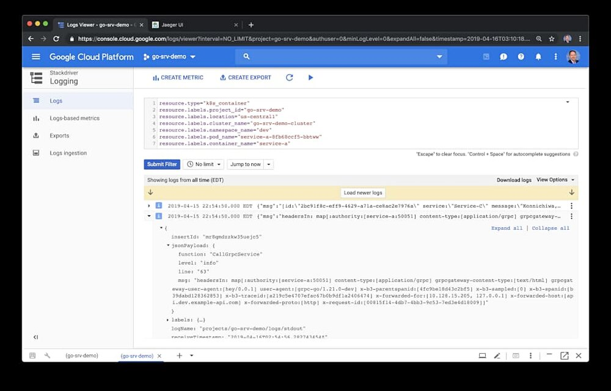

## 支柱 2: 度量

对基于 Go 语言的服务代码或 Kubernetes 资源的度量配置来说，从 HTTP JSON 转到 gRPC 不需要任何改变。

### Prometheus

[Prometheus](https://prometheus.io/) 是一个完全开源的社区驱动的系统监控和报警工具集，最初是在 2012 年左右在 SoundCloud 开发的。有趣的是，Prometheus 在 2016 年加入了[云原生计算基金会](https://cncf.io/) （CNCF），成为继[Kubernetes](http://kubernetes.io/)之后的第二个托管项目。

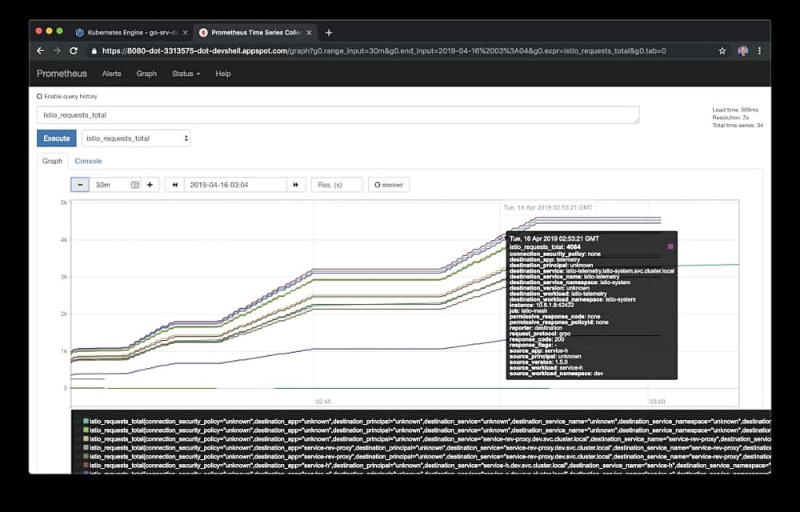

### Grafana

Grafana 将自己描述为时间序列分析开源软件的领袖。根据[Grafana Labs](https://grafana.com/grafana)的说法，Grafana 允许你查询、观测、提醒和理解指标，无论它们存储在哪里。你可以轻松地创建、探索和共享有丰富视图的数据驱动的仪表板。Grafana 允许用户为最重要的指标定义可视化的警报规则。Grafana 将持续评估规则并发送通知。

[Istio](https://istio.io/docs/tasks/telemetry/using-istio-dashboard/#about-the-grafana-add-on)的 Grafana 插件是 Grafana 的一个预配置的实例。Grafana Docker 基础镜像已经修改为带有 Prometheus 数据源和安装好的 Istio 仪表板。下图展示了看到的两个预先配置的仪表板：Istio Mesh 仪表板和 Istio 性能仪表板。

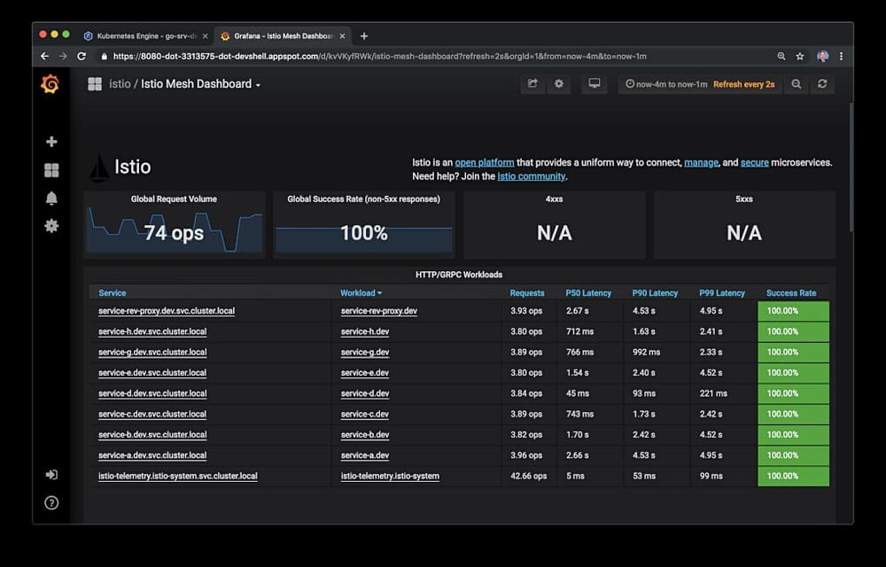
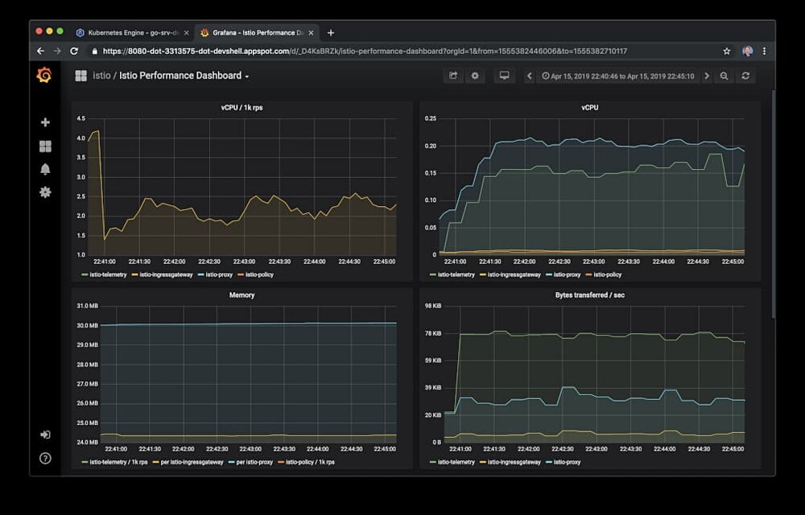

## 支柱 3: 追踪

从 HTTP 的 JSON 迁移到 gRPC 确实需要重写服务代码中的追踪逻辑。事实上，我花了大部分时间来确保报头的正确性，它从 Istio Ingress 网关传播到 gRPC 网关反向代理、再到 gRPC 上下文中的服务 A，以及上游到所有依赖的、基于 gRPC 的服务。我确信在我当前的代码中有许多关于正确处理追踪以及如何在服务调用堆栈中传播这些信息的优化。

### Jaeger

根据网站的介绍，[Jaeger](https://www.jaegertracing.io/docs/1.10/)是受[Dapper](https://research.google.com/pubs/pub36356.html) 和[OpenZipkin](http://zipkin.io/)的启发，由[Uber Technologies](http://uber.github.io/)公司发布的一个开源分布式追踪系统。它用于监控和排查基于微服务的分布式系统，包括分布式上下文传播、分布式事务监控、故障根本原因分析、服务依赖关系分析以及性能和延迟优化。Jaeger[网站](https://www.jaegertracing.io/docs/1.10/architecture/)有一篇非常好的有关 Jaeger 架构和通用追踪相关术语的概述文章。

下面看到的是一个 Jaeger UI 追踪视图。在其中有一系列由[hey](https://github.com/rakyll/hey)生成的追踪数据，hey 是一个流行的负载生成器和基准测试工具，是 Apache Bench（ab）的一个有价值的替代品。与 ab 不同的是 hey 支持 HTTP/2。在前一篇文章中详细介绍了 hey 的用法。


你可能还记得，一个追踪数据是贯穿系统的执行路径，可以认为是一个 span 的[有向无环图](https://en.wikipedia.org/wiki/Directed_acyclic_graph) （DAG）。如果你使用过 Apache Spark 这样的系统，那么你可能已经很熟悉 DAG 了。

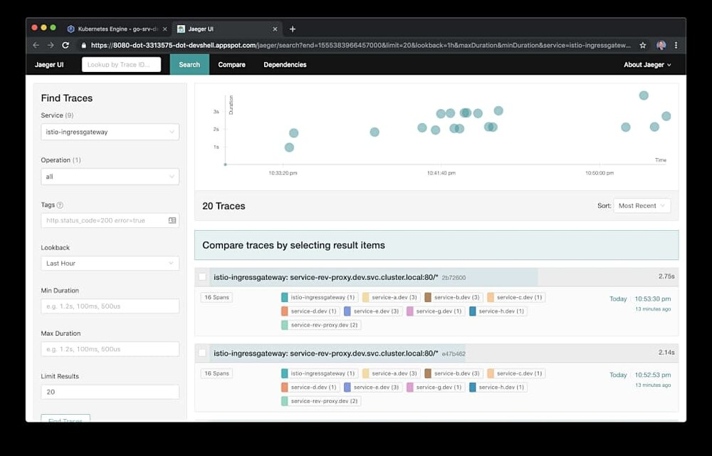

下面是 Jaeger UI Trace 的详细视图。示例的追踪信息包含了 16 个 span，其中包含 9 个组件——7 个基于 go 的服务、一个反向代理和一个 Istio Ingress 网关。每个追踪和 span 都有时间点。追踪中的根 span 是 Istio Ingress 网关。在这个演示中，追踪没有在 RabbitMQ 消息队列埋点。这意味着您不会看到包含服务 D 到服务 F 之间通过 RabbitMQ 进行解耦的、基于消息通信的追踪信息。

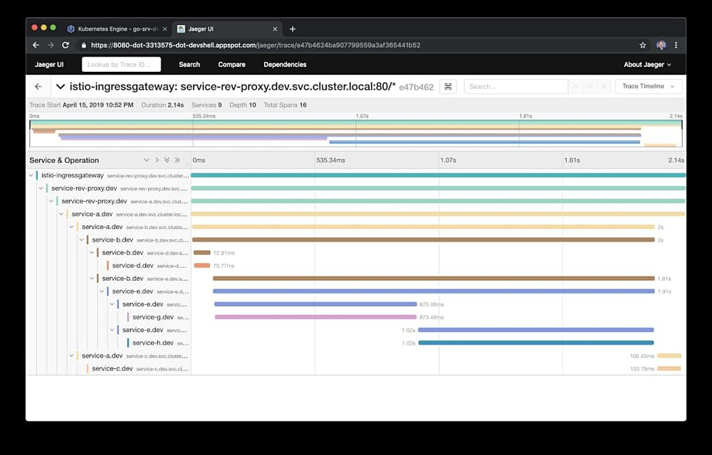

在 Jaeger UI Trace 详细视图中，您还可以植入一个包含额外元数据的单个 span。元数据包括被调用的 URL、HTTP 方法、响应状态和其他几个报头。

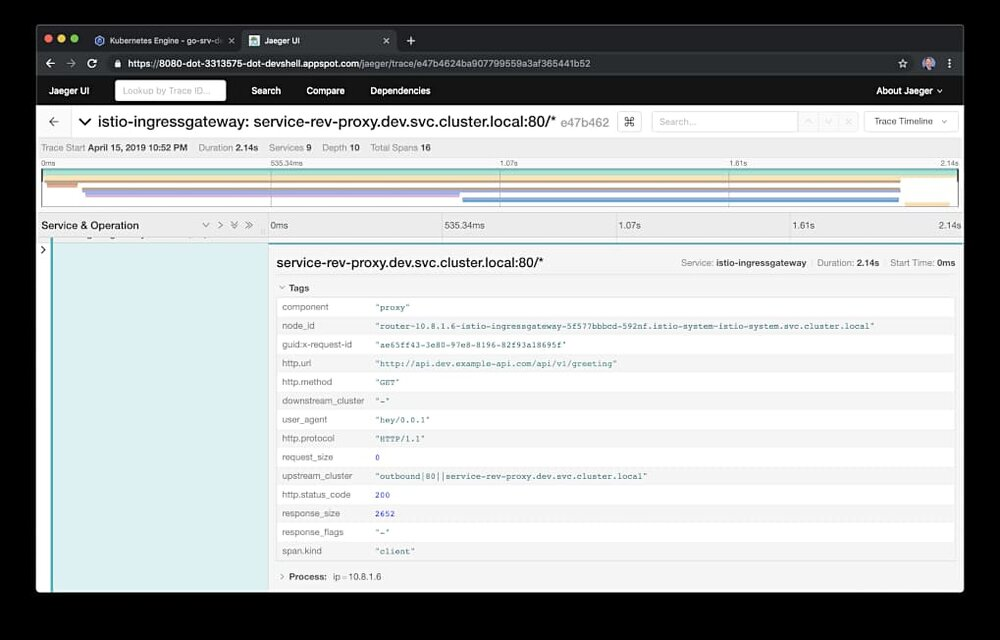

## 微服务的可观察性

对基于 Go 语言的服务代码或 Kubernetes 资源的 Kiali 配置来说，从 HTTP JSON 转到 gRPC 不需要任何改变。

### Kiali

根据他们的[网站](https://www.kiali.io/documentation/overview/)描述，Kiali 提供了以下问题的答案：Istio 服务网格中的微服务是什么？它们是如何连接的？Kiali 基于在 OpenShift 或 Kubernetes 平台的 Istio 运行，提供服务网格拓扑监测、断路器、请求速率等特性的可见性。它提供了从抽象的应用到服务和工作负载等不同级别的网格组件的视图。

Kiali UI 中的图形视图是运行在 Istio 服务网格中的组件的可视化表示。下图显示了过滤集群的 dev 命名空间，可以注意到 Kiali 已经映射了平台中的所有组件，以及丰富的元数据，比如它们的版本和通信协议。

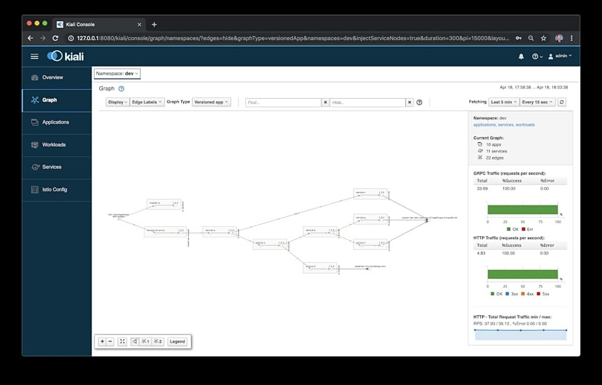

使用 Kiali，我们可以确认服务到服务的 IPC 协议现在已经由 gRPC 替换了之前的 HTTP。

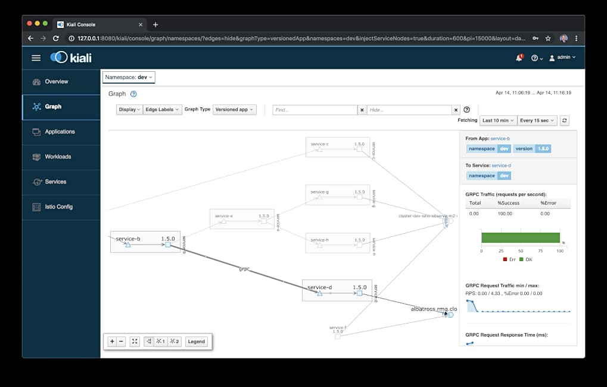

## 总结

尽管将 HTTP JSON 转换为基于 gRPC 的 protocol buffers 需要对服务进行大量的代码更改，但这并不影响我们使用 Istio 提供的工具 (包括 Prometheus、Grafana、Jaeger 和 Kiali) 对服务进行观测。

*本文所有观点均为原创，和我之前的雇主和其客户无关。*
