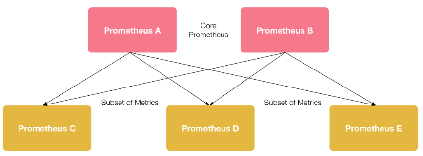

## 前言

可观测性一词诞生于几十年前的控制理论，指系统可以由其外部输出推断其内部状态的程度。近年来，随着微服务、容器化、serverless 等多种技术架构的出现，应用的构建部署与实施运行都发生了巨大转变，服务链路错综复杂、微服务与分布式趋势增强、环境容器化等一系列变化促使可观测性在云原生体系中占据着重要的作用。通常，可观测性分为 Metrics (指标)、Tracing (追踪)、Logging (日志)三部分。

Logging 是在特定时间发生的事件的文本记录，包括说明事件发生时间的时间戳和提供上下⽂的有效负载。Metrics 是通过数据的聚合，对特定时间内的行为进行衡量，指标数据是可累加的，可以观察系统的状态和趋势。Tracing面向请求，表示请求通过分布式系统的端到端的调用旅程，可以分析出请求中的异常点或故障的原因。

Istio 为网格内所有的服务通信生成详细的遥测数据。这种遥测技术让 Isito 提供了服务行为的可观察性，使运维人员能够排查故障、维护和优化应用程序，而不会给服务的开发人员带来任何额外的负担。 在 Istio1.7 版本之前，安装 Istio 时也会默认安装可观测性插件 Kiali、Prometheus、Jaeger 等。而在 Istio1.7 及其后面的版本，将不再安装这些可观测性插件。需要手动使用以下命令进行安装：

```bash
kuebctl apply -f sample/addons/
```

## Metrics

### Prometheus 抓取 Isito 配置

Istio 使用 Prometheus 采集 Metrics， envoy 数据面标暴露端口为 15020 、暴露路径为 stats/prometheus 。Istiod 控制面指标暴露端口为 15014 ，路径为 metrics。Istio 会为 envoy 和 istiod 添加 annotation，然后 Prometheus 通过这些 annotation 进行服务发现，来实时抓取注入了 envoy 的服务，以及 istiod 的指标信息。

在服务在注入 envoy 时，会为 pod 自动添加以下 annotation (该功能可以通过 --set meshConfig.enablePrometheusMerge=false 来禁用，默认开启)：

```
prometheus.io/path: /metrics
prometheus.io/port: 9100
prometheus.io/scrape: true
```

在创建 istiod 时，也会为为 istiod 的 pod 添加添加以下 annotation：

```
prometheus.io/port: 15014
prometheus.io/scrape: true
```

Prometheus 通过 kuberneters_sd_configs 配置服务发现对 Istio 指标信息进行抓取。

```yaml
kubernetes_sd_configs:
  - role: pod
  relabel_configs:
    - action: keep
      regex: true
      source_labels:
        - __meta_kubernetes_pod_annotation_prometheus_io_scrape
    - action: replace
      regex: (https?)
      source_labels:
        - __meta_kubernetes_pod_annotation_prometheus_io_scheme
      target_label: __scheme__
    - action: replace
      regex: (.+)
      source_labels:
        - __meta_kubernetes_pod_annotation_prometheus_io_path
      target_label: __metrics_path__
    - action: replace
      regex: ([^:]+)(?::\d+)?;(\d+)
      replacement: $1:$2
      source_labels:
        - __address__
        - __meta_kubernetes_pod_annotation_prometheus_io_port
      target_label: __address__
    - action: labelmap
      regex: __meta_kubernetes_pod_label_(.+)
    - action: replace
      source_labels:
        - __meta_kubernetes_namespace
      target_label: kubernetes_namespace
    - action: replace
      source_labels:
        - __meta_kubernetes_pod_name
      target_label: kubernetes_pod_name
    - action: drop
      regex: Pending|Succeeded|Failed|Completed
      source_labels:
        - __meta_kubernetes_pod_phase
```

__meta_kubernetes_pod_annotation表示 pod 中 annotation 的值，与 Istio 组件中 annotation 对应。Prometheus 默认采集指标信息的端口为 9090，默认采集指标信息的路径为 /metrics ，与 Istio 提供的指标信息不同，因此需要通过 relabel_configs 进行重新标记，以暴露为 Istio 指标实际的端口与路径。同时也会保持 pod 中的原有 label 信息，以及对 pod 的状态进行筛选。

此外，对于独立部署 Prometheus 的情况，可以根据以上内容对 Prometheus 进行配置。

### 自定义Metrics

在实际情况中，Istio 自身提供的指标可能不能够满足需求，需要对已有指标进行修改，又或者需要添加新的指标信息时，Istio 支持自定义 metrics。

Istio 使用 EnvoyFilter 来自定义 Istio Pilot 生成的 Envoy 配置。使用 EnvoyFilter 可以修改某些字段的值，添加特定的过滤器，监听器等。在一个 namespace 下可以存在多个 EnvoyFilter，将按创建顺序依次处理所有 EnvoyFilter。在 EnvoyFilter 中可以进行 INBOUND、OUTBOUND、GATEWAY 三个维度的过滤设置。

下面的示例将在 istio_request_total 这一指标中，添加 request.host 以及 destination.port 两个维度的信息，同时在 bookinfo 的 review 服务中，根据 request 的请求信息，添加 request_operation 的维度信息。

首先创建一个 EnvoyFilter 过滤器，根据 bookinfo 中 reviews 请求的 path 以及 method，对 istio_operationId 分别提供了 ListReviews、GetReview、CreateReview 三种不同类型的值。WorkloadSelector 对应用此补丁配置的 Pods/VMs 组进行选择，如果省略此参数会将此补丁应用在同一 namespace 下所有的工作负载。configPathchs 用于定义一个或多个具有匹配条件的补丁。

```yaml
apiVersion: networking.istio.io/v1alpha3
  kind: EnvoyFilter
  metadata:
    name: istio-attributegen-filter
  spec:
    workloadSelector:
      labels:
        app: reviews
    configPatches:
      - applyTo: HTTP_FILTER
        match:
          context: SIDECAR_INBOUND
          proxy:
            proxyVersion: '1\.12.*'
          listener:
            filterChain:
              filter:
                name: "envoy.http_connection_manager"
                subFilter:
                  name: "istio.stats"
        patch:
          operation: INSERT_BEFORE
          value:
            name: istio.attributegen
            typed_config:
              "@type": type.googleapis.com/udpa.type.v1.TypedStruct
              type_url: type.googleapis.com/envoy.extensions.filters.http.wasm.v3.Wasm
              value:
                config:
                  configuration:
                    "@type": type.googleapis.com/google.protobuf.StringValue
                    value: |
                      {
                        "attributes": [
                          {
                            "output_attribute": "istio_operationId",
                            "match": [
                              {
                                "value": "ListReviews",
                                "condition": "request.url_path == '/reviews' && request.method == 'GET'"
                              },
                              {
                                "value": "GetReview",
                                "condition": "request.url_path.matches('^/reviews/[[:alnum:]]*$') && request.method == 'GET'"
                              },
                              {
                                "value": "CreateReview",
                                "condition": "request.url_path == '/reviews/' && request.method == 'POST'"
                              }
                            ]
                          }
                        ]
                      }
                  vm_config:
                    runtime: envoy.wasm.runtime.null
                    code:
                      local: { inline_string: "envoy.wasm.attributegen" }
```

然后在 stats-filter-1.12.yaml 添加以下配置(示例使用 Istio 版本为 1.12)，为request_total指标添加istio_operation、request_host、destination_port这三个维度信息。

```yaml
name: istio.stats
  typed_config:
    '@type': type.googleapis.com/udpa.type.v1.TypedStruct
    type_url: type.googleapis.com/envoy.extensions.filters.http.wasm.v3.Wasm
    value:
      config:
        configuration:
          "@type": type.googleapis.com/google.protobuf.StringValue
          value: |
            { 
              "metrics": [ 
              { 
                "name": "requests_total", 
                "dimensions": 
                {
                  "request_operation": "istio_operationId" 
                  "destination_port": string(destination.port) 
                  "request_host": request.host
                } 
              }] 
            }
```

最后在 meshconfig 下开启 extraStatTags，将 istio_operationId、request_host、destination_port 信息写入。

```yaml
apiVersion: v1
  data:
    mesh: |-
      defaultConfig:
        extraStatTags:
        - destination_port
        - request_host
        - request_operation
```

查询 istio_request_total 指标可以看到如下指标维度，表示配置成功。

```
istio_requests_total{app="reviews",destination_port="9080",request_host="reviews:9080",request_operation="GetReview",......}
```

### Prometheus Federation对Istio多集群的支持

在 Istio 多集群场景下，每个集群会部署独立的 Prometheus 收集自身的指标信息，在需要将多集群指标进行聚合以及提供统一的 Prometheus 访问地址时，会使用 Prometheus Federation 将多集群数据聚合到一个独立的 Prometheus 实例上。



在聚合 Prometheus 实例中添加类似配置即可：

```yaml
scrape_configs:
  - job_name: 'federate'
    scrape_interval: 15s
    honor_labels: true
    metrics_path: '/federate'
    params:
      'match[]':
        - '{job="<job_name>"}'
    static_configs:
      - targets:
          - 'source-prometheus-1:9090'
          - 'source-prometheus-2:9090'
          - 'source-prometheus-3:9090'
```

## Tracing

Istio 推荐的分布式追踪工具 Jaeger、Zipkin 都通过 OpenTracing 规范进行实现。在分布式追踪里，存在 Trace 和 Span 两个重要概念：

* Span：分布式追踪的基本组成单元，表示一个分布式系统中的单独的工作单元，每一个 Span 可以包含其它 Span 的引用。多个 Span 在一起构成了 Trace。
* Trace：微服务中记录的完整的请求执行过程，一个完整的 Trace 由一个或多个 Span 组成。

Istio 代理能够自动发送 Span，但是需要附加如下 HTTP 请求头信息，这样才能把多个 Span 正确的关联到同一个追踪上。

* x-request-id
* x-b3-traceid
* x-b3-spanid
* x-b3-parentspanid
* x-b3-sampled
* x-b3-flags
* x-ot-span-context

### 自定义Tracing配置

Istio可以对不同的pod进行不同全链路追踪的配置。通过给POD添加名为proxy.istio.io/config的annotation，来配置该Pod的追踪采样率、自定义tag等。

```yaml
metadata:
  annotations:
    proxy.istio.io/config: |
      tracing:
        sampling: 10
          custom_tags:
            my_tag_header:
              header:
                name: host
```
也可以通过 meshconfig 进行全局的 tracing 配置。

```yaml
apiVersion: v1
  data:
    mesh: |-
      defaultConfig:
        tracing:
          sampling: 1.0
          max_path_tag_length: 256
          custom_tags:
            clusterID:
              environment:
                name: ISTIO_META_CLUSTER_ID
```

需要注意的是，以上配置必须重启服务才能生效，这是因为 config 作用的时间点是 Istio 注入 sidecar 的时候，这样配置的 tracing，对于 Envoy 来说，是放在了 bootstrap 配置里面，不能在线变更和修改。

## Logging

Istio 可以检测到网格内的服务通信的流转情况，并生成详细的遥测数据日志。默认情况下，Istio 通过 meshConfig.accessLogFile=/dev/stdout 开启了 Envoy 访问日志，日志信息可以经过 stdout 标准输出。此外，也可以使用 accessLogEncoding 和 accessLogFormat 设置日志格式。

Envoy 日志可以使用 kubectl logs 命令进行查看，但是当 Pod 被销毁后，旧的日志将不复存在，如果要查看历史的的日志数据，需要使用 EFK、Loki 等工具对日志进行持久化。

## Istio可视化

Kiali 是 Istio 服务网格可视化工具，提供了服务拓补图、全链路跟踪、指标遥测、配置校验、健康检查等功能。Kiali 需要 Prometheus 为其提供指标信息，还可以配置 Jaeger 和 Grafana ，实现分布式追踪和监控数据可视化。

默认情况下，Kiali 使用 prometheus.isito-system:9090 作为其 Prometheus 数据源。当不使用 Istio 提供的 sample/addon，独立部署 Prometheus 时，需要在 Kiali 的 configmap 中添加以下配置：

```yaml
spec:  
  external_services:    
	prometheus:
	  url: <prometheus实际地址>
```

此外，如果需要在 Kali 中加入分布式追踪和监控数据可视化的功能，也可以在 external_services 下配置 Jaeger 和 Grafana 的实际地址。

### Kiali多集群支持

Kiali 默认开启 Istio 多集群支持，若需要关闭此支持，可以进行如下设置：

```yaml
spec:  
  kiali_feature_flags:    
	clustering:      
	  enabled: false
```

通常，每个 istiod 控制面上会部署一个 Kiali。在 Isito 多集群主从模式下，只有主机群上部署了 Kiali，从集群上对应用的访问，此时通过 Kiali 是不能够查询到对应流量信息的。需要为主从集群的 Prometheus 进行联邦配置，这样才能够查询到从集群自身的指标流量信息。

## 参考文献

- [EnvoyFilter - lib.jimmysong.io](https://lib.jimmysong.io/istio-handbook/config-networking/envoy-filter/)
- [Classifying Metrics Based on Request or Response - istio.io](https://istio.io/latest/docs/tasks/observability/metrics/classify-metrics/)
- [Istio 服务网格与全链路追踪的全方位攻略 - zhuanlan.zhihu.com](https://zhuanlan.zhihu.com/p/513448061)
- [可观测性（一）- blog.csdn.net](https://blog.csdn.net/A13581861752/article/details/124311885)