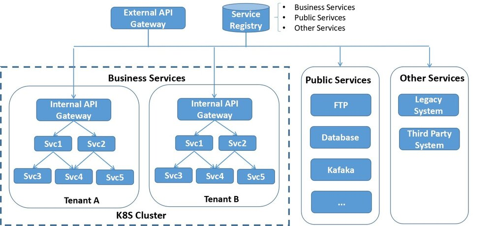

Istio 发布 1.0 版本后，其服务发现和路由规则功能已基本具备 production 能力，我们也开始了 Istio 和公司内部微服务平台的集成工作，打算以 Istio 为基础打造一个微服务管控中心，在这里把目前的进展和遇到的坑和大家分享一下。

## 现有系统架构

目前公司的微服务架构如图所示，系统中主要包含三类服务：

- 业务服务，大部分的业务服务都已经实现了微服务化和无状态，采用 docker 容器部署在 K8s 集群中，利用 K8s 的容器管理能力进行服务部署，弹缩。但也有部分服务只做了容器化，但并未进行微服务改造，此类服务属于 SOA 架构，一个服务可能对外暴露多个业务 API，这和敖小剑老师在[《SOFAMesh 中的多协议通用解决方案》](http://www.servicemesher.com/blog/x-protocol-common-address-solution/)系列文章中提到的情况是类似的。
- 一些有状态的公共服务，例如数据库，FTP 服务器，共享缓存等，目前未放入到 K8s 集群中，但业务服务对这些公共服务存在大量的依赖。
- 其他未纳入 K8S 集群的服务，如遗留系统和第三方系统提供的服务。某些业务服务和这些服务之间存在互相访问的需求。

## 服务注册

电信领域与 IT 领域相比有一些特殊性，其中一点就是多网络平面的需求。多网络平面是电信领域的一个术语，通俗来讲就是系统中存在多个网络。采用多个网络的目的一般是为了管理原因，例如管理系统采用一个网络进行通信，而应用之间的通信在另一个网络上，这多个网络之间是相互隔离的。

采用多网络平面后，和标准的 K8S 网络模型有所不同，标准的 K8S 集群中的一个 Pod 上只会有一个网络接口。我们的 PaaS 对 K8S 的网络进行了扩展，使其支持多个网络，即一个 Pod 上可以有多个网络接口（该解决方案已开源，参见[https://github.com/ZTE/Knitter](https://github.com/ZTE/Knitter)）。

由于需要支持多网络平面，我们开发了自己的服务注册系统，该服务注册系统中同时包含了 K8s 租户中的微服务，公共服务和外部服务的所有服务相关信息。服务注册系统通过 REST 接口对外提供服务注册接口，也提供管理界面。K8S 集群中的服务启动后通过代理检测并自动注册，外部服务可以通过管理界面注册，也可以开发第三方代理进行注册。

采用了定制的服务注册系统后的另一个优势是 K8S 中部署的运行实例和注册的服务关系是很灵活的，一个运行实例可以注册多个服务，以支持尚未进行微服务改造的 SOA 类型的应用。

## 服务发现

系统内部服务之间采用客户端发现机制，先通过服务发现接口从 Service Registry 中查询到对端服务地址再发起请求。平台提供了封装好的 SDK 提供给应用微服务使用，SDK 中封装了服务发现以及 LB，重试，断路等服务底层通讯机制。

## API Gateway

系统外部对内的调用通过 API Gateway 进入，采用服务端服务发现机制。服务名编码在请求 URL 中，API Gateway 解析 URL 得到服务名后，再根据 Service Registry 的服务注册信息进行分发。

根据 PaaS 的部署场景，系统可以采用 1 级或者 2 级 API Gateway 进行请求分发。单租户场景下采用 1 级 API Gateway；多租户场景下可采用 2 级 API Gateway。第一级的 Gateway 在 K8S 集群外，是整个系统的总入口，负责分流 K8s 不同租户以及外部服务的流量。第二级 Gateway 在 K8S 租户中，是租户内服务的请求入口。两级 API Gateway 都从 Service Registry 获取服务信息，考虑到安全和效率因素，每个 Gateway 只能拉取和自己负责部分的服务信息。

API Gateway 支持虚拟主机，提供 4 层和 7 层的 LB。除此以外，API Gateway 被设计为一个可插拔的平台，可以采用插件方式进行扩展，目前实现了下述插件功能：

- 对外部请求进行性能数据收集和统计分析。
- 调用认证服务对外部请求进行登录验证。
- 实现了限流、熔断、黑白名单等功能。
- 可以通过分流规则实现应用的灰度发布。

## 痛点

- 在系统的初始阶段，大部分的微服务都是基于 JAVA 编写的，我们通过 SDK 封装了服务发现，重试，限流，熔断等用于服务间点对点通讯的逻辑提供给各个业务微服务使用。但随着系统的发展，越来越多微服务开始采用 Golang 编写，还有相当一部分基于 Python 的微服务，而且作为一个平台，可以预见到将来还可能会有更多其他语言。为每一种语言编写一套 SDK 的方案渐渐变得难以维护。将微服务的通讯层下沉到 Mesh 层是一个趋势。
- 在 API Gateway 处可以对外部请求的性能数据进行统计分析，但无法对系统内部各个微服务之间调用的性能数据进行收集处理。如果采用侵入式的方案，则需要在各个语言和框架中采用一套标准的接口，并且要针对不同语言编写对应的 SDK，维护工作量很大，而且对于业务微服务的编码有较大的限制，因此采用 sidecar 方式对微服务之间调用性能数据进行收集是一个更为合理的方式。
- 通过在 API Gateway 处使用分流规则来实现灰度发布的方案有较大限制，只能对应用整体进行分流，而无法对应用中的单个微服务的不同版本进行分流配置。因此基本上无法通过灰度发布来实现微服务粒度的快速升级迭代。

# Istio 集成方案

引入 Istio 后，系统架构如下图所示：

## 控制面

引入 Istio Pilot 提供服务发现和流量规则。Service Registry 是基于 Consul 自研的，由于 Pilot 已经支持 Consul 的适配器，因此可以很容易地将我们的 Service Registry 作为服务信息提供者集成到 Pilot 中。

提供用户界面对 Mesh 中的 traffic rule 进行配置，规则可以在设计应用蓝图时进行配置，也可以在运行期进行动态修改、添加和删除。

引入 Mixer 进行 Metrics 收集，后端连接到 Promeheus，打算采用自己开发界面对指标进行呈现。

目前采用 Zipkin 和 Envoy 直连进行分布式跟踪，后续可能改用 jaeger，因为 jager 采用了 open tracing 协议，开放性更好一些，而且是 go 编写的，和我们目前的技术栈匹配。

## 数据面

在各个业务微服务的 Pod 中加入 Envoy proxy，提供服务发现，可靠通讯，并根据 Pilot 下发的路由规则对服务通讯进行路由。

虽然 Istio 提供了 Ingress Gateway，但 Ingress Gateway 只是提供了一个虚拟主机和 Https 终结的功能，并不能满足我们的业务需求。因此我们决定继续采用自研的 API Gateway。但 API Gateway 的服务发现，LB 功能交给 Envoy 接管，并将 API Gateway 上已实现的限流、熔断、重试等规则切换为 Pilot 的 Traffic rule，改为由 Envoy 处理。处理方式是在 Internal API Gateway 处也部署一个 Envoy 代理。

## 目前的进展

1. 目前我们已经完成了 Pilot 和 Mixer 的集成，由于系统内部采用了是自己的安全方案，暂未考虑 Citadel 的集成。
2. 验证了服务发现，路由规则，Metrics 收集和 Distributed Tracing
3. 开发用户友好的界面对 Istio 的路由规则进行配置和管理。
4. 基于 Istio 的路由规则，结合 K8S 开发了微服务的在线灰度升级。

## 遇到的坑和待解决问题

1. Istio 不支持多网络平面，导致 Envoy 在进行服务转发时出现了死循环，环境中 Envoy 由于 File Descriptor 被耗光不停重启。这个问题隐藏较深，花了差不多两周时间定位和排除。我们正在基于 Istio 进行扩展以支持多网络平面，并准备向社区贡献这部分代码。
2. 社区没有给出 Mixer 如何在 K8S 外进行部署的详细文档，在部署 Mixer 时遇到了较多的坑。
3. Mixer 没有 Consul environment 的 Adapter，因此上报的 Metrics 中缺失部分 attribute，我们正在评估编写该适配器，并准备向社区贡献这部分代码。
4. Istio 目前主要支持的是 HTTP 和 GRPC，对于异步消息如 Kafaka 并未支持。而要完成一个业务级的端到端路由控制，异步消息是必不可少的一环，可喜的是 Envoy 社区已经有计划要对 Kafaka 进行支持。 (<https://github.com/envoyproxy/envoy/issues/2852>)
5. 对于 IT 应用来说，Service Mesh 面对的主要是用户（北向）流量和服务间（东西向）流量，但对于 CT 应用来说，还有很大一部分属于网元到管理系统（南向）的流量，这部分流量基本上都是采用的自定义协议，目前尚不能被 Istio 理解。敖小剑老师在 [《SOFAMesh 中的多协议通用解决方案 x-protocol 介绍系列（3）——TCP 协议扩展》](http://www.servicemesher.com/blog/x-protocol-tcp-protocol-extension/)介绍的阿里 SOFAMesh 的扩展方案已经提出了一个很好的思路。

## 参考阅读

1. [SOFAMesh 中的多协议通用解决方案 x-protocol 介绍系列（1）DNS 通用寻址方案](http://www.servicemesher.com/blog/x-protocol-common-address-solution/)
2. [SOFAMesh 中的多协议通用解决方案 x-protocol 介绍系列（2）快速解码转发](http://www.servicemesher.com/blog/x-protocol-rapid-decode-forward/)
3. [SOFAMesh 中的多协议通用解决方案 x-protocol 介绍系列（3）TCP 协议扩展](http://www.servicemesher.com/blog/x-protocol-tcp-protocol-extension/)
