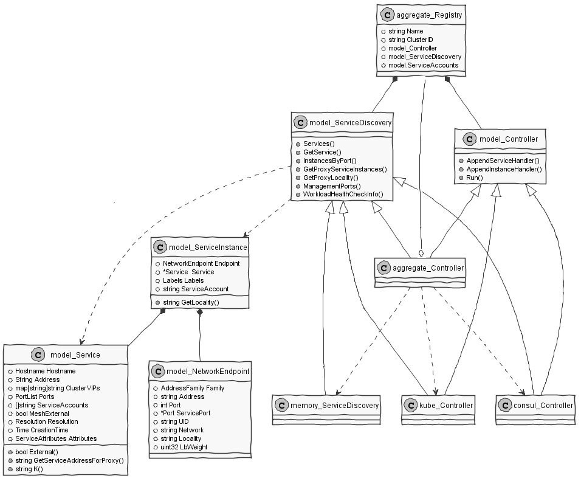
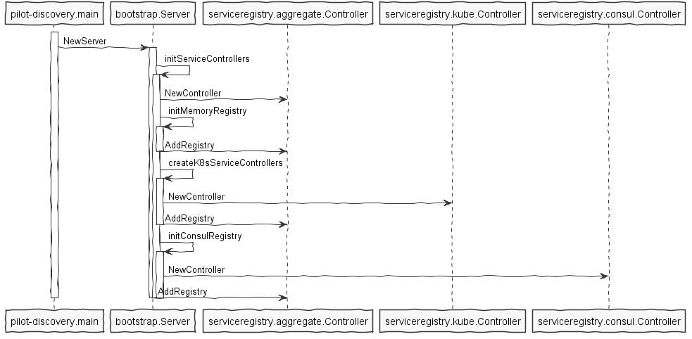
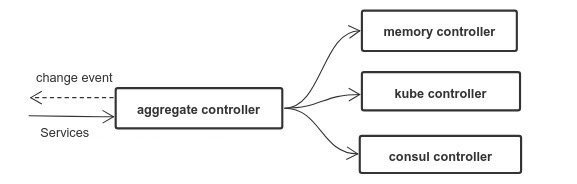

> 本文转载自[赵化冰的博客](https://zhaohuabing.com)。

在Istio架构中，Pilot组件负责维护网格中的标准服务模型，该标准服务模型独立于各种底层平台，Pilot通过适配器和各底层平台对接，以使用底层平台中的服务数据填充此标准模型。

例如Pilot中的Kubernetes适配器通过Kubernetes API Server到Kubernetes中的Service以及对应的Pod实例，将该数据被翻译为标准模型提供给Pilot使用。通过适配器模式，Pilot还可以从Cloud Foundry、Consul中获取服务信息，也可以开发适配器将其他提供服务发现的组件集成到Pilot中。

本文将从代码出发，对Pilot的服务注册机制进行分析。

备注： 本文分析的代码对应Istio commit 58186e1dc3392de842bc2b2c788f993878e0f123 

## 服务注册相关的对象

首先我们来了解一下Pilot中关于服务注册的一些基本概念和相关数据结构。

Istio源码中，和服务注册相关的对象如下面的UML类图所示。



## Service

源码文件：pilot/pkg/model/service.go

Service用于表示Istio服务网格中的一个服务（例如 catalog.mystore.com:8080）。每一个服务有一个全限定域名（FQDN）和一个或者多个接收客户端请求的监听端口。

一个服务可以有一个可选的 负载均衡器/虚拟IP，DNS解析会对应到该虚拟IP（负载均衡器的IP）上。 一般来说，不管后端的服务实例如何变化，VIP是不会变化的，Istio会维护VIP和后端实例真实IP的对应关系。

例如在Kubernetes中，服务 foo 的FQDN为`foo.default.svc.cluster.local`， 拥有一个虚拟IP 10.0.1.1，在端口80和8080上监听客户端请求。


```go
type Service struct {
        // Hostn/服务器名
        Hostname Hostname `json:"hostname"`

        // 虚拟IP / 负载均衡器 IP
        Address string `json:"address,omitempty"`

        // 如果服务部署在多个集群中，ClusterVIPs会保存不同集群中该服务对应的VIP
        ClusterVIPs map[string]string `json:"cluster-vips,omitempty"`

        // 服务端口列表
        Ports PortList `json:"ports,omitempty"`

        // 运行该服务的服务账号
        ServiceAccounts []string `json:"serviceaccounts,omitempty"`

        // 该服务是否为一个 “外部服务”， 采用 ServiceEntry 定义的服务该标志为true
        MeshExternal bool

        // 服务解析规则： 包括 
        // ClientSideLB: 由Envoy代理根据其本地的LB pool进行请求路由
        // DNSLB: 查询DNS服务器得到IP地址，并将请求发到该IP
        // Passthrough： 将请求发转发到其原始目的地
        Resolution Resolution

        // 服务创建时间
        CreationTime time.Time `json:"creationTime,omitempty"`

        // 服务的一些附加属性
        Attributes ServiceAttributes
}
```

## ServiceInstance

源码文件：pilot/pkg/model/service.go

SercieInstance中存放了服务实例相关的信息，一个Service可以对应到一到多个Service Instance，Istio在收到客户端请求时，会根据该Service配置的LB策略和路由规则从可用的Service Instance中选择一个来提供服务。

```go
type ServiceInstance struct {
        // Endpoint中包括服务实例的IP：Port，UID等
        Endpoint       NetworkEndpoint `json:"endpoint,omitempty"`
        // 对应的服务
        Service        *Service        `json:"service,omitempty"`
        // 该实例上的标签，例如版本号
        Labels         Labels          `json:"labels,omitempty"`
        // 运行该服务的服务账号
        ServiceAccount string          `json:"serviceaccount,omitempty"`
}
```


## Registry

源码文件： pilot/pkg/serviceregistry/aggregate/controller.go

Registry代表一个通过适配器插入到Pilot中的服务注册表，即Kubernetes，Cloud Foundry 或者 Consul 等具体后端的服务部署/服务注册发现平台。

Registry结构体中包含了Service Registry相关的一些接口和属性。
```go
type Registry struct {
        // 注册表的类型，例如Kubernetes, Consul, 等等。
        Name serviceregistry.ServiceRegistry
        // 某些类型的服务注册表支持多集群，例如Kubernetes，在这种情况下需要用CluterID来区分同一类型下不同集群的服务注册表
        ClusterID string
        // 控制器，负责向外发送该Registry相关的Service变化消息
        model.Controller
        // 服务发现接口，用于获取注册表中的服务信息
        model.ServiceDiscovery
}
```

Istio支持以下几种服务注册表类型：

源码文件： pilot/pkg/serviceregistry/platform.go

```go
// ServiceRegistry defines underlying platform supporting service registry
type ServiceRegistry string

const (
        // MockRegistry,用于测试的服务注册表，包含两个硬编码的test services
        MockRegistry ServiceRegistry = "Mock"
        // ConfigRegistry,可以从Configstore中获取定义的service registry，加入到Istio的服务列表中
        KubernetesRegistry ServiceRegistry = "Kubernetes"
        // 从Consul获取服务数据的服务注册表
        ConsulRegistry ServiceRegistry = "Consul"
        // 采用“Mesh Configuration Protocol”的服务注册表
        MCPRegistry ServiceRegistry = "MCP"
)
```

其中支持最完善的就是Kubernetes了，我在项目中使用了Consul，填坑的经验证明对Consul的支持只是原型验证级别的，要在产品中使用的话还需要对其进行较多的改进和优化。

注册表中最后一个类型是 MCP，MCP 是 “Mesh Configuration Protocol" 的缩写。 Istio 使用了 MCP 实现了一个服务注册和路由配置的标准接口，MCP Server可以从Kubernetes、Cloud Foundry、Consul等获取服务信息和配置数据，并将这些信息通过MCP提供给 MCP Client，即Pilot，通过这种方式，将目前特定平台的相关的代码从Pilot中剥离到独立的MCP服务器中，使Pilot的架构和代码更为清晰。MCP将逐渐替换目前的各种Adapter。更多关于MCP的内容参见：

* https://docs.google.com/document/d/1o2-V4TLJ8fJACXdlsnxKxDv2Luryo48bAhR8ShxE5-k/edit
* https://docs.google.com/document/d/1S5ygkxR1alNI8cWGG4O4iV8zp8dA6Oc23zQCvFxr83U/edit

## Controller

源码文件： pilot/pkg/model/controller.go

Controller抽象了一个Service Registry变化通知的接口，该接口会将Service及Service Instance的增加，删除，变化等消息通知给ServiceHandler。

调用Controller的Run方法后，Controller会一直执行，将监控Service Registry的变化，并将通知注册到Controller中的ServiceHandler中。

```go
type Controller interface {
        // 添加一个Service Handler，服务的变化会通知到该Handler
        AppendServiceHandler(f func(*Service, Event)) error

        // 添加一个Service Instance Handler， 服务实例的变化会通知到该Handler
        AppendInstanceHandler(f func(*ServiceInstance, Event)) error

        // 启动Controller的主循环，对Service Catalog的变化进行分发
        Run(stop <-chan struct{})
}
```
## ServiceDiscovery

源码文件： pilot/pkg/model/service.go

ServiceDiscovery抽象了一个服务发现的接口，可以通过该接口获取到Service Registry中的Service和Service Instance。
```go
type ServiceDiscovery interface {
        // 列出该Service Registry中的所有服务
        Services() ([]*Service, error)

        // 根据主机名查询服务
        // 该接口已废弃
        GetService(hostname Hostname) (*Service, error)

        // 根据主机名，服务端点和标签查询服务实例
        InstancesByPort(hostname Hostname, servicePort int, labels LabelsCollection) ([]*ServiceInstance, error)
		
		// 查询边车代理所在节点上的服务实例 
		GetProxyServiceInstances(*Proxy) ([]*ServiceInstance, error)
		
		// 获取边车代理所在的Region,Zone和SubZone
        GetProxyLocality(*Proxy) string
        
		// 管理端口，Istio生成的配置会将管理端口的流量排除，不进行路由处理
        ManagementPorts(addr string) PortList

        // 列出用于监控检查的探针
        WorkloadHealthCheckInfo(addr string) ProbeList
}
```

## Service Registry初始化流程

Service Registry初始化的主要逻辑在Pilot-discovery程序的主函数中，对应的源码为：`pilot/cmd/pilot-discovery/main.go`和`pilot/pkg/bootstrap/server.go`。

在`pilot/pkg/bootstrap/server.go`中，初始化了各种Service Registry，其流程如下图所示：
（备注： MCP Registry尚在开发过程中）



Pilot将各个Service Registry(Memory, Kube, Consul)保存在serviceregistry.aggreagete.Controller中进行统一管理，Pilot会从所有类型的Registry中查询服务和服务实例，并监控所有Registry的数据变化,当Registry数据变化后，Pilot会清空其内部的缓存并通过ADS接口向Envoy推送更新。



> 备注：上图中的controller实际上是Service Registry，aggregate controller和具体的各个类型的controller同时实现了Registry要求的controller和discovery interface。

Registry的业务逻辑在Kube Controller和Consul controller中，我们主要使用了Consul Controller， 其主要方法如下：

源码文件： pilot/pkg/serviceregistry/consul/controller.go

```go
▼+Controller : struct
    [fields]
   -client : *api.Client
   -monitor : Monitor
    [methods]
   +AppendInstanceHandler(f func(*model.ServiceInstance, model.Event)) : error
   +AppendServiceHandler(f func(*model.Service, model.Event)) : error
   +GetIstioServiceAccounts(hostname model.Hostname, ports []int) : []string
   +GetProxyServiceInstances(node *model.Proxy) : []*model.ServiceInstance, error
   +GetService(hostname model.Hostname) : *model.Service, error
   +InstancesByPort(hostname model.Hostname, port int, labels model.LabelsCollection) : []*model.ServiceInstance, error
   +ManagementPorts(addr string) : model.PortList
   +Run(stop chan )
   +Services() : []*model.Service, error
   +WorkloadHealthCheckInfo(addr string) : model.ProbeList
   -getCatalogService(name string, q *api.QueryOptions) : []*api.CatalogService, error
   -getServices() : map[string][]string, error
    [functions]
   +NewController(addr string, interval time.Duration) : *Controller, error
```
可以看到Consul Controller对象同时实现了Registry要求的Controller和ServiceDiscovery接口，可以提供Registry的变化通知和服务查询相关功能。

目前Consul Controller的实现比较简单粗暴，定时通过Consul的Rest API获取服务数据并和上一次的查询结果进行对比，如果数据发生了变化则通知Pilot discovery进行更新。该方式发起了大量对Consul Server的HTTP请求，会导致Consul Server CPU占用率高和大量TCP Socket处于TIME_WAIT状态，不能直接在产品环境下使用。

源码文件： pilot/pkg/serviceregistry/consul/monitor.go

```go
//定时轮询Consul Server Rest接口，以获取服务数据变化
func (m *consulMonitor) run(stop <-chan struct{}) {
        ticker := time.NewTicker(m.period)
        for {
                select {
                case <-stop:
                        ticker.Stop()
                        return
                case <-ticker.C:
                        m.updateServiceRecord()
                        m.updateInstanceRecord()
                }
        }
}

//比较这一次和上一次的服务数据，如有变化则回调ServiceHandler进行通知
func (m *consulMonitor) updateServiceRecord() {
        svcs, _, err := m.discovery.Catalog().Services(nil)
        if err != nil {
                log.Warnf("Could not fetch services: %v", err)
                return
        }
        newRecord := consulServices(svcs)
        
        if !reflect.DeepEqual(newRecord, m.serviceCachedRecord) {
                // This is only a work-around solution currently
                // Since Handler functions generally act as a refresher
                // regardless of the input, thus passing in meaningless
                // input should make functionalities work
                //TODO
                obj := []*api.CatalogService{}
                var event model.Event
                for _, f := range m.serviceHandlers {
                        go func(handler ServiceHandler) {
                                if err := handler(obj, event); err != nil {
                                        log.Warnf("Error executing service handler function: %v", err)
                                }
                        }(f)
                }
                m.serviceCachedRecord = newRecord
        }
}
```

我们在Consul Registry中增加了缓存，并降低了Pilot轮询Consul server的频率，以减少Pilot频繁调用给Consul server带来的大量压力，下一步打算采用Consul watch来代替轮询，优化Consul Registry的服务变化通知机制。
