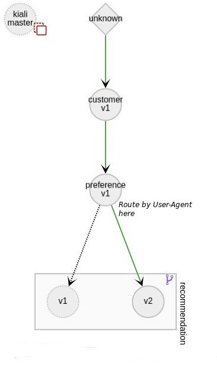

本文为翻译文章，[点击查看原文](https://medium.com/jaegertracing/istio-routing-using-opentracing-baggage-distributed-context-propagation-ed8d787a4bef)。

现代服务网格架构提供了很多的新功能，基础设施相关的依赖部分被逐步从代码中移除，极大的降低了编码工作量。除此之外，这一架构的智能路由功能还把金丝雀发布以及类似功能大大的简化了。

接下来的内容会探讨一下，Istio 路由规则是如何使用 OpenTracing Baggage 的。



想像一个场景，这个场景中我们需要通过 `User-Agent` Header 来鉴别 Safari 用户，并把它们重定向到服务的一个特定版本去。这是一个典型的金丝雀场景：新版本发布时，首先开放给一部分用户。然而很明显只有第一个服务能够接收到 `User-Agent` 头，如果路由规则中涉及到调用关系图中位置较低（靠后）的服务，就不得不把这个 Header 信息传播给所有途中经过的服务。这是一个分布式上下文传播的典型用例，很多跟踪系统都有这个功能。我们接下来会看看 Jaeger 的 OpenTracing 实现。

Baggage 条目是字符串组成的键值对，和 `Span/SpanContext` 互相关联，在一个 Trace 的范围内，会在所有的下游 Span 中进行传播。

如果你的网格中使用的是 OpenTracing，那么就已经有这个功能了；如果不是，那就有点不幸了：需要通过其他的跟踪 Header 来传递 `User-Agent` 值了，这样就需要修改途经的所有服务。

Istio 缺省使用的 B3 传播是没有提供 Baggage 头的。但是可以用 Brave（Zipkin 的 Java 客户端）来配置 Baggage 支持。一般会使用 `baggage-key:value` 的格式。Jaeger 实现了一个 B3 解码器，也用同样的格式来处理 Baggage。可以在这里查看 B3 Baggage 实现的进度。

## Demo

可以在当前的活动 Span 中这样设置 Baggage：

```java
tracer.activeSpan().setBaggageItem("user-agent", userAgent);
```

这必须在第一个服务中完成。最后一个需要完成的任务就是定义一个识别 Baggage Header 的路由。下面的路由定义会查看请求是否包含了带有 `user-agent:Safari` 条目的 Baggage，如果有，就进行转发：

```yaml
apiVersion: config.istio.io/v1alpha2
kind: RouteRule
metadata:
  name: recommendation-safari
spec:
  destination:
    namespace: tutorial
    name: recommendation
  precedence: 2
  match:
    request:
      headers:
        baggage-user-agent:
          regex: ".*Safari.*"  
  route:
  - labels:
      version: v2
```

如果是新版本的 Istio（0.8.0 以后）：

```yaml
apiVersion: networking.istio.io/v1alpha3
kind: VirtualService
metadata:
  name: recommendation-safari
spec:
  hosts:
  - recommendation
  http:
  - match:
    - headers:
        baggage-user-agent:
          regex: ".*Safari.*"
    route:
     - destination:
        host: recommendation
        subset: v2
---
apiVersion: networking.istio.io/v1alpha3
kind: DestinationRule
metadata:
  name: recommendation-destination
spec:
  host: recommendation
  subsets:
  - name: v2
    labels:
      version: v2
```

现在所有的配置都已经完成，Safari 用户会被重定向到推荐的 v2 服务。

## 相关链接

- [OpenTracing](http://opentracing.io/)
- [OpenTracing baggage 规范](https://github.com/opentracing/specification/blob/master/specification.md#set-a-baggage-item)
- [Jaeger 客户端的 B3 Baggage 支持](https://github.com/jaegertracing/jaeger/issues/755#issuecomment-393929718)
- [OpenShift 的 Istio 教程](https://github.com/redhat-developer-demos/istio-tutorial)
- [Kiali](https://kiali.org/)
