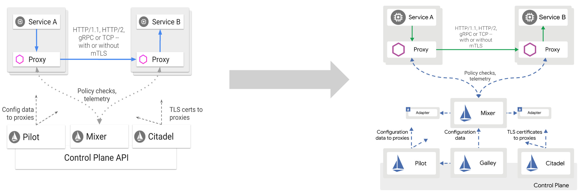
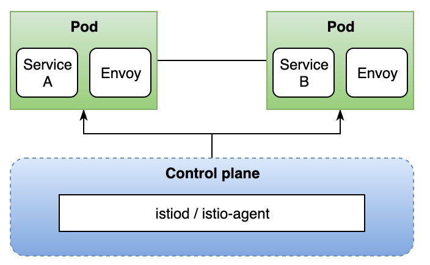

## 引子

早在 2019 年底的 KubeConNA 中，Google API 基础设施的架构师 Louis Ryan 就透露了 Istio 控制平面架构将要进行调整的消息。从即将发布的 1.5 版本开始，原本多个独立的组件将会整合在一起，成为一个单体结构。相信每个开发者都能意识到架构调整会带来什么样的后果。这一重磅消息也促使笔者决定著成此文，以告天下拥趸：变化有风险，落地需谨慎！

## 原罪

### 解耦是罪？

这并不是 Istio 第一次调整架构了。号称 Production ready 的 1.0 版本在后续的 1.1 版本就进行了比较大的调整，分离了 Pilot 的配置下发功能到新的 Galley 组件中，将 Mixer 组件中原本进程内运行的 Plugin 改为了进程外运行的 adapter，进一步加剧了 Mixer 组件的性能问题。

坦白讲，如果抛开性能问题，笔者个人非常喜欢 Istio 1.1 的架构设计。它是贯彻解耦原则的典范，各个组件职责清晰，界限分明，所谓真正的设计优雅。1.1 版本的控制平面包括了下面几个组件：

- Pilot：数据平面配置中心；
- Mixer: 负责 Telemetry，聚合指标信息到多种后端（Back-end Adapter）；实现策略支持；
- Galley: 配置的监听、验证和转发；
- Citadel: 安全相关，证书签发、Secret 生成、CA 集成等；
- Injector：数据平面的注册和初始化。

这些组件分工且协作，共同组成了完整的控制平面。

但是，银弹效应再次应验，在软件的设计与开发过程中我们从来就不可能在天平的一端站稳脚跟。选择极致的代价就是掀翻这一平衡。你唯一能做的就是在设计天平的横杆上来来回回的验证并找到最佳的平衡点。但必须承认，对于一个追求完美的架构师来讲，这一过程是异常痛苦的。Istio 在构建完美架构的同时忽略了易用性和性能问题。本是后起之秀却能完美开局，如今正是要酣畅淋漓地开疆拓土之时，却似乎有流局的风险，令人唏嘘不已。

解耦当然不是原罪，它是推动软件架构变革的原动力。从单体到分层，再到服务化，每一次进化都是解耦思想的印证。但是，我们一定不能忘记，在软件设计领域中，解耦充其量只能是第二原则，它必须为第一原则让步，而这第一原则，就是设计的本质：取舍（trade off）。

Istio 取舍不利是造成现在这种状况的首要原因。

### 设计的取舍

我们经常说系统要具有可扩展性；另一方面，我们又要小心矫枉过正，以免出现过度设计。既要有预知变化的宽容度，又得避免写出永远也不会运行到的“dead code”。取舍，在设计阶段贯穿始终。

任何一个系统都是由一粒种子成长为参天大树的，Istio 也不例外。唯一不同的是，它从 0.1 版本刚刚问世就已经枝繁叶茂，功能强大，胸怀宇宙。我们现在很难评断当初的设计是不正确的。但 2 年的市场检验已然说明了问题，完善和强大在某种程度上就是复杂和易用性的缺失，Istio 的落地项目少的可怜。Envoy（Istio 的御用数据平面）的缔造者 Matt Keiln 在自己的 Twitter 上评价了 Service Mesh 的落地情况，他用带引号的反语表达了自己的无奈：

实践是检验真理的唯一标准，没人用的背后，很可能就是不易使用，设计与实现脱节。关于复杂难用这一点，读者可以自行通过接入一个 Mixer 的 adapter 就能深刻的体会到了（挂载一个 backend 居然要定义 instance，handler，rule 等一系列繁复的配置信息）。

软件设计之初的原型一定是简洁甚至简陋的，仅仅包含基本的用例和愿景。这就好比一个交通工具的核心是出行能力，那么我们可以选择从最便捷的自行车开始设计并不断完善。而 Istio 一经问世便能力非凡，俨然是一辆保时捷 911，马力强大配置豪华，其结果就是，大部分人都买不起。

笔者依然相信 Istio 团队的设计初衷是好的，其愿景是尽可能的去诠释出 Service Mesh 的最终形态。但很可惜，这种高瞻远瞩脱离现实太远，反而成了空中楼阁。

### 复杂是万恶之源

> Complexity is the root of all evil or: How I Learned to Stop Worrying and Love the Monolith.

在 Istiod 的 design 文档 [Simplified Istio (istiod)](https://docs.google.com/document/d/1v8BxI07u-mby5f5rCruwF7odSXgb9G8-C9W5hQtSIAg/edit#heading=h.xw1gqgyqs5b) 的卷首，设计团队就喊出了上面的口号：**复杂是万恶之源，停止焦虑，学会爱上单体**。可见 Istio 开发团队下定决心要进行变革，其根本目标就是消除现有架构的复杂性。

多组件架构带来的复杂性最直接的体现就是部署和维护上。1.4 版本的 CRD 有 24 个之多，远大于 AWS App Mesh 这种托管产品（只有 3 个）。`istio-system` 部署后的 Deployment 也是数量惊人。简化部署和提升可维护性的方式，就是构建一个单一的 istiod，将原有各个核心组件的功能整合在一起。

另外，还会以 JWT 等方式简化数据平面到控制平面的身份验证，构建一个独立的 istio-agent，使得 istiod 可以运行在集群、VM 或本地服务器而不需要 RBAC 权限。很明显，Istio 终于开始认真考虑用户生产环境的复杂性，并和现有的托管产品（App Mesh, Traffic director）靠拢，开始提供对 VM 的支持。

Istio 架构的复杂性主要表现在以下几方面：

- 从维护的角度看，架构中的多个组件如果交由不同的团队（个人）去维护的确是合理的。但实际情况是，整个 Istio 的搭建通常都是由一个团队甚至一个人去完成的，分离的组件变的毫无必要，且增加了部署和维护复杂性；
- Istio 的各个组件是否支持单独部署？恐怕单独部署的组件并不能工作。版本变更也需要对全部组件一起更新，那分离的意义何在？
- 从伸缩（scaling）的角度讲，分离的组件会更加有效，可以让成本更低。但在 Istio 的架构中，控制平面的成本受单一的因素（服务于 xDS）影响，致使分离的价值很小。
- 不同的组件如果在部署中具有不同的安全角色，那么这种隔离是有意义的。但实际上这些组件在默认安装中具有相同的地位，用户几乎不会修改其权限，所有组件都统一安装在 `istio-system` 这一命名空间下。

除此以外，更新维护也会涉及到大量的修改。这些因素大大增加了用户对 Istio 的刻板印象：安装和管理复杂，维护成本高。

## 救赎

`istiod` 是即将发布的 1.5 版本中出现的一个单体应用（单一二进制文件），它整合了现有架构中各组件的功能，使开发者可以获得更好的运维体验。Istio 的自我救赎之路即将开始。

### 目标

重构的愿景是提升易用性和降低复杂性，设计文档中给出了以下具体的目标：

- 降低安装复杂性
- 降低配置复杂性
- 提升控制平面可维护性
- 问题诊断更容易
- 提高效率和响应速度
- 消除不必要的耦合

聚合并不意味着耦合，组件化依然会在单体中继续维护。所以我们无需担心泥球（Mud ball）状的系统，系统会高内聚但内部低耦合，对用户透明。同时，实验性的功能也不再提供（果然有过度设计），保证 istiod 的高度可用。

文档中提到新的设计和最初在实验阶段实现的 `hyperistio` 非常类似。可见笔者上文所述原型阶段的种子是真实存在的。恭喜 Istio，轮回转生。

### 功能和形态

原有组件的功能会整合为如下 2 部分：

- istiod：合并了除 Mixer 之外的大部分组件功能，成为新的控制平面；
- istio-agent：私钥生成，本地 SDS 服务器，启动 Envoy 等；

同时也删除了部分功能，单体形态也消除了大量的配置项，以及组件通信带来的复杂性。未来大概率情况下，用户只需要维护一个 `mesh.yaml` 的配置文件来定义自己的 mesh，而不是现在要组合各种繁复的自定义资源。

在运行层面，新架构提供了更多的选择方式，以应对不同的开发环境：

- 在 Kubernetes 集群中运行；
- 在 Kubernetes 集群中运行，对单独的 namespace 生效；
- `minion` 集群代理模式 - 这种模式是指安装在当前集群的 istiod 会作为远程 istiod 的代理，为本地集群提供相应的控制平面功能。也可以反向的推送到远端集群。这使得将新集群接入到已有的 mesh 更加方便；
- 集群外运行；
- 静态配置运行；
- 在 Pod 中运行代理；
- 本地运行代理；

多运行方式的提供是向现有生产环境多样化的妥协。通过多种方式适配环境，从而降低接入难度。同时和托管的云产品保持一致的体验。

### 再谈设计

#### 重构阶段

愿景清晰，目标明确。这一次，Istio 在设计上的取舍会是怎样的呢？文档中将其划分为 3 个阶段。

**阶段 1：科学怪人的怪兽（Frankenstein's Monster）**

科学怪人是一部著名的美国电影，讲述了一个天才科学家创造了一个怪物最终被其毁灭的故事。Istio 团队为何要以它来自嘲呢？笔者在豆瓣的电影介绍中看到这样一段话：

> 弗兰肯斯坦（科林·克利夫 Colin Clive 饰）是一个天才科学家，他想像上帝一样创造生命...

用如此极端的类比来比喻 Istio，笔者武断的认为其本意是：Istio 本想扮演上帝一般的角色（统一 Service Mesh 江湖，成为微服务架构的事实标准），却因为过度设计与现实脱离，成为了一个怪兽（monster）。因此，重构的第一阶段，就是从肢解怪兽开始。

在旧的架构中，Istio 启动过程复杂且依赖于顺序：

- Citadel 要先启动为其他组件生成证书；
- Galley 要先监控 apiserver；
- Pilot 要 Galley 准备好才能启动；
- autoinject 需要 Pilot 启动完成；
- 等等

本来是解耦合的组件，却因为启动过程耦合在了一起，维护性可想而知。合并后将消除这些启动依赖，并支持多版本同时运行，以满足升级或者灰度部署的需要。

**阶段 2：深度清理**

这一阶段将会着重清除不必要的相互依赖和不支持的用例，以便系统更加的高效和干净。

**阶段 3：管道（pipeline）重构**

此阶段的工作可以大致分为工程卫生，效率和可维护性工作。

#### 安装、配置的影响

简化后的控制平面单元将由：mesh.yaml，CRD，集群 role 和 binding，istio-system 命名空间这几部分组成。安装过程不再有顺序上的依赖。配置也精练到 mesh.yaml 中，整体操作会简单的多。

升级也变得简单，金丝雀部署（canarying）成为一种可选的部署方式；安装过程中对权限的需求也大大减少；对于 VM 这样的非 Kubernetes 环境，只需要安装一个单一的二进制文件即可。

#### 构建、测试和发布的影响

集成测试变得简单，因为只需要协调 istiod、istio-agent 和 Envoy 以及下游组件；配置的精简使得端到端测试也变得容易；测试和构建的时间也会大幅降低，另外，Istio 的启动时间也会大大减少。

### 其他

系统的精练必然能够提高其可靠性。特别是改善复杂性导致的问题。例如：

- 组件将只依赖于 apiserver，不再受启动顺序或其他组件的影响；

- 组件之间的网络/证书问题和对 Citadel 的依赖都被消除了；

- 对于内存使用，单一组件消除了重复的缓存、序列化和延迟；

- 消除了跨组件通信，避免了通信问题；

性能提升方面，原本被诟病的 Mixer 组件将被取消，在未来版本中，其功能将会被合并到 sidecar 中。这其实变相的实现了 [Mixer V2](https://docs.google.com/document/d/1QKmtem5jU_2F3Lh5SqLp0IuPb80_70J7aJEYu4_gS-s/edit) 版本，解决了进程外调用的性能问题；多组件合并为 istiod 也解决了原来重复的序列化和延迟问题。这一次，Istio 在经过社区长期的灵魂拷问下，终于卸下优雅架构的包袱，全面拥抱性能和易用性。

## 结论

Service Mesh 概念的缔造者，Linkerd 的作者 William Morgan 曾说过这样一段话：“今天的服务网格处于不幸的状态：虽然有真实和重要的价值，但市场营销已经超过了技术本身”。Istio 的高调登场，加上 3 家顶尖厂商的背书，让众多拥趸失去理性思考的能力，盲目的追捧正是这种恶性营销的表现。今天的 Istio 终于放低姿态，以回归单体的方式完成自我救赎，来重新融入社区的怀抱。笔者仍然相信，未来 Istio 依然有能力成为一个成熟而优秀的产品，深耕于社区，服务于大众。让我们拭目以待。
