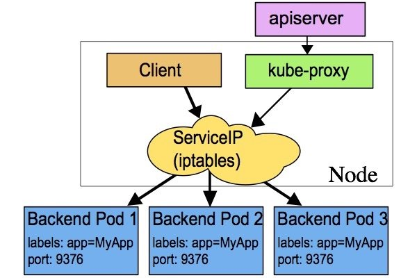
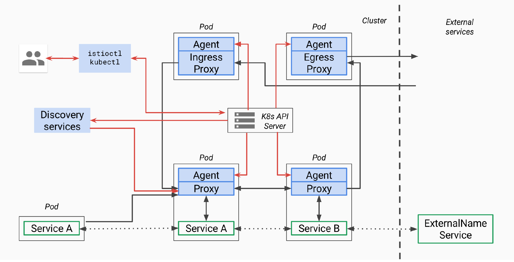

本文介绍了 Istio 和 Kubernetes 中的一些服务和流量的抽象模型。虽然 Istio 一开始确定的抽象模型与对接的底层平台无关，但目前来看基本绑定 Kubernetes，本文仅以 Kubernetes 说明。另外在 [ServiceMesher 社区](http://www.servicemesher.com)中最近有很多关于 Istio、Envoy、Kubernetes 之中的服务模型关系的讨论，本文作为一个开篇说明，Kubernetes 和 Istio 之间有哪些共有的服务模型，Istio 在 Kubernetes 的服务模型之上又增加了什么。

**服务具有多个版本。**在 CI/CD 过程中，同一个服务可能同时部署在多个环境中，如开发、生产和测试环境等，这些服务版本不一定具有不同的 API，可能只是一些小的更改导致的迭代版本。在 A/B 测试和灰度发布中经常遇到这种情况。

## Kubernetes 与 Istio 中共有的模型

因为 Istio 基本就是绑定在 Kubernetes 上，下面是我们熟知的 Kubernetes 及 Istio 中共有的服务模型。



上图是 Kubernetes 中 iptables 代理模式（另外还有 IPVS 模式）下的 service 概念图，管理员可以在 kube-proxy 中配置简单的负载均衡，对整个 node 生效，无法配置到单个服务的负载均衡和其他微服务的高级功能，例如熔断、限流、追踪等，这些功能只能在应用中实现了，而在 Istio 的概念模型中完全去掉了 `kube-proxy`  这个组件，将其分散到每个应用 Pod 中同时部署的 Envoy 中实现。

下面列举的是 Kubernetes 和 Istio 中共有的模型。

### Service

这实际上跟 Kubernetes 中的 service 概念是一致的，请参考 [Kubernetes 中的 service](https://jimmysong.io/kubernetes-handbook/concepts/service.html)。Istio 推出了比 service 更复杂的模型 `VirtualService`，这不单纯是定义一个服务定义了，而是在服务之上定义了路由规则。

每个服务都有一个完全限定的域名（FQDN），监听一个或多个端口。服务还可以有与其相关联的单个负载均衡器或虚拟 IP 地址。针对 FQDN 的 DNS 查询将解析为该负载均衡器或者虚拟 IP 的地址。

例如 Kubernetes 中一个服务为 `foo.default.svc.cluster.local hostname`，虚拟 IP /ClusterIP 是 10.0.1.1，监听的端口是 80 和 8080。

### Endpoint

这里指的是 Kubernetes 中的 endpoint，一个 endpoint 是实现了某服务的具体实例，一个服务可能有一个或者多个 Endpoint，表示为 IP 地址加端口，也可以为 DNS 名称加端口。

其实到底哪些实例属于同一个 service，还是需要 通过 label 匹配来选择。

### Label

服务的版本、对应的引用名称等是通过 label 来标记的，例如下面 Kubernetes 中一个应用的 YAML 配置。

```yaml
apiVersion: extensions/v1beta1
kind: Deployment
metadata:
  name: ratings-v1
spec:
  replicas: 1
  template:
    metadata:
      labels:
        app: ratings
        version: v1
    spec:
      containers:
      - name: ratings
        image: istio/examples-bookinfo-ratings-v1:1.8.0
        imagePullPolicy: IfNotPresent
        ports:
        - containerPort: 9080
```

 `version: v1` 标记该服务是 v1 版本，`version` 是一个约定俗称的标签，建议大家的服务上都带上该标签。

当然服务的 label 可以设置任意多个，这样的好处是在做路由的时候可以根据标签匹配来做细粒度的流量划分。

## 控制面板 Envoy

Envoy 是 Istio 中默认的 proxy sidecar，负责服务间的流量管控、认证与安全加密、可观察性等。Envoy 中有如下几个重要概念。


上图是 Envoy 的架构图。

### Cluster

集群（cluster）是 Envoy 连接到的一组逻辑上相似的上游主机。Envoy 通过[服务发现](https://www.envoyproxy.io/docs/envoy/latest/intro/arch_overview/service_discovery#arch-overview-service-discovery)发现集群中的成员。Envoy 可以通过[主动运行状况检查](https://www.envoyproxy.io/docs/envoy/latest/intro/arch_overview/health_checking#arch-overview-health-checking)来确定集群成员的健康状况。Envoy 如何将请求路由到集群成员由[负载均衡策略](https://www.envoyproxy.io/docs/envoy/latest/intro/arch_overview/load_balancing#arch-overview-load-balancing)确定。

这个与 Kubernetes 中的 Service 概念类似，只不过 Kubernetes 中的服务发现中并不包含健康状况检查，而是通过[配置 Pod 的 liveness 和 readiness 探针](https://jimmysong.io/kubernetes-handbook/guide/configure-liveness-readiness-probes.html)来实现，服务发现默认也是通过 DNS 来实现。

### Listener

监听器（listener）是可以由下游客户端连接的命名网络位置（例如，端口、unix域套接字等）。Envoy 公开一个或多个下游主机连接的侦听器。一般是每台主机运行一个 Envoy，使用单进程运行，但是每个进程中可以启动任意数量的 Listener（监听器），目前只监听 TCP，每个监听器都独立配置一定数量的（L3/L4）网络过滤器。Listenter 也可以通过 Listener Discovery Service（**LDS**）动态获取。

### Listener filter

Listener 使用 listener filter（监听器过滤器）来操作链接的元数据。它的作用是在不更改 Envoy 的核心功能的情况下添加更多的集成功能。Listener filter 的 API 相对简单，因为这些过滤器最终是在新接受的套接字上运行。在链中可以互相衔接以支持更复杂的场景，例如调用速率限制。Envoy 已经包含了多个监听器过滤器。

## Istio 中增加的流量模型

`VirtualService`、`DestinationRule`、`Gateway`、`ServiceEntry` 和 `EnvoyFilter` 都是 Istio 中为流量管理所创建的 CRD，这些概念其实是做路由管理，而 Kubernetes 中的 service 只是用来做服务发现，所以以上其实也不能成为 Istio 中的服务模型，但其实它们也是用来管理服务的，如果流量不能路由的创建的服务上面去，那服务的存在又有何意义？在 Service Mesh 真正的服务模型还是得从 Envoy 的 [xDS 协议](http://www.servicemesher.com/blog/envoy-xds-protocol/)来看，其中包括了服务的流量治理，服务的断点是通过 EDS 来配置的。



上图是 Pilot 设计图，来自[Istio Pilot design overview](https://github.com/istio/old_pilot_repo/blob/master/doc/design.md)。

### Routing

Kubernetes 中的 service 是没有任何路由属性可以配置的，Istio 在设计之初就通过在同一个 Pod 中，在应用容器旁运行一个 sidecar proxy 来透明得实现细粒度的路由控制。

### VirtualService

`VirtualService` 定义针对指定服务流量的路由规则。每个路由规则都针对特定协议的匹配规则。如果流量符合这些特征，就会根据规则发送到服务注册表中的目标服务（或者目标服务的子集或版本）。对于 A/B 测试和灰度发布等场景，通常需要使用划分 `subset`，VirtualService 中根据 destination 中的 subset 配置来选择路由，但是这些 subset 究竟对应哪些服务示例，这就需要 `DestionationRule`。详情请参考 [VirtualService](https://preliminary.istio.io/zh/docs/reference/config/istio.networking.v1alpha3/#virtualservice)。

### DestinationRule

`DestinationRule` 所定义的策略，决定了经过路由处理之后的流量的访问策略。这些策略中可以定义负载均衡配置、连接池尺寸以及外部检测（用于在负载均衡池中对不健康主机进行识别和驱逐）配置。详情请参考 [DestinationRule](https://preliminary.istio.io/zh/docs/reference/config/istio.networking.v1alpha3/#destinationrule)。

### Gateway

`Gateway` 描述了一个负载均衡器，用于承载网格边缘的进入和发出连接。这一规范中描述了一系列开放端口，以及这些端口所使用的协议、负载均衡的 SNI 配置等内容。

这个实际上就是定义服务网格的边缘路由。详情请参考 [Gateway](https://preliminary.istio.io/zh/docs/reference/config/istio.networking.v1alpha3/#gateway)。

### ServiceEntry

`ServiceEntry` 能够在 Istio 内部的服务注册表中加入额外的条目，从而让网格中自动发现的服务能够访问和路由到这些手工加入的服务。`ServiceEntry` 描述了服务的属性（DNS 名称、VIP、端口、协议以及端点）。这类服务可能是网格外的 API，或者是处于网格内部但却不存在于平台的服务注册表中的条目（例如需要和 Kubernetes 服务沟通的一组虚拟机服务）。

如果没有配置 ServiceEntry 的话，Istio 实际上是无法发现服务网格外部的服务的。

### EnvoyFilter

`EnvoyFilter` 对象描述了针对代理服务的过滤器，这些过滤器可以定制由 Istio Pilot 生成的代理配置。这一功能一定要谨慎使用。错误的配置内容一旦完成传播，可能会令整个服务网格进入瘫痪状态。详情请参考 [EnvoyFilter](https://preliminary.istio.io/zh/docs/reference/config/istio.networking.v1alpha3/#envoyfilter)。

Envoy 中的 listener 可以配置多个 [filter](https://www.envoyproxy.io/docs/envoy/latest/intro/arch_overview/listener_filters)，这也是一种通过 Istio 来扩展 Envoy 的机制。

## 参考

- [Kubernetes 中的 service - jimmysong.io](https://jimmysong.io/kubernetes-handbook/concepts/service.html)
- [Istio services model - github.com](https://github.com/istio/old_pilot_repo/blob/master/doc/service-registry.md)
- [流量路由 - istio.io](https://istio.io/zh/docs/reference/config/istio.networking.v1alpha3)

